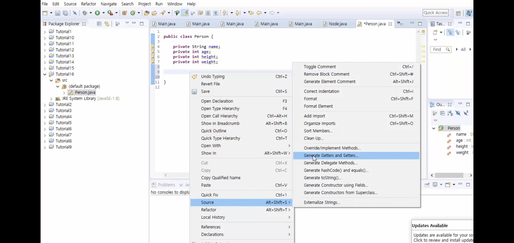
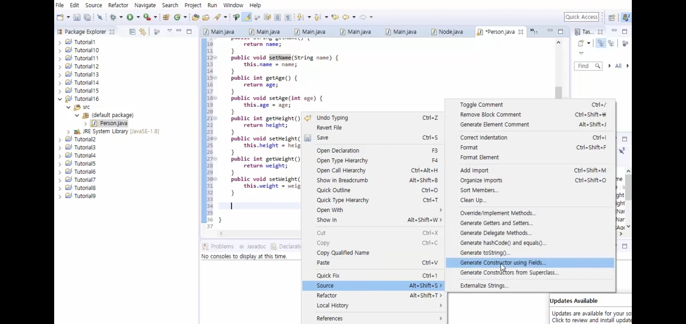

## Thread

### Two ways to create and run a thread

동시에 여러가지 작업을 하기 위한 것.

마치 프로그램 로딩 프로세스바 1~100%

실제로 백그라운드에서 실행되는 동안 동시에 프로세스바 퍼센트 업.

thread.isAlive();

해당 thread가 살아있냐? true/false

하지만 thread가 죽는데 아주 조금의 시간이 걸리기 때문에 

Thread.sleep(3000); 정도를 앞 코드에 추가해줘서 죽는 시간을 기다려주자.

thread는 내가 죽이지 않아도 알아서 소멸한다.

### setPriority

ex) bluetooth > wifi

## Exception

### try ... catch

크롤링 할 때 예외처리가 생겨서 중간에 종료되거나 엉뚱한 페이지가 뜰 수 있다.

이때 종료가 안되고 계속 이어서 크롤링 할 수 있는 방법.

<table class="colorscripter-code-table" style="margin:0;padding:0;border:none;background-color:#fafafa;border-radius:4px;" cellspacing="0" cellpadding="0"><tr><td style="padding:6px;border-right:2px solid #e5e5e5">

1

2

3

4

5

6

7

8

9

10

11

12

13

</td><td style="padding:6px 0;text-align:left">

public&nbsp;static&nbsp;void&nbsp;main(String[]&nbsp;args)&nbsp;{

&nbsp;&nbsp;&nbsp;&nbsp;&nbsp;&nbsp;&nbsp;&nbsp;String&nbsp;line&nbsp;=&nbsp;"abc";

&nbsp;&nbsp;&nbsp;&nbsp;&nbsp;&nbsp;&nbsp;&nbsp;try&nbsp;{

&nbsp;&nbsp;&nbsp;&nbsp;&nbsp;&nbsp;&nbsp;&nbsp;&nbsp;&nbsp;&nbsp;&nbsp;System.out.println(line.charAt(3));

&nbsp;&nbsp;&nbsp;&nbsp;&nbsp;&nbsp;&nbsp;&nbsp;}&nbsp;catch&nbsp;(Exception&nbsp;e)&nbsp;{

&nbsp;&nbsp;&nbsp;&nbsp;&nbsp;&nbsp;&nbsp;&nbsp;&nbsp;&nbsp;&nbsp;&nbsp;e.printStackTrace();

&nbsp;&nbsp;&nbsp;&nbsp;&nbsp;&nbsp;&nbsp;&nbsp;}&nbsp;finally&nbsp;{

&nbsp;&nbsp;&nbsp;&nbsp;&nbsp;&nbsp;&nbsp;&nbsp;&nbsp;&nbsp;&nbsp;&nbsp;System.out.println("finally");

&nbsp;&nbsp;&nbsp;&nbsp;&nbsp;&nbsp;&nbsp;&nbsp;}

&nbsp;&nbsp;&nbsp;&nbsp;&nbsp;&nbsp;&nbsp;&nbsp;System.out.println("Hello&nbsp;World");

&nbsp;

&nbsp;&nbsp;&nbsp;&nbsp;}

&nbsp;

<a href="http://colorscripter.com/info#e" target="_blank" style="color:#e5e5e5text-decoration:none">Colored by Color Scripter</a>
</td><td style="vertical-align:bottom;padding:0 2px 4px 0"><a href="http://colorscripter.com/info#e" target="_blank" style="text-decoration:none;color:white">cs</a></td></tr></table>

java.lang.StringIndexOutOfBoundsException: String index out of range: 3
	at java.base/java.lang.StringLatin1.charAt(StringLatin1.java:48)
	at java.base/java.lang.String.charAt(String.java:1512)
	at java_010.Main.main(Main.java:8)
finally
Hello World

❗**catch에서 일반적으로 에러를 복구할 수 있는 코드를 추가해준다.**

<table class="colorscripter-code-table" style="margin:0;padding:0;border:none;background-color:#fafafa;border-radius:4px;" cellspacing="0" cellpadding="0"><tr><td style="padding:6px;border-right:2px solid #e5e5e5">

1

2

3

4

5

6

7

8

9

10

11

</td><td style="padding:6px 0;text-align:left">

public&nbsp;static&nbsp;void&nbsp;main(String[]&nbsp;args)&nbsp;{

&nbsp;&nbsp;&nbsp;&nbsp;String&nbsp;line&nbsp;=&nbsp;"abc";

&nbsp;&nbsp;&nbsp;&nbsp;try&nbsp;{

&nbsp;&nbsp;&nbsp;&nbsp;&nbsp;&nbsp;&nbsp;&nbsp;System.out.println(line.charAt(2));

&nbsp;&nbsp;&nbsp;&nbsp;}&nbsp;catch&nbsp;(Exception&nbsp;e)&nbsp;{

&nbsp;&nbsp;&nbsp;&nbsp;&nbsp;&nbsp;&nbsp;&nbsp;e.printStackTrace();

&nbsp;&nbsp;&nbsp;&nbsp;}&nbsp;finally&nbsp;{

&nbsp;&nbsp;&nbsp;&nbsp;&nbsp;&nbsp;&nbsp;&nbsp;System.out.println("finally");

&nbsp;&nbsp;&nbsp;&nbsp;}

System.out.println("Hello&nbsp;World");

&nbsp;&nbsp;&nbsp;&nbsp;}

<a href="http://colorscripter.com/info#e" target="_blank" style="color:#e5e5e5text-decoration:none">Colored by Color Scripter</a>
</td><td style="vertical-align:bottom;padding:0 2px 4px 0"><a href="http://colorscripter.com/info#e" target="_blank" style="text-decoration:none;color:white">cs</a></td></tr></table>

c
finally
Hello World

❗**finally는 무조건 출력된다!**

습관적으로 

catch에 e.printStackTrace();를 넣어서 에러 로그를 가져오자!

일반 Exception은 General Exception으로 모든 Exception을 잡기 때문에,

캐치문의 맨 마지막에 넣어줘야한다. 마치 if문의 else처럼.

## Syncronization (동기화)

데이터베이스의 기본 crud

데이터베이스의 사용목적은 여러 매체를 통해 DB에 접근 가능하게 하려고.

한쪽에서 접근을 하면 다른 쪽에서 접근을 못하게 막아야한다.

 

쓰레드1~3가 동시에 배열을 바꿀 때에 쓰레드 1이 접근하고 끝난 다음에 2가 들어가고 , 3이 들어가야 동기화가 된다. 동시에  접근해서 바꾸면 정보 처리가 섞여서 불가능해짐.

**하나의 자원을 여러 프로세스가 여러 스레드가 여러 객체가 접근해서는 안된다!**

##  File Handling

### Write

### Read

### Update

### Delete

## +α &예습

코딩룰. 상속받는(extends의 대상)클래스의
변수에 get()와 set()를 만들어주는 이유. 자바 프로그램의 보안을 강화하기 위하여 한번 거쳐가는 과정을 설계.
extends는 물리고물리고물리고 가능.
ex)person>

#### get()과 set()자동 설정 하기

클래스에서
접근범위 자료형 변수명;
private string name;
을 정해주고, 
코드 페이지 우클릭
Source -> Generate Getters and Setters
Select All -> OK

#### 생성자 자동 만들기

Source -> Generate Constructer using fields

생성자: 하나의 인스턴스를 만들 때 자동으로 그 인스턴스가 가지는 변수들을 한번에 초기화해주는 것

상위클래스의 생성자가 있어야 하위 클래스에
Student student1 = new Student("홍길동", 27, 175);
이게 가능. 생성자를 받는거네!

Mac(물리적) 주소는 전세계에서 유니크함. 공장에서 찍어낼 때 생성.

