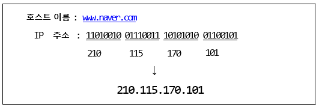
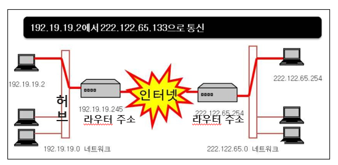
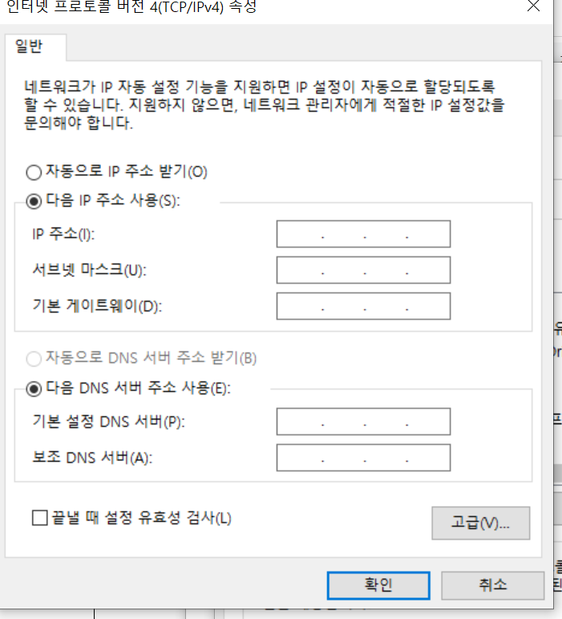
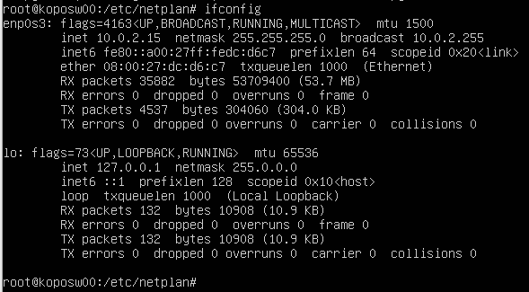
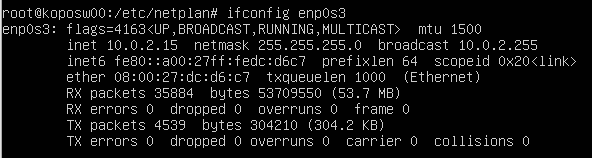
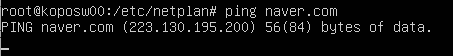
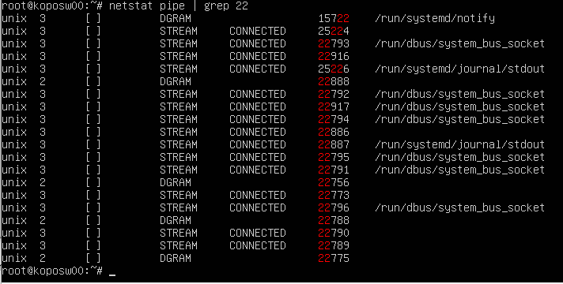

# 7. 네트워크 관리

## 1.네트워크 이론

1) ### TCP/IP 기초

IP는 인터넷 프로토콜이다.

우리가 쓰는 모든 데이터는 tcp ip 로 보내는 것이다.

osi7layer

우리가 어떠한 통신체계를 가질 떄 계층을 나눠서 만들자!

ex ) 금호 타이어를 사던 한국타이어를 사던 다 상관없는 그냥 레이어 이듯이.

상위계층은 밑단에 계층에는 전혀 영향이 없게 만들자!

2) ### IP주소 체계

   **ip주소 체계**

   ip 인터넷 주소를 부여하면 DNS라고 인터넷 주소를 IP로 변환해주는 서비스로 

   IP로 변환됨 그 IP가 물리적주소로 연결이 됨

   ex)

   

   IP끝 한자리는 단말.

   A는 가장 많은 PC를 가질 수 있는 네트웤

   B는 두개

   C는 맨 마지막 단말만.

   나스와 내 pc의 ip주소를 보면 앞 세자리가 같으니 같은 공간에 있는 단말기라 볼 수 있음.

   

   

   

3) ### TCP/IP통신흐름 및 장비

허브와 라우터

넷마스크 255.255.255.0 =>c자리까지 서버를 쓰겠다.

허브에서 라우터장비를 찾는다. 디폴트게이트웨이가 라우터장비 주소.

설정을 안하는 것은

dhcp <--> static

유동 주소와 고정주소.

노트북은 기본적으로 dhcp로 무선이 붙자마자 자동으로 ip가 내려옴

dhcp의 단점으로, 서버를 구축할 때에는 ip주소가 고정되어있지 않으면 그때그때 데이터를 어떻게 받을지 난감하다..

## 2.네트워크 환경 설정

1) ### 설정 전 알아두어야 할 사항

DNS : 아이피를 외우는 것은 힘드니 url을 IP로 바꿔주는 서비스

2) ### 네트워크 연결 설정

dls서버는 부분의 dls서버

888888.44 : 미국 구글주소

리눅스에서 네트워크를 모니터링할 수 있는 명령어 3가지

### 	✅ifconfig

enp0s3ㅑㄹ채 : lan카드 번호.

RX & TX : 데이터 보낸 것과 받은것

ifconfig으로 네트워크 서버설정할 수 있지만, 껐다키면 리셋됨.

그래서 자주 사용 안함.

### 	✅ping

핑공격. 주요 시스템에 핑 신호를 계에에에속 보내면 서버가 뻗음.

그래서 지금 핑을 받아주는 서버는 거의 없다.

핑으로 알 수 있는 것은 ip주소가 url로 바뀌는 것을 알 수 있다.

### 	✅netstat

가장 많이 쓰임.

application차원에서 포트들이 통신이 잘 연결되어있나, 어느게 연결되어있나. 볼 때 사용.

자기의 서버와 ssh(21번)서버가 잘 연결되어있나 볼 수 있다.

tcp 0 ~~~~ 21 established 

