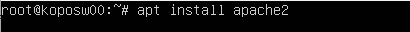

# 8. 웹서버 구성

**1.** **웹서버**

대표적인 예 : 아파치

아파치와 톰캣.

톰캣을 달고살거야.

**1)LAMP**

lamp라는 용어는 올드... php도 거의 사용 안하기 떄문

php대신 스프링프레임워크 같은 걸 사용.

윈도우가 아닌 리눅스 계열은 C#

항상 apt 를 클린하고 업데이트 하는, 최신화 시켜놓는 습관을 들이자!

**2)Apache데몬설치**

**apache2설치와 80번 포트포워딩** 

이후에 내 인터넷에서 내 아이피를 입력해 들어가면 이렇게

내 서버가 리눅스에 이렇게 설치를 하는 것.

**ssh를 root로 바로 들어가는 설정하기**

프티로 root로 들어감

그리고 재부팅.

❗이때 잘못된코드를 만졌을 경우, 혹은 코드에 이상이 있을 경우,

sshd -t 명령으로 오류가 있는 라인을 찾아낼 수 있다!

프티와 노트패드++에 root아이디와 비번 설정.

이렇게 루트로 들어갔기 때문에 파일을 막 고칠 수 있다.

서버의 html파일을 해석해서 브라우저에서 보여주는 것

3)Apache 데몬 설정 및 시동

4)홈페이지 게시

현재 이 브라우저 페이지의 위치가 /var/www/html/index.html이라는 것.

해당 index.html을 수정해주면 이렇게 수정한 html 페이지를 표시할 수 있다.

## +α &예습

교수님 유튜브로 aws보기

amazon web service

해외여행 결제 카드 가져오기(안쓰는 것)

