# 9. 클라우드 시스템

## 1.VM복제

### 1)VM복제하기

기본적으로 버추얼 박스에서 가상머신을 한개 만들 떄마다 nat network하나 만들어서 가상머신 하나 넣고, 그런방식. 그래서 얘네가 서로 보지 못함.

그래서 버추얼 박스에서 NAT NETWORK를 custom하게 만들고 그 안에 가상 머신을 여러개 넣고 서로 볼 수 있게 만든다.

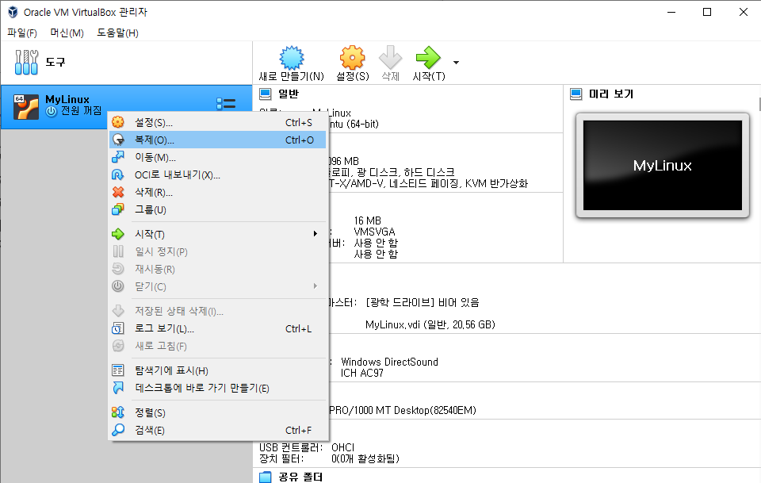

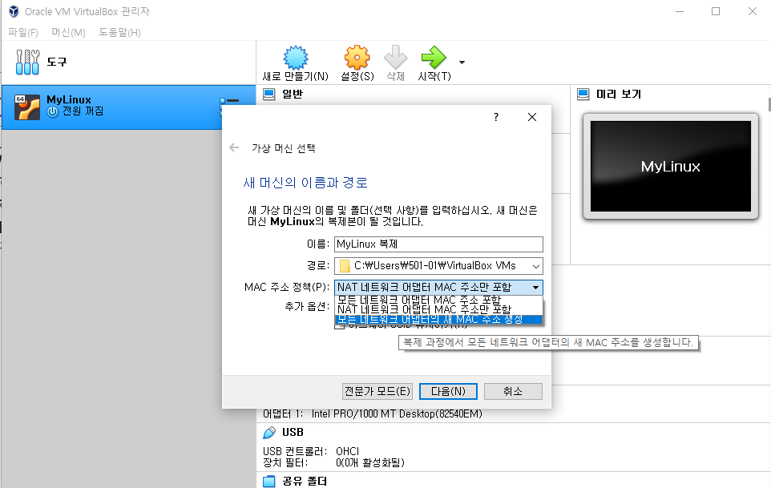

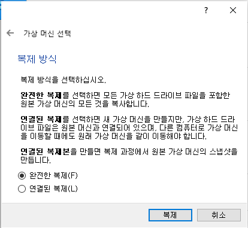

같은 네트워크에서 맥어드레스가 같으면 ip충돌 오류가 생길 수 있기 때문에

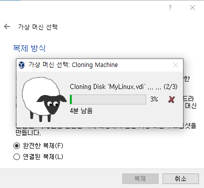

버추얼박스의 파일 - 환경설정 - 네트워크 - 오른쪽 새 NAT 네트워크를 추가합니다.

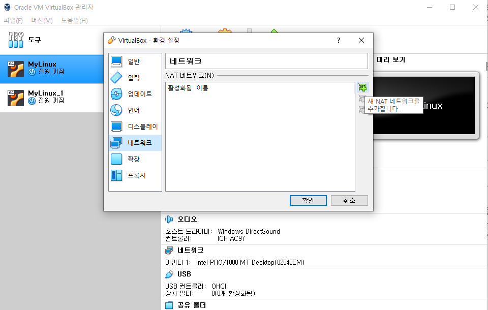

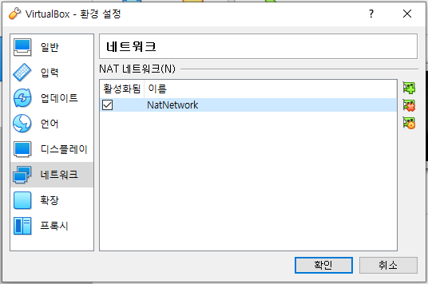

확인!

myLinux의 설정을 복제까지 NAT네트워크로 만들어준다.

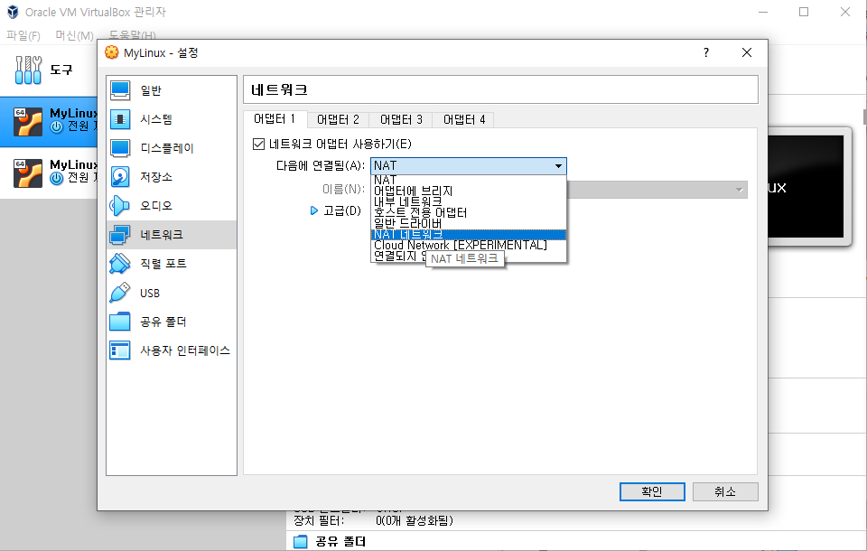

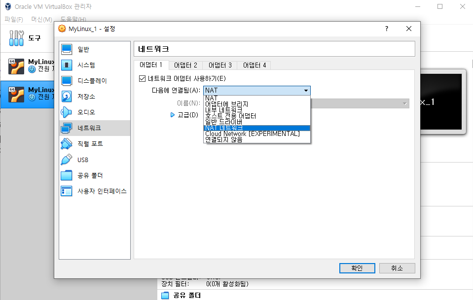

이때 복제 서버도 ip까지 똑같기 때문에 바꿔줘야 함

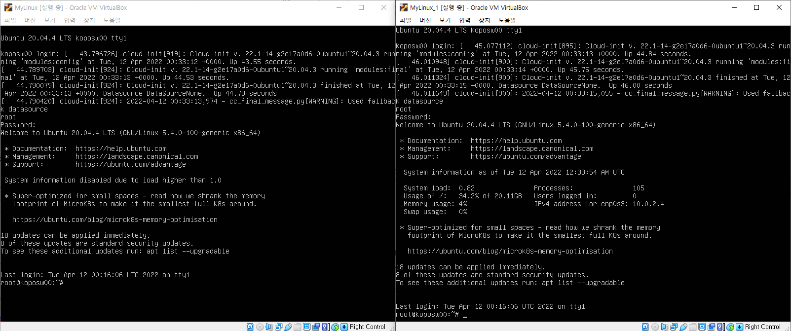

두 채널이 복제 됐기 때문에 같은 아이디와 비밀번호로 둘 다 접속이 가능한 모습.

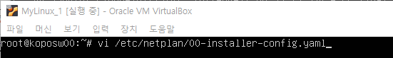

복제된 _1채널의 ip를 바꾸기 위해 해당 yaml 파일에 vim편집기로 접속을 하는 명령어

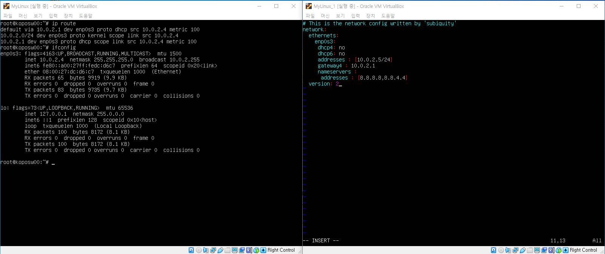

이때 기존 inet(ip)는 10.0.2.4 였으니 복제 ip는 10.0.2.5로 바꿔주는 모습

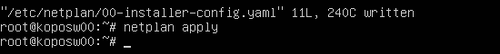

저장한 _1의 yaml파일을 netplan apply로 적용시켜준다.

/24는 넷마스크가 255.255.255.0이 결국 8.8.8.0 이니까 /24 해준 것.

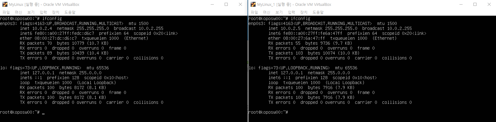

ifconfig하여 inet이 서로 2.4 2.5인것을 확인!!

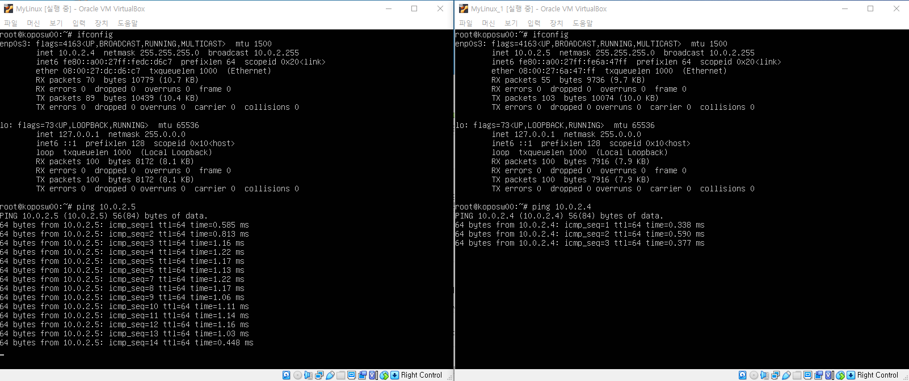

이제 서로의 ip에 ping을 찍어보내 연결이 잘 되었는지 확인한다

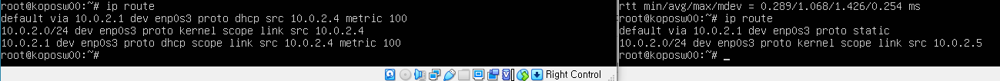

ip route 명령어로 서로 같은 게이트웨이 (via 10.0.2.1)인 것도 확인할 수 있다. 

#### 복제 개념 설명

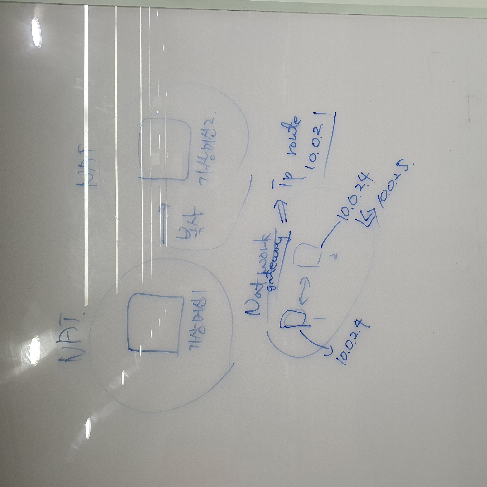

### 2)호스트네임, 네트워크 설정

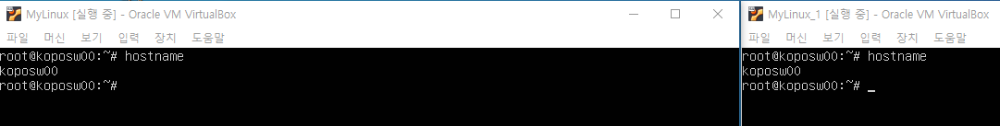

호스트네임이 도메인 네임과 비슷한 개념이기 때문에 이것도 바꿔주는 것이 좋다.

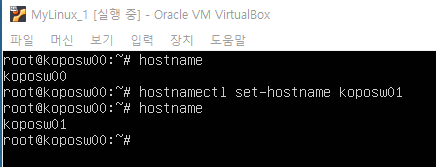

_1채널의 호스트 네임을 바꿨고, @뒤의 이름은 재부팅 해주면 바뀐다!

**두 서버의 포트포워딩**

버추얼박스의 환경설정에서

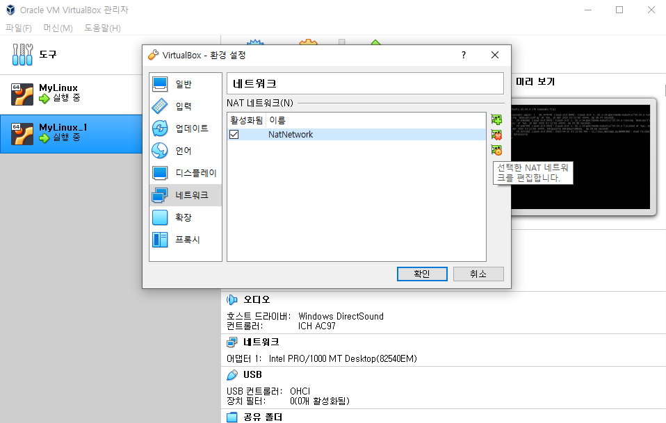

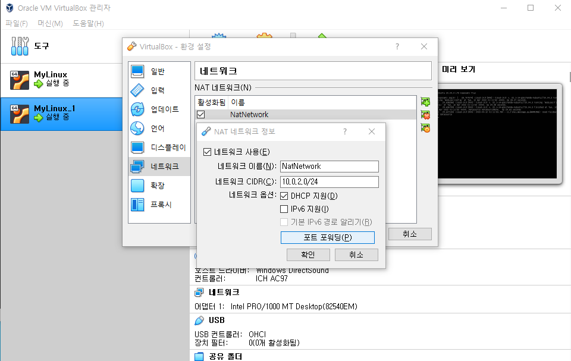

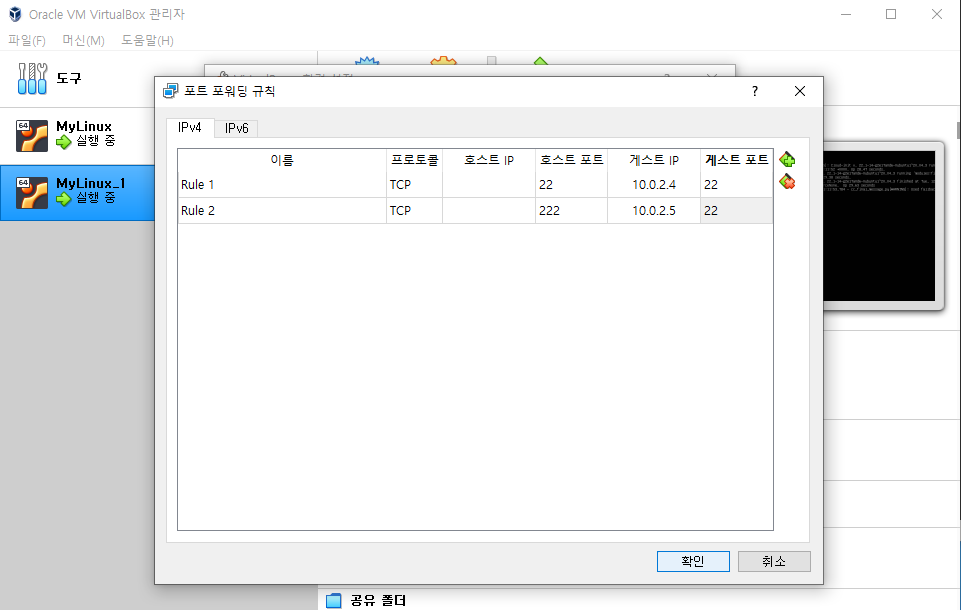

프티를 설정해준다.

원본 채널 👉 MyLinux_0

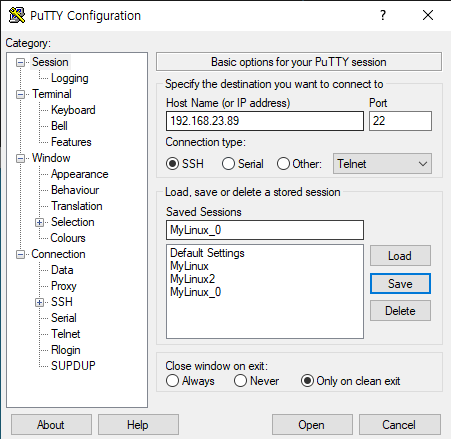

복제한 채널 👉 MyLinux_1

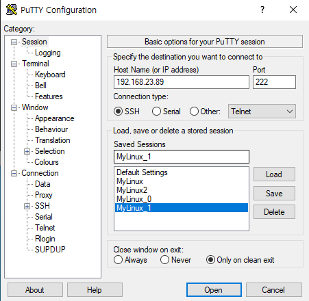

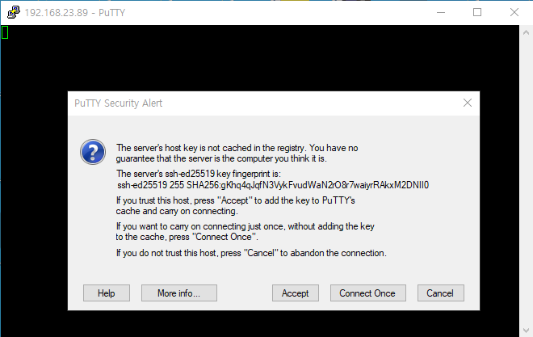

accept!

끝

**+α** : 아파치 포트포워딩 추가하기

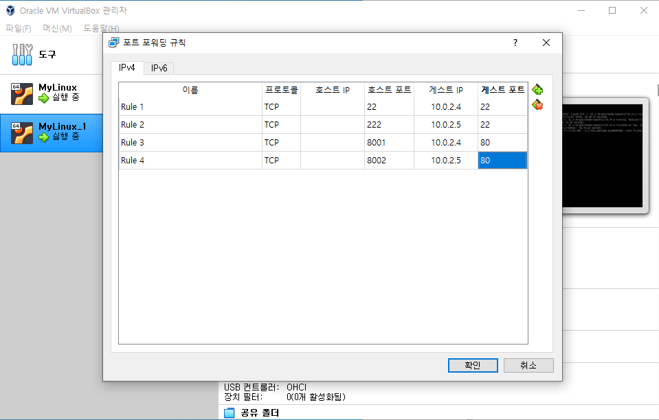

바깥에서 8001로 들어오면 10.0.2.4 의 80번 포트로 들어오고,

바깥에서 8002로 들어오면  10.0.2.5 의 80번 포트로 들어온다는 뜻.

인터넷 브라우저에서 방금 설정한 포트포워딩으로 접속하기

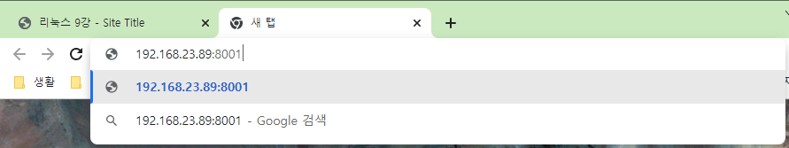

내 아이피 : 포트번호 

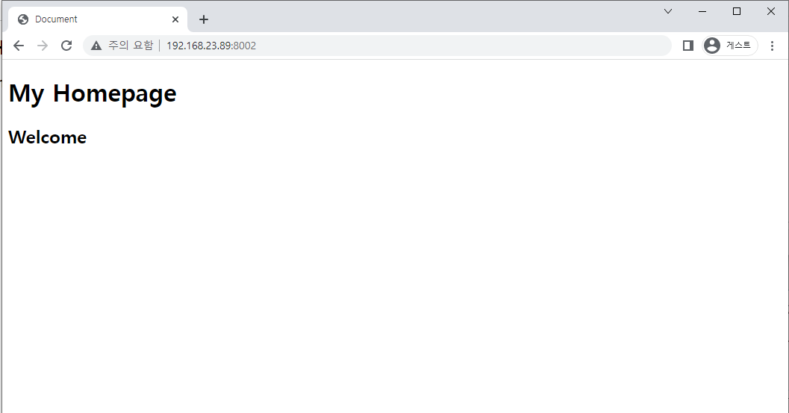

어제 만들었던 a.html 파일이 보인다.

## 3)고정IP 설정 

### 4)브릿지 설정

## 2. GCP/AWS

### 1)가입 

### 2)설정

### 3)ftp클라이언트 사용하기

## 3.Docker

### 1)Docker

### 2)xinetd.conf설정

### 3)/etc/services 파일

## +α &예습