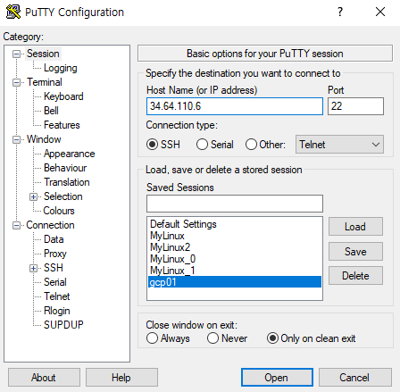

# 9. 클라우드 시스템

## 1.VM복제

### 1)VM복제하기

기본적으로 버추얼 박스에서 가상머신을 한개 만들 떄마다 nat network하나 만들어서 가상머신 하나 넣고, 그런방식. 그래서 얘네가 서로 보지 못함.

그래서 버추얼 박스에서 NAT NETWORK를 custom하게 만들고 그 안에 가상 머신을 여러개 넣고 서로 볼 수 있게 만든다.

같은 네트워크에서 맥어드레스가 같으면 ip충돌 오류가 생길 수 있기 때문에

버추얼박스의 파일 - 환경설정 - 네트워크 - 오른쪽 새 NAT 네트워크를 추가합니다.

확인!

myLinux의 설정을 복제까지 NAT네트워크로 만들어준다.

이때 복제 서버도 ip까지 똑같기 때문에 바꿔줘야 함

두 채널이 복제 됐기 때문에 같은 아이디와 비밀번호로 둘 다 접속이 가능한 모습.

복제된 _1채널의 ip를 바꾸기 위해 해당 yaml 파일에 vim편집기로 접속을 하는 명령어

이때 기존 inet(ip)는 10.0.2.4 였으니 복제 ip는 10.0.2.5로 바꿔주는 모습

저장한 _1의 yaml파일을 netplan apply로 적용시켜준다.

/24는 넷마스크가 255.255.255.0이 결국 8.8.8.0 이니까 /24 해준 것.

ifconfig하여 inet이 서로 2.4 2.5인것을 확인!!

이제 서로의 ip에 ping을 찍어보내 연결이 잘 되었는지 확인한다

ip route 명령어로 서로 같은 게이트웨이 (via 10.0.2.1)인 것도 확인할 수 있다. 

#### 복제 개념 설명

### 2)호스트네임, 네트워크 설정

호스트네임이 도메인 네임과 비슷한 개념이기 때문에 이것도 바꿔주는 것이 좋다.

_1채널의 호스트 네임을 바꿨고, @뒤의 이름은 재부팅 해주면 바뀐다!

**두 서버의 포트포워딩**

버추얼박스의 환경설정에서

프티를 설정해준다.

원본 채널 👉 MyLinux_0

복제한 채널 👉 MyLinux_1

accept!

끝

**+α** : 아파치 포트포워딩 추가하기

바깥에서 8001로 들어오면 10.0.2.4 의 80번 포트로 들어오고,

바깥에서 8002로 들어오면  10.0.2.5 의 80번 포트로 들어온다는 뜻.

인터넷 브라우저에서 방금 설정한 포트포워딩으로 접속하기

내 아이피 : 포트번호 

어제 만들었던 a.html 파일이 보인다.

## 3)고정IP 설정 

### 4)브릿지 설정

## 2. GCP/AWS

### 🍀AWS

### 1)가입 

### 2)설정

컴퓨팅의 EC2

서울 서버로 설정,

인스턴스 시작.

ubuntu 검색, 내 버전과 맞는 것 선택

검토 및 시작

새 키페어 생성

키페어 이름  "5floor"

키페어 다운. 시작,

인스턴스 상태가 대기에서 실행을 바뀔것이다.

연결 클릭, 연결.

==> 아마존 서버에다가 가상머신을 하나 만든 것.

#### 목표 1. 가상머신에서 ssh로 접속.

프티에서

permission 에러 뜨면,

chmod 600 id_rsa 명령어로 권한을 좁혀주고 다시 진행.

(개인의 키니까 다른 사람들이 보면 안되니)

#### 목표 2. putty에서 바로 접속.

내 pc의 puTTygen 실행

load 

pem파일 선택.

save private key 클릭. yes, 저장

conversions

open export ssh key 

파일명id_rsa으로, 저장

준비물

**id_rsa**

**aws.ppk**

**5floor.pem**

putty열고,

auth의 browse, ppk넣기

session에서 아마존 인스턴스의 퍼블릭 ipv4 복사 HostName에 붙여넣기.

aws는 기본적으로 사용자 명이 ubuntu이다.

**👉 이게 비대칭 인증법을 하는 것임**

인증서를 가지고 로그인을 하는 것.(지금까지는 우분투에서 id pwd로 들어갔지만,)

aws통해 받은 pem파일엔 public key와 private key가 있다.

public key는 접속을 하는 곳에서 받는 것.

어디에 있어도 상관없음

 private key는 접속을 하는 사람이 내는 것

내가 몰래 가지고 있는 것

aws.ppk -> private key

aws.ppk를 putty에 넣어서 public key에 접속을 하는 것이다

 public key는 아마존에서 이미 등록을 해놓았다.

해당 브라우저의 채널에서 .ssh/ authorized_keys에 저장중

인증서 방식이 여러 종류가 있다.

putty 에서 쓰는 ppk파일 형식(aws.ppk)을 받고,

open ssh 형식에서 쓰는 ppk파일 형식(id_rsa)을 받은 것.

#### 목표 3. apache2 설치 후 웹에서 접속.

**프티의 ubuntu(aws)에서**

우선 apt update

sudo apt install apache2 명령어로 아파치2를 설치한다.

**aws 설정 페이지에서**

네트워킹 - 보안 그룹 - 인바운드 규칙 편집 - 규칙 추가 - HTTP설정, 사용자 0.0.0.0/0 으로(모든 소스에서 들어올 수 있다는 뜻) 설정 - 규칙 저장

-> 브라우저에서 접속 가능

inbound : 들어오는 것

outbound : 나가는 것

### 3)ftp클라이언트 사용하기

### 🍀GCP

gcp도 private key로 public key에 들어가는 것. aws와 별 다를 것이 없다.

구글 같은 경우는 aws와는 다르게 인증서를 만든 다음에 등록을 해줘야한다.

### 1)GCP 가입

2) 인스턴스 만들기 및 설정

 - 사용 - 인스턴스 만들기

ssh를 클릭해 연결한다.

**키 받기**

ssh-keygen -t rsa -C {username}

그리고 엔터 세번

키를 받았다!

.ssh디렉토리가 생겼고 id_rsa가 생겼다.

cat으로 열어 키를 복사하자.

public key를 구글에선 웹 인터페이스를 통해 등록하기를 권장한다.

그래서 GCP 설정에서 메타데이터 - ssh 에 등록을 한다.

그리고 저장!!

저장이 완료된 모습

rsa를 받고,

프티 젠에서 로드를 함니다.

그리고 save private key

yas

저장

완료된 모습.

다시 구글 GCP에서 외부 아이피 복사해서~

Hostname에 붙여넣기,

Auth - Browse에서 

아까 받은 GCP private key 열기.

그리고 만든 gcp01로 접속! 끝!

**방화벽 규칙 설정하기**

방화벽 규칙 만들기 클릭

tcp : 80 👉 http의 포트 번호

0.0.0.0/0 👉 모두 허용한다는 뜻.

트래픽 방향 : 수신 👉 inbound

구글 인스턴스 채널에서 아파치를 설치한 후,

브라우저에 들어가주면

접속이 된다!

## 3.Docker

### 1)Docker

리눅스 컨테이너 👉 고립해주는 기술

운영체제를 지지고 볶고 할 때 쪼개서 쓸 수 있도록 하게 만드는 기술. 그때 중요한건 서로서로가 모르게, 각자각자가 서로 다른 운영체제처럼 가동될 수 있도록 하는 것 👉 컨테이너 기술.

음청나게 많이 쓴댜

usecase중에 가장 critical 한 것은, 

ex) python을 통해서 서비스를 2개 만들었다. 이때 2개가 쓰는 라이브러리가 다르다. 이때 만약 서로 호환이 안된다면? 이러한 versioning 문제를 도커를 이용해서 깨끗히 해결 가능!

그저 각자의 서비스 2개에 도커를 이용해 각자 갈 길 가도록 하는 것. (유저는 그저 매 업데이트 되는 도커를 받아 적용만 하면 됨)

 Docker는 리눅스 컨테이너 기술이므로, 리눅스에만 개발가능.

그리하여 다른 운영체제의 서버라면, 리눅스 가상머신을 켜고 도커를 올린다고 한다.

hypervisor : virtual box같은 것들

doker engine이 가상화 없이 바로 실행하게끔 해주어 새로운 컨테이너를 생성하는 속도가 빠르다.

java의 클래스(붕어빵 틀)와 인스턴스(붕어빵)처럼

도커는 Image가 있고 container를 만든다.

이때 image는

+ layerd 할 수 있고
+ immutable 불변이다.

한번 만든 layer는 버전이 올라가지 않는이상 변하지 않는다(immutable). 그리하여 새로 올리는(layerd) 레이어 만큼의 공간만 추가 소비한다.  = 컨테이너는 여러개 만들어도 Image는 재사용 할 수 있다.

그리하여 image는 안바뀌고, 내가 새로 customize하는 R/W layer 만 조작한다.

### 1-1)Docker 설치

리파지토리 셋, 설치 완료

도커에 지정되어있는 경로를 html에 연결을 한다.

-d : demon형태로 백그라운드에서 실행

-p : 8003:80

-v : 파일 시스템을 연결

httpd : image 이름

doker ps -a 모두 보이기

-P host포트 : doker 포트

호스트에서 80으로 들어오면 80으로 보내라

이때 우리는 VB를 사용하므로 한단계 더 포트포워딩을 해줘야 한다.

docker	가상머신	host머신

80	<-	8003	<-	8010

브라우저를 통해 들어가는 것은 host머신으로 접속하는 것이기 때문에 포트 번호를 설정해둔 호스트 포트 8010으로 하여 접속한다.

### 2)xinetd.conf설정

### 3)/etc/services 파일

## +α &예습