#### CRUD = 게시판

Create = 글 쓰기

Read = 목록, 글 읽기

Update = 글 수정

Delete = 글 삭제

#### DB는 human language와 비슷하다.

C U D 모두 단어와 쓰이는 명령어가 같음.

**❗ Read만 다름. Read = Select**

#### DBA

database administrator (DB전문가)

(카카오 네이버같은 큰 회사) 효율이 너무 중요함! 대량의 DATA의 효율을 중심적으로 보는 사람

### DB의 사용 목적

여러 기기, 매체에서 접근을 해도 내용은 다 똑같아야한다.  서로간의 동기화(synchronization)

ex) 폰으로 읽은 메일이 컴퓨터로 들어간 메일함에도 읽음으로 뜬다.

### SQL(Structured Query Language)

구조화된, 질의, 언어

SQL Standard (sql 표준)

My SQL : 교육용이면 무료이다.

Ms SQL

Oracle : 라이센스가 있어야 함(무진장 비쌈).

SQ Lite

위 SQL들은 마치 사투리(c와 c#)보다 더 가까운 억양같은 느낌. 하나만 제대로 하면 나머지는 너무 수월하다. (uclick은 oracle을 쓴다) 

------

## 명령어

## CR

#### show databases;

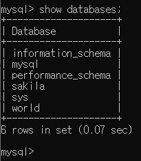

자바 : Project **⊂** Package **⊂** Class

SQL : DB **⊂** TABLE

ex) 우리은행DB **⊂** 이체TABLE, 우리은행DB **⊂** 계좌TABLE, 우리은행DB **⊂** 출금TABLE

###   use world;

### show tables;

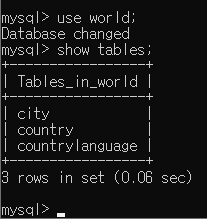

use라는 DB안에 city TABLE과 country TABLE과...

### select*from city;

테이블 선택하기

### desc city;

**description.** 해당 테이블의 항목(구조)을 보여달라.

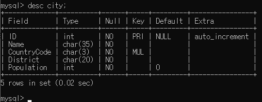

char(35) => 최대 35글자의 char타입

### create databases class;

class라는 db 생성

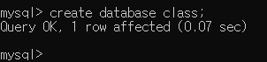

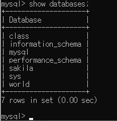

show databases; 명령어를 통해 만들어진 class 테이블 확인!

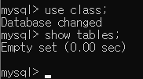

안에는 아직 비어있는 class 테이블.

### create table student(id int, name varchar(20));

student라는 테이블을 만드는데 Id와 name 항목을 만드는 명령어.

desc 명령어를 통해 해당 테이블 확인하기.

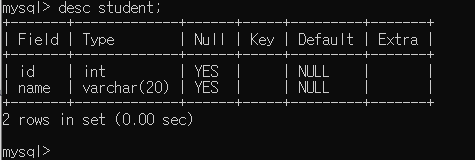

varchar은 char을 가변적으로 길이를 갖게 한다.

#### insert into student values(1, '홍규민');

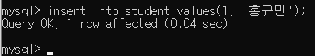

student 테이블에 값(values)를 넣겠다(insert). 

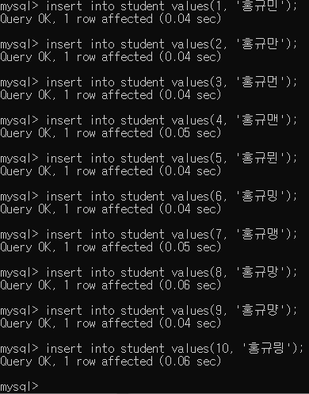

여러 값들을 넣었다.

select*from student;로 확인하기.

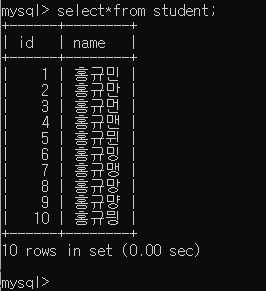

#### select {항목 이름} from student;

일부만(name) select하기

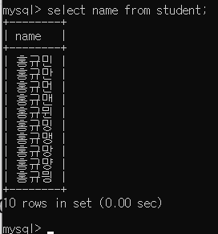

ID값이 5이상인 요소의 id를 찾기

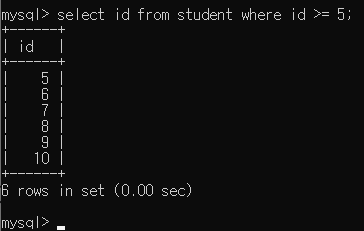

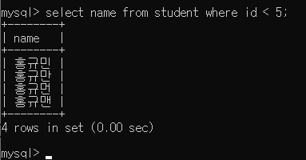

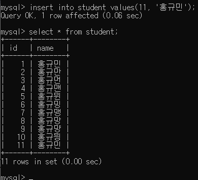

name이 중복인 요소의 각 id를 추출하려면?

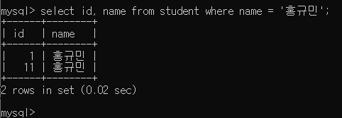

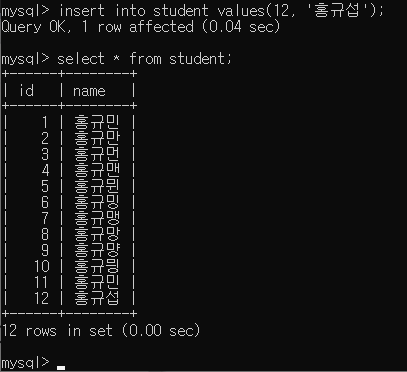

이름에 '섭'이 들어가는 요소를 찾으려면?

#### like 👉 java의 contains

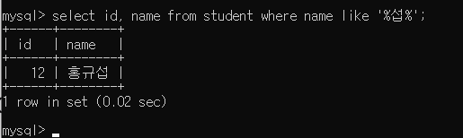

✅여기서 %가 의미하는 것은 *이다.

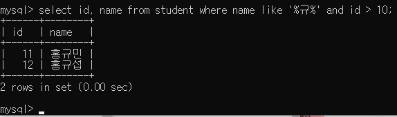

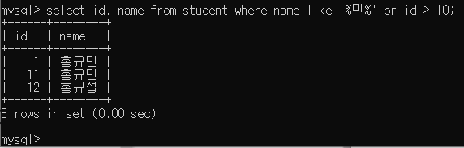

#### && == and

#### || == or

## UD

#### update {테이블명} set {항목명} = 'newName' where {id} = N; 

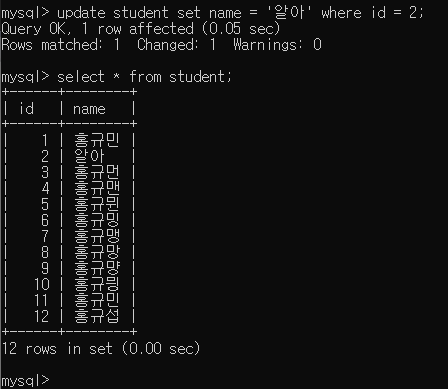

#### 선택해서 update하기

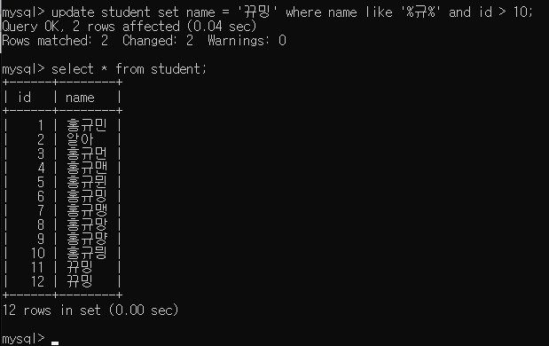

#### delete from student where name like '%규%';

delete는 from이 들어가야한다.

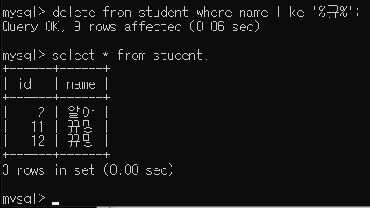

다시 넣기)

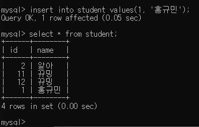

JDBC : 자바에서 mySQL에 연결할 때 사용

과제 : java에서 JDBC연결해서 id 프린트 12개 해서 캡쳐 후 교수님께 