# 데이터베이스 기초

### 1)데이터베이스 개요

우리나라에서 제일 많이 쓰는 DB : 1.oracle 2.cmax(국산)

mySQL == mariaDB (용어가 다르지만 개념은 같다)

DB는 중복을 피해서 넣는다.

record와 column이 합쳐진 table

talble이 합쳐진 database

databases가 합쳐진 databases

KEY : 중복되지 않는 데이터

ex)은행의 계좌번호. 계좌번호(키 데이터)를 입력하면 해당 유저의 정보를 빠르게 찾을 수 있다.

데이터베이스 시스템을 다루는 명령어 : SQL

각 SQL들은 체계는 같지만 내부 함수들이 다르다는 것.

### 2)DDL/DML/DCL 🔅암기必🔅

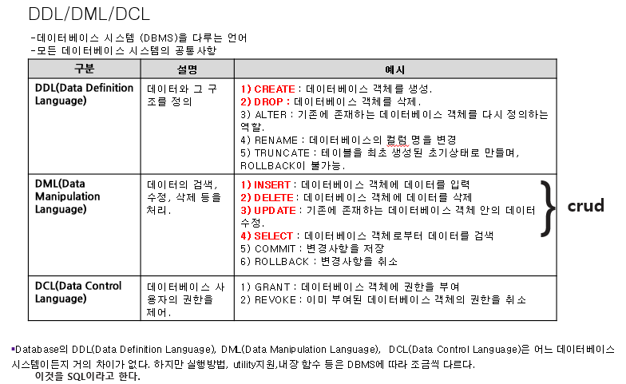

### 3)mysql 설치 및 시작

mysql에서는 mysql만의 세상.

그 안의 유저가 또 있다. 리눅스의 koposw00이나 root와는 또 다르다.

기본Databases는 시스템이 사용하고 있는 DB이다.

처음 만들고 mysql 명령어로만 들어갈 수 있는데,

이때는 mysql 유저를 아직 생성하지 않았기 때문에

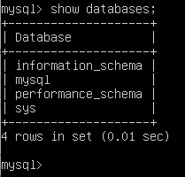

### 4)데이터베이스 만들기, 지우기, 보기, 선택

만들기

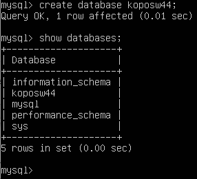

지우기

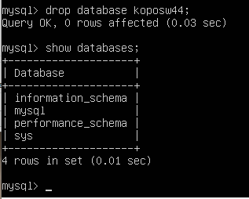

db안으로 들어가기(선택)

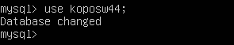

### 5)테이블 만들기, 지우기, 보기

varchara()내부에 해당 글자만큼 받는다.

not null 비어있으면 안된다.

primary key 1차 키이다.

db안의 tables들을 보기

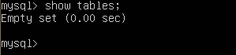

테이블 만들기

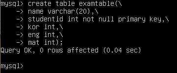

만든 테이블 확인하기

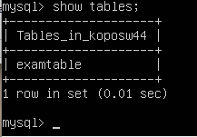

테이블 지우고 확인하기

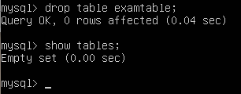

다시 만들기

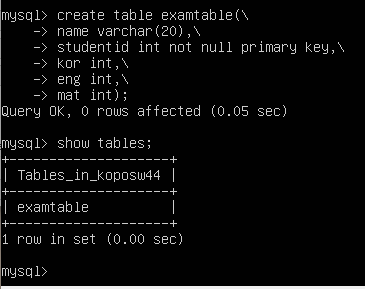

셀렉트 테이블(모든 필드를 보여주라)

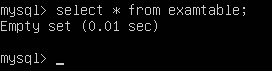

#### 자료입력

**프티로 입력해야 한글이 써진다

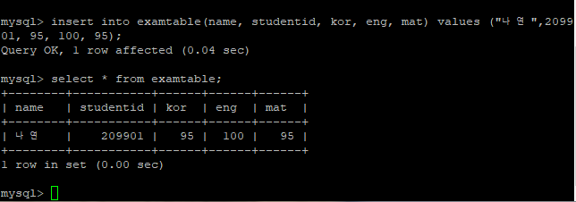

정연

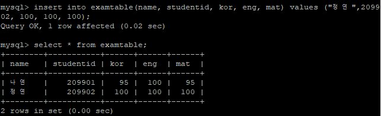

모모

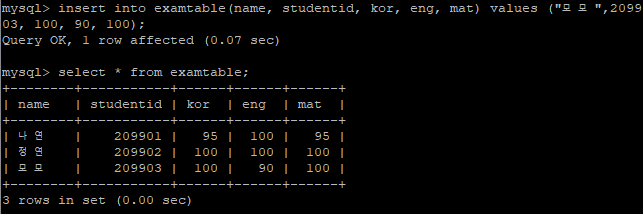

사나

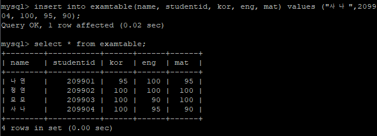

지효

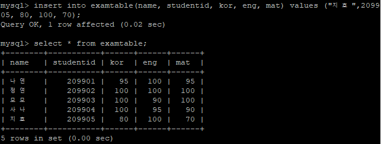

미나

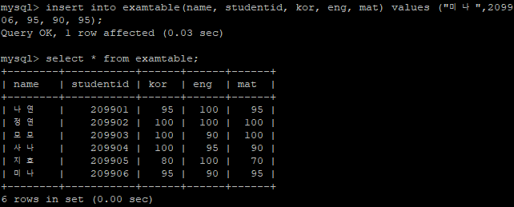

다현

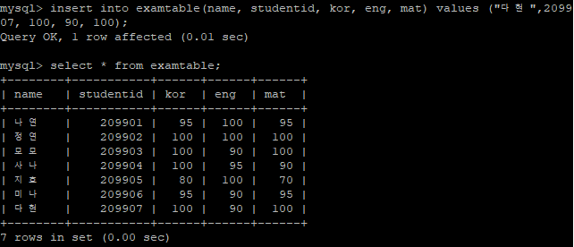

채영

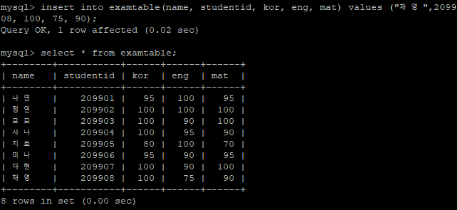

쯔위

### 데이터 삭제

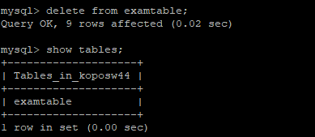

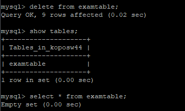

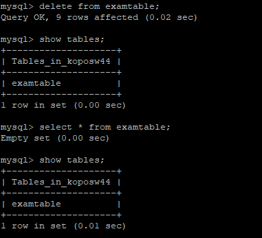

#### 다시 트와이스 멤버들 넣기

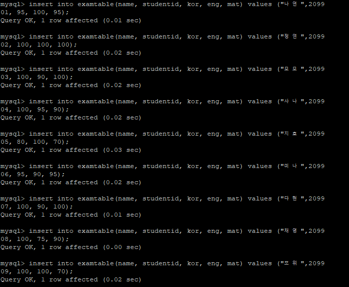

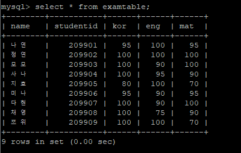

❗not null의 속성을 가진 studentid (key)는 null이면 안된다.

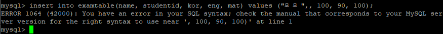

### 6)한 테이블에 대하여 자료조회, 입력, 수정, 삭제 (select, insert, update, delete)

### 7)Where 절

##### where조건의 이해(1)

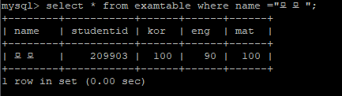

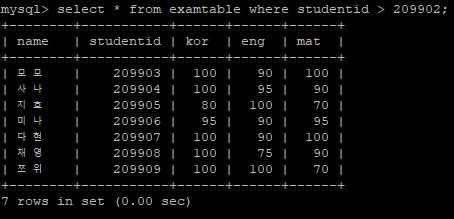

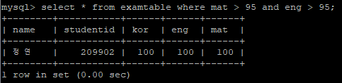

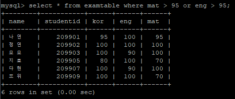

##### where조건의 이해(2)

insert는 없는 행을 넣는 것

update는 행이 있는 것을 교체하는 것. Update는 꼭 where 절이 있어야한다.

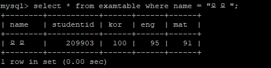

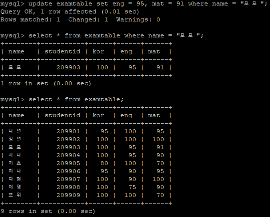

❗where절을 넣지 않을 경우 모든 데이터의 해당 값들이 일괄 바뀌게 된다.

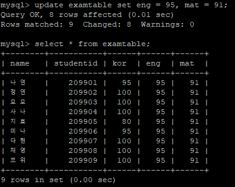

##### where조건의 이해(3)

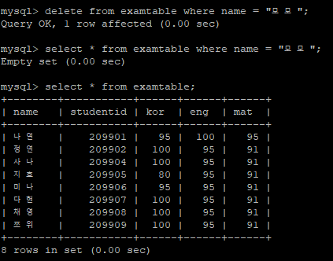

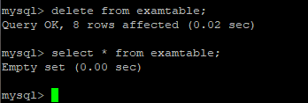

다시 다 넣기

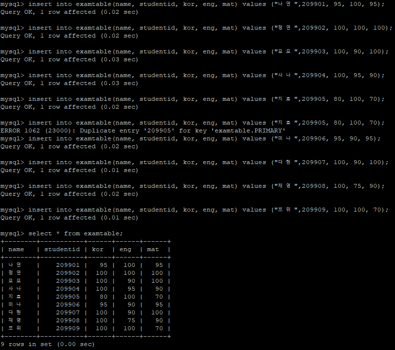

### 8)함수 count(), avg(), sum(), max(), min()

#### 주요함수의 이해

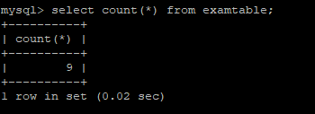

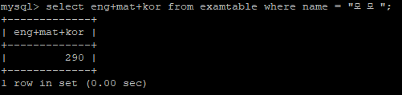

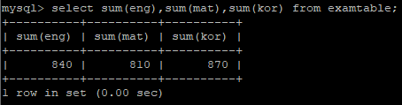

❗ave가 아닌 avg이다.

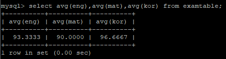

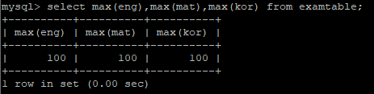

### root패스워드 설정

127.0.0.1 : 로컬호스트, 자기 서버 안에서만 접속할 수 있는 호스트

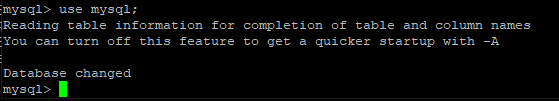

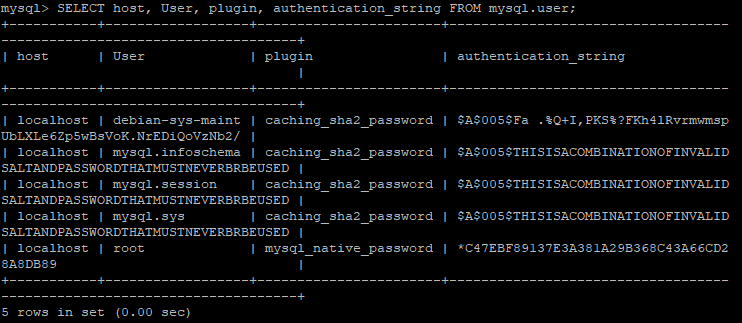

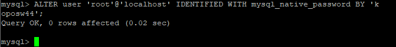

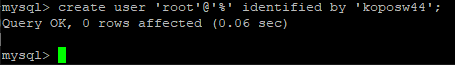

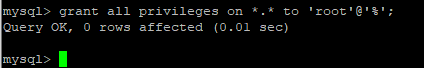

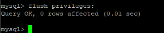

### 