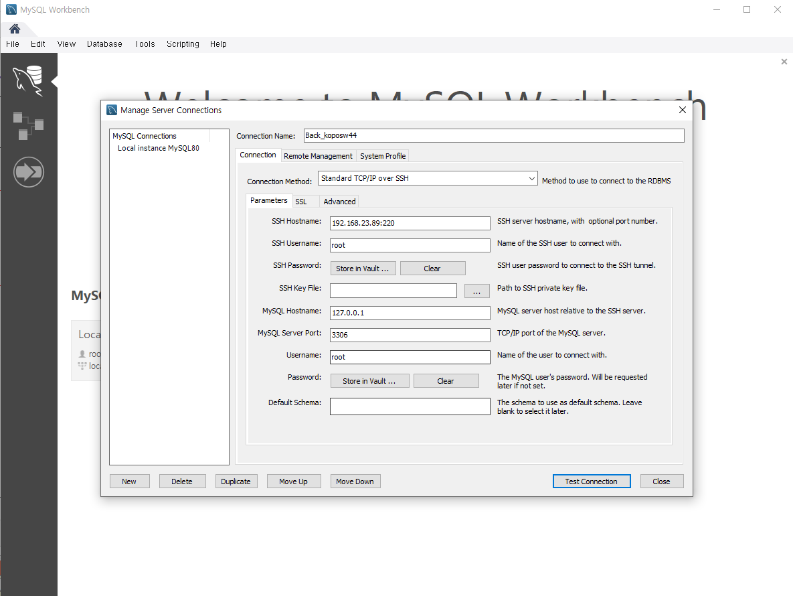
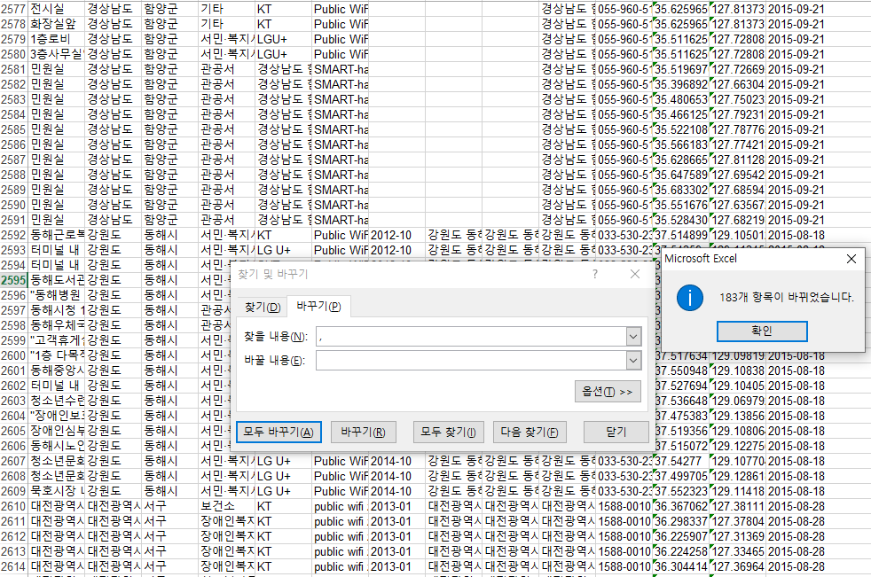

# 2. JAVA DB 다루기

1)JDBC/JNDI

실무에서는 거의 JNDI를 많이 사용한다.

### 1)데이터베이스 연결 전 작업

### 2)한글처리(UTF-8)

### 3)Result set

### 4)JDBC 기본 프로그램

### 5)examtable

### 6)Freewifi

### 7)Self-training

### ETL 작업

extract

transfer

load

오토커밋 : insert 할 때마다 locking걸었다가 푸는 것.

그렇기 때문에 대용량 데이터 처리를 DB 통해서 처리할 때 시간이 오래걸림.

그래서 ETL작업(쭉 추출했다가 한번에 로드하는 방법)으로 한번에 처리하면 시간 단축됨.

addBatch 메모리를 띄운다.

회사정보서치.

제니스앤컴퍼니

메가존클라우드

유클릭

뱅크웨어글로벌

11시11분(NHN자회사)
