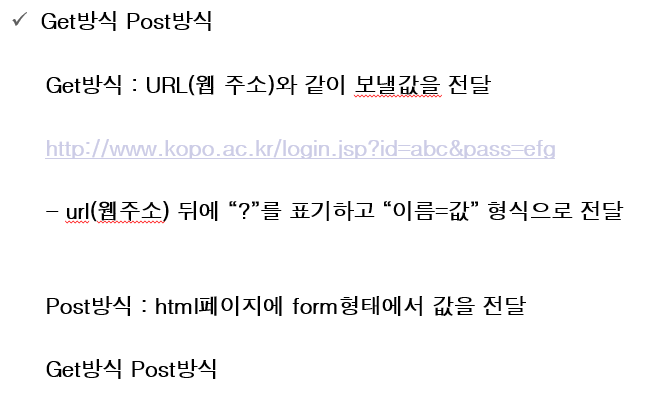

# 1.JavaScript 익혀서 먹기

톰캣 서버에서 작업하는 이유.

톰캣이 JSP 코드를 해석해줘서 웹 서버(브라우저)로 보내주는 역할을 해줄 수 있다.

Spring 은 servlet(웹에서 java프로그램으로 되어있는)계통이다

servlet(풀 자막 코딩)보다 간편한 jsp(간이코딩).

**jsp는 확장자 명이 jsp로 해줘야한다!**

메소드, 함수를 선언할 때에는 앞 ! 를 빼주어야 메인 함수 밖에서 실행이 되고 메소드를 만들 수 있다.

jsp는 에러처리를 똑바로 안해주면 코드가 고객에게 노출이된다. (정보 유출 위험)

catch를 만들어 "고객센터에 연락주세요" 등등 

<!-%@ page errorPage="error.jsp"%-->

위 코드로 에러 발생 시 해당 페이지로 보낼 수 있다.

✨✨✨✨✨✨✨✨✨✨✨✨✨매우중요✨✨✨✨✨✨✨✨✨✨✨✨✨

값을 입력하는 Get방식과 Post방식

http://www.kopo.ac.kr/login.jsp?id=abc&pass=efg

login.jsp에

id 변수에 abc 보내기

pass 변수에 efg 보내기

get방식으로 한글을 보낼 떄엔 인코딩을 해야한다.