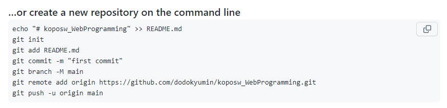
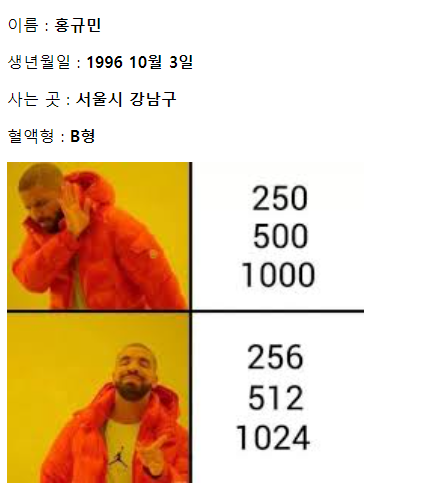
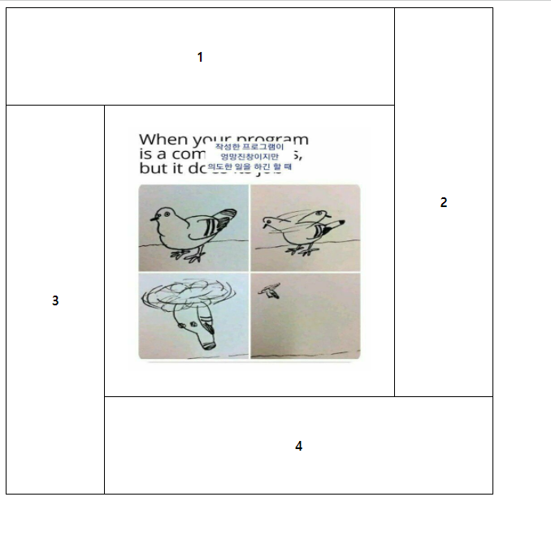

# 웹 (프론트엔드)개발의 기초 1

배우는 내용 

HTML 

CSS

Javascript

웹 브라우저가 인식할 수 있는 유일한 언어

JQuery 

JSP (비교적 old)

Vue.js(front-end 최신기술)

예전의 프론트엔트 3대장 : jsp(java), php, asp(ms)

우리나라에서는 asp시장이 적다. 공공기관은 대부분이 jsp.

요즘 프론트엔드 3대장 : vue.js, react, angular

~~ workbench는 개발자 아무도 안쓴다 ~~

### 마크업 언어의 종류들

html

xml 

json

### 제이쿼리

js를 쉽게 써보자 해서 개량하고 개량한

### 라이브러리와 프레이워크 차이

라이브러리 : 차트 만들어 놓은 파일 가져오기.

프레임워크 : 생태계를 만들어 놓은 것. java를 활용해서 만들 수 있게.(ex jsp)

자바스크립트의 프레임워크들 react, angular, vue

ios도 프레임워크다!

##### 웹쪽의 공식 문서는 mozilla 정리가 잘 되어있는 w3schools

### 깃헙과 연동하기

(git이 pc에 설치되어 있는 환경에서)

vscode의 Terminal -> New Terminal

##### 로컬 레파지토리를 만드는 터미널 명령어 :

git init

##### 이제 버전 관리할 파일 지정(스테이징) 할거야:

git add . (모든파일)

##### 커밋하기:

git commit

##### 현재 커밋 준비중인 파일 등 상태 확인하기:

git status

##### 커밋한 로그 확인하기:

git log

##### 이제 깃헙에서 리파지토리를 만들어준다.

\+ 눌러서 저장소(리파지토리 만들어주기)

(참고)

git branch -M main : main branch로 이름 설정됨.

을 주석처리 하면 바로 master로 붙는다.

 

깃을 관리할 때 기본적으로 master 이름.

##### 내 리파지토리 주소 복사.

##### 로컬 리파지토리와 vscode리모트 연결:

git remote add origin {리파지토리 주소}

아무것도 안뜨면 완료된 것.

remote를 가리키는것 이름이 기본적으로 origin

##### 리모트 연결 확인하기:

git remote -v

fetch는 파일을 받기는 싫고 있는지만 보는 것.

##### 처음 리파지토리에 연결하고 업로드하는 명령:

git push -u origin master

remote에 있는 origin에 로컬 master를 연결 하겠다.

연결이 되었고 파일이 커밋 되었다!

##### 연결 오류시

git branch -M master main

깃 브랜치에 master를 main브랜치로 하겠다.

바 

초록색 바는 추가된 내용. 

노란색 바는 수정된 내용.

빨간색 바는 삭제된 내용.

##### 바를 클릭하여 상세 내용을 확인할 수 있다.

revert change화살표를 눌러 돌아갈 수 있음.

수정내용 다시 올려보자!

#### 깃 히스토리 확인하기

##### 방법1)

깃헙에서 시계 아이콘을 눌러 커밋 로그를 확인할 수 있다.

##### 방법2)vscode에서 확인하기

1. git history 익스텐션을 받는다.

2. 소스컨트롤 메뉴에 시계아이콘 생김

클릭!

커밋 내용을 검색하여 확인할 수 있다. (평소에 이름을 잘 적어놓자!)

origin은 remote의 별칭.

master는 내 로컬.

##### 방법2+a)vscode 수정내용 커밋해보기(3탄)

\+를 눌러 간편하게 스테이징!

커밋 제목 같이 적어두기

체크 클릭!

sync changes를 눌러 push를 해주면

3탄이 업로드 되었다!

### emmet 내장함수 이용하여 간단하게 테이블, 리스트만들기

emmet이라는 내장함수를 사용하여 간단하게 만들었다!

폼 액션을 #으로 지정해주면 자기 자신에게 보낸다.

## 실습하기

#### ex1)

<table class="colorscripter-code-table" style="margin:0;padding:0;border:none;background-color:#fafafa;border-radius:4px;" cellspacing="0" cellpadding="0"><tr><td style="padding:6px;border-right:2px solid #e5e5e5">

1

2

3

4

5

6

7

8

9

10

11

12

13

14

15

16

17

18

19

20

21

</td><td style="padding:6px 0;text-align:left">

&lt;!DOCTYPE&nbsp;html&gt;

&lt;html&nbsp;lang="en"&gt;

&nbsp;&nbsp;&lt;head&gt;

&nbsp;&nbsp;&nbsp;&nbsp;&lt;meta&nbsp;charset="UTF-8"&nbsp;/&gt;

&nbsp;&nbsp;&nbsp;&nbsp;&lt;meta&nbsp;http-equiv="X-UA-Compatible"&nbsp;content="IE=edge"&nbsp;/&gt;

&nbsp;&nbsp;&nbsp;&nbsp;&lt;meta&nbsp;name="viewport"&nbsp;content="width=device-width,&nbsp;initial-scale=1.0"&nbsp;/&gt;

&nbsp;&nbsp;&nbsp;&nbsp;&lt;title&gt;Document&lt;/title&gt;

&nbsp;&nbsp;&lt;/head&gt;

&nbsp;&nbsp;&lt;body&gt;

&nbsp;&nbsp;&nbsp;&nbsp;&lt;p&gt;이름&nbsp;:&nbsp;&lt;b&gt;홍규민&lt;/b&gt;&lt;/p&gt;

&nbsp;&nbsp;&nbsp;&nbsp;&lt;p&gt;생년월일&nbsp;:&nbsp;&lt;b&gt;1996&nbsp;10월&nbsp;3일&lt;/b&gt;&lt;/p&gt;

&nbsp;&nbsp;&nbsp;&nbsp;&lt;p&gt;사는&nbsp;곳&nbsp;:&nbsp;&lt;b&gt;서울시&nbsp;강남구&lt;/b&gt;&lt;/p&gt;

&nbsp;&nbsp;&nbsp;&nbsp;&lt;p&gt;혈액형&nbsp;:&nbsp;&lt;b&gt;B형&lt;/b&gt;&lt;/p&gt;

&nbsp;&nbsp;&nbsp;&nbsp;&lt;img

&nbsp;&nbsp;&nbsp;&nbsp;&nbsp;&nbsp;src="https://encrypted-tbn0.gstatic.com/images?q=tbn:ANd9GcSfDsvRTzYUbYR_LCSkMmASMRcaIjVXFBsnJw&amp;usqp=CAU"

&nbsp;&nbsp;&nbsp;&nbsp;&nbsp;&nbsp;width="30%"

&nbsp;&nbsp;&nbsp;&nbsp;&nbsp;&nbsp;alt="이미지"

&nbsp;&nbsp;&nbsp;&nbsp;/&gt;

&nbsp;&nbsp;&lt;/body&gt;

&lt;/html&gt;

&nbsp;

<a href="http://colorscripter.com/info#e" target="_blank" style="color:#e5e5e5text-decoration:none">Colored by Color Scripter</a>
</td><td style="vertical-align:bottom;padding:0 2px 4px 0"><a href="http://colorscripter.com/info#e" target="_blank" style="text-decoration:none;color:white">cs</a></td></tr></table>

------

#### ex2)

<table class="colorscripter-code-table" style="margin:0;padding:0;border:none;background-color:#fafafa;border-radius:4px;" cellspacing="0" cellpadding="0"><tr><td style="padding:6px;border-right:2px solid #e5e5e5">

1

2

3

4

5

6

7

8

9

10

11

12

13

14

15

16

17

18

</td><td style="padding:6px 0;text-align:left">

&lt;!DOCTYPE&nbsp;html&gt;

&lt;html&nbsp;lang="en"&gt;

&lt;head&gt;

&nbsp;&nbsp;&nbsp;&nbsp;&lt;meta&nbsp;charset="UTF-8"&gt;

&nbsp;&nbsp;&nbsp;&nbsp;&lt;meta&nbsp;http-equiv="X-UA-Compatible"&nbsp;content="IE=edge"&gt;

&nbsp;&nbsp;&nbsp;&nbsp;&lt;meta&nbsp;name="viewport"&nbsp;content="width=device-width,&nbsp;initial-scale=1.0"&gt;

&nbsp;&nbsp;&nbsp;&nbsp;&lt;title&gt;Document&lt;/title&gt;

&lt;/head&gt;

&lt;body&gt;

&nbsp;&nbsp;&nbsp;&nbsp;&lt;p&nbsp;align="center"&nbsp;&gt;&lt;img&nbsp;src="https://www.fifplay.com/img/public/premier-league-3-logo.png"&nbsp;width="30%"&nbsp;alt="epl로고"&gt;&lt;/p&gt;

&nbsp;&nbsp;&nbsp;&nbsp;&lt;p&gt;&lt;h2&nbsp;align="center"&gt;경기&nbsp;일정&lt;/h2&gt;&lt;/p&gt;

&nbsp;&nbsp;&nbsp;&nbsp;&lt;p&nbsp;align="center"&nbsp;&gt;&lt;img&nbsp;src="https://w.namu.la/s/5d9930a1b31cf7f61aa946577044b0c761f09a709a138a2b2d0f3a926f81ab9e539881267ad82881b54137a717e959bf757fe8023008b999c585cdb20aa2725283650e31fe12724cb36d24b3db9a3d813497c87663d02bcae7c3b7e479f74b9a"&nbsp;width="20"&nbsp;alt="토트넘"&gt;&lt;a&nbsp;href="https://www.google.com/search?gs_ssp=eJzj4tDP1TfIKMsqMmD04izJLylJzctIzAUASS8HIA&amp;q=tottenham&amp;oq=%EC%83%9B%E3%85%85&amp;aqs=chrome.1.69i57j46i131i433i512j0i131i433i512l3j0i3l2j46i131i433i512j0i3.1622j1j4&amp;sourceid=chrome&amp;ie=UTF-8#sie=t;/m/0hvjr;2;/m/02_tc;mt;fp;1;;"&gt;SPURS&lt;/a&gt;&lt;/p&gt;

&nbsp;&nbsp;&nbsp;&nbsp;&lt;p&nbsp;align="center"&nbsp;&gt;&lt;img&nbsp;src="https://w.namu.la/s/74cef6dadf0f5c1bb3c1b2cdc7b4bd74fde660dfbe59bdc121fe00d9b2dd35d13385358aad8481d20138d72d4acefa1c5051832a196fe3b7f4d47e6be2cb902937dd0dcd1fdb7b29c203ac770fe93d2d7c012fa8ec09a1af8fd7a76f44b3c2a3"&nbsp;width="20"&nbsp;alt="맨시티"&gt;&lt;a&nbsp;href="https://www.google.com/search?q=%EB%A6%AC%EB%B2%84%ED%92%80&amp;sxsrf=ALiCzsZI-t_hIwp6IVt9ByWffsolrMlabA%3A1653537358283&amp;ei=TvqOYqXyEIfx0gSmhrmYDg&amp;ved=0ahUKEwil0fPWovz3AhWHuJQKHSZDDuMQ4dUDCA4&amp;uact=5&amp;oq=%EB%A6%AC%EB%B2%84%ED%92%80&amp;gs_lcp=Cgdnd3Mtd2l6EAMyDQgAEIAEEIcCELEDEBQyBQgAEIAEMgUIABCABDILCAAQgAQQsQMQgwEyBQgAEIAEMgUIABCABDIFCAAQgAQyCggAEIAEEIcCEBQyBQgAEIAEMgUIABCABDoECCMQJzoOCC4QgAQQsQMQgwEQ1AI6BQguEIAEOgsILhCABBCxAxDUAjoLCC4QgAQQsQMQgwFKBAhBGABKBAhGGABQAFjcA2DNBGgBcAF4AYABwgGIAYAGkgEDMC41mAEAoAEBwAEB&amp;sclient=gws-wiz#sie=t;/m/04ltf;2;/m/02_tc;mt;fp;1;;"&gt;MANCITY&lt;/a&gt;&lt;/p&gt;

&nbsp;&nbsp;&nbsp;&nbsp;&lt;p&nbsp;align="center"&nbsp;&gt;&lt;img&nbsp;src="https://w.namu.la/s/d097267d0b17fea7cce28d77fba847064e3a13638fade54bf12a128201325324cf33042a215b5dbd587068bc1d85876088ee36e331b21d6a7a7f4c06b13ee3ab2158cd43ea6fb4f7bb330613619ad97584ffa36fb070ee47c206a9a6f49fa32a"&nbsp;width="20"&nbsp;alt="리버풀"&gt;&lt;a&nbsp;href="https://www.google.com/search?q=%EB%A7%A8%EC%8B%9C%ED%8B%B0&amp;sxsrf=ALiCzsZvJ7nBQ4MBkJroVRDoi0ObWwZmOg%3A1653537312045&amp;ei=IPqOYoenAorO0QTX7q-gDg&amp;ved=0ahUKEwiHt-3Aovz3AhUKZ5QKHVf3C-QQ4dUDCA4&amp;uact=5&amp;oq=%EB%A7%A8%EC%8B%9C%ED%8B%B0&amp;gs_lcp=Cgdnd3Mtd2l6EAMyCAguEIAEELEDMggIABCABBCxAzIICAAQgAQQsQMyBAgAEAMyBAgAEAMyBQgAEIAEMgUIABCABDIFCAAQgAQyBQgAEIAEMgsIABCABBCxAxCDAUoECEEYAEoECEYYAFAAWL0GYLsHaABwAXgAgAGhAYgBkAeSAQMwLjaYAQCgAQHAAQE&amp;sclient=gws-wiz#sie=t;/m/01634x;2;/m/02_tc;mt;fp;1;;"&gt;LIVERPOOL&lt;/a&gt;&lt;/p&gt;

&nbsp;&nbsp;&nbsp;&nbsp;&lt;p&nbsp;align="center"&nbsp;&gt;&lt;img&nbsp;src="https://w.namu.la/s/3549f69f6bd3a8247c9857b4e99328ffabd456db7237013cc23ba08b9733ce3f87a2aee98b86cd07685e587f1d5378b8862e191786471d23f155297e7c92291f30e56d9bf1bdafe29a4e85fd938837300e67d528d3eef64922026e4fbb19f2fe"&nbsp;width="20"&nbsp;alt="첼시"&gt;&lt;a&nbsp;href="https://www.google.com/search?q=%EC%B2%BC%EC%8B%9C&amp;sxsrf=ALiCzsZYgp9D_a1Vd3KnMG4By-tsR_CfEw%3A1653537428092&amp;ei=lPqOYrCYBYnUmAXWj5WYDg&amp;ved=0ahUKEwiwspj4ovz3AhUJKqYKHdZHBeMQ4dUDCA4&amp;uact=5&amp;oq=%EC%B2%BC%EC%8B%9C&amp;gs_lcp=Cgdnd3Mtd2l6EAMyBAgjECcyBAgjECcyCwgAEIAEELEDEIMBMgUIABCABDIFCAAQgAQyCwgAEIAEELEDEIMBMgUIABCABDIICAAQgAQQsQMyBQgAEIAEMgUIABCABDoNCCMQJxCLAxCoAxCmAzoHCCMQJxCLAzoRCC4QgAQQsQMQgwEQxwEQowI6DgguEIAEELEDEMcBENEDOgcILhCABBAKOggILhCABBCxAzoHCCMQ6gIQJzoHCC4Q6gIQJ0oECEEYAEoECEYYAFAAWJURYLcSaAZwAXgAgAHCAYgB9QuSAQQwLjEwmAEAoAEBsAEKuAECwAEB&amp;sclient=gws-wiz#sie=t;/m/023fb;2;/m/02_tc;mt;fp;1;;"&gt;CHELSEA&lt;/a&gt;&lt;/p&gt;

&lt;/body&gt;

&lt;/body&gt;

&lt;/html&gt;

<a href="http://colorscripter.com/info#e" target="_blank" style="color:#e5e5e5text-decoration:none">Colored by Color Scripter</a>
</td><td style="vertical-align:bottom;padding:0 2px 4px 0"><a href="http://colorscripter.com/info#e" target="_blank" style="text-decoration:none;color:white">cs</a></td></tr></table>

------

#### ex3)

<table class="colorscripter-code-table" style="margin:0;padding:0;border:none;background-color:#fafafa;border-radius:4px;" cellspacing="0" cellpadding="0"><tr><td style="padding:6px;border-right:2px solid #e5e5e5">

1

2

3

4

5

6

7

8

9

10

11

12

13

14

15

16

17

18

19

20

21

22

23

24

25

26

27

28

29

30

31

32

33

34

35

36

37

38

39

40

41

42

43

44

45

</td><td style="padding:6px 0;text-align:left">

&lt;!DOCTYPE&nbsp;html&gt;

&lt;html&nbsp;lang="en"&gt;

&nbsp;&nbsp;&lt;head&gt;

&nbsp;&nbsp;&nbsp;&nbsp;&lt;meta&nbsp;charset="UTF-8"&nbsp;/&gt;

&nbsp;&nbsp;&nbsp;&nbsp;&lt;meta&nbsp;http-equiv="X-UA-Compatible"&nbsp;content="IE=edge"&nbsp;/&gt;

&nbsp;&nbsp;&nbsp;&nbsp;&lt;meta&nbsp;name="viewport"&nbsp;content="width=device-width,&nbsp;initial-scale=1.0"&nbsp;/&gt;

&nbsp;&nbsp;&nbsp;&nbsp;&lt;title&gt;Document&lt;/title&gt;

&nbsp;&nbsp;&lt;/head&gt;

&nbsp;&nbsp;&nbsp;&nbsp;&lt;style&gt;

&nbsp;&nbsp;&nbsp;&nbsp;&nbsp;&nbsp;table&nbsp;{

&nbsp;&nbsp;&nbsp;&nbsp;&nbsp;&nbsp;&nbsp;&nbsp;&nbsp;&nbsp;&nbsp;&nbsp;&nbsp;&nbsp;border&nbsp;:&nbsp;1px&nbsp;solid&nbsp;black;

&nbsp;&nbsp;&nbsp;&nbsp;&nbsp;&nbsp;&nbsp;&nbsp;&nbsp;&nbsp;&nbsp;&nbsp;&nbsp;&nbsp;border-collapse&nbsp;:&nbsp;collapse;

&nbsp;&nbsp;&nbsp;&nbsp;&nbsp;&nbsp;&nbsp;&nbsp;&nbsp;&nbsp;&nbsp;&nbsp;};

&nbsp;&nbsp;&nbsp;&nbsp;&nbsp;&nbsp;td&nbsp;{

&nbsp;&nbsp;&nbsp;&nbsp;&nbsp;&nbsp;&nbsp;&nbsp;border&nbsp;:&nbsp;1px&nbsp;solid&nbsp;black;

&nbsp;&nbsp;&nbsp;&nbsp;&nbsp;&nbsp;&nbsp;&nbsp;border-collapse&nbsp;:&nbsp;collapse;

&nbsp;&nbsp;&nbsp;&nbsp;&nbsp;&nbsp;};

&nbsp;&nbsp;&nbsp;&nbsp;&lt;/style&gt;

&nbsp;&nbsp;&lt;body&gt;

&nbsp;&nbsp;&nbsp;&nbsp;&lt;!--&nbsp;table&gt;tr*5&gt;tr*2&nbsp;(emmet&nbsp;이라는&nbsp;내장&nbsp;함수를&nbsp;이용한&nbsp;코드)--&gt;

&nbsp;&nbsp;&nbsp;&nbsp;&lt;table&nbsp;border="1"&nbsp;width="300"&nbsp;height="400"&gt;

&nbsp;&nbsp;&nbsp;&nbsp;&nbsp;&nbsp;&lt;tr&gt;

&nbsp;&nbsp;&nbsp;&nbsp;&nbsp;&nbsp;&nbsp;&nbsp;&lt;th&nbsp;rowspan="4"&nbsp;align="left"&gt;1&lt;/th&gt;

&nbsp;&nbsp;&nbsp;&nbsp;&nbsp;&nbsp;&nbsp;&nbsp;&lt;th&nbsp;align="left"&gt;2&lt;/th&gt;

&nbsp;&nbsp;&nbsp;&nbsp;&nbsp;&nbsp;&lt;/tr&gt;

&nbsp;&nbsp;&nbsp;&nbsp;&nbsp;&nbsp;&lt;tr&gt;

&nbsp;&nbsp;&nbsp;&nbsp;&nbsp;&nbsp;&nbsp;&nbsp;&lt;th&nbsp;align="left"&gt;3&lt;/th&gt;

&nbsp;&nbsp;&nbsp;&nbsp;&nbsp;&nbsp;&lt;/tr&gt;

&nbsp;&nbsp;&nbsp;&nbsp;&nbsp;&nbsp;&lt;tr&gt;

&nbsp;&nbsp;&nbsp;&nbsp;&nbsp;&nbsp;&nbsp;&nbsp;&lt;th&nbsp;align="left"&gt;4&lt;/th&gt;

&nbsp;&nbsp;&nbsp;&nbsp;&nbsp;&nbsp;&lt;/tr&gt;

&nbsp;&nbsp;&nbsp;&nbsp;&nbsp;&nbsp;&lt;th&nbsp;align="left"&gt;5&lt;/th&gt;

&nbsp;&nbsp;&nbsp;&nbsp;&nbsp;&nbsp;&lt;tr&gt;

&nbsp;&nbsp;&nbsp;&nbsp;&nbsp;&nbsp;&lt;/tr&gt;

&nbsp;&nbsp;&nbsp;&nbsp;&nbsp;&nbsp;&lt;tr&gt;

&nbsp;&nbsp;&nbsp;&nbsp;&nbsp;&nbsp;&nbsp;&nbsp;&lt;th&nbsp;colspan="2"&nbsp;align="center"&nbsp;align="left"&gt;6&lt;/th&gt;

&nbsp;&nbsp;&nbsp;&nbsp;&nbsp;&nbsp;&lt;/tr&gt;

&nbsp;&nbsp;&nbsp;&nbsp;&lt;/table&gt;

&nbsp;

&nbsp;

&nbsp;&nbsp;&nbsp;&nbsp;&lt;/form&gt;

&nbsp;

&nbsp;&nbsp;&lt;/body&gt;

&lt;/html&gt;

&nbsp;

<a href="http://colorscripter.com/info#e" target="_blank" style="color:#e5e5e5text-decoration:none">Colored by Color Scripter</a>
</td><td style="vertical-align:bottom;padding:0 2px 4px 0"><a href="http://colorscripter.com/info#e" target="_blank" style="text-decoration:none;color:white">cs</a></td></tr></table>

------

#### ex4)

<table class="colorscripter-code-table" style="margin:0;padding:0;border:none;background-color:#fafafa;border-radius:4px;" cellspacing="0" cellpadding="0"><tr><td style="padding:6px;border-right:2px solid #e5e5e5">

1

2

3

4

5

6

7

8

9

10

11

12

13

14

15

16

17

18

19

20

21

22

23

24

25

26

27

28

29

30

31

32

33

34

35

36

37

38

39

40

41

</td><td style="padding:6px 0;text-align:left">

&lt;!DOCTYPE&nbsp;html&gt;

&lt;html&nbsp;lang="en"&gt;

&nbsp;&nbsp;&lt;head&gt;

&nbsp;&nbsp;&nbsp;&nbsp;&lt;meta&nbsp;charset="UTF-8"&nbsp;/&gt;

&nbsp;&nbsp;&nbsp;&nbsp;&lt;meta&nbsp;http-equiv="X-UA-Compatible"&nbsp;content="IE=edge"&nbsp;/&gt;

&nbsp;&nbsp;&nbsp;&nbsp;&lt;meta&nbsp;name="viewport"&nbsp;content="width=device-width,&nbsp;initial-scale=1.0"&nbsp;/&gt;

&nbsp;&nbsp;&nbsp;&nbsp;&lt;title&gt;Document&lt;/title&gt;

&nbsp;&nbsp;&nbsp;&nbsp;&lt;style&gt;

&nbsp;&nbsp;&nbsp;&nbsp;&nbsp;&nbsp;table&nbsp;{

&nbsp;&nbsp;&nbsp;&nbsp;&nbsp;&nbsp;&nbsp;&nbsp;border:&nbsp;1px&nbsp;solid&nbsp;black;

&nbsp;&nbsp;&nbsp;&nbsp;&nbsp;&nbsp;&nbsp;&nbsp;border-collapse:&nbsp;collapse;

&nbsp;&nbsp;&nbsp;&nbsp;&nbsp;&nbsp;}

&nbsp;&nbsp;&nbsp;&nbsp;&nbsp;&nbsp;th&nbsp;{

&nbsp;&nbsp;&nbsp;&nbsp;&nbsp;&nbsp;&nbsp;&nbsp;border:&nbsp;1px&nbsp;solid&nbsp;black;

&nbsp;&nbsp;&nbsp;&nbsp;&nbsp;&nbsp;&nbsp;&nbsp;border-collapse:&nbsp;collapse;

&nbsp;&nbsp;&nbsp;&nbsp;&nbsp;&nbsp;}

&nbsp;&nbsp;&nbsp;&nbsp;&lt;/style&gt;

&nbsp;&nbsp;&lt;/head&gt;

&nbsp;&nbsp;&lt;body&gt;

&nbsp;&nbsp;&nbsp;&nbsp;&lt;table&nbsp;width="300"&nbsp;height="300"&gt;

&nbsp;&nbsp;&nbsp;&nbsp;&nbsp;&nbsp;&lt;tr&gt;

&nbsp;&nbsp;&nbsp;&nbsp;&nbsp;&nbsp;&nbsp;&nbsp;&lt;th&nbsp;colspan="2"&nbsp;align="left"&gt;2&lt;/th&gt;

&nbsp;&nbsp;&nbsp;&nbsp;&nbsp;&nbsp;&nbsp;&nbsp;&lt;th&nbsp;rowspan="7"&nbsp;align="left"&gt;7&lt;/th&gt;

&nbsp;&nbsp;&nbsp;&nbsp;&nbsp;&nbsp;&lt;/tr&gt;

&nbsp;&nbsp;&nbsp;&nbsp;&nbsp;&nbsp;&lt;tr&gt;

&nbsp;&nbsp;&nbsp;&nbsp;&nbsp;&nbsp;&nbsp;&nbsp;&lt;th&nbsp;rowspan="3"&nbsp;align="left"&gt;1&lt;/th&gt;

&nbsp;&nbsp;&nbsp;&nbsp;&nbsp;&nbsp;&nbsp;&nbsp;&lt;th&nbsp;align="left"&nbsp;align="left"&gt;3&lt;/th&gt;

&nbsp;&nbsp;&nbsp;&nbsp;&nbsp;&nbsp;&lt;/tr&gt;

&nbsp;&nbsp;&nbsp;&nbsp;&nbsp;&nbsp;&lt;tr&gt;

&nbsp;&nbsp;&nbsp;&nbsp;&nbsp;&nbsp;&nbsp;&nbsp;&lt;th&nbsp;align="left"&nbsp;align="left"&gt;4&lt;/th&gt;

&nbsp;&nbsp;&nbsp;&nbsp;&nbsp;&nbsp;&lt;/tr&gt;

&nbsp;&nbsp;&nbsp;&nbsp;&nbsp;&nbsp;&lt;tr&gt;

&nbsp;&nbsp;&nbsp;&nbsp;&nbsp;&nbsp;&nbsp;&nbsp;&lt;th&gt;5&lt;/th&gt;

&nbsp;&nbsp;&nbsp;&nbsp;&nbsp;&nbsp;&lt;/tr&gt;

&nbsp;&nbsp;&nbsp;&nbsp;&nbsp;&nbsp;&lt;tr&gt;

&nbsp;&nbsp;&nbsp;&nbsp;&nbsp;&nbsp;&nbsp;&nbsp;&lt;th&nbsp;colspan="2"&nbsp;align="left"&gt;6&lt;/th&gt;

&nbsp;&nbsp;&nbsp;&nbsp;&nbsp;&nbsp;&lt;/tr&gt;

&nbsp;&nbsp;&nbsp;&nbsp;&lt;/table&gt;

&nbsp;&nbsp;&lt;/body&gt;

&lt;/html&gt;

&nbsp;

<a href="http://colorscripter.com/info#e" target="_blank" style="color:#e5e5e5text-decoration:none">Colored by Color Scripter</a>
</td><td style="vertical-align:bottom;padding:0 2px 4px 0"><a href="http://colorscripter.com/info#e" target="_blank" style="text-decoration:none;color:white">cs</a></td></tr></table>

------

#### ex5)

<table class="colorscripter-code-table" style="margin:0;padding:0;border:none;background-color:#fafafa;border-radius:4px;" cellspacing="0" cellpadding="0"><tr><td style="padding:6px;border-right:2px solid #e5e5e5">

1

2

3

4

5

6

7

8

9

10

11

12

13

14

15

16

17

18

19

20

21

22

23

24

25

26

27

28

29

30

31

32

33

34

35

36

37

38

39

40

41

42

</td><td style="padding:6px 0;text-align:left">

&lt;!DOCTYPE&nbsp;html&gt;

&lt;html&nbsp;lang="en"&gt;

&nbsp;&nbsp;&lt;head&gt;

&nbsp;&nbsp;&nbsp;&nbsp;&lt;meta&nbsp;charset="UTF-8"&nbsp;/&gt;

&nbsp;&nbsp;&nbsp;&nbsp;&lt;meta&nbsp;http-equiv="X-UA-Compatible"&nbsp;content="IE=edge"&nbsp;/&gt;

&nbsp;&nbsp;&nbsp;&nbsp;&lt;meta&nbsp;name="viewport"&nbsp;content="width=device-width,&nbsp;initial-scale=1.0"&nbsp;/&gt;

&nbsp;&nbsp;&nbsp;&nbsp;&lt;title&gt;Document&lt;/title&gt;

&nbsp;&nbsp;&nbsp;&nbsp;&lt;style&gt;

&nbsp;&nbsp;&nbsp;&nbsp;&nbsp;&nbsp;table&nbsp;{

&nbsp;&nbsp;&nbsp;&nbsp;&nbsp;&nbsp;&nbsp;&nbsp;border:&nbsp;1px&nbsp;solid&nbsp;black;

&nbsp;&nbsp;&nbsp;&nbsp;&nbsp;&nbsp;&nbsp;&nbsp;border-collapse:&nbsp;collapse;

&nbsp;&nbsp;&nbsp;&nbsp;&nbsp;&nbsp;}

&nbsp;&nbsp;&nbsp;&nbsp;&nbsp;&nbsp;th&nbsp;{

&nbsp;&nbsp;&nbsp;&nbsp;&nbsp;&nbsp;&nbsp;&nbsp;border:&nbsp;1px&nbsp;solid&nbsp;black;

&nbsp;&nbsp;&nbsp;&nbsp;&nbsp;&nbsp;&nbsp;&nbsp;border-collapse:&nbsp;collapse;

&nbsp;&nbsp;&nbsp;&nbsp;&nbsp;&nbsp;}

&nbsp;&nbsp;&nbsp;&nbsp;&lt;/style&gt;

&nbsp;&nbsp;&lt;/head&gt;

&nbsp;&nbsp;&lt;body&gt;

&nbsp;&nbsp;&nbsp;&nbsp;&lt;table&nbsp;width="600"&nbsp;height="600"&gt;

&nbsp;&nbsp;&nbsp;&nbsp;&nbsp;&nbsp;&lt;tr&gt;

&nbsp;&nbsp;&nbsp;&nbsp;&nbsp;&nbsp;&nbsp;&nbsp;&lt;th&nbsp;colspan="2"&nbsp;width="100"&nbsp;height="100"&gt;1&lt;/th&gt;

&nbsp;&nbsp;&nbsp;&nbsp;&nbsp;&nbsp;&nbsp;&nbsp;&lt;th&nbsp;rowspan="2"&nbsp;width="100"&nbsp;height="100"&gt;2&lt;/th&gt;

&nbsp;&nbsp;&nbsp;&nbsp;&nbsp;&nbsp;&lt;/tr&gt;

&nbsp;&nbsp;&nbsp;&nbsp;&nbsp;&nbsp;&lt;tr&gt;

&nbsp;&nbsp;&nbsp;&nbsp;&nbsp;&nbsp;&nbsp;&nbsp;&lt;th&nbsp;rowspan="2"&nbsp;width="100"&nbsp;height="100"&gt;3&lt;/th&gt;

&nbsp;&nbsp;&nbsp;&nbsp;&nbsp;&nbsp;&nbsp;&nbsp;&lt;th&nbsp;width="100"&nbsp;height="100"&gt;

&nbsp;&nbsp;&nbsp;&nbsp;&nbsp;&nbsp;&nbsp;&nbsp;&nbsp;&nbsp;&lt;img

&nbsp;&nbsp;&nbsp;&nbsp;&nbsp;&nbsp;&nbsp;&nbsp;&nbsp;&nbsp;&nbsp;&nbsp;src="https://i.pinimg.com/564x/b9/6e/23/b96e2321b09b83eb4f40f2ea20078f80.jpg"

&nbsp;&nbsp;&nbsp;&nbsp;&nbsp;&nbsp;&nbsp;&nbsp;&nbsp;&nbsp;&nbsp;&nbsp;width="300"

&nbsp;&nbsp;&nbsp;&nbsp;&nbsp;&nbsp;&nbsp;&nbsp;&nbsp;&nbsp;&nbsp;&nbsp;height="300"

&nbsp;&nbsp;&nbsp;&nbsp;&nbsp;&nbsp;&nbsp;&nbsp;&nbsp;&nbsp;&nbsp;&nbsp;alt="개발자&nbsp;밈"

&nbsp;&nbsp;&nbsp;&nbsp;&nbsp;&nbsp;&nbsp;&nbsp;&nbsp;&nbsp;/&gt;

&nbsp;&nbsp;&nbsp;&nbsp;&nbsp;&nbsp;&nbsp;&nbsp;&lt;/th&gt;

&nbsp;&nbsp;&nbsp;&nbsp;&nbsp;&nbsp;&lt;/tr&gt;

&nbsp;&nbsp;&nbsp;&nbsp;&nbsp;&nbsp;&lt;tr&gt;

&nbsp;&nbsp;&nbsp;&nbsp;&nbsp;&nbsp;&nbsp;&nbsp;&lt;th&nbsp;colspan="2"&nbsp;width="100"&nbsp;height="100"&gt;4&lt;/th&gt;

&nbsp;&nbsp;&nbsp;&nbsp;&nbsp;&nbsp;&lt;/tr&gt;

&nbsp;&nbsp;&nbsp;&nbsp;&lt;/table&gt;

&nbsp;&nbsp;&lt;/body&gt;

&lt;/html&gt;

&nbsp;

<a href="http://colorscripter.com/info#e" target="_blank" style="color:#e5e5e5text-decoration:none">Colored by Color Scripter</a>
</td><td style="vertical-align:bottom;padding:0 2px 4px 0"><a href="http://colorscripter.com/info#e" target="_blank" style="text-decoration:none;color:white">cs</a></td></tr></table>

------

#### ex6)

<table class="colorscripter-code-table" style="margin:0;padding:0;border:none;background-color:#fafafa;border-radius:4px;" cellspacing="0" cellpadding="0"><tr><td style="padding:6px;border-right:2px solid #e5e5e5">

1

2

3

4

5

6

7

8

9

10

11

12

13

14

15

16

17

18

19

20

21

22

23

24

25

26

27

28

29

30

31

32

33

34

35

36

37

38

39

40

41

42

43

44

45

46

47

48

49

50

51

52

53

54

55

56

57

58

59

60

</td><td style="padding:6px 0;text-align:left">

&lt;!DOCTYPE&nbsp;html&gt;

&lt;html&nbsp;lang="en"&gt;

&nbsp;&nbsp;&lt;head&gt;

&nbsp;&nbsp;&nbsp;&nbsp;&lt;meta&nbsp;charset="UTF-8"&nbsp;/&gt;

&nbsp;&nbsp;&nbsp;&nbsp;&lt;meta&nbsp;http-equiv="X-UA-Compatible"&nbsp;content="IE=edge"&nbsp;/&gt;

&nbsp;&nbsp;&nbsp;&nbsp;&lt;meta&nbsp;name="viewport"&nbsp;content="width=device-width,&nbsp;initial-scale=1.0"&nbsp;/&gt;

&nbsp;&nbsp;&nbsp;&nbsp;&lt;title&gt;Document&lt;/title&gt;

&nbsp;&nbsp;&nbsp;&nbsp;&lt;style&gt;

&nbsp;&nbsp;&nbsp;&nbsp;&nbsp;&nbsp;table&nbsp;{

&nbsp;&nbsp;&nbsp;&nbsp;&nbsp;&nbsp;&nbsp;&nbsp;border:&nbsp;1px&nbsp;solid&nbsp;black;

&nbsp;&nbsp;&nbsp;&nbsp;&nbsp;&nbsp;&nbsp;&nbsp;border-collapse:&nbsp;collapse;

&nbsp;&nbsp;&nbsp;&nbsp;&nbsp;&nbsp;}

&nbsp;&nbsp;&nbsp;&nbsp;&nbsp;&nbsp;th&nbsp;{

&nbsp;&nbsp;&nbsp;&nbsp;&nbsp;&nbsp;&nbsp;&nbsp;border:&nbsp;1px&nbsp;solid&nbsp;black;

&nbsp;&nbsp;&nbsp;&nbsp;&nbsp;&nbsp;&nbsp;&nbsp;border-collapse:&nbsp;collapse;

&nbsp;&nbsp;&nbsp;&nbsp;&nbsp;&nbsp;}

&nbsp;&nbsp;&nbsp;&nbsp;&lt;/style&gt;

&nbsp;&nbsp;&lt;/head&gt;

&nbsp;&nbsp;&lt;body&gt;

&nbsp;&nbsp;&nbsp;&nbsp;&lt;table&nbsp;width="600"&nbsp;height="600"&gt;

&nbsp;&nbsp;&nbsp;&nbsp;&nbsp;&nbsp;&lt;tr&gt;

&nbsp;&nbsp;&nbsp;&nbsp;&nbsp;&nbsp;&nbsp;&nbsp;&lt;th

&nbsp;&nbsp;&nbsp;&nbsp;&nbsp;&nbsp;&nbsp;&nbsp;&nbsp;&nbsp;colspan="2"

&nbsp;&nbsp;&nbsp;&nbsp;&nbsp;&nbsp;&nbsp;&nbsp;&nbsp;&nbsp;width="100"

&nbsp;&nbsp;&nbsp;&nbsp;&nbsp;&nbsp;&nbsp;&nbsp;&nbsp;&nbsp;height="100"

&nbsp;&nbsp;&nbsp;&nbsp;&nbsp;&nbsp;&nbsp;&nbsp;&nbsp;&nbsp;style="background-color:&nbsp;yellow"

&nbsp;&nbsp;&nbsp;&nbsp;&nbsp;&nbsp;&nbsp;&nbsp;&gt;

&nbsp;&nbsp;&nbsp;&nbsp;&nbsp;&nbsp;&nbsp;&nbsp;&nbsp;&nbsp;1

&nbsp;&nbsp;&nbsp;&nbsp;&nbsp;&nbsp;&nbsp;&nbsp;&lt;/th&gt;

&nbsp;&nbsp;&nbsp;&nbsp;&nbsp;&nbsp;&nbsp;&nbsp;&lt;th

&nbsp;&nbsp;&nbsp;&nbsp;&nbsp;&nbsp;&nbsp;&nbsp;&nbsp;&nbsp;rowspan="2"

&nbsp;&nbsp;&nbsp;&nbsp;&nbsp;&nbsp;&nbsp;&nbsp;&nbsp;&nbsp;width="100"

&nbsp;&nbsp;&nbsp;&nbsp;&nbsp;&nbsp;&nbsp;&nbsp;&nbsp;&nbsp;height="100"

&nbsp;&nbsp;&nbsp;&nbsp;&nbsp;&nbsp;&nbsp;&nbsp;&nbsp;&nbsp;style="background-color:&nbsp;greenyellow"

&nbsp;&nbsp;&nbsp;&nbsp;&nbsp;&nbsp;&nbsp;&nbsp;&gt;

&nbsp;&nbsp;&nbsp;&nbsp;&nbsp;&nbsp;&nbsp;&nbsp;&nbsp;&nbsp;2

&nbsp;&nbsp;&nbsp;&nbsp;&nbsp;&nbsp;&nbsp;&nbsp;&lt;/th&gt;

&nbsp;&nbsp;&nbsp;&nbsp;&nbsp;&nbsp;&lt;/tr&gt;

&nbsp;&nbsp;&nbsp;&nbsp;&nbsp;&nbsp;&lt;tr&gt;

&nbsp;&nbsp;&nbsp;&nbsp;&nbsp;&nbsp;&nbsp;&nbsp;&lt;th&nbsp;rowspan="2"&nbsp;width="100"&nbsp;height="100"&nbsp;style="background-color:&nbsp;blue"&gt;

&nbsp;&nbsp;&nbsp;&nbsp;&nbsp;&nbsp;&nbsp;&nbsp;&nbsp;&nbsp;3

&nbsp;&nbsp;&nbsp;&nbsp;&nbsp;&nbsp;&nbsp;&nbsp;&lt;/th&gt;

&nbsp;&nbsp;&nbsp;&nbsp;&nbsp;&nbsp;&nbsp;&nbsp;&lt;th&nbsp;width="100"&nbsp;height="100"&gt;

&nbsp;&nbsp;&nbsp;&nbsp;&nbsp;&nbsp;&nbsp;&nbsp;&nbsp;&nbsp;&lt;img

&nbsp;&nbsp;&nbsp;&nbsp;&nbsp;&nbsp;&nbsp;&nbsp;&nbsp;&nbsp;&nbsp;&nbsp;src="https://i.pinimg.com/564x/b9/6e/23/b96e2321b09b83eb4f40f2ea20078f80.jpg"

&nbsp;&nbsp;&nbsp;&nbsp;&nbsp;&nbsp;&nbsp;&nbsp;&nbsp;&nbsp;&nbsp;&nbsp;width="300"

&nbsp;&nbsp;&nbsp;&nbsp;&nbsp;&nbsp;&nbsp;&nbsp;&nbsp;&nbsp;&nbsp;&nbsp;height="300"

&nbsp;&nbsp;&nbsp;&nbsp;&nbsp;&nbsp;&nbsp;&nbsp;&nbsp;&nbsp;&nbsp;&nbsp;alt="개발자&nbsp;밈"

&nbsp;&nbsp;&nbsp;&nbsp;&nbsp;&nbsp;&nbsp;&nbsp;&nbsp;&nbsp;/&gt;

&nbsp;&nbsp;&nbsp;&nbsp;&nbsp;&nbsp;&nbsp;&nbsp;&lt;/th&gt;

&nbsp;&nbsp;&nbsp;&nbsp;&nbsp;&nbsp;&lt;/tr&gt;

&nbsp;&nbsp;&nbsp;&nbsp;&nbsp;&nbsp;&lt;tr&gt;

&nbsp;&nbsp;&nbsp;&nbsp;&nbsp;&nbsp;&nbsp;&nbsp;&lt;th&nbsp;colspan="2"&nbsp;width="100"&nbsp;height="100"&nbsp;style="background-color:&nbsp;red"&gt;

&nbsp;&nbsp;&nbsp;&nbsp;&nbsp;&nbsp;&nbsp;&nbsp;&nbsp;&nbsp;4

&nbsp;&nbsp;&nbsp;&nbsp;&nbsp;&nbsp;&nbsp;&nbsp;&lt;/th&gt;

&nbsp;&nbsp;&nbsp;&nbsp;&nbsp;&nbsp;&lt;/tr&gt;

&nbsp;&nbsp;&nbsp;&nbsp;&lt;/table&gt;

&nbsp;&nbsp;&lt;/body&gt;

&lt;/html&gt;

&nbsp;

<a href="http://colorscripter.com/info#e" target="_blank" style="color:#e5e5e5text-decoration:none">Colored by Color Scripter</a>
</td><td style="vertical-align:bottom;padding:0 2px 4px 0"><a href="http://colorscripter.com/info#e" target="_blank" style="text-decoration:none;color:white">cs</a></td></tr></table>

------

#### ex7)

<table class="colorscripter-code-table" style="margin:0;padding:0;border:none;background-color:#fafafa;border-radius:4px;" cellspacing="0" cellpadding="0"><tr><td style="padding:6px;border-right:2px solid #e5e5e5">

1

2

3

4

5

6

7

8

9

10

11

12

13

14

15

16

17

18

19

20

21

22

23

24

25

26

27

28

29

30

31

32

33

34

35

36

37

38

39

40

41

42

43

44

45

46

47

48

49

50

51

52

53

54

55

56

57

58

59

60

61

62

63

</td><td style="padding:6px 0;text-align:left">

&lt;!DOCTYPE&nbsp;html&gt;

&lt;html&nbsp;lang="en"&gt;

&nbsp;&nbsp;&lt;head&gt;

&nbsp;&nbsp;&nbsp;&nbsp;&lt;meta&nbsp;charset="UTF-8"&nbsp;/&gt;

&nbsp;&nbsp;&nbsp;&nbsp;&lt;meta&nbsp;http-equiv="X-UA-Compatible"&nbsp;content="IE=edge"&nbsp;/&gt;

&nbsp;&nbsp;&nbsp;&nbsp;&lt;meta&nbsp;name="viewport"&nbsp;content="width=device-width,&nbsp;initial-scale=1.0"&nbsp;/&gt;

&nbsp;&nbsp;&nbsp;&nbsp;&lt;title&gt;Document&lt;/title&gt;

&nbsp;&nbsp;&nbsp;&nbsp;&lt;style&gt;

&nbsp;&nbsp;&nbsp;&nbsp;&nbsp;&nbsp;input&nbsp;{

&nbsp;&nbsp;&nbsp;&nbsp;&nbsp;&nbsp;&nbsp;&nbsp;width:&nbsp;300px;

&nbsp;&nbsp;&nbsp;&nbsp;&nbsp;&nbsp;}

&nbsp;&nbsp;&nbsp;&nbsp;&nbsp;&nbsp;select&nbsp;{

&nbsp;&nbsp;&nbsp;&nbsp;&nbsp;&nbsp;&nbsp;&nbsp;width:&nbsp;100px;

&nbsp;&nbsp;&nbsp;&nbsp;&nbsp;&nbsp;}

&nbsp;&nbsp;&nbsp;&nbsp;&nbsp;&nbsp;body&nbsp;{

&nbsp;&nbsp;&nbsp;&nbsp;&nbsp;&nbsp;&nbsp;&nbsp;width:&nbsp;480px;

&nbsp;&nbsp;&nbsp;&nbsp;&nbsp;&nbsp;&nbsp;&nbsp;margin:&nbsp;0&nbsp;auto;

&nbsp;&nbsp;&nbsp;&nbsp;&nbsp;&nbsp;}

&nbsp;&nbsp;&nbsp;&nbsp;&lt;/style&gt;

&nbsp;&nbsp;&lt;/head&gt;

&nbsp;&nbsp;&lt;body&gt;

&nbsp;&nbsp;&nbsp;&nbsp;&lt;p&gt;&lt;input&nbsp;type="text"&nbsp;placeholder="이름"&nbsp;/&gt;&lt;/p&gt;

&nbsp;&nbsp;&nbsp;&nbsp;&lt;p&gt;&lt;input&nbsp;type="text"&nbsp;placeholder="아이디"&nbsp;/&gt;&lt;/p&gt;

&nbsp;&nbsp;&nbsp;&nbsp;&lt;p&gt;

&nbsp;&nbsp;&nbsp;&nbsp;&nbsp;&nbsp;&lt;input&nbsp;id="a"&nbsp;type="password"&nbsp;placeholder="비밀번호"&nbsp;/&gt;&lt;a&nbsp;href=""

&nbsp;&nbsp;&nbsp;&nbsp;&nbsp;&nbsp;&nbsp;&nbsp;&gt;비밀번호&nbsp;도움말&lt;/a

&nbsp;&nbsp;&nbsp;&nbsp;&nbsp;&nbsp;&gt;

&nbsp;&nbsp;&nbsp;&nbsp;&lt;/p&gt;

&nbsp;&nbsp;&nbsp;&nbsp;&lt;p&gt;

&nbsp;&nbsp;&nbsp;&nbsp;&nbsp;&nbsp;&lt;input&nbsp;id="a"&nbsp;type="password"&nbsp;placeholder="비밀번호&nbsp;재입력"&nbsp;/&gt;&lt;a

&nbsp;&nbsp;&nbsp;&nbsp;&nbsp;&nbsp;&nbsp;&nbsp;href=""

&nbsp;&nbsp;&nbsp;&nbsp;&nbsp;&nbsp;&gt;&lt;/a&gt;

&nbsp;&nbsp;&nbsp;&nbsp;&lt;/p&gt;

&nbsp;&nbsp;&nbsp;&nbsp;&lt;p&gt;

&nbsp;&nbsp;&nbsp;&nbsp;&nbsp;&nbsp;&lt;select&nbsp;name="phone"&gt;

&nbsp;&nbsp;&nbsp;&nbsp;&nbsp;&nbsp;&nbsp;&nbsp;&lt;option&nbsp;value="none"&gt;휴대폰&nbsp;번호&nbsp;선택&lt;/option&gt;

&nbsp;&nbsp;&nbsp;&nbsp;&nbsp;&nbsp;&nbsp;&nbsp;&lt;option&nbsp;value="010"&gt;010&lt;/option&gt;

&nbsp;&nbsp;&nbsp;&nbsp;&nbsp;&nbsp;&nbsp;&nbsp;&lt;option&nbsp;value="070"&gt;070&lt;/option&gt;

&nbsp;&nbsp;&nbsp;&nbsp;&nbsp;&nbsp;&nbsp;&nbsp;&lt;option&nbsp;value="011"&gt;011&lt;/option&gt;

&nbsp;&nbsp;&nbsp;&nbsp;&nbsp;&nbsp;&lt;/select&gt;

&nbsp;&nbsp;&nbsp;&nbsp;&nbsp;&nbsp;-

&nbsp;&nbsp;&nbsp;&nbsp;&nbsp;&nbsp;&lt;input&nbsp;type="text"&nbsp;style="width:&nbsp;78px"&nbsp;/&gt;&nbsp;-

&nbsp;&nbsp;&nbsp;&nbsp;&nbsp;&nbsp;&lt;input&nbsp;type="text"&nbsp;style="width:&nbsp;78px"&nbsp;/&gt;

&nbsp;&nbsp;&nbsp;&nbsp;&lt;/p&gt;

&nbsp;&nbsp;&nbsp;&nbsp;&lt;p&gt;

&nbsp;&nbsp;&nbsp;&nbsp;&nbsp;&nbsp;&lt;input&nbsp;type="text"&nbsp;style="width:&nbsp;136px"&nbsp;/&gt;&nbsp;@

&nbsp;&nbsp;&nbsp;&nbsp;&nbsp;&nbsp;&lt;select&nbsp;name="email"&nbsp;style="width:&nbsp;136px"&gt;

&nbsp;&nbsp;&nbsp;&nbsp;&nbsp;&nbsp;&nbsp;&nbsp;&lt;option&nbsp;value="none"&gt;선택&lt;/option&gt;

&nbsp;&nbsp;&nbsp;&nbsp;&nbsp;&nbsp;&nbsp;&nbsp;&lt;option&nbsp;value="gmail"&gt;gmail.com&lt;/option&gt;

&nbsp;&nbsp;&nbsp;&nbsp;&nbsp;&nbsp;&nbsp;&nbsp;&lt;option&nbsp;value="naver"&gt;naver.com&lt;/option&gt;

&nbsp;&nbsp;&nbsp;&nbsp;&nbsp;&nbsp;&nbsp;&nbsp;&lt;option&nbsp;value="daum"&gt;daum.net&lt;/option&gt;

&nbsp;&nbsp;&nbsp;&nbsp;&nbsp;&nbsp;&lt;/select&gt;

&nbsp;&nbsp;&nbsp;&nbsp;&lt;/p&gt;

&nbsp;

&nbsp;&nbsp;&nbsp;&nbsp;&lt;p&nbsp;align="center"&gt;

&nbsp;&nbsp;&nbsp;&nbsp;&nbsp;&nbsp;&lt;button&nbsp;style="background-color:&nbsp;rgb(206,&nbsp;88,&nbsp;88);&nbsp;text-align:&nbsp;center"&gt;

&nbsp;&nbsp;&nbsp;&nbsp;&nbsp;&nbsp;&nbsp;&nbsp;가입신청

&nbsp;&nbsp;&nbsp;&nbsp;&nbsp;&nbsp;&lt;/button&gt;

&nbsp;&nbsp;&nbsp;&nbsp;&nbsp;&nbsp;&lt;button&gt;취소&lt;/button&gt;

&nbsp;&nbsp;&nbsp;&nbsp;&lt;/p&gt;

&nbsp;&nbsp;&lt;/body&gt;

&lt;/html&gt;

&nbsp;

<a href="http://colorscripter.com/info#e" target="_blank" style="color:#e5e5e5text-decoration:none">Colored by Color Scripter</a>
</td><td style="vertical-align:bottom;padding:0 2px 4px 0"><a href="http://colorscripter.com/info#e" target="_blank" style="text-decoration:none;color:white">cs</a></td></tr></table>

