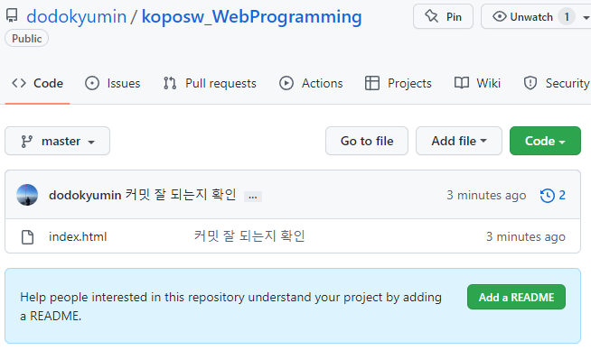

# 웹 (프론트엔드)개발의 기초 1


[TOC]

HTML 

CSS

Javascript : 웹 브라우저가 인식할 수 있는 유일한 언어

JQuery 

JSP (비교적 old)

Vue.js(front-end 최신기술)


**예전의 프론트엔트 3대장 : jsp(java), php, asp(ms)**

우리나라에서는 asp시장이 적다. 공공기관은 대부분이 jsp.


**요즘 프론트엔드 3대장 : vue.js, react, angular**


~~workbench는 개발자 아무도 안쓴다~~


### 👉마크업 언어의 종류들

html

xml 

json


### 👉제이쿼리

js를 쉽게 써보자 해서 개량하고 개량한


### 👉라이브러리와 프레임워크 차이

라이브러리 : 차트 만들어 놓은 파일 가져오기.

프레임워크 : 생태계를 만들어 놓은 것. java를 활용해서 만들 수 있게.(ex jsp)

자바스크립트의 프레임워크들 react, angular, vue

ios도 프레임워크다!


##### 웹쪽의 공식 문서는 mozilla 정리가 잘 되어있는 w3schools


### ✔깃헙과 연동하기

(git이 pc에 설치되어 있는 환경에서)

vscode의 Terminal -> New Terminal


##### 로컬 레파지토리를 만드는 터미널 명령어 :

```
>git init
```


##### 이제 버전 관리할 파일 지정(스테이징) 할거야:

```
>git add . (모든파일)
```


##### 커밋하기:

```
>git commit
```


##### 현재 커밋 준비중인 파일 등 상태 확인하기:

```
>git status
```


##### 커밋한 로그 확인하기:

```
>git log
```


##### 이제 깃헙에서 리파지토리를 만들어준다.

\+ 눌러서 저장소(리파지토리 만들어주기)


(참고)

git branch -M main : main branch로 이름 설정됨.

을 주석처리 하면 바로 master로 붙는다.

 

깃을 관리할 때 기본적으로 master 이름.


##### 내 리파지토리 주소 복사.


##### 로컬 리파지토리와 vscode리모트 연결:

```
>git remote add origin {리파지토리 주소}
```


아무것도 안뜨면 완료된 것.

remote를 가리키는것 이름이 기본적으로 origin


https://github.com/dodokyumin/koposw_JSPLinuxUbuntu.git

##### 리모트 연결 확인하기:

```
>git remote -v
```


fetch는 파일을 받기는 싫고 있는지만 보는 것.


##### 깃헙 계정 로그인하기 :

```
git config --global user.email "you@example.com"
> 비밀번호 입력(노출)

 git config --global user.name "Your Name"
```


##### 처음 리파지토리에 연결하고 업로드하는 명령:

```
>git push -u origin master
```

remote에 있는 origin에 로컬 master를 연결 하겠다.


연결이 되었고 파일이 커밋 되었다!


##### ❗연결 오류시

```
>git branch -M master main
```

깃 브랜치에 master를 main브랜치로 하겠다.


초록색 바는 추가된 내용. 

노란색 바는 수정된 내용.

빨간색 바는 삭제된 내용.


##### 바를 클릭하여 상세 내용을 확인할 수 있다.


revert change화살표를 눌러 돌아갈 수 있음.


수정내용 다시 올려보자!


#### 👉깃 히스토리 확인하기

##### 방법1) 깃헙 홈페이지에서 확인하기

깃헙에서 시계 아이콘을 눌러 커밋 로그를 확인할 수 있다.




##### 방법2) vscode에서 확인하기

1. git history 익스텐션을 받는다.


2. 소스컨트롤 메뉴에 시계아이콘 생김


클릭!


커밋 내용을 검색하여 확인할 수 있다. (평소에 이름을 잘 적어놓자!)


origin은 remote의 별칭.

master는 내 로컬.


##### 방법2+a)vscode 수정내용 커밋해보기(3탄)


\+를 눌러 간편하게 스테이징!


커밋 제목 같이 적어두기


체크 클릭!


sync changes를 눌러 push를 해주면


3탄이 업로드 되었다!


### ✔emmet 내장함수 이용하여 간단하게 테이블, 리스트만들기


emmet이라는 내장함수를 사용하여 간단하게 만들었다!


폼 액션을 #으로 지정해주면 자기 자신에게 보낸다.


## 📖실습하기

#### ex1)


<div class="colorscripter-code" style="color:#010101;font-family:Consolas, 'Liberation Mono', Menlo, Courier, monospace !important; position:relative !important;overflow:auto"><table class="colorscripter-code-table" style="margin:0;padding:0;border:none;background-color:#fafafa;border-radius:4px;" cellspacing="0" cellpadding="0"><tr><td style="padding:6px;border-right:2px solid #e5e5e5"><div style="margin:0;padding:0;word-break:normal;text-align:right;color:#666;font-family:Consolas, 'Liberation Mono', Menlo, Courier, monospace !important;line-height:130%"><div style="line-height:130%">1</div><div style="line-height:130%">2</div><div style="line-height:130%">3</div><div style="line-height:130%">4</div><div style="line-height:130%">5</div><div style="line-height:130%">6</div><div style="line-height:130%">7</div><div style="line-height:130%">8</div><div style="line-height:130%">9</div><div style="line-height:130%">10</div><div style="line-height:130%">11</div><div style="line-height:130%">12</div><div style="line-height:130%">13</div><div style="line-height:130%">14</div><div style="line-height:130%">15</div><div style="line-height:130%">16</div><div style="line-height:130%">17</div><div style="line-height:130%">18</div><div style="line-height:130%">19</div><div style="line-height:130%">20</div><div style="line-height:130%">21</div></div></td><td style="padding:6px 0;text-align:left"><div style="margin:0;padding:0;color:#010101;font-family:Consolas, 'Liberation Mono', Menlo, Courier, monospace !important;line-height:130%"><div style="padding:0 6px; white-space:pre; line-height:130%"><span style="color:#010101">&lt;</span><span style="color:#066de2">!DOCTYPE</span>&nbsp;<span style="color:#0a9989">html</span><span style="color:#010101">&gt;</span></div><div style="padding:0 6px; white-space:pre; line-height:130%"><span style="color:#010101">&lt;</span><span style="color:#066de2">html</span>&nbsp;<span style="color:#0a9989">lang</span>=<span style="color:#df5000">"en"</span><span style="color:#0a9989"></span><span style="color:#010101">&gt;</span></div><div style="padding:0 6px; white-space:pre; line-height:130%">&nbsp;&nbsp;<span style="color:#010101">&lt;</span><span style="color:#066de2">head</span><span style="color:#010101">&gt;</span></div><div style="padding:0 6px; white-space:pre; line-height:130%">&nbsp;&nbsp;&nbsp;&nbsp;<span style="color:#010101">&lt;</span><span style="color:#066de2">meta</span>&nbsp;<span style="color:#0a9989">charset</span>=<span style="color:#df5000">"UTF-8"</span><span style="color:#0a9989"></span>&nbsp;<span style="color:#0a9989">/</span><span style="color:#010101">&gt;</span></div><div style="padding:0 6px; white-space:pre; line-height:130%">&nbsp;&nbsp;&nbsp;&nbsp;<span style="color:#010101">&lt;</span><span style="color:#066de2">meta</span>&nbsp;<span style="color:#0a9989">http-equiv</span>=<span style="color:#df5000">"X-UA-Compatible"</span><span style="color:#0a9989"></span>&nbsp;<span style="color:#0a9989">content</span>=<span style="color:#df5000">"IE=edge"</span><span style="color:#0a9989"></span>&nbsp;<span style="color:#0a9989">/</span><span style="color:#010101">&gt;</span></div><div style="padding:0 6px; white-space:pre; line-height:130%">&nbsp;&nbsp;&nbsp;&nbsp;<span style="color:#010101">&lt;</span><span style="color:#066de2">meta</span>&nbsp;<span style="color:#0a9989">name</span>=<span style="color:#df5000">"viewport"</span><span style="color:#0a9989"></span>&nbsp;<span style="color:#0a9989">content</span>=<span style="color:#df5000">"width=device-width,&nbsp;initial-scale=1.0"</span><span style="color:#0a9989"></span>&nbsp;<span style="color:#0a9989">/</span><span style="color:#010101">&gt;</span></div><div style="padding:0 6px; white-space:pre; line-height:130%">&nbsp;&nbsp;&nbsp;&nbsp;<span style="color:#010101">&lt;</span><span style="color:#066de2">title</span><span style="color:#010101">&gt;</span>Document<span style="color:#010101">&lt;</span><span style="color:#010101">/</span><span style="color:#066de2">title</span><span style="color:#010101">&gt;</span></div><div style="padding:0 6px; white-space:pre; line-height:130%">&nbsp;&nbsp;<span style="color:#010101">&lt;</span><span style="color:#010101">/</span><span style="color:#066de2">head</span><span style="color:#010101">&gt;</span></div><div style="padding:0 6px; white-space:pre; line-height:130%">&nbsp;&nbsp;<span style="color:#010101">&lt;</span><span style="color:#066de2">body</span><span style="color:#010101">&gt;</span></div><div style="padding:0 6px; white-space:pre; line-height:130%">&nbsp;&nbsp;&nbsp;&nbsp;<span style="color:#010101">&lt;</span><span style="color:#066de2">p</span><span style="color:#010101">&gt;</span>이름&nbsp;:&nbsp;<span style="color:#010101">&lt;</span><span style="color:#066de2">b</span><span style="color:#010101">&gt;</span>홍규민<span style="color:#010101">&lt;</span><span style="color:#010101">/</span><span style="color:#066de2">b</span><span style="color:#010101">&gt;</span><span style="color:#010101">&lt;</span><span style="color:#010101">/</span><span style="color:#066de2">p</span><span style="color:#010101">&gt;</span></div><div style="padding:0 6px; white-space:pre; line-height:130%">&nbsp;&nbsp;&nbsp;&nbsp;<span style="color:#010101">&lt;</span><span style="color:#066de2">p</span><span style="color:#010101">&gt;</span>생년월일&nbsp;:&nbsp;<span style="color:#010101">&lt;</span><span style="color:#066de2">b</span><span style="color:#010101">&gt;</span>1996&nbsp;10월&nbsp;3일<span style="color:#010101">&lt;</span><span style="color:#010101">/</span><span style="color:#066de2">b</span><span style="color:#010101">&gt;</span><span style="color:#010101">&lt;</span><span style="color:#010101">/</span><span style="color:#066de2">p</span><span style="color:#010101">&gt;</span></div><div style="padding:0 6px; white-space:pre; line-height:130%">&nbsp;&nbsp;&nbsp;&nbsp;<span style="color:#010101">&lt;</span><span style="color:#066de2">p</span><span style="color:#010101">&gt;</span>사는&nbsp;곳&nbsp;:&nbsp;<span style="color:#010101">&lt;</span><span style="color:#066de2">b</span><span style="color:#010101">&gt;</span>서울시&nbsp;강남구<span style="color:#010101">&lt;</span><span style="color:#010101">/</span><span style="color:#066de2">b</span><span style="color:#010101">&gt;</span><span style="color:#010101">&lt;</span><span style="color:#010101">/</span><span style="color:#066de2">p</span><span style="color:#010101">&gt;</span></div><div style="padding:0 6px; white-space:pre; line-height:130%">&nbsp;&nbsp;&nbsp;&nbsp;<span style="color:#010101">&lt;</span><span style="color:#066de2">p</span><span style="color:#010101">&gt;</span>혈액형&nbsp;:&nbsp;<span style="color:#010101">&lt;</span><span style="color:#066de2">b</span><span style="color:#010101">&gt;</span>B형<span style="color:#010101">&lt;</span><span style="color:#010101">/</span><span style="color:#066de2">b</span><span style="color:#010101">&gt;</span><span style="color:#010101">&lt;</span><span style="color:#010101">/</span><span style="color:#066de2">p</span><span style="color:#010101">&gt;</span></div><div style="padding:0 6px; white-space:pre; line-height:130%">&nbsp;&nbsp;&nbsp;&nbsp;<span style="color:#010101">&lt;</span><span style="color:#066de2">img</span></div><div style="padding:0 6px; white-space:pre; line-height:130%"><span style="color:#0a9989"></span>&nbsp;<span style="color:#0a9989"></span>&nbsp;<span style="color:#0a9989"></span>&nbsp;<span style="color:#0a9989"></span>&nbsp;<span style="color:#0a9989"></span>&nbsp;<span style="color:#0a9989"></span>&nbsp;<span style="color:#0a9989">src</span>=<span style="color:#df5000">"https://encrypted-tbn0.gstatic.com/images?q=tbn:ANd9GcSfDsvRTzYUbYR_LCSkMmASMRcaIjVXFBsnJw&amp;usqp=CAU"</span><span style="color:#0a9989"></span></div><div style="padding:0 6px; white-space:pre; line-height:130%"><span style="color:#0a9989"></span>&nbsp;<span style="color:#0a9989"></span>&nbsp;<span style="color:#0a9989"></span>&nbsp;<span style="color:#0a9989"></span>&nbsp;<span style="color:#0a9989"></span>&nbsp;<span style="color:#0a9989"></span>&nbsp;<span style="color:#0a9989">width</span>=<span style="color:#df5000">"30%"</span><span style="color:#0a9989"></span></div><div style="padding:0 6px; white-space:pre; line-height:130%"><span style="color:#0a9989"></span>&nbsp;<span style="color:#0a9989"></span>&nbsp;<span style="color:#0a9989"></span>&nbsp;<span style="color:#0a9989"></span>&nbsp;<span style="color:#0a9989"></span>&nbsp;<span style="color:#0a9989"></span>&nbsp;<span style="color:#0a9989">alt</span>=<span style="color:#df5000">"이미지"</span><span style="color:#0a9989"></span></div><div style="padding:0 6px; white-space:pre; line-height:130%"><span style="color:#0a9989"></span>&nbsp;<span style="color:#0a9989"></span>&nbsp;<span style="color:#0a9989"></span>&nbsp;<span style="color:#0a9989"></span>&nbsp;<span style="color:#0a9989">/</span><span style="color:#010101">&gt;</span></div><div style="padding:0 6px; white-space:pre; line-height:130%">&nbsp;&nbsp;<span style="color:#010101">&lt;</span><span style="color:#010101">/</span><span style="color:#066de2">body</span><span style="color:#010101">&gt;</span></div><div style="padding:0 6px; white-space:pre; line-height:130%"><span style="color:#010101">&lt;</span><span style="color:#010101">/</span><span style="color:#066de2">html</span><span style="color:#010101">&gt;</span></div><div style="padding:0 6px; white-space:pre; line-height:130%">&nbsp;</div></div><div style="text-align:right;margin-top:-13px;margin-right:5px;font-size:9px;font-style:italic"><a href="http://colorscripter.com/info#e" target="_blank" style="color:#e5e5e5text-decoration:none">Colored by Color Scripter</a></div></td><td style="vertical-align:bottom;padding:0 2px 4px 0"><a href="http://colorscripter.com/info#e" target="_blank" style="text-decoration:none;color:white"><span style="font-size:9px;word-break:normal;background-color:#e5e5e5;color:white;border-radius:10px;padding:1px">cs</span></a></td></tr></table></div>


------

#### ex2)

<div class="colorscripter-code" style="color:#010101;font-family:Consolas, 'Liberation Mono', Menlo, Courier, monospace !important; position:relative !important;overflow:auto"><table class="colorscripter-code-table" style="margin:0;padding:0;border:none;background-color:#fafafa;border-radius:4px;" cellspacing="0" cellpadding="0"><tr><td style="padding:6px;border-right:2px solid #e5e5e5"><div style="margin:0;padding:0;word-break:normal;text-align:right;color:#666;font-family:Consolas, 'Liberation Mono', Menlo, Courier, monospace !important;line-height:130%"><div style="line-height:130%">1</div><div style="line-height:130%">2</div><div style="line-height:130%">3</div><div style="line-height:130%">4</div><div style="line-height:130%">5</div><div style="line-height:130%">6</div><div style="line-height:130%">7</div><div style="line-height:130%">8</div><div style="line-height:130%">9</div><div style="line-height:130%">10</div><div style="line-height:130%">11</div><div style="line-height:130%">12</div><div style="line-height:130%">13</div><div style="line-height:130%">14</div><div style="line-height:130%">15</div><div style="line-height:130%">16</div><div style="line-height:130%">17</div><div style="line-height:130%">18</div></div></td><td style="padding:6px 0;text-align:left"><div style="margin:0;padding:0;color:#010101;font-family:Consolas, 'Liberation Mono', Menlo, Courier, monospace !important;line-height:130%"><div style="padding:0 6px; white-space:pre; line-height:130%"><span style="color:#010101">&lt;</span><span style="color:#066de2">!DOCTYPE</span>&nbsp;<span style="color:#0a9989">html</span><span style="color:#010101">&gt;</span></div><div style="padding:0 6px; white-space:pre; line-height:130%"><span style="color:#010101">&lt;</span><span style="color:#066de2">html</span>&nbsp;<span style="color:#0a9989">lang</span>=<span style="color:#df5000">"en"</span><span style="color:#0a9989"></span><span style="color:#010101">&gt;</span></div><div style="padding:0 6px; white-space:pre; line-height:130%"><span style="color:#010101">&lt;</span><span style="color:#066de2">head</span><span style="color:#010101">&gt;</span></div><div style="padding:0 6px; white-space:pre; line-height:130%">&nbsp;&nbsp;&nbsp;&nbsp;<span style="color:#010101">&lt;</span><span style="color:#066de2">meta</span>&nbsp;<span style="color:#0a9989">charset</span>=<span style="color:#df5000">"UTF-8"</span><span style="color:#0a9989"></span><span style="color:#010101">&gt;</span></div><div style="padding:0 6px; white-space:pre; line-height:130%">&nbsp;&nbsp;&nbsp;&nbsp;<span style="color:#010101">&lt;</span><span style="color:#066de2">meta</span>&nbsp;<span style="color:#0a9989">http-equiv</span>=<span style="color:#df5000">"X-UA-Compatible"</span><span style="color:#0a9989"></span>&nbsp;<span style="color:#0a9989">content</span>=<span style="color:#df5000">"IE=edge"</span><span style="color:#0a9989"></span><span style="color:#010101">&gt;</span></div><div style="padding:0 6px; white-space:pre; line-height:130%">&nbsp;&nbsp;&nbsp;&nbsp;<span style="color:#010101">&lt;</span><span style="color:#066de2">meta</span>&nbsp;<span style="color:#0a9989">name</span>=<span style="color:#df5000">"viewport"</span><span style="color:#0a9989"></span>&nbsp;<span style="color:#0a9989">content</span>=<span style="color:#df5000">"width=device-width,&nbsp;initial-scale=1.0"</span><span style="color:#0a9989"></span><span style="color:#010101">&gt;</span></div><div style="padding:0 6px; white-space:pre; line-height:130%">&nbsp;&nbsp;&nbsp;&nbsp;<span style="color:#010101">&lt;</span><span style="color:#066de2">title</span><span style="color:#010101">&gt;</span>Document<span style="color:#010101">&lt;</span><span style="color:#010101">/</span><span style="color:#066de2">title</span><span style="color:#010101">&gt;</span></div><div style="padding:0 6px; white-space:pre; line-height:130%"><span style="color:#010101">&lt;</span><span style="color:#010101">/</span><span style="color:#066de2">head</span><span style="color:#010101">&gt;</span></div><div style="padding:0 6px; white-space:pre; line-height:130%"><span style="color:#010101">&lt;</span><span style="color:#066de2">body</span><span style="color:#010101">&gt;</span></div><div style="padding:0 6px; white-space:pre; line-height:130%">&nbsp;&nbsp;&nbsp;&nbsp;<span style="color:#010101">&lt;</span><span style="color:#066de2">p</span>&nbsp;<span style="color:#0a9989">align</span>=<span style="color:#df5000">"center"</span><span style="color:#0a9989"></span>&nbsp;<span style="color:#0a9989"></span><span style="color:#010101">&gt;</span><span style="color:#010101">&lt;</span><span style="color:#066de2">img</span>&nbsp;<span style="color:#0a9989">src</span>=<span style="color:#df5000">"https://www.fifplay.com/img/public/premier-league-3-logo.png"</span><span style="color:#0a9989"></span>&nbsp;<span style="color:#0a9989">width</span>=<span style="color:#df5000">"30%"</span><span style="color:#0a9989"></span>&nbsp;<span style="color:#0a9989">alt</span>=<span style="color:#df5000">"epl로고"</span><span style="color:#0a9989"></span><span style="color:#010101">&gt;</span><span style="color:#010101">&lt;</span><span style="color:#010101">/</span><span style="color:#066de2">p</span><span style="color:#010101">&gt;</span></div><div style="padding:0 6px; white-space:pre; line-height:130%">&nbsp;&nbsp;&nbsp;&nbsp;<span style="color:#010101">&lt;</span><span style="color:#066de2">p</span><span style="color:#010101">&gt;</span><span style="color:#010101">&lt;</span><span style="color:#066de2">h2</span>&nbsp;<span style="color:#0a9989">align</span>=<span style="color:#df5000">"center"</span><span style="color:#0a9989"></span><span style="color:#010101">&gt;</span>경기&nbsp;일정<span style="color:#010101">&lt;</span><span style="color:#010101">/</span><span style="color:#066de2">h2</span><span style="color:#010101">&gt;</span><span style="color:#010101">&lt;</span><span style="color:#010101">/</span><span style="color:#066de2">p</span><span style="color:#010101">&gt;</span></div><div style="padding:0 6px; white-space:pre; line-height:130%">&nbsp;&nbsp;&nbsp;&nbsp;<span style="color:#010101">&lt;</span><span style="color:#066de2">p</span>&nbsp;<span style="color:#0a9989">align</span>=<span style="color:#df5000">"center"</span><span style="color:#0a9989"></span>&nbsp;<span style="color:#0a9989"></span><span style="color:#010101">&gt;</span><span style="color:#010101">&lt;</span><span style="color:#066de2">img</span>&nbsp;<span style="color:#0a9989">src</span>=<span style="color:#df5000">"https://w.namu.la/s/5d9930a1b31cf7f61aa946577044b0c761f09a709a138a2b2d0f3a926f81ab9e539881267ad82881b54137a717e959bf757fe8023008b999c585cdb20aa2725283650e31fe12724cb36d24b3db9a3d813497c87663d02bcae7c3b7e479f74b9a"</span><span style="color:#0a9989"></span>&nbsp;<span style="color:#0a9989">width</span>=<span style="color:#df5000">"20"</span><span style="color:#0a9989"></span>&nbsp;<span style="color:#0a9989">alt</span>=<span style="color:#df5000">"토트넘"</span><span style="color:#0a9989"></span><span style="color:#010101">&gt;</span><span style="color:#010101">&lt;</span><span style="color:#066de2">a</span>&nbsp;<span style="color:#0a9989">href</span>=<span style="color:#df5000">"https://www.google.com/search?gs_ssp=eJzj4tDP1TfIKMsqMmD04izJLylJzctIzAUASS8HIA&amp;q=tottenham&amp;oq=%EC%83%9B%E3%85%85&amp;aqs=chrome.1.69i57j46i131i433i512j0i131i433i512l3j0i3l2j46i131i433i512j0i3.1622j1j4&amp;sourceid=chrome&amp;ie=UTF-8#sie=t;/m/0hvjr;2;/m/02_tc;mt;fp;1;;"</span><span style="color:#0a9989"></span><span style="color:#010101">&gt;</span>SPURS<span style="color:#010101">&lt;</span><span style="color:#010101">/</span><span style="color:#066de2">a</span><span style="color:#010101">&gt;</span><span style="color:#010101">&lt;</span><span style="color:#010101">/</span><span style="color:#066de2">p</span><span style="color:#010101">&gt;</span></div><div style="padding:0 6px; white-space:pre; line-height:130%">&nbsp;&nbsp;&nbsp;&nbsp;<span style="color:#010101">&lt;</span><span style="color:#066de2">p</span>&nbsp;<span style="color:#0a9989">align</span>=<span style="color:#df5000">"center"</span><span style="color:#0a9989"></span>&nbsp;<span style="color:#0a9989"></span><span style="color:#010101">&gt;</span><span style="color:#010101">&lt;</span><span style="color:#066de2">img</span>&nbsp;<span style="color:#0a9989">src</span>=<span style="color:#df5000">"https://w.namu.la/s/74cef6dadf0f5c1bb3c1b2cdc7b4bd74fde660dfbe59bdc121fe00d9b2dd35d13385358aad8481d20138d72d4acefa1c5051832a196fe3b7f4d47e6be2cb902937dd0dcd1fdb7b29c203ac770fe93d2d7c012fa8ec09a1af8fd7a76f44b3c2a3"</span><span style="color:#0a9989"></span>&nbsp;<span style="color:#0a9989">width</span>=<span style="color:#df5000">"20"</span><span style="color:#0a9989"></span>&nbsp;<span style="color:#0a9989">alt</span>=<span style="color:#df5000">"맨시티"</span><span style="color:#0a9989"></span><span style="color:#010101">&gt;</span><span style="color:#010101">&lt;</span><span style="color:#066de2">a</span>&nbsp;<span style="color:#0a9989">href</span>=<span style="color:#df5000">"https://www.google.com/search?q=%EB%A6%AC%EB%B2%84%ED%92%80&amp;sxsrf=ALiCzsZI-t_hIwp6IVt9ByWffsolrMlabA%3A1653537358283&amp;ei=TvqOYqXyEIfx0gSmhrmYDg&amp;ved=0ahUKEwil0fPWovz3AhWHuJQKHSZDDuMQ4dUDCA4&amp;uact=5&amp;oq=%EB%A6%AC%EB%B2%84%ED%92%80&amp;gs_lcp=Cgdnd3Mtd2l6EAMyDQgAEIAEEIcCELEDEBQyBQgAEIAEMgUIABCABDILCAAQgAQQsQMQgwEyBQgAEIAEMgUIABCABDIFCAAQgAQyCggAEIAEEIcCEBQyBQgAEIAEMgUIABCABDoECCMQJzoOCC4QgAQQsQMQgwEQ1AI6BQguEIAEOgsILhCABBCxAxDUAjoLCC4QgAQQsQMQgwFKBAhBGABKBAhGGABQAFjcA2DNBGgBcAF4AYABwgGIAYAGkgEDMC41mAEAoAEBwAEB&amp;sclient=gws-wiz#sie=t;/m/04ltf;2;/m/02_tc;mt;fp;1;;"</span><span style="color:#0a9989"></span><span style="color:#010101">&gt;</span>MANCITY<span style="color:#010101">&lt;</span><span style="color:#010101">/</span><span style="color:#066de2">a</span><span style="color:#010101">&gt;</span><span style="color:#010101">&lt;</span><span style="color:#010101">/</span><span style="color:#066de2">p</span><span style="color:#010101">&gt;</span></div><div style="padding:0 6px; white-space:pre; line-height:130%">&nbsp;&nbsp;&nbsp;&nbsp;<span style="color:#010101">&lt;</span><span style="color:#066de2">p</span>&nbsp;<span style="color:#0a9989">align</span>=<span style="color:#df5000">"center"</span><span style="color:#0a9989"></span>&nbsp;<span style="color:#0a9989"></span><span style="color:#010101">&gt;</span><span style="color:#010101">&lt;</span><span style="color:#066de2">img</span>&nbsp;<span style="color:#0a9989">src</span>=<span style="color:#df5000">"https://w.namu.la/s/d097267d0b17fea7cce28d77fba847064e3a13638fade54bf12a128201325324cf33042a215b5dbd587068bc1d85876088ee36e331b21d6a7a7f4c06b13ee3ab2158cd43ea6fb4f7bb330613619ad97584ffa36fb070ee47c206a9a6f49fa32a"</span><span style="color:#0a9989"></span>&nbsp;<span style="color:#0a9989">width</span>=<span style="color:#df5000">"20"</span><span style="color:#0a9989"></span>&nbsp;<span style="color:#0a9989">alt</span>=<span style="color:#df5000">"리버풀"</span><span style="color:#0a9989"></span><span style="color:#010101">&gt;</span><span style="color:#010101">&lt;</span><span style="color:#066de2">a</span>&nbsp;<span style="color:#0a9989">href</span>=<span style="color:#df5000">"https://www.google.com/search?q=%EB%A7%A8%EC%8B%9C%ED%8B%B0&amp;sxsrf=ALiCzsZvJ7nBQ4MBkJroVRDoi0ObWwZmOg%3A1653537312045&amp;ei=IPqOYoenAorO0QTX7q-gDg&amp;ved=0ahUKEwiHt-3Aovz3AhUKZ5QKHVf3C-QQ4dUDCA4&amp;uact=5&amp;oq=%EB%A7%A8%EC%8B%9C%ED%8B%B0&amp;gs_lcp=Cgdnd3Mtd2l6EAMyCAguEIAEELEDMggIABCABBCxAzIICAAQgAQQsQMyBAgAEAMyBAgAEAMyBQgAEIAEMgUIABCABDIFCAAQgAQyBQgAEIAEMgsIABCABBCxAxCDAUoECEEYAEoECEYYAFAAWL0GYLsHaABwAXgAgAGhAYgBkAeSAQMwLjaYAQCgAQHAAQE&amp;sclient=gws-wiz#sie=t;/m/01634x;2;/m/02_tc;mt;fp;1;;"</span><span style="color:#0a9989"></span><span style="color:#010101">&gt;</span>LIVERPOOL<span style="color:#010101">&lt;</span><span style="color:#010101">/</span><span style="color:#066de2">a</span><span style="color:#010101">&gt;</span><span style="color:#010101">&lt;</span><span style="color:#010101">/</span><span style="color:#066de2">p</span><span style="color:#010101">&gt;</span></div><div style="padding:0 6px; white-space:pre; line-height:130%">&nbsp;&nbsp;&nbsp;&nbsp;<span style="color:#010101">&lt;</span><span style="color:#066de2">p</span>&nbsp;<span style="color:#0a9989">align</span>=<span style="color:#df5000">"center"</span><span style="color:#0a9989"></span>&nbsp;<span style="color:#0a9989"></span><span style="color:#010101">&gt;</span><span style="color:#010101">&lt;</span><span style="color:#066de2">img</span>&nbsp;<span style="color:#0a9989">src</span>=<span style="color:#df5000">"https://w.namu.la/s/3549f69f6bd3a8247c9857b4e99328ffabd456db7237013cc23ba08b9733ce3f87a2aee98b86cd07685e587f1d5378b8862e191786471d23f155297e7c92291f30e56d9bf1bdafe29a4e85fd938837300e67d528d3eef64922026e4fbb19f2fe"</span><span style="color:#0a9989"></span>&nbsp;<span style="color:#0a9989">width</span>=<span style="color:#df5000">"20"</span><span style="color:#0a9989"></span>&nbsp;<span style="color:#0a9989">alt</span>=<span style="color:#df5000">"첼시"</span><span style="color:#0a9989"></span><span style="color:#010101">&gt;</span><span style="color:#010101">&lt;</span><span style="color:#066de2">a</span>&nbsp;<span style="color:#0a9989">href</span>=<span style="color:#df5000">"https://www.google.com/search?q=%EC%B2%BC%EC%8B%9C&amp;sxsrf=ALiCzsZYgp9D_a1Vd3KnMG4By-tsR_CfEw%3A1653537428092&amp;ei=lPqOYrCYBYnUmAXWj5WYDg&amp;ved=0ahUKEwiwspj4ovz3AhUJKqYKHdZHBeMQ4dUDCA4&amp;uact=5&amp;oq=%EC%B2%BC%EC%8B%9C&amp;gs_lcp=Cgdnd3Mtd2l6EAMyBAgjECcyBAgjECcyCwgAEIAEELEDEIMBMgUIABCABDIFCAAQgAQyCwgAEIAEELEDEIMBMgUIABCABDIICAAQgAQQsQMyBQgAEIAEMgUIABCABDoNCCMQJxCLAxCoAxCmAzoHCCMQJxCLAzoRCC4QgAQQsQMQgwEQxwEQowI6DgguEIAEELEDEMcBENEDOgcILhCABBAKOggILhCABBCxAzoHCCMQ6gIQJzoHCC4Q6gIQJ0oECEEYAEoECEYYAFAAWJURYLcSaAZwAXgAgAHCAYgB9QuSAQQwLjEwmAEAoAEBsAEKuAECwAEB&amp;sclient=gws-wiz#sie=t;/m/023fb;2;/m/02_tc;mt;fp;1;;"</span><span style="color:#0a9989"></span><span style="color:#010101">&gt;</span>CHELSEA<span style="color:#010101">&lt;</span><span style="color:#010101">/</span><span style="color:#066de2">a</span><span style="color:#010101">&gt;</span><span style="color:#010101">&lt;</span><span style="color:#010101">/</span><span style="color:#066de2">p</span><span style="color:#010101">&gt;</span></div><div style="padding:0 6px; white-space:pre; line-height:130%"><span style="color:#010101">&lt;</span><span style="color:#010101">/</span><span style="color:#066de2">body</span><span style="color:#010101">&gt;</span></div><div style="padding:0 6px; white-space:pre; line-height:130%"><span style="color:#010101">&lt;</span><span style="color:#010101">/</span><span style="color:#066de2">body</span><span style="color:#010101">&gt;</span></div><div style="padding:0 6px; white-space:pre; line-height:130%"><span style="color:#010101">&lt;</span><span style="color:#010101">/</span><span style="color:#066de2">html</span><span style="color:#010101">&gt;</span></div></div><div style="text-align:right;margin-top:-13px;margin-right:5px;font-size:9px;font-style:italic"><a href="http://colorscripter.com/info#e" target="_blank" style="color:#e5e5e5text-decoration:none">Colored by Color Scripter</a></div></td><td style="vertical-align:bottom;padding:0 2px 4px 0"><a href="http://colorscripter.com/info#e" target="_blank" style="text-decoration:none;color:white"><span style="font-size:9px;word-break:normal;background-color:#e5e5e5;color:white;border-radius:10px;padding:1px">cs</span></a></td></tr></table></div>


------

#### ex3)

<div class="colorscripter-code" style="color:#010101;font-family:Consolas, 'Liberation Mono', Menlo, Courier, monospace !important; position:relative !important;overflow:auto"><table class="colorscripter-code-table" style="margin:0;padding:0;border:none;background-color:#fafafa;border-radius:4px;" cellspacing="0" cellpadding="0"><tr><td style="padding:6px;border-right:2px solid #e5e5e5"><div style="margin:0;padding:0;word-break:normal;text-align:right;color:#666;font-family:Consolas, 'Liberation Mono', Menlo, Courier, monospace !important;line-height:130%"><div style="line-height:130%">1</div><div style="line-height:130%">2</div><div style="line-height:130%">3</div><div style="line-height:130%">4</div><div style="line-height:130%">5</div><div style="line-height:130%">6</div><div style="line-height:130%">7</div><div style="line-height:130%">8</div><div style="line-height:130%">9</div><div style="line-height:130%">10</div><div style="line-height:130%">11</div><div style="line-height:130%">12</div><div style="line-height:130%">13</div><div style="line-height:130%">14</div><div style="line-height:130%">15</div><div style="line-height:130%">16</div><div style="line-height:130%">17</div><div style="line-height:130%">18</div><div style="line-height:130%">19</div><div style="line-height:130%">20</div><div style="line-height:130%">21</div><div style="line-height:130%">22</div><div style="line-height:130%">23</div><div style="line-height:130%">24</div><div style="line-height:130%">25</div><div style="line-height:130%">26</div><div style="line-height:130%">27</div><div style="line-height:130%">28</div><div style="line-height:130%">29</div><div style="line-height:130%">30</div><div style="line-height:130%">31</div><div style="line-height:130%">32</div><div style="line-height:130%">33</div><div style="line-height:130%">34</div><div style="line-height:130%">35</div><div style="line-height:130%">36</div><div style="line-height:130%">37</div><div style="line-height:130%">38</div><div style="line-height:130%">39</div><div style="line-height:130%">40</div><div style="line-height:130%">41</div><div style="line-height:130%">42</div><div style="line-height:130%">43</div><div style="line-height:130%">44</div><div style="line-height:130%">45</div></div></td><td style="padding:6px 0;text-align:left"><div style="margin:0;padding:0;color:#010101;font-family:Consolas, 'Liberation Mono', Menlo, Courier, monospace !important;line-height:130%"><div style="padding:0 6px; white-space:pre; line-height:130%"><span style="color:#010101">&lt;</span><span style="color:#066de2">!DOCTYPE</span>&nbsp;<span style="color:#0a9989">html</span><span style="color:#010101">&gt;</span></div><div style="padding:0 6px; white-space:pre; line-height:130%"><span style="color:#010101">&lt;</span><span style="color:#066de2">html</span>&nbsp;<span style="color:#0a9989">lang</span>=<span style="color:#df5000">"en"</span><span style="color:#0a9989"></span><span style="color:#010101">&gt;</span></div><div style="padding:0 6px; white-space:pre; line-height:130%">&nbsp;&nbsp;<span style="color:#010101">&lt;</span><span style="color:#066de2">head</span><span style="color:#010101">&gt;</span></div><div style="padding:0 6px; white-space:pre; line-height:130%">&nbsp;&nbsp;&nbsp;&nbsp;<span style="color:#010101">&lt;</span><span style="color:#066de2">meta</span>&nbsp;<span style="color:#0a9989">charset</span>=<span style="color:#df5000">"UTF-8"</span><span style="color:#0a9989"></span>&nbsp;<span style="color:#0a9989">/</span><span style="color:#010101">&gt;</span></div><div style="padding:0 6px; white-space:pre; line-height:130%">&nbsp;&nbsp;&nbsp;&nbsp;<span style="color:#010101">&lt;</span><span style="color:#066de2">meta</span>&nbsp;<span style="color:#0a9989">http-equiv</span>=<span style="color:#df5000">"X-UA-Compatible"</span><span style="color:#0a9989"></span>&nbsp;<span style="color:#0a9989">content</span>=<span style="color:#df5000">"IE=edge"</span><span style="color:#0a9989"></span>&nbsp;<span style="color:#0a9989">/</span><span style="color:#010101">&gt;</span></div><div style="padding:0 6px; white-space:pre; line-height:130%">&nbsp;&nbsp;&nbsp;&nbsp;<span style="color:#010101">&lt;</span><span style="color:#066de2">meta</span>&nbsp;<span style="color:#0a9989">name</span>=<span style="color:#df5000">"viewport"</span><span style="color:#0a9989"></span>&nbsp;<span style="color:#0a9989">content</span>=<span style="color:#df5000">"width=device-width,&nbsp;initial-scale=1.0"</span><span style="color:#0a9989"></span>&nbsp;<span style="color:#0a9989">/</span><span style="color:#010101">&gt;</span></div><div style="padding:0 6px; white-space:pre; line-height:130%">&nbsp;&nbsp;&nbsp;&nbsp;<span style="color:#010101">&lt;</span><span style="color:#066de2">title</span><span style="color:#010101">&gt;</span>Document<span style="color:#010101">&lt;</span><span style="color:#010101">/</span><span style="color:#066de2">title</span><span style="color:#010101">&gt;</span></div><div style="padding:0 6px; white-space:pre; line-height:130%">&nbsp;&nbsp;<span style="color:#010101">&lt;</span><span style="color:#010101">/</span><span style="color:#066de2">head</span><span style="color:#010101">&gt;</span></div><div style="padding:0 6px; white-space:pre; line-height:130%">&nbsp;&nbsp;&nbsp;&nbsp;<span style="color:#010101">&lt;</span><span style="color:#066de2">style</span><span style="color:#010101">&gt;</span><span style="color:#ff3399"></span></div><div style="padding:0 6px; white-space:pre; line-height:130%"><span style="color:#ff3399">&nbsp;&nbsp;&nbsp;&nbsp;&nbsp;&nbsp;table&nbsp;</span>{<span style="color:#0099cc"></span></div><div style="padding:0 6px; white-space:pre; line-height:130%"><span style="color:#0099cc">&nbsp;&nbsp;&nbsp;&nbsp;&nbsp;&nbsp;&nbsp;&nbsp;&nbsp;&nbsp;&nbsp;&nbsp;&nbsp;&nbsp;border&nbsp;</span><span style="color:#ff3399">:</span><span style="color:#0066cc">&nbsp;1px&nbsp;solid&nbsp;black</span><span style="color:#ff3399">;</span><span style="color:#0099cc"></span></div><div style="padding:0 6px; white-space:pre; line-height:130%"><span style="color:#0099cc">&nbsp;&nbsp;&nbsp;&nbsp;&nbsp;&nbsp;&nbsp;&nbsp;&nbsp;&nbsp;&nbsp;&nbsp;&nbsp;&nbsp;border-collapse&nbsp;</span><span style="color:#ff3399">:</span><span style="color:#0066cc">&nbsp;collapse</span><span style="color:#ff3399">;</span><span style="color:#0066cc"></span></div><div style="padding:0 6px; white-space:pre; line-height:130%"><span style="color:#0066cc">&nbsp;&nbsp;&nbsp;&nbsp;&nbsp;&nbsp;&nbsp;&nbsp;&nbsp;&nbsp;&nbsp;&nbsp;</span>}<span style="color:#ff3399">;</span></div><div style="padding:0 6px; white-space:pre; line-height:130%"><span style="color:#ff3399">&nbsp;&nbsp;&nbsp;&nbsp;&nbsp;&nbsp;td&nbsp;</span>{<span style="color:#0099cc"></span></div><div style="padding:0 6px; white-space:pre; line-height:130%"><span style="color:#0099cc">&nbsp;&nbsp;&nbsp;&nbsp;&nbsp;&nbsp;&nbsp;&nbsp;border&nbsp;</span><span style="color:#ff3399">:</span><span style="color:#0066cc">&nbsp;1px&nbsp;solid&nbsp;black</span><span style="color:#ff3399">;</span><span style="color:#0099cc"></span></div><div style="padding:0 6px; white-space:pre; line-height:130%"><span style="color:#0099cc">&nbsp;&nbsp;&nbsp;&nbsp;&nbsp;&nbsp;&nbsp;&nbsp;border-collapse&nbsp;</span><span style="color:#ff3399">:</span><span style="color:#0066cc">&nbsp;collapse</span><span style="color:#ff3399">;</span><span style="color:#0066cc"></span></div><div style="padding:0 6px; white-space:pre; line-height:130%"><span style="color:#0066cc">&nbsp;&nbsp;&nbsp;&nbsp;&nbsp;&nbsp;</span>};</div><div style="padding:0 6px; white-space:pre; line-height:130%">&nbsp;&nbsp;&nbsp;&nbsp;<span style="color:#010101">&lt;</span><span style="color:#010101">/</span><span style="color:#066de2">style</span><span style="color:#010101">&gt;</span></div><div style="padding:0 6px; white-space:pre; line-height:130%">&nbsp;&nbsp;<span style="color:#010101">&lt;</span><span style="color:#066de2">body</span><span style="color:#010101">&gt;</span></div><div style="padding:0 6px; white-space:pre; line-height:130%">&nbsp;&nbsp;&nbsp;&nbsp;<span style="color:#999999">&lt;!--&nbsp;table&gt;tr*5&gt;tr*2&nbsp;(emmet&nbsp;이라는&nbsp;내장&nbsp;함수를&nbsp;이용한&nbsp;코드)--&gt;</span></div><div style="padding:0 6px; white-space:pre; line-height:130%">&nbsp;&nbsp;&nbsp;&nbsp;<span style="color:#010101">&lt;</span><span style="color:#066de2">table</span>&nbsp;<span style="color:#0a9989">border</span>=<span style="color:#df5000">"1"</span><span style="color:#0a9989"></span>&nbsp;<span style="color:#0a9989">width</span>=<span style="color:#df5000">"300"</span><span style="color:#0a9989"></span>&nbsp;<span style="color:#0a9989">height</span>=<span style="color:#df5000">"400"</span><span style="color:#0a9989"></span><span style="color:#010101">&gt;</span></div><div style="padding:0 6px; white-space:pre; line-height:130%">&nbsp;&nbsp;&nbsp;&nbsp;&nbsp;&nbsp;<span style="color:#010101">&lt;</span><span style="color:#066de2">tr</span><span style="color:#010101">&gt;</span></div><div style="padding:0 6px; white-space:pre; line-height:130%">&nbsp;&nbsp;&nbsp;&nbsp;&nbsp;&nbsp;&nbsp;&nbsp;<span style="color:#010101">&lt;</span><span style="color:#066de2">th</span>&nbsp;<span style="color:#0a9989">rowspan</span>=<span style="color:#df5000">"4"</span><span style="color:#0a9989"></span>&nbsp;<span style="color:#0a9989">align</span>=<span style="color:#df5000">"left"</span><span style="color:#0a9989"></span><span style="color:#010101">&gt;</span>1<span style="color:#010101">&lt;</span><span style="color:#010101">/</span><span style="color:#066de2">th</span><span style="color:#010101">&gt;</span></div><div style="padding:0 6px; white-space:pre; line-height:130%">&nbsp;&nbsp;&nbsp;&nbsp;&nbsp;&nbsp;&nbsp;&nbsp;<span style="color:#010101">&lt;</span><span style="color:#066de2">th</span>&nbsp;<span style="color:#0a9989">align</span>=<span style="color:#df5000">"left"</span><span style="color:#0a9989"></span><span style="color:#010101">&gt;</span>2<span style="color:#010101">&lt;</span><span style="color:#010101">/</span><span style="color:#066de2">th</span><span style="color:#010101">&gt;</span></div><div style="padding:0 6px; white-space:pre; line-height:130%">&nbsp;&nbsp;&nbsp;&nbsp;&nbsp;&nbsp;<span style="color:#010101">&lt;</span><span style="color:#010101">/</span><span style="color:#066de2">tr</span><span style="color:#010101">&gt;</span></div><div style="padding:0 6px; white-space:pre; line-height:130%">&nbsp;&nbsp;&nbsp;&nbsp;&nbsp;&nbsp;<span style="color:#010101">&lt;</span><span style="color:#066de2">tr</span><span style="color:#010101">&gt;</span></div><div style="padding:0 6px; white-space:pre; line-height:130%">&nbsp;&nbsp;&nbsp;&nbsp;&nbsp;&nbsp;&nbsp;&nbsp;<span style="color:#010101">&lt;</span><span style="color:#066de2">th</span>&nbsp;<span style="color:#0a9989">align</span>=<span style="color:#df5000">"left"</span><span style="color:#0a9989"></span><span style="color:#010101">&gt;</span>3<span style="color:#010101">&lt;</span><span style="color:#010101">/</span><span style="color:#066de2">th</span><span style="color:#010101">&gt;</span></div><div style="padding:0 6px; white-space:pre; line-height:130%">&nbsp;&nbsp;&nbsp;&nbsp;&nbsp;&nbsp;<span style="color:#010101">&lt;</span><span style="color:#010101">/</span><span style="color:#066de2">tr</span><span style="color:#010101">&gt;</span></div><div style="padding:0 6px; white-space:pre; line-height:130%">&nbsp;&nbsp;&nbsp;&nbsp;&nbsp;&nbsp;<span style="color:#010101">&lt;</span><span style="color:#066de2">tr</span><span style="color:#010101">&gt;</span></div><div style="padding:0 6px; white-space:pre; line-height:130%">&nbsp;&nbsp;&nbsp;&nbsp;&nbsp;&nbsp;&nbsp;&nbsp;<span style="color:#010101">&lt;</span><span style="color:#066de2">th</span>&nbsp;<span style="color:#0a9989">align</span>=<span style="color:#df5000">"left"</span><span style="color:#0a9989"></span><span style="color:#010101">&gt;</span>4<span style="color:#010101">&lt;</span><span style="color:#010101">/</span><span style="color:#066de2">th</span><span style="color:#010101">&gt;</span></div><div style="padding:0 6px; white-space:pre; line-height:130%">&nbsp;&nbsp;&nbsp;&nbsp;&nbsp;&nbsp;<span style="color:#010101">&lt;</span><span style="color:#010101">/</span><span style="color:#066de2">tr</span><span style="color:#010101">&gt;</span></div><div style="padding:0 6px; white-space:pre; line-height:130%">&nbsp;&nbsp;&nbsp;&nbsp;&nbsp;&nbsp;<span style="color:#010101">&lt;</span><span style="color:#066de2">th</span>&nbsp;<span style="color:#0a9989">align</span>=<span style="color:#df5000">"left"</span><span style="color:#0a9989"></span><span style="color:#010101">&gt;</span>5<span style="color:#010101">&lt;</span><span style="color:#010101">/</span><span style="color:#066de2">th</span><span style="color:#010101">&gt;</span></div><div style="padding:0 6px; white-space:pre; line-height:130%">&nbsp;&nbsp;&nbsp;&nbsp;&nbsp;&nbsp;<span style="color:#010101">&lt;</span><span style="color:#066de2">tr</span><span style="color:#010101">&gt;</span></div><div style="padding:0 6px; white-space:pre; line-height:130%">&nbsp;&nbsp;&nbsp;&nbsp;&nbsp;&nbsp;<span style="color:#010101">&lt;</span><span style="color:#010101">/</span><span style="color:#066de2">tr</span><span style="color:#010101">&gt;</span></div><div style="padding:0 6px; white-space:pre; line-height:130%">&nbsp;&nbsp;&nbsp;&nbsp;&nbsp;&nbsp;<span style="color:#010101">&lt;</span><span style="color:#066de2">tr</span><span style="color:#010101">&gt;</span></div><div style="padding:0 6px; white-space:pre; line-height:130%">&nbsp;&nbsp;&nbsp;&nbsp;&nbsp;&nbsp;&nbsp;&nbsp;<span style="color:#010101">&lt;</span><span style="color:#066de2">th</span>&nbsp;<span style="color:#0a9989">colspan</span>=<span style="color:#df5000">"2"</span><span style="color:#0a9989"></span>&nbsp;<span style="color:#0a9989">align</span>=<span style="color:#df5000">"center"</span><span style="color:#0a9989"></span>&nbsp;<span style="color:#0a9989">align</span>=<span style="color:#df5000">"left"</span><span style="color:#0a9989"></span><span style="color:#010101">&gt;</span>6<span style="color:#010101">&lt;</span><span style="color:#010101">/</span><span style="color:#066de2">th</span><span style="color:#010101">&gt;</span></div><div style="padding:0 6px; white-space:pre; line-height:130%">&nbsp;&nbsp;&nbsp;&nbsp;&nbsp;&nbsp;<span style="color:#010101">&lt;</span><span style="color:#010101">/</span><span style="color:#066de2">tr</span><span style="color:#010101">&gt;</span></div><div style="padding:0 6px; white-space:pre; line-height:130%">&nbsp;&nbsp;&nbsp;&nbsp;<span style="color:#010101">&lt;</span><span style="color:#010101">/</span><span style="color:#066de2">table</span><span style="color:#010101">&gt;</span></div><div style="padding:0 6px; white-space:pre; line-height:130%">&nbsp;</div><div style="padding:0 6px; white-space:pre; line-height:130%">&nbsp;</div><div style="padding:0 6px; white-space:pre; line-height:130%">&nbsp;&nbsp;&nbsp;&nbsp;<span style="color:#010101">&lt;</span><span style="color:#010101">/</span><span style="color:#066de2">form</span><span style="color:#010101">&gt;</span></div><div style="padding:0 6px; white-space:pre; line-height:130%">&nbsp;</div><div style="padding:0 6px; white-space:pre; line-height:130%">&nbsp;&nbsp;<span style="color:#010101">&lt;</span><span style="color:#010101">/</span><span style="color:#066de2">body</span><span style="color:#010101">&gt;</span></div><div style="padding:0 6px; white-space:pre; line-height:130%"><span style="color:#010101">&lt;</span><span style="color:#010101">/</span><span style="color:#066de2">html</span><span style="color:#010101">&gt;</span></div><div style="padding:0 6px; white-space:pre; line-height:130%">&nbsp;</div></div><div style="text-align:right;margin-top:-13px;margin-right:5px;font-size:9px;font-style:italic"><a href="http://colorscripter.com/info#e" target="_blank" style="color:#e5e5e5text-decoration:none">Colored by Color Scripter</a></div></td><td style="vertical-align:bottom;padding:0 2px 4px 0"><a href="http://colorscripter.com/info#e" target="_blank" style="text-decoration:none;color:white"><span style="font-size:9px;word-break:normal;background-color:#e5e5e5;color:white;border-radius:10px;padding:1px">cs</span></a></td></tr></table></div>


------

#### ex4)

<div class="colorscripter-code" style="color:#010101;font-family:Consolas, 'Liberation Mono', Menlo, Courier, monospace !important; position:relative !important;overflow:auto"><table class="colorscripter-code-table" style="margin:0;padding:0;border:none;background-color:#fafafa;border-radius:4px;" cellspacing="0" cellpadding="0"><tr><td style="padding:6px;border-right:2px solid #e5e5e5"><div style="margin:0;padding:0;word-break:normal;text-align:right;color:#666;font-family:Consolas, 'Liberation Mono', Menlo, Courier, monospace !important;line-height:130%"><div style="line-height:130%">1</div><div style="line-height:130%">2</div><div style="line-height:130%">3</div><div style="line-height:130%">4</div><div style="line-height:130%">5</div><div style="line-height:130%">6</div><div style="line-height:130%">7</div><div style="line-height:130%">8</div><div style="line-height:130%">9</div><div style="line-height:130%">10</div><div style="line-height:130%">11</div><div style="line-height:130%">12</div><div style="line-height:130%">13</div><div style="line-height:130%">14</div><div style="line-height:130%">15</div><div style="line-height:130%">16</div><div style="line-height:130%">17</div><div style="line-height:130%">18</div><div style="line-height:130%">19</div><div style="line-height:130%">20</div><div style="line-height:130%">21</div><div style="line-height:130%">22</div><div style="line-height:130%">23</div><div style="line-height:130%">24</div><div style="line-height:130%">25</div><div style="line-height:130%">26</div><div style="line-height:130%">27</div><div style="line-height:130%">28</div><div style="line-height:130%">29</div><div style="line-height:130%">30</div><div style="line-height:130%">31</div><div style="line-height:130%">32</div><div style="line-height:130%">33</div><div style="line-height:130%">34</div><div style="line-height:130%">35</div><div style="line-height:130%">36</div><div style="line-height:130%">37</div><div style="line-height:130%">38</div><div style="line-height:130%">39</div><div style="line-height:130%">40</div><div style="line-height:130%">41</div></div></td><td style="padding:6px 0;text-align:left"><div style="margin:0;padding:0;color:#010101;font-family:Consolas, 'Liberation Mono', Menlo, Courier, monospace !important;line-height:130%"><div style="padding:0 6px; white-space:pre; line-height:130%"><span style="color:#010101">&lt;</span><span style="color:#066de2">!DOCTYPE</span>&nbsp;<span style="color:#0a9989">html</span><span style="color:#010101">&gt;</span></div><div style="padding:0 6px; white-space:pre; line-height:130%"><span style="color:#010101">&lt;</span><span style="color:#066de2">html</span>&nbsp;<span style="color:#0a9989">lang</span>=<span style="color:#df5000">"en"</span><span style="color:#0a9989"></span><span style="color:#010101">&gt;</span></div><div style="padding:0 6px; white-space:pre; line-height:130%">&nbsp;&nbsp;<span style="color:#010101">&lt;</span><span style="color:#066de2">head</span><span style="color:#010101">&gt;</span></div><div style="padding:0 6px; white-space:pre; line-height:130%">&nbsp;&nbsp;&nbsp;&nbsp;<span style="color:#010101">&lt;</span><span style="color:#066de2">meta</span>&nbsp;<span style="color:#0a9989">charset</span>=<span style="color:#df5000">"UTF-8"</span><span style="color:#0a9989"></span>&nbsp;<span style="color:#0a9989">/</span><span style="color:#010101">&gt;</span></div><div style="padding:0 6px; white-space:pre; line-height:130%">&nbsp;&nbsp;&nbsp;&nbsp;<span style="color:#010101">&lt;</span><span style="color:#066de2">meta</span>&nbsp;<span style="color:#0a9989">http-equiv</span>=<span style="color:#df5000">"X-UA-Compatible"</span><span style="color:#0a9989"></span>&nbsp;<span style="color:#0a9989">content</span>=<span style="color:#df5000">"IE=edge"</span><span style="color:#0a9989"></span>&nbsp;<span style="color:#0a9989">/</span><span style="color:#010101">&gt;</span></div><div style="padding:0 6px; white-space:pre; line-height:130%">&nbsp;&nbsp;&nbsp;&nbsp;<span style="color:#010101">&lt;</span><span style="color:#066de2">meta</span>&nbsp;<span style="color:#0a9989">name</span>=<span style="color:#df5000">"viewport"</span><span style="color:#0a9989"></span>&nbsp;<span style="color:#0a9989">content</span>=<span style="color:#df5000">"width=device-width,&nbsp;initial-scale=1.0"</span><span style="color:#0a9989"></span>&nbsp;<span style="color:#0a9989">/</span><span style="color:#010101">&gt;</span></div><div style="padding:0 6px; white-space:pre; line-height:130%">&nbsp;&nbsp;&nbsp;&nbsp;<span style="color:#010101">&lt;</span><span style="color:#066de2">title</span><span style="color:#010101">&gt;</span>Document<span style="color:#010101">&lt;</span><span style="color:#010101">/</span><span style="color:#066de2">title</span><span style="color:#010101">&gt;</span></div><div style="padding:0 6px; white-space:pre; line-height:130%">&nbsp;&nbsp;&nbsp;&nbsp;<span style="color:#010101">&lt;</span><span style="color:#066de2">style</span><span style="color:#010101">&gt;</span><span style="color:#ff3399"></span></div><div style="padding:0 6px; white-space:pre; line-height:130%"><span style="color:#ff3399">&nbsp;&nbsp;&nbsp;&nbsp;&nbsp;&nbsp;table&nbsp;</span>{<span style="color:#0099cc"></span></div><div style="padding:0 6px; white-space:pre; line-height:130%"><span style="color:#0099cc">&nbsp;&nbsp;&nbsp;&nbsp;&nbsp;&nbsp;&nbsp;&nbsp;border</span><span style="color:#ff3399">:</span><span style="color:#0066cc">&nbsp;1px&nbsp;solid&nbsp;black</span><span style="color:#ff3399">;</span><span style="color:#0099cc"></span></div><div style="padding:0 6px; white-space:pre; line-height:130%"><span style="color:#0099cc">&nbsp;&nbsp;&nbsp;&nbsp;&nbsp;&nbsp;&nbsp;&nbsp;border-collapse</span><span style="color:#ff3399">:</span><span style="color:#0066cc">&nbsp;collapse</span><span style="color:#ff3399">;</span><span style="color:#0066cc"></span></div><div style="padding:0 6px; white-space:pre; line-height:130%"><span style="color:#0066cc">&nbsp;&nbsp;&nbsp;&nbsp;&nbsp;&nbsp;</span>}<span style="color:#ff3399"></span></div><div style="padding:0 6px; white-space:pre; line-height:130%"><span style="color:#ff3399">&nbsp;&nbsp;&nbsp;&nbsp;&nbsp;&nbsp;th&nbsp;</span>{<span style="color:#0099cc"></span></div><div style="padding:0 6px; white-space:pre; line-height:130%"><span style="color:#0099cc">&nbsp;&nbsp;&nbsp;&nbsp;&nbsp;&nbsp;&nbsp;&nbsp;border</span><span style="color:#ff3399">:</span><span style="color:#0066cc">&nbsp;1px&nbsp;solid&nbsp;black</span><span style="color:#ff3399">;</span><span style="color:#0099cc"></span></div><div style="padding:0 6px; white-space:pre; line-height:130%"><span style="color:#0099cc">&nbsp;&nbsp;&nbsp;&nbsp;&nbsp;&nbsp;&nbsp;&nbsp;border-collapse</span><span style="color:#ff3399">:</span><span style="color:#0066cc">&nbsp;collapse</span><span style="color:#ff3399">;</span><span style="color:#0066cc"></span></div><div style="padding:0 6px; white-space:pre; line-height:130%"><span style="color:#0066cc">&nbsp;&nbsp;&nbsp;&nbsp;&nbsp;&nbsp;</span>}</div><div style="padding:0 6px; white-space:pre; line-height:130%">&nbsp;&nbsp;&nbsp;&nbsp;<span style="color:#010101">&lt;</span><span style="color:#010101">/</span><span style="color:#066de2">style</span><span style="color:#010101">&gt;</span></div><div style="padding:0 6px; white-space:pre; line-height:130%">&nbsp;&nbsp;<span style="color:#010101">&lt;</span><span style="color:#010101">/</span><span style="color:#066de2">head</span><span style="color:#010101">&gt;</span></div><div style="padding:0 6px; white-space:pre; line-height:130%">&nbsp;&nbsp;<span style="color:#010101">&lt;</span><span style="color:#066de2">body</span><span style="color:#010101">&gt;</span></div><div style="padding:0 6px; white-space:pre; line-height:130%">&nbsp;&nbsp;&nbsp;&nbsp;<span style="color:#010101">&lt;</span><span style="color:#066de2">table</span>&nbsp;<span style="color:#0a9989">width</span>=<span style="color:#df5000">"300"</span><span style="color:#0a9989"></span>&nbsp;<span style="color:#0a9989">height</span>=<span style="color:#df5000">"300"</span><span style="color:#0a9989"></span><span style="color:#010101">&gt;</span></div><div style="padding:0 6px; white-space:pre; line-height:130%">&nbsp;&nbsp;&nbsp;&nbsp;&nbsp;&nbsp;<span style="color:#010101">&lt;</span><span style="color:#066de2">tr</span><span style="color:#010101">&gt;</span></div><div style="padding:0 6px; white-space:pre; line-height:130%">&nbsp;&nbsp;&nbsp;&nbsp;&nbsp;&nbsp;&nbsp;&nbsp;<span style="color:#010101">&lt;</span><span style="color:#066de2">th</span>&nbsp;<span style="color:#0a9989">colspan</span>=<span style="color:#df5000">"2"</span><span style="color:#0a9989"></span>&nbsp;<span style="color:#0a9989">align</span>=<span style="color:#df5000">"left"</span><span style="color:#0a9989"></span><span style="color:#010101">&gt;</span>2<span style="color:#010101">&lt;</span><span style="color:#010101">/</span><span style="color:#066de2">th</span><span style="color:#010101">&gt;</span></div><div style="padding:0 6px; white-space:pre; line-height:130%">&nbsp;&nbsp;&nbsp;&nbsp;&nbsp;&nbsp;&nbsp;&nbsp;<span style="color:#010101">&lt;</span><span style="color:#066de2">th</span>&nbsp;<span style="color:#0a9989">rowspan</span>=<span style="color:#df5000">"7"</span><span style="color:#0a9989"></span>&nbsp;<span style="color:#0a9989">align</span>=<span style="color:#df5000">"left"</span><span style="color:#0a9989"></span><span style="color:#010101">&gt;</span>7<span style="color:#010101">&lt;</span><span style="color:#010101">/</span><span style="color:#066de2">th</span><span style="color:#010101">&gt;</span></div><div style="padding:0 6px; white-space:pre; line-height:130%">&nbsp;&nbsp;&nbsp;&nbsp;&nbsp;&nbsp;<span style="color:#010101">&lt;</span><span style="color:#010101">/</span><span style="color:#066de2">tr</span><span style="color:#010101">&gt;</span></div><div style="padding:0 6px; white-space:pre; line-height:130%">&nbsp;&nbsp;&nbsp;&nbsp;&nbsp;&nbsp;<span style="color:#010101">&lt;</span><span style="color:#066de2">tr</span><span style="color:#010101">&gt;</span></div><div style="padding:0 6px; white-space:pre; line-height:130%">&nbsp;&nbsp;&nbsp;&nbsp;&nbsp;&nbsp;&nbsp;&nbsp;<span style="color:#010101">&lt;</span><span style="color:#066de2">th</span>&nbsp;<span style="color:#0a9989">rowspan</span>=<span style="color:#df5000">"3"</span><span style="color:#0a9989"></span>&nbsp;<span style="color:#0a9989">align</span>=<span style="color:#df5000">"left"</span><span style="color:#0a9989"></span><span style="color:#010101">&gt;</span>1<span style="color:#010101">&lt;</span><span style="color:#010101">/</span><span style="color:#066de2">th</span><span style="color:#010101">&gt;</span></div><div style="padding:0 6px; white-space:pre; line-height:130%">&nbsp;&nbsp;&nbsp;&nbsp;&nbsp;&nbsp;&nbsp;&nbsp;<span style="color:#010101">&lt;</span><span style="color:#066de2">th</span>&nbsp;<span style="color:#0a9989">align</span>=<span style="color:#df5000">"left"</span><span style="color:#0a9989"></span>&nbsp;<span style="color:#0a9989">align</span>=<span style="color:#df5000">"left"</span><span style="color:#0a9989"></span><span style="color:#010101">&gt;</span>3<span style="color:#010101">&lt;</span><span style="color:#010101">/</span><span style="color:#066de2">th</span><span style="color:#010101">&gt;</span></div><div style="padding:0 6px; white-space:pre; line-height:130%">&nbsp;&nbsp;&nbsp;&nbsp;&nbsp;&nbsp;<span style="color:#010101">&lt;</span><span style="color:#010101">/</span><span style="color:#066de2">tr</span><span style="color:#010101">&gt;</span></div><div style="padding:0 6px; white-space:pre; line-height:130%">&nbsp;&nbsp;&nbsp;&nbsp;&nbsp;&nbsp;<span style="color:#010101">&lt;</span><span style="color:#066de2">tr</span><span style="color:#010101">&gt;</span></div><div style="padding:0 6px; white-space:pre; line-height:130%">&nbsp;&nbsp;&nbsp;&nbsp;&nbsp;&nbsp;&nbsp;&nbsp;<span style="color:#010101">&lt;</span><span style="color:#066de2">th</span>&nbsp;<span style="color:#0a9989">align</span>=<span style="color:#df5000">"left"</span><span style="color:#0a9989"></span>&nbsp;<span style="color:#0a9989">align</span>=<span style="color:#df5000">"left"</span><span style="color:#0a9989"></span><span style="color:#010101">&gt;</span>4<span style="color:#010101">&lt;</span><span style="color:#010101">/</span><span style="color:#066de2">th</span><span style="color:#010101">&gt;</span></div><div style="padding:0 6px; white-space:pre; line-height:130%">&nbsp;&nbsp;&nbsp;&nbsp;&nbsp;&nbsp;<span style="color:#010101">&lt;</span><span style="color:#010101">/</span><span style="color:#066de2">tr</span><span style="color:#010101">&gt;</span></div><div style="padding:0 6px; white-space:pre; line-height:130%">&nbsp;&nbsp;&nbsp;&nbsp;&nbsp;&nbsp;<span style="color:#010101">&lt;</span><span style="color:#066de2">tr</span><span style="color:#010101">&gt;</span></div><div style="padding:0 6px; white-space:pre; line-height:130%">&nbsp;&nbsp;&nbsp;&nbsp;&nbsp;&nbsp;&nbsp;&nbsp;<span style="color:#010101">&lt;</span><span style="color:#066de2">th</span><span style="color:#010101">&gt;</span>5<span style="color:#010101">&lt;</span><span style="color:#010101">/</span><span style="color:#066de2">th</span><span style="color:#010101">&gt;</span></div><div style="padding:0 6px; white-space:pre; line-height:130%">&nbsp;&nbsp;&nbsp;&nbsp;&nbsp;&nbsp;<span style="color:#010101">&lt;</span><span style="color:#010101">/</span><span style="color:#066de2">tr</span><span style="color:#010101">&gt;</span></div><div style="padding:0 6px; white-space:pre; line-height:130%">&nbsp;&nbsp;&nbsp;&nbsp;&nbsp;&nbsp;<span style="color:#010101">&lt;</span><span style="color:#066de2">tr</span><span style="color:#010101">&gt;</span></div><div style="padding:0 6px; white-space:pre; line-height:130%">&nbsp;&nbsp;&nbsp;&nbsp;&nbsp;&nbsp;&nbsp;&nbsp;<span style="color:#010101">&lt;</span><span style="color:#066de2">th</span>&nbsp;<span style="color:#0a9989">colspan</span>=<span style="color:#df5000">"2"</span><span style="color:#0a9989"></span>&nbsp;<span style="color:#0a9989">align</span>=<span style="color:#df5000">"left"</span><span style="color:#0a9989"></span><span style="color:#010101">&gt;</span>6<span style="color:#010101">&lt;</span><span style="color:#010101">/</span><span style="color:#066de2">th</span><span style="color:#010101">&gt;</span></div><div style="padding:0 6px; white-space:pre; line-height:130%">&nbsp;&nbsp;&nbsp;&nbsp;&nbsp;&nbsp;<span style="color:#010101">&lt;</span><span style="color:#010101">/</span><span style="color:#066de2">tr</span><span style="color:#010101">&gt;</span></div><div style="padding:0 6px; white-space:pre; line-height:130%">&nbsp;&nbsp;&nbsp;&nbsp;<span style="color:#010101">&lt;</span><span style="color:#010101">/</span><span style="color:#066de2">table</span><span style="color:#010101">&gt;</span></div><div style="padding:0 6px; white-space:pre; line-height:130%">&nbsp;&nbsp;<span style="color:#010101">&lt;</span><span style="color:#010101">/</span><span style="color:#066de2">body</span><span style="color:#010101">&gt;</span></div><div style="padding:0 6px; white-space:pre; line-height:130%"><span style="color:#010101">&lt;</span><span style="color:#010101">/</span><span style="color:#066de2">html</span><span style="color:#010101">&gt;</span></div><div style="padding:0 6px; white-space:pre; line-height:130%">&nbsp;</div></div><div style="text-align:right;margin-top:-13px;margin-right:5px;font-size:9px;font-style:italic"><a href="http://colorscripter.com/info#e" target="_blank" style="color:#e5e5e5text-decoration:none">Colored by Color Scripter</a></div></td><td style="vertical-align:bottom;padding:0 2px 4px 0"><a href="http://colorscripter.com/info#e" target="_blank" style="text-decoration:none;color:white"><span style="font-size:9px;word-break:normal;background-color:#e5e5e5;color:white;border-radius:10px;padding:1px">cs</span></a></td></tr></table></div>


------

#### ex5)

<div class="colorscripter-code" style="color:#010101;font-family:Consolas, 'Liberation Mono', Menlo, Courier, monospace !important; position:relative !important;overflow:auto"><table class="colorscripter-code-table" style="margin:0;padding:0;border:none;background-color:#fafafa;border-radius:4px;" cellspacing="0" cellpadding="0"><tr><td style="padding:6px;border-right:2px solid #e5e5e5"><div style="margin:0;padding:0;word-break:normal;text-align:right;color:#666;font-family:Consolas, 'Liberation Mono', Menlo, Courier, monospace !important;line-height:130%"><div style="line-height:130%">1</div><div style="line-height:130%">2</div><div style="line-height:130%">3</div><div style="line-height:130%">4</div><div style="line-height:130%">5</div><div style="line-height:130%">6</div><div style="line-height:130%">7</div><div style="line-height:130%">8</div><div style="line-height:130%">9</div><div style="line-height:130%">10</div><div style="line-height:130%">11</div><div style="line-height:130%">12</div><div style="line-height:130%">13</div><div style="line-height:130%">14</div><div style="line-height:130%">15</div><div style="line-height:130%">16</div><div style="line-height:130%">17</div><div style="line-height:130%">18</div><div style="line-height:130%">19</div><div style="line-height:130%">20</div><div style="line-height:130%">21</div><div style="line-height:130%">22</div><div style="line-height:130%">23</div><div style="line-height:130%">24</div><div style="line-height:130%">25</div><div style="line-height:130%">26</div><div style="line-height:130%">27</div><div style="line-height:130%">28</div><div style="line-height:130%">29</div><div style="line-height:130%">30</div><div style="line-height:130%">31</div><div style="line-height:130%">32</div><div style="line-height:130%">33</div><div style="line-height:130%">34</div><div style="line-height:130%">35</div><div style="line-height:130%">36</div><div style="line-height:130%">37</div><div style="line-height:130%">38</div><div style="line-height:130%">39</div><div style="line-height:130%">40</div><div style="line-height:130%">41</div><div style="line-height:130%">42</div></div></td><td style="padding:6px 0;text-align:left"><div style="margin:0;padding:0;color:#010101;font-family:Consolas, 'Liberation Mono', Menlo, Courier, monospace !important;line-height:130%"><div style="padding:0 6px; white-space:pre; line-height:130%"><span style="color:#010101">&lt;</span><span style="color:#066de2">!DOCTYPE</span>&nbsp;<span style="color:#0a9989">html</span><span style="color:#010101">&gt;</span></div><div style="padding:0 6px; white-space:pre; line-height:130%"><span style="color:#010101">&lt;</span><span style="color:#066de2">html</span>&nbsp;<span style="color:#0a9989">lang</span>=<span style="color:#df5000">"en"</span><span style="color:#0a9989"></span><span style="color:#010101">&gt;</span></div><div style="padding:0 6px; white-space:pre; line-height:130%">&nbsp;&nbsp;<span style="color:#010101">&lt;</span><span style="color:#066de2">head</span><span style="color:#010101">&gt;</span></div><div style="padding:0 6px; white-space:pre; line-height:130%">&nbsp;&nbsp;&nbsp;&nbsp;<span style="color:#010101">&lt;</span><span style="color:#066de2">meta</span>&nbsp;<span style="color:#0a9989">charset</span>=<span style="color:#df5000">"UTF-8"</span><span style="color:#0a9989"></span>&nbsp;<span style="color:#0a9989">/</span><span style="color:#010101">&gt;</span></div><div style="padding:0 6px; white-space:pre; line-height:130%">&nbsp;&nbsp;&nbsp;&nbsp;<span style="color:#010101">&lt;</span><span style="color:#066de2">meta</span>&nbsp;<span style="color:#0a9989">http-equiv</span>=<span style="color:#df5000">"X-UA-Compatible"</span><span style="color:#0a9989"></span>&nbsp;<span style="color:#0a9989">content</span>=<span style="color:#df5000">"IE=edge"</span><span style="color:#0a9989"></span>&nbsp;<span style="color:#0a9989">/</span><span style="color:#010101">&gt;</span></div><div style="padding:0 6px; white-space:pre; line-height:130%">&nbsp;&nbsp;&nbsp;&nbsp;<span style="color:#010101">&lt;</span><span style="color:#066de2">meta</span>&nbsp;<span style="color:#0a9989">name</span>=<span style="color:#df5000">"viewport"</span><span style="color:#0a9989"></span>&nbsp;<span style="color:#0a9989">content</span>=<span style="color:#df5000">"width=device-width,&nbsp;initial-scale=1.0"</span><span style="color:#0a9989"></span>&nbsp;<span style="color:#0a9989">/</span><span style="color:#010101">&gt;</span></div><div style="padding:0 6px; white-space:pre; line-height:130%">&nbsp;&nbsp;&nbsp;&nbsp;<span style="color:#010101">&lt;</span><span style="color:#066de2">title</span><span style="color:#010101">&gt;</span>Document<span style="color:#010101">&lt;</span><span style="color:#010101">/</span><span style="color:#066de2">title</span><span style="color:#010101">&gt;</span></div><div style="padding:0 6px; white-space:pre; line-height:130%">&nbsp;&nbsp;&nbsp;&nbsp;<span style="color:#010101">&lt;</span><span style="color:#066de2">style</span><span style="color:#010101">&gt;</span><span style="color:#ff3399"></span></div><div style="padding:0 6px; white-space:pre; line-height:130%"><span style="color:#ff3399">&nbsp;&nbsp;&nbsp;&nbsp;&nbsp;&nbsp;table&nbsp;</span>{<span style="color:#0099cc"></span></div><div style="padding:0 6px; white-space:pre; line-height:130%"><span style="color:#0099cc">&nbsp;&nbsp;&nbsp;&nbsp;&nbsp;&nbsp;&nbsp;&nbsp;border</span><span style="color:#ff3399">:</span><span style="color:#0066cc">&nbsp;1px&nbsp;solid&nbsp;black</span><span style="color:#ff3399">;</span><span style="color:#0099cc"></span></div><div style="padding:0 6px; white-space:pre; line-height:130%"><span style="color:#0099cc">&nbsp;&nbsp;&nbsp;&nbsp;&nbsp;&nbsp;&nbsp;&nbsp;border-collapse</span><span style="color:#ff3399">:</span><span style="color:#0066cc">&nbsp;collapse</span><span style="color:#ff3399">;</span><span style="color:#0066cc"></span></div><div style="padding:0 6px; white-space:pre; line-height:130%"><span style="color:#0066cc">&nbsp;&nbsp;&nbsp;&nbsp;&nbsp;&nbsp;</span>}<span style="color:#ff3399"></span></div><div style="padding:0 6px; white-space:pre; line-height:130%"><span style="color:#ff3399">&nbsp;&nbsp;&nbsp;&nbsp;&nbsp;&nbsp;th&nbsp;</span>{<span style="color:#0099cc"></span></div><div style="padding:0 6px; white-space:pre; line-height:130%"><span style="color:#0099cc">&nbsp;&nbsp;&nbsp;&nbsp;&nbsp;&nbsp;&nbsp;&nbsp;border</span><span style="color:#ff3399">:</span><span style="color:#0066cc">&nbsp;1px&nbsp;solid&nbsp;black</span><span style="color:#ff3399">;</span><span style="color:#0099cc"></span></div><div style="padding:0 6px; white-space:pre; line-height:130%"><span style="color:#0099cc">&nbsp;&nbsp;&nbsp;&nbsp;&nbsp;&nbsp;&nbsp;&nbsp;border-collapse</span><span style="color:#ff3399">:</span><span style="color:#0066cc">&nbsp;collapse</span><span style="color:#ff3399">;</span><span style="color:#0066cc"></span></div><div style="padding:0 6px; white-space:pre; line-height:130%"><span style="color:#0066cc">&nbsp;&nbsp;&nbsp;&nbsp;&nbsp;&nbsp;</span>}</div><div style="padding:0 6px; white-space:pre; line-height:130%">&nbsp;&nbsp;&nbsp;&nbsp;<span style="color:#010101">&lt;</span><span style="color:#010101">/</span><span style="color:#066de2">style</span><span style="color:#010101">&gt;</span></div><div style="padding:0 6px; white-space:pre; line-height:130%">&nbsp;&nbsp;<span style="color:#010101">&lt;</span><span style="color:#010101">/</span><span style="color:#066de2">head</span><span style="color:#010101">&gt;</span></div><div style="padding:0 6px; white-space:pre; line-height:130%">&nbsp;&nbsp;<span style="color:#010101">&lt;</span><span style="color:#066de2">body</span><span style="color:#010101">&gt;</span></div><div style="padding:0 6px; white-space:pre; line-height:130%">&nbsp;&nbsp;&nbsp;&nbsp;<span style="color:#010101">&lt;</span><span style="color:#066de2">table</span>&nbsp;<span style="color:#0a9989">width</span>=<span style="color:#df5000">"600"</span><span style="color:#0a9989"></span>&nbsp;<span style="color:#0a9989">height</span>=<span style="color:#df5000">"600"</span><span style="color:#0a9989"></span><span style="color:#010101">&gt;</span></div><div style="padding:0 6px; white-space:pre; line-height:130%">&nbsp;&nbsp;&nbsp;&nbsp;&nbsp;&nbsp;<span style="color:#010101">&lt;</span><span style="color:#066de2">tr</span><span style="color:#010101">&gt;</span></div><div style="padding:0 6px; white-space:pre; line-height:130%">&nbsp;&nbsp;&nbsp;&nbsp;&nbsp;&nbsp;&nbsp;&nbsp;<span style="color:#010101">&lt;</span><span style="color:#066de2">th</span>&nbsp;<span style="color:#0a9989">colspan</span>=<span style="color:#df5000">"2"</span><span style="color:#0a9989"></span>&nbsp;<span style="color:#0a9989">width</span>=<span style="color:#df5000">"100"</span><span style="color:#0a9989"></span>&nbsp;<span style="color:#0a9989">height</span>=<span style="color:#df5000">"100"</span><span style="color:#0a9989"></span><span style="color:#010101">&gt;</span>1<span style="color:#010101">&lt;</span><span style="color:#010101">/</span><span style="color:#066de2">th</span><span style="color:#010101">&gt;</span></div><div style="padding:0 6px; white-space:pre; line-height:130%">&nbsp;&nbsp;&nbsp;&nbsp;&nbsp;&nbsp;&nbsp;&nbsp;<span style="color:#010101">&lt;</span><span style="color:#066de2">th</span>&nbsp;<span style="color:#0a9989">rowspan</span>=<span style="color:#df5000">"2"</span><span style="color:#0a9989"></span>&nbsp;<span style="color:#0a9989">width</span>=<span style="color:#df5000">"100"</span><span style="color:#0a9989"></span>&nbsp;<span style="color:#0a9989">height</span>=<span style="color:#df5000">"100"</span><span style="color:#0a9989"></span><span style="color:#010101">&gt;</span>2<span style="color:#010101">&lt;</span><span style="color:#010101">/</span><span style="color:#066de2">th</span><span style="color:#010101">&gt;</span></div><div style="padding:0 6px; white-space:pre; line-height:130%">&nbsp;&nbsp;&nbsp;&nbsp;&nbsp;&nbsp;<span style="color:#010101">&lt;</span><span style="color:#010101">/</span><span style="color:#066de2">tr</span><span style="color:#010101">&gt;</span></div><div style="padding:0 6px; white-space:pre; line-height:130%">&nbsp;&nbsp;&nbsp;&nbsp;&nbsp;&nbsp;<span style="color:#010101">&lt;</span><span style="color:#066de2">tr</span><span style="color:#010101">&gt;</span></div><div style="padding:0 6px; white-space:pre; line-height:130%">&nbsp;&nbsp;&nbsp;&nbsp;&nbsp;&nbsp;&nbsp;&nbsp;<span style="color:#010101">&lt;</span><span style="color:#066de2">th</span>&nbsp;<span style="color:#0a9989">rowspan</span>=<span style="color:#df5000">"2"</span><span style="color:#0a9989"></span>&nbsp;<span style="color:#0a9989">width</span>=<span style="color:#df5000">"100"</span><span style="color:#0a9989"></span>&nbsp;<span style="color:#0a9989">height</span>=<span style="color:#df5000">"100"</span><span style="color:#0a9989"></span><span style="color:#010101">&gt;</span>3<span style="color:#010101">&lt;</span><span style="color:#010101">/</span><span style="color:#066de2">th</span><span style="color:#010101">&gt;</span></div><div style="padding:0 6px; white-space:pre; line-height:130%">&nbsp;&nbsp;&nbsp;&nbsp;&nbsp;&nbsp;&nbsp;&nbsp;<span style="color:#010101">&lt;</span><span style="color:#066de2">th</span>&nbsp;<span style="color:#0a9989">width</span>=<span style="color:#df5000">"100"</span><span style="color:#0a9989"></span>&nbsp;<span style="color:#0a9989">height</span>=<span style="color:#df5000">"100"</span><span style="color:#0a9989"></span><span style="color:#010101">&gt;</span></div><div style="padding:0 6px; white-space:pre; line-height:130%">&nbsp;&nbsp;&nbsp;&nbsp;&nbsp;&nbsp;&nbsp;&nbsp;&nbsp;&nbsp;<span style="color:#010101">&lt;</span><span style="color:#066de2">img</span></div><div style="padding:0 6px; white-space:pre; line-height:130%"><span style="color:#0a9989"></span>&nbsp;<span style="color:#0a9989"></span>&nbsp;<span style="color:#0a9989"></span>&nbsp;<span style="color:#0a9989"></span>&nbsp;<span style="color:#0a9989"></span>&nbsp;<span style="color:#0a9989"></span>&nbsp;<span style="color:#0a9989"></span>&nbsp;<span style="color:#0a9989"></span>&nbsp;<span style="color:#0a9989"></span>&nbsp;<span style="color:#0a9989"></span>&nbsp;<span style="color:#0a9989"></span>&nbsp;<span style="color:#0a9989"></span>&nbsp;<span style="color:#0a9989">src</span>=<span style="color:#df5000">"https://i.pinimg.com/564x/b9/6e/23/b96e2321b09b83eb4f40f2ea20078f80.jpg"</span><span style="color:#0a9989"></span></div><div style="padding:0 6px; white-space:pre; line-height:130%"><span style="color:#0a9989"></span>&nbsp;<span style="color:#0a9989"></span>&nbsp;<span style="color:#0a9989"></span>&nbsp;<span style="color:#0a9989"></span>&nbsp;<span style="color:#0a9989"></span>&nbsp;<span style="color:#0a9989"></span>&nbsp;<span style="color:#0a9989"></span>&nbsp;<span style="color:#0a9989"></span>&nbsp;<span style="color:#0a9989"></span>&nbsp;<span style="color:#0a9989"></span>&nbsp;<span style="color:#0a9989"></span>&nbsp;<span style="color:#0a9989"></span>&nbsp;<span style="color:#0a9989">width</span>=<span style="color:#df5000">"300"</span><span style="color:#0a9989"></span></div><div style="padding:0 6px; white-space:pre; line-height:130%"><span style="color:#0a9989"></span>&nbsp;<span style="color:#0a9989"></span>&nbsp;<span style="color:#0a9989"></span>&nbsp;<span style="color:#0a9989"></span>&nbsp;<span style="color:#0a9989"></span>&nbsp;<span style="color:#0a9989"></span>&nbsp;<span style="color:#0a9989"></span>&nbsp;<span style="color:#0a9989"></span>&nbsp;<span style="color:#0a9989"></span>&nbsp;<span style="color:#0a9989"></span>&nbsp;<span style="color:#0a9989"></span>&nbsp;<span style="color:#0a9989"></span>&nbsp;<span style="color:#0a9989">height</span>=<span style="color:#df5000">"300"</span><span style="color:#0a9989"></span></div><div style="padding:0 6px; white-space:pre; line-height:130%"><span style="color:#0a9989"></span>&nbsp;<span style="color:#0a9989"></span>&nbsp;<span style="color:#0a9989"></span>&nbsp;<span style="color:#0a9989"></span>&nbsp;<span style="color:#0a9989"></span>&nbsp;<span style="color:#0a9989"></span>&nbsp;<span style="color:#0a9989"></span>&nbsp;<span style="color:#0a9989"></span>&nbsp;<span style="color:#0a9989"></span>&nbsp;<span style="color:#0a9989"></span>&nbsp;<span style="color:#0a9989"></span>&nbsp;<span style="color:#0a9989"></span>&nbsp;<span style="color:#0a9989">alt</span>=<span style="color:#df5000">"개발자&nbsp;밈"</span><span style="color:#0a9989"></span></div><div style="padding:0 6px; white-space:pre; line-height:130%"><span style="color:#0a9989"></span>&nbsp;<span style="color:#0a9989"></span>&nbsp;<span style="color:#0a9989"></span>&nbsp;<span style="color:#0a9989"></span>&nbsp;<span style="color:#0a9989"></span>&nbsp;<span style="color:#0a9989"></span>&nbsp;<span style="color:#0a9989"></span>&nbsp;<span style="color:#0a9989"></span>&nbsp;<span style="color:#0a9989"></span>&nbsp;<span style="color:#0a9989"></span>&nbsp;<span style="color:#0a9989">/</span><span style="color:#010101">&gt;</span></div><div style="padding:0 6px; white-space:pre; line-height:130%">&nbsp;&nbsp;&nbsp;&nbsp;&nbsp;&nbsp;&nbsp;&nbsp;<span style="color:#010101">&lt;</span><span style="color:#010101">/</span><span style="color:#066de2">th</span><span style="color:#010101">&gt;</span></div><div style="padding:0 6px; white-space:pre; line-height:130%">&nbsp;&nbsp;&nbsp;&nbsp;&nbsp;&nbsp;<span style="color:#010101">&lt;</span><span style="color:#010101">/</span><span style="color:#066de2">tr</span><span style="color:#010101">&gt;</span></div><div style="padding:0 6px; white-space:pre; line-height:130%">&nbsp;&nbsp;&nbsp;&nbsp;&nbsp;&nbsp;<span style="color:#010101">&lt;</span><span style="color:#066de2">tr</span><span style="color:#010101">&gt;</span></div><div style="padding:0 6px; white-space:pre; line-height:130%">&nbsp;&nbsp;&nbsp;&nbsp;&nbsp;&nbsp;&nbsp;&nbsp;<span style="color:#010101">&lt;</span><span style="color:#066de2">th</span>&nbsp;<span style="color:#0a9989">colspan</span>=<span style="color:#df5000">"2"</span><span style="color:#0a9989"></span>&nbsp;<span style="color:#0a9989">width</span>=<span style="color:#df5000">"100"</span><span style="color:#0a9989"></span>&nbsp;<span style="color:#0a9989">height</span>=<span style="color:#df5000">"100"</span><span style="color:#0a9989"></span><span style="color:#010101">&gt;</span>4<span style="color:#010101">&lt;</span><span style="color:#010101">/</span><span style="color:#066de2">th</span><span style="color:#010101">&gt;</span></div><div style="padding:0 6px; white-space:pre; line-height:130%">&nbsp;&nbsp;&nbsp;&nbsp;&nbsp;&nbsp;<span style="color:#010101">&lt;</span><span style="color:#010101">/</span><span style="color:#066de2">tr</span><span style="color:#010101">&gt;</span></div><div style="padding:0 6px; white-space:pre; line-height:130%">&nbsp;&nbsp;&nbsp;&nbsp;<span style="color:#010101">&lt;</span><span style="color:#010101">/</span><span style="color:#066de2">table</span><span style="color:#010101">&gt;</span></div><div style="padding:0 6px; white-space:pre; line-height:130%">&nbsp;&nbsp;<span style="color:#010101">&lt;</span><span style="color:#010101">/</span><span style="color:#066de2">body</span><span style="color:#010101">&gt;</span></div><div style="padding:0 6px; white-space:pre; line-height:130%"><span style="color:#010101">&lt;</span><span style="color:#010101">/</span><span style="color:#066de2">html</span><span style="color:#010101">&gt;</span></div><div style="padding:0 6px; white-space:pre; line-height:130%">&nbsp;</div></div><div style="text-align:right;margin-top:-13px;margin-right:5px;font-size:9px;font-style:italic"><a href="http://colorscripter.com/info#e" target="_blank" style="color:#e5e5e5text-decoration:none">Colored by Color Scripter</a></div></td><td style="vertical-align:bottom;padding:0 2px 4px 0"><a href="http://colorscripter.com/info#e" target="_blank" style="text-decoration:none;color:white"><span style="font-size:9px;word-break:normal;background-color:#e5e5e5;color:white;border-radius:10px;padding:1px">cs</span></a></td></tr></table></div>


------

#### ex6)

<div class="colorscripter-code" style="color:#010101;font-family:Consolas, 'Liberation Mono', Menlo, Courier, monospace !important; position:relative !important;overflow:auto"><table class="colorscripter-code-table" style="margin:0;padding:0;border:none;background-color:#fafafa;border-radius:4px;" cellspacing="0" cellpadding="0"><tr><td style="padding:6px;border-right:2px solid #e5e5e5"><div style="margin:0;padding:0;word-break:normal;text-align:right;color:#666;font-family:Consolas, 'Liberation Mono', Menlo, Courier, monospace !important;line-height:130%"><div style="line-height:130%">1</div><div style="line-height:130%">2</div><div style="line-height:130%">3</div><div style="line-height:130%">4</div><div style="line-height:130%">5</div><div style="line-height:130%">6</div><div style="line-height:130%">7</div><div style="line-height:130%">8</div><div style="line-height:130%">9</div><div style="line-height:130%">10</div><div style="line-height:130%">11</div><div style="line-height:130%">12</div><div style="line-height:130%">13</div><div style="line-height:130%">14</div><div style="line-height:130%">15</div><div style="line-height:130%">16</div><div style="line-height:130%">17</div><div style="line-height:130%">18</div><div style="line-height:130%">19</div><div style="line-height:130%">20</div><div style="line-height:130%">21</div><div style="line-height:130%">22</div><div style="line-height:130%">23</div><div style="line-height:130%">24</div><div style="line-height:130%">25</div><div style="line-height:130%">26</div><div style="line-height:130%">27</div><div style="line-height:130%">28</div><div style="line-height:130%">29</div><div style="line-height:130%">30</div><div style="line-height:130%">31</div><div style="line-height:130%">32</div><div style="line-height:130%">33</div><div style="line-height:130%">34</div><div style="line-height:130%">35</div><div style="line-height:130%">36</div><div style="line-height:130%">37</div><div style="line-height:130%">38</div><div style="line-height:130%">39</div><div style="line-height:130%">40</div><div style="line-height:130%">41</div><div style="line-height:130%">42</div><div style="line-height:130%">43</div><div style="line-height:130%">44</div><div style="line-height:130%">45</div><div style="line-height:130%">46</div><div style="line-height:130%">47</div><div style="line-height:130%">48</div><div style="line-height:130%">49</div><div style="line-height:130%">50</div><div style="line-height:130%">51</div><div style="line-height:130%">52</div><div style="line-height:130%">53</div><div style="line-height:130%">54</div><div style="line-height:130%">55</div><div style="line-height:130%">56</div><div style="line-height:130%">57</div><div style="line-height:130%">58</div><div style="line-height:130%">59</div><div style="line-height:130%">60</div></div></td><td style="padding:6px 0;text-align:left"><div style="margin:0;padding:0;color:#010101;font-family:Consolas, 'Liberation Mono', Menlo, Courier, monospace !important;line-height:130%"><div style="padding:0 6px; white-space:pre; line-height:130%"><span style="color:#010101">&lt;</span><span style="color:#066de2">!DOCTYPE</span>&nbsp;<span style="color:#0a9989">html</span><span style="color:#010101">&gt;</span></div><div style="padding:0 6px; white-space:pre; line-height:130%"><span style="color:#010101">&lt;</span><span style="color:#066de2">html</span>&nbsp;<span style="color:#0a9989">lang</span>=<span style="color:#df5000">"en"</span><span style="color:#0a9989"></span><span style="color:#010101">&gt;</span></div><div style="padding:0 6px; white-space:pre; line-height:130%">&nbsp;&nbsp;<span style="color:#010101">&lt;</span><span style="color:#066de2">head</span><span style="color:#010101">&gt;</span></div><div style="padding:0 6px; white-space:pre; line-height:130%">&nbsp;&nbsp;&nbsp;&nbsp;<span style="color:#010101">&lt;</span><span style="color:#066de2">meta</span>&nbsp;<span style="color:#0a9989">charset</span>=<span style="color:#df5000">"UTF-8"</span><span style="color:#0a9989"></span>&nbsp;<span style="color:#0a9989">/</span><span style="color:#010101">&gt;</span></div><div style="padding:0 6px; white-space:pre; line-height:130%">&nbsp;&nbsp;&nbsp;&nbsp;<span style="color:#010101">&lt;</span><span style="color:#066de2">meta</span>&nbsp;<span style="color:#0a9989">http-equiv</span>=<span style="color:#df5000">"X-UA-Compatible"</span><span style="color:#0a9989"></span>&nbsp;<span style="color:#0a9989">content</span>=<span style="color:#df5000">"IE=edge"</span><span style="color:#0a9989"></span>&nbsp;<span style="color:#0a9989">/</span><span style="color:#010101">&gt;</span></div><div style="padding:0 6px; white-space:pre; line-height:130%">&nbsp;&nbsp;&nbsp;&nbsp;<span style="color:#010101">&lt;</span><span style="color:#066de2">meta</span>&nbsp;<span style="color:#0a9989">name</span>=<span style="color:#df5000">"viewport"</span><span style="color:#0a9989"></span>&nbsp;<span style="color:#0a9989">content</span>=<span style="color:#df5000">"width=device-width,&nbsp;initial-scale=1.0"</span><span style="color:#0a9989"></span>&nbsp;<span style="color:#0a9989">/</span><span style="color:#010101">&gt;</span></div><div style="padding:0 6px; white-space:pre; line-height:130%">&nbsp;&nbsp;&nbsp;&nbsp;<span style="color:#010101">&lt;</span><span style="color:#066de2">title</span><span style="color:#010101">&gt;</span>Document<span style="color:#010101">&lt;</span><span style="color:#010101">/</span><span style="color:#066de2">title</span><span style="color:#010101">&gt;</span></div><div style="padding:0 6px; white-space:pre; line-height:130%">&nbsp;&nbsp;&nbsp;&nbsp;<span style="color:#010101">&lt;</span><span style="color:#066de2">style</span><span style="color:#010101">&gt;</span><span style="color:#ff3399"></span></div><div style="padding:0 6px; white-space:pre; line-height:130%"><span style="color:#ff3399">&nbsp;&nbsp;&nbsp;&nbsp;&nbsp;&nbsp;table&nbsp;</span>{<span style="color:#0099cc"></span></div><div style="padding:0 6px; white-space:pre; line-height:130%"><span style="color:#0099cc">&nbsp;&nbsp;&nbsp;&nbsp;&nbsp;&nbsp;&nbsp;&nbsp;border</span><span style="color:#ff3399">:</span><span style="color:#0066cc">&nbsp;1px&nbsp;solid&nbsp;black</span><span style="color:#ff3399">;</span><span style="color:#0099cc"></span></div><div style="padding:0 6px; white-space:pre; line-height:130%"><span style="color:#0099cc">&nbsp;&nbsp;&nbsp;&nbsp;&nbsp;&nbsp;&nbsp;&nbsp;border-collapse</span><span style="color:#ff3399">:</span><span style="color:#0066cc">&nbsp;collapse</span><span style="color:#ff3399">;</span><span style="color:#0066cc"></span></div><div style="padding:0 6px; white-space:pre; line-height:130%"><span style="color:#0066cc">&nbsp;&nbsp;&nbsp;&nbsp;&nbsp;&nbsp;</span>}<span style="color:#ff3399"></span></div><div style="padding:0 6px; white-space:pre; line-height:130%"><span style="color:#ff3399">&nbsp;&nbsp;&nbsp;&nbsp;&nbsp;&nbsp;th&nbsp;</span>{<span style="color:#0099cc"></span></div><div style="padding:0 6px; white-space:pre; line-height:130%"><span style="color:#0099cc">&nbsp;&nbsp;&nbsp;&nbsp;&nbsp;&nbsp;&nbsp;&nbsp;border</span><span style="color:#ff3399">:</span><span style="color:#0066cc">&nbsp;1px&nbsp;solid&nbsp;black</span><span style="color:#ff3399">;</span><span style="color:#0099cc"></span></div><div style="padding:0 6px; white-space:pre; line-height:130%"><span style="color:#0099cc">&nbsp;&nbsp;&nbsp;&nbsp;&nbsp;&nbsp;&nbsp;&nbsp;border-collapse</span><span style="color:#ff3399">:</span><span style="color:#0066cc">&nbsp;collapse</span><span style="color:#ff3399">;</span><span style="color:#0066cc"></span></div><div style="padding:0 6px; white-space:pre; line-height:130%"><span style="color:#0066cc">&nbsp;&nbsp;&nbsp;&nbsp;&nbsp;&nbsp;</span>}</div><div style="padding:0 6px; white-space:pre; line-height:130%">&nbsp;&nbsp;&nbsp;&nbsp;<span style="color:#010101">&lt;</span><span style="color:#010101">/</span><span style="color:#066de2">style</span><span style="color:#010101">&gt;</span></div><div style="padding:0 6px; white-space:pre; line-height:130%">&nbsp;&nbsp;<span style="color:#010101">&lt;</span><span style="color:#010101">/</span><span style="color:#066de2">head</span><span style="color:#010101">&gt;</span></div><div style="padding:0 6px; white-space:pre; line-height:130%">&nbsp;&nbsp;<span style="color:#010101">&lt;</span><span style="color:#066de2">body</span><span style="color:#010101">&gt;</span></div><div style="padding:0 6px; white-space:pre; line-height:130%">&nbsp;&nbsp;&nbsp;&nbsp;<span style="color:#010101">&lt;</span><span style="color:#066de2">table</span>&nbsp;<span style="color:#0a9989">width</span>=<span style="color:#df5000">"600"</span><span style="color:#0a9989"></span>&nbsp;<span style="color:#0a9989">height</span>=<span style="color:#df5000">"600"</span><span style="color:#0a9989"></span><span style="color:#010101">&gt;</span></div><div style="padding:0 6px; white-space:pre; line-height:130%">&nbsp;&nbsp;&nbsp;&nbsp;&nbsp;&nbsp;<span style="color:#010101">&lt;</span><span style="color:#066de2">tr</span><span style="color:#010101">&gt;</span></div><div style="padding:0 6px; white-space:pre; line-height:130%">&nbsp;&nbsp;&nbsp;&nbsp;&nbsp;&nbsp;&nbsp;&nbsp;<span style="color:#010101">&lt;</span><span style="color:#066de2">th</span></div><div style="padding:0 6px; white-space:pre; line-height:130%"><span style="color:#0a9989"></span>&nbsp;<span style="color:#0a9989"></span>&nbsp;<span style="color:#0a9989"></span>&nbsp;<span style="color:#0a9989"></span>&nbsp;<span style="color:#0a9989"></span>&nbsp;<span style="color:#0a9989"></span>&nbsp;<span style="color:#0a9989"></span>&nbsp;<span style="color:#0a9989"></span>&nbsp;<span style="color:#0a9989"></span>&nbsp;<span style="color:#0a9989"></span>&nbsp;<span style="color:#0a9989">colspan</span>=<span style="color:#df5000">"2"</span><span style="color:#0a9989"></span></div><div style="padding:0 6px; white-space:pre; line-height:130%"><span style="color:#0a9989"></span>&nbsp;<span style="color:#0a9989"></span>&nbsp;<span style="color:#0a9989"></span>&nbsp;<span style="color:#0a9989"></span>&nbsp;<span style="color:#0a9989"></span>&nbsp;<span style="color:#0a9989"></span>&nbsp;<span style="color:#0a9989"></span>&nbsp;<span style="color:#0a9989"></span>&nbsp;<span style="color:#0a9989"></span>&nbsp;<span style="color:#0a9989"></span>&nbsp;<span style="color:#0a9989">width</span>=<span style="color:#df5000">"100"</span><span style="color:#0a9989"></span></div><div style="padding:0 6px; white-space:pre; line-height:130%"><span style="color:#0a9989"></span>&nbsp;<span style="color:#0a9989"></span>&nbsp;<span style="color:#0a9989"></span>&nbsp;<span style="color:#0a9989"></span>&nbsp;<span style="color:#0a9989"></span>&nbsp;<span style="color:#0a9989"></span>&nbsp;<span style="color:#0a9989"></span>&nbsp;<span style="color:#0a9989"></span>&nbsp;<span style="color:#0a9989"></span>&nbsp;<span style="color:#0a9989"></span>&nbsp;<span style="color:#0a9989">height</span>=<span style="color:#df5000">"100"</span><span style="color:#0a9989"></span></div><div style="padding:0 6px; white-space:pre; line-height:130%"><span style="color:#0a9989"></span>&nbsp;<span style="color:#0a9989"></span>&nbsp;<span style="color:#0a9989"></span>&nbsp;<span style="color:#0a9989"></span>&nbsp;<span style="color:#0a9989"></span>&nbsp;<span style="color:#0a9989"></span>&nbsp;<span style="color:#0a9989"></span>&nbsp;<span style="color:#0a9989"></span>&nbsp;<span style="color:#0a9989"></span>&nbsp;<span style="color:#0a9989"></span>&nbsp;<span style="color:#0a9989">style</span>=<span style="color:#df5000">"background-color:&nbsp;yellow"</span><span style="color:#0a9989"></span></div><div style="padding:0 6px; white-space:pre; line-height:130%"><span style="color:#0a9989"></span>&nbsp;<span style="color:#0a9989"></span>&nbsp;<span style="color:#0a9989"></span>&nbsp;<span style="color:#0a9989"></span>&nbsp;<span style="color:#0a9989"></span>&nbsp;<span style="color:#0a9989"></span>&nbsp;<span style="color:#0a9989"></span>&nbsp;<span style="color:#0a9989"></span>&nbsp;<span style="color:#0a9989"></span><span style="color:#010101">&gt;</span></div><div style="padding:0 6px; white-space:pre; line-height:130%">&nbsp;&nbsp;&nbsp;&nbsp;&nbsp;&nbsp;&nbsp;&nbsp;&nbsp;&nbsp;1</div><div style="padding:0 6px; white-space:pre; line-height:130%">&nbsp;&nbsp;&nbsp;&nbsp;&nbsp;&nbsp;&nbsp;&nbsp;<span style="color:#010101">&lt;</span><span style="color:#010101">/</span><span style="color:#066de2">th</span><span style="color:#010101">&gt;</span></div><div style="padding:0 6px; white-space:pre; line-height:130%">&nbsp;&nbsp;&nbsp;&nbsp;&nbsp;&nbsp;&nbsp;&nbsp;<span style="color:#010101">&lt;</span><span style="color:#066de2">th</span></div><div style="padding:0 6px; white-space:pre; line-height:130%"><span style="color:#0a9989"></span>&nbsp;<span style="color:#0a9989"></span>&nbsp;<span style="color:#0a9989"></span>&nbsp;<span style="color:#0a9989"></span>&nbsp;<span style="color:#0a9989"></span>&nbsp;<span style="color:#0a9989"></span>&nbsp;<span style="color:#0a9989"></span>&nbsp;<span style="color:#0a9989"></span>&nbsp;<span style="color:#0a9989"></span>&nbsp;<span style="color:#0a9989"></span>&nbsp;<span style="color:#0a9989">rowspan</span>=<span style="color:#df5000">"2"</span><span style="color:#0a9989"></span></div><div style="padding:0 6px; white-space:pre; line-height:130%"><span style="color:#0a9989"></span>&nbsp;<span style="color:#0a9989"></span>&nbsp;<span style="color:#0a9989"></span>&nbsp;<span style="color:#0a9989"></span>&nbsp;<span style="color:#0a9989"></span>&nbsp;<span style="color:#0a9989"></span>&nbsp;<span style="color:#0a9989"></span>&nbsp;<span style="color:#0a9989"></span>&nbsp;<span style="color:#0a9989"></span>&nbsp;<span style="color:#0a9989"></span>&nbsp;<span style="color:#0a9989">width</span>=<span style="color:#df5000">"100"</span><span style="color:#0a9989"></span></div><div style="padding:0 6px; white-space:pre; line-height:130%"><span style="color:#0a9989"></span>&nbsp;<span style="color:#0a9989"></span>&nbsp;<span style="color:#0a9989"></span>&nbsp;<span style="color:#0a9989"></span>&nbsp;<span style="color:#0a9989"></span>&nbsp;<span style="color:#0a9989"></span>&nbsp;<span style="color:#0a9989"></span>&nbsp;<span style="color:#0a9989"></span>&nbsp;<span style="color:#0a9989"></span>&nbsp;<span style="color:#0a9989"></span>&nbsp;<span style="color:#0a9989">height</span>=<span style="color:#df5000">"100"</span><span style="color:#0a9989"></span></div><div style="padding:0 6px; white-space:pre; line-height:130%"><span style="color:#0a9989"></span>&nbsp;<span style="color:#0a9989"></span>&nbsp;<span style="color:#0a9989"></span>&nbsp;<span style="color:#0a9989"></span>&nbsp;<span style="color:#0a9989"></span>&nbsp;<span style="color:#0a9989"></span>&nbsp;<span style="color:#0a9989"></span>&nbsp;<span style="color:#0a9989"></span>&nbsp;<span style="color:#0a9989"></span>&nbsp;<span style="color:#0a9989"></span>&nbsp;<span style="color:#0a9989">style</span>=<span style="color:#df5000">"background-color:&nbsp;greenyellow"</span><span style="color:#0a9989"></span></div><div style="padding:0 6px; white-space:pre; line-height:130%"><span style="color:#0a9989"></span>&nbsp;<span style="color:#0a9989"></span>&nbsp;<span style="color:#0a9989"></span>&nbsp;<span style="color:#0a9989"></span>&nbsp;<span style="color:#0a9989"></span>&nbsp;<span style="color:#0a9989"></span>&nbsp;<span style="color:#0a9989"></span>&nbsp;<span style="color:#0a9989"></span>&nbsp;<span style="color:#0a9989"></span><span style="color:#010101">&gt;</span></div><div style="padding:0 6px; white-space:pre; line-height:130%">&nbsp;&nbsp;&nbsp;&nbsp;&nbsp;&nbsp;&nbsp;&nbsp;&nbsp;&nbsp;2</div><div style="padding:0 6px; white-space:pre; line-height:130%">&nbsp;&nbsp;&nbsp;&nbsp;&nbsp;&nbsp;&nbsp;&nbsp;<span style="color:#010101">&lt;</span><span style="color:#010101">/</span><span style="color:#066de2">th</span><span style="color:#010101">&gt;</span></div><div style="padding:0 6px; white-space:pre; line-height:130%">&nbsp;&nbsp;&nbsp;&nbsp;&nbsp;&nbsp;<span style="color:#010101">&lt;</span><span style="color:#010101">/</span><span style="color:#066de2">tr</span><span style="color:#010101">&gt;</span></div><div style="padding:0 6px; white-space:pre; line-height:130%">&nbsp;&nbsp;&nbsp;&nbsp;&nbsp;&nbsp;<span style="color:#010101">&lt;</span><span style="color:#066de2">tr</span><span style="color:#010101">&gt;</span></div><div style="padding:0 6px; white-space:pre; line-height:130%">&nbsp;&nbsp;&nbsp;&nbsp;&nbsp;&nbsp;&nbsp;&nbsp;<span style="color:#010101">&lt;</span><span style="color:#066de2">th</span>&nbsp;<span style="color:#0a9989">rowspan</span>=<span style="color:#df5000">"2"</span><span style="color:#0a9989"></span>&nbsp;<span style="color:#0a9989">width</span>=<span style="color:#df5000">"100"</span><span style="color:#0a9989"></span>&nbsp;<span style="color:#0a9989">height</span>=<span style="color:#df5000">"100"</span><span style="color:#0a9989"></span>&nbsp;<span style="color:#0a9989">style</span>=<span style="color:#df5000">"background-color:&nbsp;blue"</span><span style="color:#0a9989"></span><span style="color:#010101">&gt;</span></div><div style="padding:0 6px; white-space:pre; line-height:130%">&nbsp;&nbsp;&nbsp;&nbsp;&nbsp;&nbsp;&nbsp;&nbsp;&nbsp;&nbsp;3</div><div style="padding:0 6px; white-space:pre; line-height:130%">&nbsp;&nbsp;&nbsp;&nbsp;&nbsp;&nbsp;&nbsp;&nbsp;<span style="color:#010101">&lt;</span><span style="color:#010101">/</span><span style="color:#066de2">th</span><span style="color:#010101">&gt;</span></div><div style="padding:0 6px; white-space:pre; line-height:130%">&nbsp;&nbsp;&nbsp;&nbsp;&nbsp;&nbsp;&nbsp;&nbsp;<span style="color:#010101">&lt;</span><span style="color:#066de2">th</span>&nbsp;<span style="color:#0a9989">width</span>=<span style="color:#df5000">"100"</span><span style="color:#0a9989"></span>&nbsp;<span style="color:#0a9989">height</span>=<span style="color:#df5000">"100"</span><span style="color:#0a9989"></span><span style="color:#010101">&gt;</span></div><div style="padding:0 6px; white-space:pre; line-height:130%">&nbsp;&nbsp;&nbsp;&nbsp;&nbsp;&nbsp;&nbsp;&nbsp;&nbsp;&nbsp;<span style="color:#010101">&lt;</span><span style="color:#066de2">img</span></div><div style="padding:0 6px; white-space:pre; line-height:130%"><span style="color:#0a9989"></span>&nbsp;<span style="color:#0a9989"></span>&nbsp;<span style="color:#0a9989"></span>&nbsp;<span style="color:#0a9989"></span>&nbsp;<span style="color:#0a9989"></span>&nbsp;<span style="color:#0a9989"></span>&nbsp;<span style="color:#0a9989"></span>&nbsp;<span style="color:#0a9989"></span>&nbsp;<span style="color:#0a9989"></span>&nbsp;<span style="color:#0a9989"></span>&nbsp;<span style="color:#0a9989"></span>&nbsp;<span style="color:#0a9989"></span>&nbsp;<span style="color:#0a9989">src</span>=<span style="color:#df5000">"https://i.pinimg.com/564x/b9/6e/23/b96e2321b09b83eb4f40f2ea20078f80.jpg"</span><span style="color:#0a9989"></span></div><div style="padding:0 6px; white-space:pre; line-height:130%"><span style="color:#0a9989"></span>&nbsp;<span style="color:#0a9989"></span>&nbsp;<span style="color:#0a9989"></span>&nbsp;<span style="color:#0a9989"></span>&nbsp;<span style="color:#0a9989"></span>&nbsp;<span style="color:#0a9989"></span>&nbsp;<span style="color:#0a9989"></span>&nbsp;<span style="color:#0a9989"></span>&nbsp;<span style="color:#0a9989"></span>&nbsp;<span style="color:#0a9989"></span>&nbsp;<span style="color:#0a9989"></span>&nbsp;<span style="color:#0a9989"></span>&nbsp;<span style="color:#0a9989">width</span>=<span style="color:#df5000">"300"</span><span style="color:#0a9989"></span></div><div style="padding:0 6px; white-space:pre; line-height:130%"><span style="color:#0a9989"></span>&nbsp;<span style="color:#0a9989"></span>&nbsp;<span style="color:#0a9989"></span>&nbsp;<span style="color:#0a9989"></span>&nbsp;<span style="color:#0a9989"></span>&nbsp;<span style="color:#0a9989"></span>&nbsp;<span style="color:#0a9989"></span>&nbsp;<span style="color:#0a9989"></span>&nbsp;<span style="color:#0a9989"></span>&nbsp;<span style="color:#0a9989"></span>&nbsp;<span style="color:#0a9989"></span>&nbsp;<span style="color:#0a9989"></span>&nbsp;<span style="color:#0a9989">height</span>=<span style="color:#df5000">"300"</span><span style="color:#0a9989"></span></div><div style="padding:0 6px; white-space:pre; line-height:130%"><span style="color:#0a9989"></span>&nbsp;<span style="color:#0a9989"></span>&nbsp;<span style="color:#0a9989"></span>&nbsp;<span style="color:#0a9989"></span>&nbsp;<span style="color:#0a9989"></span>&nbsp;<span style="color:#0a9989"></span>&nbsp;<span style="color:#0a9989"></span>&nbsp;<span style="color:#0a9989"></span>&nbsp;<span style="color:#0a9989"></span>&nbsp;<span style="color:#0a9989"></span>&nbsp;<span style="color:#0a9989"></span>&nbsp;<span style="color:#0a9989"></span>&nbsp;<span style="color:#0a9989">alt</span>=<span style="color:#df5000">"개발자&nbsp;밈"</span><span style="color:#0a9989"></span></div><div style="padding:0 6px; white-space:pre; line-height:130%"><span style="color:#0a9989"></span>&nbsp;<span style="color:#0a9989"></span>&nbsp;<span style="color:#0a9989"></span>&nbsp;<span style="color:#0a9989"></span>&nbsp;<span style="color:#0a9989"></span>&nbsp;<span style="color:#0a9989"></span>&nbsp;<span style="color:#0a9989"></span>&nbsp;<span style="color:#0a9989"></span>&nbsp;<span style="color:#0a9989"></span>&nbsp;<span style="color:#0a9989"></span>&nbsp;<span style="color:#0a9989">/</span><span style="color:#010101">&gt;</span></div><div style="padding:0 6px; white-space:pre; line-height:130%">&nbsp;&nbsp;&nbsp;&nbsp;&nbsp;&nbsp;&nbsp;&nbsp;<span style="color:#010101">&lt;</span><span style="color:#010101">/</span><span style="color:#066de2">th</span><span style="color:#010101">&gt;</span></div><div style="padding:0 6px; white-space:pre; line-height:130%">&nbsp;&nbsp;&nbsp;&nbsp;&nbsp;&nbsp;<span style="color:#010101">&lt;</span><span style="color:#010101">/</span><span style="color:#066de2">tr</span><span style="color:#010101">&gt;</span></div><div style="padding:0 6px; white-space:pre; line-height:130%">&nbsp;&nbsp;&nbsp;&nbsp;&nbsp;&nbsp;<span style="color:#010101">&lt;</span><span style="color:#066de2">tr</span><span style="color:#010101">&gt;</span></div><div style="padding:0 6px; white-space:pre; line-height:130%">&nbsp;&nbsp;&nbsp;&nbsp;&nbsp;&nbsp;&nbsp;&nbsp;<span style="color:#010101">&lt;</span><span style="color:#066de2">th</span>&nbsp;<span style="color:#0a9989">colspan</span>=<span style="color:#df5000">"2"</span><span style="color:#0a9989"></span>&nbsp;<span style="color:#0a9989">width</span>=<span style="color:#df5000">"100"</span><span style="color:#0a9989"></span>&nbsp;<span style="color:#0a9989">height</span>=<span style="color:#df5000">"100"</span><span style="color:#0a9989"></span>&nbsp;<span style="color:#0a9989">style</span>=<span style="color:#df5000">"background-color:&nbsp;red"</span><span style="color:#0a9989"></span><span style="color:#010101">&gt;</span></div><div style="padding:0 6px; white-space:pre; line-height:130%">&nbsp;&nbsp;&nbsp;&nbsp;&nbsp;&nbsp;&nbsp;&nbsp;&nbsp;&nbsp;4</div><div style="padding:0 6px; white-space:pre; line-height:130%">&nbsp;&nbsp;&nbsp;&nbsp;&nbsp;&nbsp;&nbsp;&nbsp;<span style="color:#010101">&lt;</span><span style="color:#010101">/</span><span style="color:#066de2">th</span><span style="color:#010101">&gt;</span></div><div style="padding:0 6px; white-space:pre; line-height:130%">&nbsp;&nbsp;&nbsp;&nbsp;&nbsp;&nbsp;<span style="color:#010101">&lt;</span><span style="color:#010101">/</span><span style="color:#066de2">tr</span><span style="color:#010101">&gt;</span></div><div style="padding:0 6px; white-space:pre; line-height:130%">&nbsp;&nbsp;&nbsp;&nbsp;<span style="color:#010101">&lt;</span><span style="color:#010101">/</span><span style="color:#066de2">table</span><span style="color:#010101">&gt;</span></div><div style="padding:0 6px; white-space:pre; line-height:130%">&nbsp;&nbsp;<span style="color:#010101">&lt;</span><span style="color:#010101">/</span><span style="color:#066de2">body</span><span style="color:#010101">&gt;</span></div><div style="padding:0 6px; white-space:pre; line-height:130%"><span style="color:#010101">&lt;</span><span style="color:#010101">/</span><span style="color:#066de2">html</span><span style="color:#010101">&gt;</span></div><div style="padding:0 6px; white-space:pre; line-height:130%">&nbsp;</div></div><div style="text-align:right;margin-top:-13px;margin-right:5px;font-size:9px;font-style:italic"><a href="http://colorscripter.com/info#e" target="_blank" style="color:#e5e5e5text-decoration:none">Colored by Color Scripter</a></div></td><td style="vertical-align:bottom;padding:0 2px 4px 0"><a href="http://colorscripter.com/info#e" target="_blank" style="text-decoration:none;color:white"><span style="font-size:9px;word-break:normal;background-color:#e5e5e5;color:white;border-radius:10px;padding:1px">cs</span></a></td></tr></table></div>


------

#### ex7)

<div class="colorscripter-code" style="color:#010101;font-family:Consolas, 'Liberation Mono', Menlo, Courier, monospace !important; position:relative !important;overflow:auto"><table class="colorscripter-code-table" style="margin:0;padding:0;border:none;background-color:#fafafa;border-radius:4px;" cellspacing="0" cellpadding="0"><tr><td style="padding:6px;border-right:2px solid #e5e5e5"><div style="margin:0;padding:0;word-break:normal;text-align:right;color:#666;font-family:Consolas, 'Liberation Mono', Menlo, Courier, monospace !important;line-height:130%"><div style="line-height:130%">1</div><div style="line-height:130%">2</div><div style="line-height:130%">3</div><div style="line-height:130%">4</div><div style="line-height:130%">5</div><div style="line-height:130%">6</div><div style="line-height:130%">7</div><div style="line-height:130%">8</div><div style="line-height:130%">9</div><div style="line-height:130%">10</div><div style="line-height:130%">11</div><div style="line-height:130%">12</div><div style="line-height:130%">13</div><div style="line-height:130%">14</div><div style="line-height:130%">15</div><div style="line-height:130%">16</div><div style="line-height:130%">17</div><div style="line-height:130%">18</div><div style="line-height:130%">19</div><div style="line-height:130%">20</div><div style="line-height:130%">21</div><div style="line-height:130%">22</div><div style="line-height:130%">23</div><div style="line-height:130%">24</div><div style="line-height:130%">25</div><div style="line-height:130%">26</div><div style="line-height:130%">27</div><div style="line-height:130%">28</div><div style="line-height:130%">29</div><div style="line-height:130%">30</div><div style="line-height:130%">31</div><div style="line-height:130%">32</div><div style="line-height:130%">33</div><div style="line-height:130%">34</div><div style="line-height:130%">35</div><div style="line-height:130%">36</div><div style="line-height:130%">37</div><div style="line-height:130%">38</div><div style="line-height:130%">39</div><div style="line-height:130%">40</div><div style="line-height:130%">41</div><div style="line-height:130%">42</div><div style="line-height:130%">43</div><div style="line-height:130%">44</div><div style="line-height:130%">45</div><div style="line-height:130%">46</div><div style="line-height:130%">47</div><div style="line-height:130%">48</div><div style="line-height:130%">49</div><div style="line-height:130%">50</div><div style="line-height:130%">51</div><div style="line-height:130%">52</div><div style="line-height:130%">53</div><div style="line-height:130%">54</div><div style="line-height:130%">55</div><div style="line-height:130%">56</div><div style="line-height:130%">57</div><div style="line-height:130%">58</div><div style="line-height:130%">59</div><div style="line-height:130%">60</div><div style="line-height:130%">61</div><div style="line-height:130%">62</div><div style="line-height:130%">63</div></div></td><td style="padding:6px 0;text-align:left"><div style="margin:0;padding:0;color:#010101;font-family:Consolas, 'Liberation Mono', Menlo, Courier, monospace !important;line-height:130%"><div style="padding:0 6px; white-space:pre; line-height:130%"><span style="color:#010101">&lt;</span><span style="color:#066de2">!DOCTYPE</span>&nbsp;<span style="color:#0a9989">html</span><span style="color:#010101">&gt;</span></div><div style="padding:0 6px; white-space:pre; line-height:130%"><span style="color:#010101">&lt;</span><span style="color:#066de2">html</span>&nbsp;<span style="color:#0a9989">lang</span>=<span style="color:#df5000">"en"</span><span style="color:#0a9989"></span><span style="color:#010101">&gt;</span></div><div style="padding:0 6px; white-space:pre; line-height:130%">&nbsp;&nbsp;<span style="color:#010101">&lt;</span><span style="color:#066de2">head</span><span style="color:#010101">&gt;</span></div><div style="padding:0 6px; white-space:pre; line-height:130%">&nbsp;&nbsp;&nbsp;&nbsp;<span style="color:#010101">&lt;</span><span style="color:#066de2">meta</span>&nbsp;<span style="color:#0a9989">charset</span>=<span style="color:#df5000">"UTF-8"</span><span style="color:#0a9989"></span>&nbsp;<span style="color:#0a9989">/</span><span style="color:#010101">&gt;</span></div><div style="padding:0 6px; white-space:pre; line-height:130%">&nbsp;&nbsp;&nbsp;&nbsp;<span style="color:#010101">&lt;</span><span style="color:#066de2">meta</span>&nbsp;<span style="color:#0a9989">http-equiv</span>=<span style="color:#df5000">"X-UA-Compatible"</span><span style="color:#0a9989"></span>&nbsp;<span style="color:#0a9989">content</span>=<span style="color:#df5000">"IE=edge"</span><span style="color:#0a9989"></span>&nbsp;<span style="color:#0a9989">/</span><span style="color:#010101">&gt;</span></div><div style="padding:0 6px; white-space:pre; line-height:130%">&nbsp;&nbsp;&nbsp;&nbsp;<span style="color:#010101">&lt;</span><span style="color:#066de2">meta</span>&nbsp;<span style="color:#0a9989">name</span>=<span style="color:#df5000">"viewport"</span><span style="color:#0a9989"></span>&nbsp;<span style="color:#0a9989">content</span>=<span style="color:#df5000">"width=device-width,&nbsp;initial-scale=1.0"</span><span style="color:#0a9989"></span>&nbsp;<span style="color:#0a9989">/</span><span style="color:#010101">&gt;</span></div><div style="padding:0 6px; white-space:pre; line-height:130%">&nbsp;&nbsp;&nbsp;&nbsp;<span style="color:#010101">&lt;</span><span style="color:#066de2">title</span><span style="color:#010101">&gt;</span>Document<span style="color:#010101">&lt;</span><span style="color:#010101">/</span><span style="color:#066de2">title</span><span style="color:#010101">&gt;</span></div><div style="padding:0 6px; white-space:pre; line-height:130%">&nbsp;&nbsp;&nbsp;&nbsp;<span style="color:#010101">&lt;</span><span style="color:#066de2">style</span><span style="color:#010101">&gt;</span><span style="color:#ff3399"></span></div><div style="padding:0 6px; white-space:pre; line-height:130%"><span style="color:#ff3399">&nbsp;&nbsp;&nbsp;&nbsp;&nbsp;&nbsp;input&nbsp;</span>{<span style="color:#0099cc"></span></div><div style="padding:0 6px; white-space:pre; line-height:130%"><span style="color:#0099cc">&nbsp;&nbsp;&nbsp;&nbsp;&nbsp;&nbsp;&nbsp;&nbsp;width</span><span style="color:#ff3399">:</span><span style="color:#0066cc">&nbsp;300px</span><span style="color:#ff3399">;</span><span style="color:#0066cc"></span></div><div style="padding:0 6px; white-space:pre; line-height:130%"><span style="color:#0066cc">&nbsp;&nbsp;&nbsp;&nbsp;&nbsp;&nbsp;</span>}<span style="color:#ff3399"></span></div><div style="padding:0 6px; white-space:pre; line-height:130%"><span style="color:#ff3399">&nbsp;&nbsp;&nbsp;&nbsp;&nbsp;&nbsp;select&nbsp;</span>{<span style="color:#0099cc"></span></div><div style="padding:0 6px; white-space:pre; line-height:130%"><span style="color:#0099cc">&nbsp;&nbsp;&nbsp;&nbsp;&nbsp;&nbsp;&nbsp;&nbsp;width</span><span style="color:#ff3399">:</span><span style="color:#0066cc">&nbsp;100px</span><span style="color:#ff3399">;</span><span style="color:#0066cc"></span></div><div style="padding:0 6px; white-space:pre; line-height:130%"><span style="color:#0066cc">&nbsp;&nbsp;&nbsp;&nbsp;&nbsp;&nbsp;</span>}<span style="color:#ff3399"></span></div><div style="padding:0 6px; white-space:pre; line-height:130%"><span style="color:#ff3399">&nbsp;&nbsp;&nbsp;&nbsp;&nbsp;&nbsp;body&nbsp;</span>{<span style="color:#0099cc"></span></div><div style="padding:0 6px; white-space:pre; line-height:130%"><span style="color:#0099cc">&nbsp;&nbsp;&nbsp;&nbsp;&nbsp;&nbsp;&nbsp;&nbsp;width</span><span style="color:#ff3399">:</span><span style="color:#0066cc">&nbsp;480px</span><span style="color:#ff3399">;</span><span style="color:#0099cc"></span></div><div style="padding:0 6px; white-space:pre; line-height:130%"><span style="color:#0099cc">&nbsp;&nbsp;&nbsp;&nbsp;&nbsp;&nbsp;&nbsp;&nbsp;margin</span><span style="color:#ff3399">:</span><span style="color:#0066cc">&nbsp;0&nbsp;auto</span><span style="color:#ff3399">;</span><span style="color:#0066cc"></span></div><div style="padding:0 6px; white-space:pre; line-height:130%"><span style="color:#0066cc">&nbsp;&nbsp;&nbsp;&nbsp;&nbsp;&nbsp;</span>}</div><div style="padding:0 6px; white-space:pre; line-height:130%">&nbsp;&nbsp;&nbsp;&nbsp;<span style="color:#010101">&lt;</span><span style="color:#010101">/</span><span style="color:#066de2">style</span><span style="color:#010101">&gt;</span></div><div style="padding:0 6px; white-space:pre; line-height:130%">&nbsp;&nbsp;<span style="color:#010101">&lt;</span><span style="color:#010101">/</span><span style="color:#066de2">head</span><span style="color:#010101">&gt;</span></div><div style="padding:0 6px; white-space:pre; line-height:130%">&nbsp;&nbsp;<span style="color:#010101">&lt;</span><span style="color:#066de2">body</span><span style="color:#010101">&gt;</span></div><div style="padding:0 6px; white-space:pre; line-height:130%">&nbsp;&nbsp;&nbsp;&nbsp;<span style="color:#010101">&lt;</span><span style="color:#066de2">p</span><span style="color:#010101">&gt;</span><span style="color:#010101">&lt;</span><span style="color:#066de2">input</span>&nbsp;<span style="color:#0a9989">type</span>=<span style="color:#df5000">"text"</span><span style="color:#0a9989"></span>&nbsp;<span style="color:#0a9989">placeholder</span>=<span style="color:#df5000">"이름"</span><span style="color:#0a9989"></span>&nbsp;<span style="color:#0a9989">/</span><span style="color:#010101">&gt;</span><span style="color:#010101">&lt;</span><span style="color:#010101">/</span><span style="color:#066de2">p</span><span style="color:#010101">&gt;</span></div><div style="padding:0 6px; white-space:pre; line-height:130%">&nbsp;&nbsp;&nbsp;&nbsp;<span style="color:#010101">&lt;</span><span style="color:#066de2">p</span><span style="color:#010101">&gt;</span><span style="color:#010101">&lt;</span><span style="color:#066de2">input</span>&nbsp;<span style="color:#0a9989">type</span>=<span style="color:#df5000">"text"</span><span style="color:#0a9989"></span>&nbsp;<span style="color:#0a9989">placeholder</span>=<span style="color:#df5000">"아이디"</span><span style="color:#0a9989"></span>&nbsp;<span style="color:#0a9989">/</span><span style="color:#010101">&gt;</span><span style="color:#010101">&lt;</span><span style="color:#010101">/</span><span style="color:#066de2">p</span><span style="color:#010101">&gt;</span></div><div style="padding:0 6px; white-space:pre; line-height:130%">&nbsp;&nbsp;&nbsp;&nbsp;<span style="color:#010101">&lt;</span><span style="color:#066de2">p</span><span style="color:#010101">&gt;</span></div><div style="padding:0 6px; white-space:pre; line-height:130%">&nbsp;&nbsp;&nbsp;&nbsp;&nbsp;&nbsp;<span style="color:#010101">&lt;</span><span style="color:#066de2">input</span>&nbsp;<span style="color:#0a9989">id</span>=<span style="color:#df5000">"a"</span><span style="color:#0a9989"></span>&nbsp;<span style="color:#0a9989">type</span>=<span style="color:#df5000">"password"</span><span style="color:#0a9989"></span>&nbsp;<span style="color:#0a9989">placeholder</span>=<span style="color:#df5000">"비밀번호"</span><span style="color:#0a9989"></span>&nbsp;<span style="color:#0a9989">/</span><span style="color:#010101">&gt;</span><span style="color:#010101">&lt;</span><span style="color:#066de2">a</span>&nbsp;<span style="color:#0a9989">href</span>=<span style="color:#df5000">""</span><span style="color:#0a9989"></span></div><div style="padding:0 6px; white-space:pre; line-height:130%"><span style="color:#0a9989"></span>&nbsp;<span style="color:#0a9989"></span>&nbsp;<span style="color:#0a9989"></span>&nbsp;<span style="color:#0a9989"></span>&nbsp;<span style="color:#0a9989"></span>&nbsp;<span style="color:#0a9989"></span>&nbsp;<span style="color:#0a9989"></span>&nbsp;<span style="color:#0a9989"></span>&nbsp;<span style="color:#0a9989"></span><span style="color:#010101">&gt;</span>비밀번호&nbsp;도움말<span style="color:#010101">&lt;</span><span style="color:#066de2">/a</span></div><div style="padding:0 6px; white-space:pre; line-height:130%"><span style="color:#0a9989"></span>&nbsp;<span style="color:#0a9989"></span>&nbsp;<span style="color:#0a9989"></span>&nbsp;<span style="color:#0a9989"></span>&nbsp;<span style="color:#0a9989"></span>&nbsp;<span style="color:#0a9989"></span>&nbsp;<span style="color:#0a9989"></span><span style="color:#010101">&gt;</span></div><div style="padding:0 6px; white-space:pre; line-height:130%">&nbsp;&nbsp;&nbsp;&nbsp;<span style="color:#010101">&lt;</span><span style="color:#010101">/</span><span style="color:#066de2">p</span><span style="color:#010101">&gt;</span></div><div style="padding:0 6px; white-space:pre; line-height:130%">&nbsp;&nbsp;&nbsp;&nbsp;<span style="color:#010101">&lt;</span><span style="color:#066de2">p</span><span style="color:#010101">&gt;</span></div><div style="padding:0 6px; white-space:pre; line-height:130%">&nbsp;&nbsp;&nbsp;&nbsp;&nbsp;&nbsp;<span style="color:#010101">&lt;</span><span style="color:#066de2">input</span>&nbsp;<span style="color:#0a9989">id</span>=<span style="color:#df5000">"a"</span><span style="color:#0a9989"></span>&nbsp;<span style="color:#0a9989">type</span>=<span style="color:#df5000">"password"</span><span style="color:#0a9989"></span>&nbsp;<span style="color:#0a9989">placeholder</span>=<span style="color:#df5000">"비밀번호&nbsp;재입력"</span><span style="color:#0a9989"></span>&nbsp;<span style="color:#0a9989">/</span><span style="color:#010101">&gt;</span><span style="color:#010101">&lt;</span><span style="color:#066de2">a</span></div><div style="padding:0 6px; white-space:pre; line-height:130%"><span style="color:#0a9989"></span>&nbsp;<span style="color:#0a9989"></span>&nbsp;<span style="color:#0a9989"></span>&nbsp;<span style="color:#0a9989"></span>&nbsp;<span style="color:#0a9989"></span>&nbsp;<span style="color:#0a9989"></span>&nbsp;<span style="color:#0a9989"></span>&nbsp;<span style="color:#0a9989"></span>&nbsp;<span style="color:#0a9989">href</span>=<span style="color:#df5000">""</span><span style="color:#0a9989"></span></div><div style="padding:0 6px; white-space:pre; line-height:130%"><span style="color:#0a9989"></span>&nbsp;<span style="color:#0a9989"></span>&nbsp;<span style="color:#0a9989"></span>&nbsp;<span style="color:#0a9989"></span>&nbsp;<span style="color:#0a9989"></span>&nbsp;<span style="color:#0a9989"></span>&nbsp;<span style="color:#0a9989"></span><span style="color:#010101">&gt;</span><span style="color:#010101">&lt;</span><span style="color:#010101">/</span><span style="color:#066de2">a</span><span style="color:#010101">&gt;</span></div><div style="padding:0 6px; white-space:pre; line-height:130%">&nbsp;&nbsp;&nbsp;&nbsp;<span style="color:#010101">&lt;</span><span style="color:#010101">/</span><span style="color:#066de2">p</span><span style="color:#010101">&gt;</span></div><div style="padding:0 6px; white-space:pre; line-height:130%">&nbsp;&nbsp;&nbsp;&nbsp;<span style="color:#010101">&lt;</span><span style="color:#066de2">p</span><span style="color:#010101">&gt;</span></div><div style="padding:0 6px; white-space:pre; line-height:130%">&nbsp;&nbsp;&nbsp;&nbsp;&nbsp;&nbsp;<span style="color:#010101">&lt;</span><span style="color:#066de2">select</span>&nbsp;<span style="color:#0a9989">name</span>=<span style="color:#df5000">"phone"</span><span style="color:#0a9989"></span><span style="color:#010101">&gt;</span></div><div style="padding:0 6px; white-space:pre; line-height:130%">&nbsp;&nbsp;&nbsp;&nbsp;&nbsp;&nbsp;&nbsp;&nbsp;<span style="color:#010101">&lt;</span><span style="color:#066de2">option</span>&nbsp;<span style="color:#0a9989">value</span>=<span style="color:#df5000">"none"</span><span style="color:#0a9989"></span><span style="color:#010101">&gt;</span>휴대폰&nbsp;번호&nbsp;선택<span style="color:#010101">&lt;</span><span style="color:#010101">/</span><span style="color:#066de2">option</span><span style="color:#010101">&gt;</span></div><div style="padding:0 6px; white-space:pre; line-height:130%">&nbsp;&nbsp;&nbsp;&nbsp;&nbsp;&nbsp;&nbsp;&nbsp;<span style="color:#010101">&lt;</span><span style="color:#066de2">option</span>&nbsp;<span style="color:#0a9989">value</span>=<span style="color:#df5000">"010"</span><span style="color:#0a9989"></span><span style="color:#010101">&gt;</span>010<span style="color:#010101">&lt;</span><span style="color:#010101">/</span><span style="color:#066de2">option</span><span style="color:#010101">&gt;</span></div><div style="padding:0 6px; white-space:pre; line-height:130%">&nbsp;&nbsp;&nbsp;&nbsp;&nbsp;&nbsp;&nbsp;&nbsp;<span style="color:#010101">&lt;</span><span style="color:#066de2">option</span>&nbsp;<span style="color:#0a9989">value</span>=<span style="color:#df5000">"070"</span><span style="color:#0a9989"></span><span style="color:#010101">&gt;</span>070<span style="color:#010101">&lt;</span><span style="color:#010101">/</span><span style="color:#066de2">option</span><span style="color:#010101">&gt;</span></div><div style="padding:0 6px; white-space:pre; line-height:130%">&nbsp;&nbsp;&nbsp;&nbsp;&nbsp;&nbsp;&nbsp;&nbsp;<span style="color:#010101">&lt;</span><span style="color:#066de2">option</span>&nbsp;<span style="color:#0a9989">value</span>=<span style="color:#df5000">"011"</span><span style="color:#0a9989"></span><span style="color:#010101">&gt;</span>011<span style="color:#010101">&lt;</span><span style="color:#010101">/</span><span style="color:#066de2">option</span><span style="color:#010101">&gt;</span></div><div style="padding:0 6px; white-space:pre; line-height:130%">&nbsp;&nbsp;&nbsp;&nbsp;&nbsp;&nbsp;<span style="color:#010101">&lt;</span><span style="color:#010101">/</span><span style="color:#066de2">select</span><span style="color:#010101">&gt;</span></div><div style="padding:0 6px; white-space:pre; line-height:130%">&nbsp;&nbsp;&nbsp;&nbsp;&nbsp;&nbsp;-</div><div style="padding:0 6px; white-space:pre; line-height:130%">&nbsp;&nbsp;&nbsp;&nbsp;&nbsp;&nbsp;<span style="color:#010101">&lt;</span><span style="color:#066de2">input</span>&nbsp;<span style="color:#0a9989">type</span>=<span style="color:#df5000">"text"</span><span style="color:#0a9989"></span>&nbsp;<span style="color:#0a9989">style</span>=<span style="color:#df5000">"width:&nbsp;78px"</span><span style="color:#0a9989"></span>&nbsp;<span style="color:#0a9989">/</span><span style="color:#010101">&gt;</span>&nbsp;-</div><div style="padding:0 6px; white-space:pre; line-height:130%">&nbsp;&nbsp;&nbsp;&nbsp;&nbsp;&nbsp;<span style="color:#010101">&lt;</span><span style="color:#066de2">input</span>&nbsp;<span style="color:#0a9989">type</span>=<span style="color:#df5000">"text"</span><span style="color:#0a9989"></span>&nbsp;<span style="color:#0a9989">style</span>=<span style="color:#df5000">"width:&nbsp;78px"</span><span style="color:#0a9989"></span>&nbsp;<span style="color:#0a9989">/</span><span style="color:#010101">&gt;</span></div><div style="padding:0 6px; white-space:pre; line-height:130%">&nbsp;&nbsp;&nbsp;&nbsp;<span style="color:#010101">&lt;</span><span style="color:#010101">/</span><span style="color:#066de2">p</span><span style="color:#010101">&gt;</span></div><div style="padding:0 6px; white-space:pre; line-height:130%">&nbsp;&nbsp;&nbsp;&nbsp;<span style="color:#010101">&lt;</span><span style="color:#066de2">p</span><span style="color:#010101">&gt;</span></div><div style="padding:0 6px; white-space:pre; line-height:130%">&nbsp;&nbsp;&nbsp;&nbsp;&nbsp;&nbsp;<span style="color:#010101">&lt;</span><span style="color:#066de2">input</span>&nbsp;<span style="color:#0a9989">type</span>=<span style="color:#df5000">"text"</span><span style="color:#0a9989"></span>&nbsp;<span style="color:#0a9989">style</span>=<span style="color:#df5000">"width:&nbsp;136px"</span><span style="color:#0a9989"></span>&nbsp;<span style="color:#0a9989">/</span><span style="color:#010101">&gt;</span>&nbsp;@</div><div style="padding:0 6px; white-space:pre; line-height:130%">&nbsp;&nbsp;&nbsp;&nbsp;&nbsp;&nbsp;<span style="color:#010101">&lt;</span><span style="color:#066de2">select</span>&nbsp;<span style="color:#0a9989">name</span>=<span style="color:#df5000">"email"</span><span style="color:#0a9989"></span>&nbsp;<span style="color:#0a9989">style</span>=<span style="color:#df5000">"width:&nbsp;136px"</span><span style="color:#0a9989"></span><span style="color:#010101">&gt;</span></div><div style="padding:0 6px; white-space:pre; line-height:130%">&nbsp;&nbsp;&nbsp;&nbsp;&nbsp;&nbsp;&nbsp;&nbsp;<span style="color:#010101">&lt;</span><span style="color:#066de2">option</span>&nbsp;<span style="color:#0a9989">value</span>=<span style="color:#df5000">"none"</span><span style="color:#0a9989"></span><span style="color:#010101">&gt;</span>선택<span style="color:#010101">&lt;</span><span style="color:#010101">/</span><span style="color:#066de2">option</span><span style="color:#010101">&gt;</span></div><div style="padding:0 6px; white-space:pre; line-height:130%">&nbsp;&nbsp;&nbsp;&nbsp;&nbsp;&nbsp;&nbsp;&nbsp;<span style="color:#010101">&lt;</span><span style="color:#066de2">option</span>&nbsp;<span style="color:#0a9989">value</span>=<span style="color:#df5000">"gmail"</span><span style="color:#0a9989"></span><span style="color:#010101">&gt;</span>gmail.com<span style="color:#010101">&lt;</span><span style="color:#010101">/</span><span style="color:#066de2">option</span><span style="color:#010101">&gt;</span></div><div style="padding:0 6px; white-space:pre; line-height:130%">&nbsp;&nbsp;&nbsp;&nbsp;&nbsp;&nbsp;&nbsp;&nbsp;<span style="color:#010101">&lt;</span><span style="color:#066de2">option</span>&nbsp;<span style="color:#0a9989">value</span>=<span style="color:#df5000">"naver"</span><span style="color:#0a9989"></span><span style="color:#010101">&gt;</span>naver.com<span style="color:#010101">&lt;</span><span style="color:#010101">/</span><span style="color:#066de2">option</span><span style="color:#010101">&gt;</span></div><div style="padding:0 6px; white-space:pre; line-height:130%">&nbsp;&nbsp;&nbsp;&nbsp;&nbsp;&nbsp;&nbsp;&nbsp;<span style="color:#010101">&lt;</span><span style="color:#066de2">option</span>&nbsp;<span style="color:#0a9989">value</span>=<span style="color:#df5000">"daum"</span><span style="color:#0a9989"></span><span style="color:#010101">&gt;</span>daum.net<span style="color:#010101">&lt;</span><span style="color:#010101">/</span><span style="color:#066de2">option</span><span style="color:#010101">&gt;</span></div><div style="padding:0 6px; white-space:pre; line-height:130%">&nbsp;&nbsp;&nbsp;&nbsp;&nbsp;&nbsp;<span style="color:#010101">&lt;</span><span style="color:#010101">/</span><span style="color:#066de2">select</span><span style="color:#010101">&gt;</span></div><div style="padding:0 6px; white-space:pre; line-height:130%">&nbsp;&nbsp;&nbsp;&nbsp;<span style="color:#010101">&lt;</span><span style="color:#010101">/</span><span style="color:#066de2">p</span><span style="color:#010101">&gt;</span></div><div style="padding:0 6px; white-space:pre; line-height:130%">&nbsp;</div><div style="padding:0 6px; white-space:pre; line-height:130%">&nbsp;&nbsp;&nbsp;&nbsp;<span style="color:#010101">&lt;</span><span style="color:#066de2">p</span>&nbsp;<span style="color:#0a9989">align</span>=<span style="color:#df5000">"center"</span><span style="color:#0a9989"></span><span style="color:#010101">&gt;</span></div><div style="padding:0 6px; white-space:pre; line-height:130%">&nbsp;&nbsp;&nbsp;&nbsp;&nbsp;&nbsp;<span style="color:#010101">&lt;</span><span style="color:#066de2">button</span>&nbsp;<span style="color:#0a9989">style</span>=<span style="color:#df5000">"background-color:&nbsp;rgb(206,&nbsp;88,&nbsp;88);&nbsp;text-align:&nbsp;center"</span><span style="color:#0a9989"></span><span style="color:#010101">&gt;</span></div><div style="padding:0 6px; white-space:pre; line-height:130%">&nbsp;&nbsp;&nbsp;&nbsp;&nbsp;&nbsp;&nbsp;&nbsp;가입신청</div><div style="padding:0 6px; white-space:pre; line-height:130%">&nbsp;&nbsp;&nbsp;&nbsp;&nbsp;&nbsp;<span style="color:#010101">&lt;</span><span style="color:#010101">/</span><span style="color:#066de2">button</span><span style="color:#010101">&gt;</span></div><div style="padding:0 6px; white-space:pre; line-height:130%">&nbsp;&nbsp;&nbsp;&nbsp;&nbsp;&nbsp;<span style="color:#010101">&lt;</span><span style="color:#066de2">button</span><span style="color:#010101">&gt;</span>취소<span style="color:#010101">&lt;</span><span style="color:#010101">/</span><span style="color:#066de2">button</span><span style="color:#010101">&gt;</span></div><div style="padding:0 6px; white-space:pre; line-height:130%">&nbsp;&nbsp;&nbsp;&nbsp;<span style="color:#010101">&lt;</span><span style="color:#010101">/</span><span style="color:#066de2">p</span><span style="color:#010101">&gt;</span></div><div style="padding:0 6px; white-space:pre; line-height:130%">&nbsp;&nbsp;<span style="color:#010101">&lt;</span><span style="color:#010101">/</span><span style="color:#066de2">body</span><span style="color:#010101">&gt;</span></div><div style="padding:0 6px; white-space:pre; line-height:130%"><span style="color:#010101">&lt;</span><span style="color:#010101">/</span><span style="color:#066de2">html</span><span style="color:#010101">&gt;</span></div><div style="padding:0 6px; white-space:pre; line-height:130%">&nbsp;</div></div><div style="text-align:right;margin-top:-13px;margin-right:5px;font-size:9px;font-style:italic"><a href="http://colorscripter.com/info#e" target="_blank" style="color:#e5e5e5text-decoration:none">Colored by Color Scripter</a></div></td><td style="vertical-align:bottom;padding:0 2px 4px 0"><a href="http://colorscripter.com/info#e" target="_blank" style="text-decoration:none;color:white"><span style="font-size:9px;word-break:normal;background-color:#e5e5e5;color:white;border-radius:10px;padding:1px">cs</span></a></td></tr></table></div>


