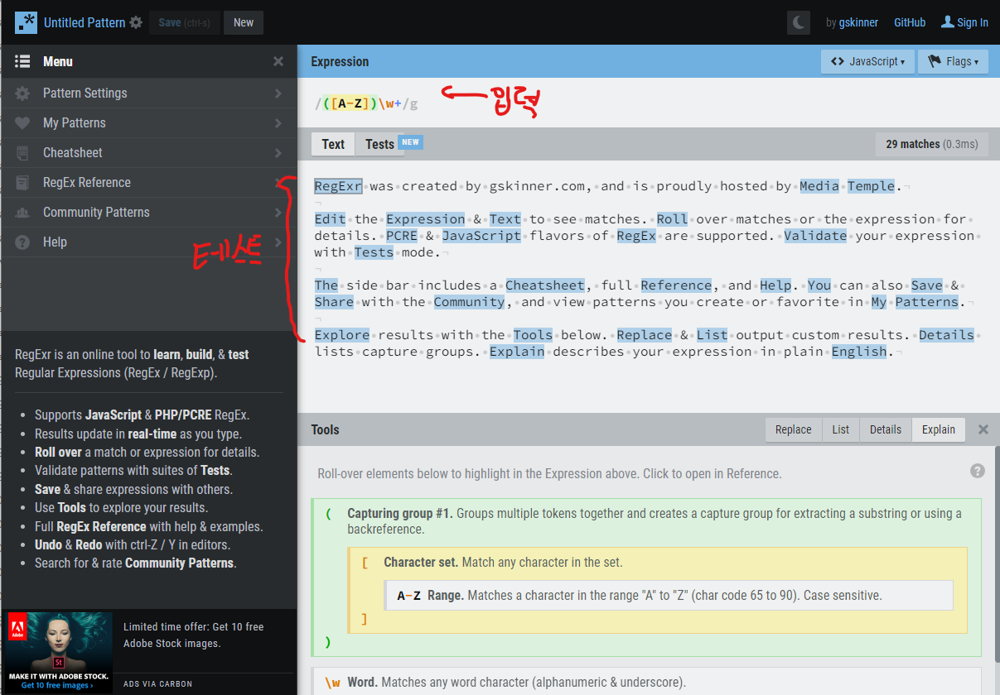

# 웹 (프론트엔드)개발의 기초 2

> 구글에서 코드를 긁어온 것은 직접 공부하여 내것으로 만들자!

#### ✏정규식

어떤 문자열을 받았을 때 내가 정해놓은 규칙에 맞는지 안맞는지 검사하는 것 -> 정규식 검사.

[^0-9.]

^ : 시작

0-9 : 0~9사의 값이 들어온

. : 문자 수

/g : (global) 문자열 내의 모든 패턴으로 검색한다.

정규식은 공통적인 기술. 모든 언어를 불문하고 공통적으로 사용된다.

정규식을 직접 만들고 테스트 해볼 수 있는 사이트 : https://regexr.com/

메뉴에서 정규식 패턴 검색도 할 수 있다.

