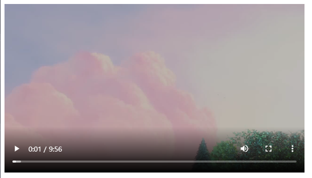
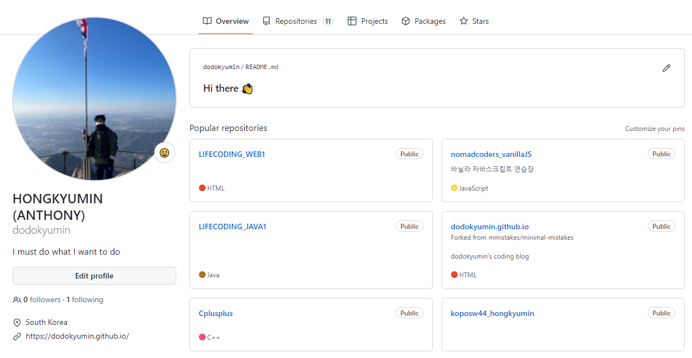

# 웹 (프론트엔드)개발의 기초 2


> 구글에서 코드를 긁어온 것은 직접 공부하여 내것으로 만들자!

> 긍정적인 생각을 하고 웃자! ~~관상도 중요하다~~

#### ✏정규식

어떤 문자열을 받았을 때 내가 정해놓은 규칙에 맞는지 안맞는지 검사하는 것 -> 정규식 검사.

[^0-9.]

^ : 시작

0-9 : 0~9사의 값이 들어온

. : 문자 수

/g : (global) 문자열 내의 모든 패턴으로 검색한다.


정규식은 공통적인 기술. 모든 언어를 불문하고 공통적으로 사용된다.

정규식을 직접 만들고 테스트 해볼 수 있는 사이트 : https://regexr.com/


메뉴에서 정규식 패턴 검색도 할 수 있다.


## ✏HTML의 기본 내용

```
<!DOCTYPE html>
```

html 문서 맨 위에 무조건 정의하는 코드. 없어도 잘 돈다.

html의 규약을 설명하고 있는 문서에는 꼭 있다.

```
<html lang="en">
```

이 페이지가 영어를 기준으로 작성이 되었다.

```
<meta charset="UTF-8">
```

브라우저에게 정보들을 전달해주는 내용을 담고있다. (utf-8로는 모든 언어 커버 가능하다)

```
<meta http-equiv="X-UA-Compatible" content="IE=edge">
```

호환을 위한 코드. chrome을 쓰는 입장에서 필요는 없다. 인터넷 익스플로러를 호환시켜주기 위해

```
<meta name="viewport" content="width=device-width, initial-scale=1.0">
```

기기 사이즈(모바일을 위한)에 맞춰서 화면을 출력하는 코드.


```
<meta name="description" content="비디오 태그 연습">
```

제대로 페이지를 설명하고자 하려면 description의 content에 내용을 적는다.


디스크립션을 적어놓으면 검색 시 해당 자리에 그 내용이 출력된다.


## ✔오늘 배운 태그

### \<p>

##### 	 : 단락을 나눌 때

p태그는 기본적으로 margin(여백)이 있다.


### \<div>

##### 	 : 특별한 역할을 하지 않는 영역. display 속성이 block


### \<span>

##### 	 : 특별한 역할을 하지 않는 영역. display 속성이 line


### \<video>

##### 	 : 비디오의 소스를 가져와 설정에 맞게 브라우저에 띄울 수 있다.

```
<video
      src="http://commondatastorage.googleapis.com/gtv-videos-bucket/sample/BigBuckBunny.mp4"
      controls
      autoplay
      width="600"
    ></video>
```

브라우저에 영상 플레이어를 띄웠다.



**controls 속성:**

controls를 통해 width height등 사이즈 조절을 할 수 있다.


**autoplay 속성 :**	(audio태그도 동일)

***chromium** 기반의 브라우저들은 autoplay를  허용하지 않는다.

~~모바일의 등장으로 데이터 요금 개념이 생겼기 때문에~~, 사용자의 프라이버시를 위해,

개발자가 맘대로 사용자의 허락없이 영상을 시작할 수 없다.(muted autoplay는 허용된다.)

*chrome 브라우저를 만든 도구 이름 chromium


### \<audio>

##### 	: 영상이나 소리 파일의 소스를 가져와 설정에 맞게 브라우저에 띄울 수 있다.

```
<audio src="src="http://commondatastorage.googleapis.com/gtv-videos-bucket/sample/BigBuckBunny.mp4"
  controls
  autoplay
  hidden
  ></audio>
```


**hidden 속성** : 

오디오 플레이어를 숨긴다.(단, 새로고침하면 오디오 재생이 되지 않는다.)


### \<iframe>

​	: 문서의 레이아웃을 구성할 때 사용되는 프레임을 만든다.

```
<!DOCTYPE html>
<html lang="en">
  <head>
    <meta charset="UTF-8" />
    <meta http-equiv="X-UA-Compatible" content="IE=edge" />
    <meta name="viewport" content="width=device-width, initial-scale=1.0" />
    <meta name="description" content="비디오 태그 연습" />
    <title>Document</title>
  </head>
  <body>
    <video
      src="http://commondatastorage.googleapis.com/gtv-videos-bucket/sample/BigBuckBunny.mp4"
      controls
      autoplay
      muted
      width="600"
    ></video>
    <div>
      <video
        src="http://commondatastorage.googleapis.com/gtv-videos-bucket/sample/BigBuckBunny.mp4"
        controls
        autoplay
        muted
        width="600"
      ></video>
      <video
        src="http://commondatastorage.googleapis.com/gtv-videos-bucket/sample/BigBuckBunny.mp4"
        controls
        autoplay
        muted
        width="600"
      ></video>
    </div>
  </body>
</html>

```

프레임 3개를 만들어 화면에 총 3개의 프레임, 그리고 각 프레임에 담겨있는 영상 3개가 출력되도록 하였다.

+추가로 줄바꿈 속성이 있는 div 태그로 영상 2개는 아랫줄에 출력하였다.


##### ▶영상의 소스를 얻는 방법(youtube)

 	유튜브 영상 아래에 있는 공유버튼 클릭!


이 한 줄은 영상의 링크.


퍼가기를 누르면 아래와 같이 iframe 태그에 영상 속성(너비 width와 높이 height의 코드가 담겨있다.)이 같이 있는 코드를 받을 수 있다.


복사한 코드를 자기 코드에 붙여주면 완성!


## 📇Github Pages (웹 호스팅) 뚜잇

올리고 싶은 뤼파지토리의 setting - pages에 들어가 save 를 눌러주면,


 Yout site is ready to be published at ~ 이라며 생성된 내 해당 레파지토리의 주소를 보여준다!


잊지 않게 그 레파지토리의 readme.md파일을 만들어 홈페이지 url을 적어두는 꿀팁!


이제 그 url로 들어가보면


처음에 실습으로 만들었던 index.html의 출력 화면이 보여진다!👍


## ✨내 깃헙 페이지의 Profile(README.md) 만들기

리파지토리 생성을 할 때에 내 깃헙 아이디와 같은 이름으로 설정을 해주면,

깃헙 프로필에 추가하는 README.md 파일을 사용할 수 있다는 고양이의 깜짝 알림이 뜬다!

이때 Add a README file 체크박스를 적용해주고 Create repository를 해주자! (물론 이후에 추가해줄 수도 있다.)


프로필 화면에 생성된 readme 파일과 그 내용이 보여진다!👋앙뇽



이제 깃허브 readme에 나의 모든 스킬, 과제 등등 다 담아보자!


## CSS(Cascading Style Sheet)

디자인에 최적화된 웹페이지 마크업 언어.


#### 엘리먼트

​	: 웹 디자인의 최소 단위. ❗반드시 태그만을 의미하지는 않는다.


#### 셀렉터(선택자)

​	: css 혹은 js로 변화시킬 대상(데이터)을 지정할 때 부른다.

​	선택할 때 태그, 클래스, 네임, 아이디를 이용한다.

#### 클래스

여러 태그의 속성에 한번에 접근할 때 사용한다.


#### 아이디

아이디는 하나만 있을 수 있다. (주민번호처럼)


#### 네임

 name속성은 잘 쓰지 않는다. 크게 중요x


### CSS 의 적용 구조 알아보기

#### 방식1,2 : 내부 선언 방식 & 인라인 방식

<div class="colorscripter-code" style="color:#010101;font-family:Consolas, 'Liberation Mono', Menlo, Courier, monospace !important; position:relative !important;overflow:auto"><table class="colorscripter-code-table" style="margin:0;padding:0;border:none;background-color:#fafafa;border-radius:4px;" cellspacing="0" cellpadding="0"><tr><td style="padding:6px;border-right:2px solid #e5e5e5"><div style="margin:0;padding:0;word-break:normal;text-align:right;color:#666;font-family:Consolas, 'Liberation Mono', Menlo, Courier, monospace !important;line-height:130%"><div style="line-height:130%">1</div><div style="line-height:130%">2</div><div style="line-height:130%">3</div><div style="line-height:130%">4</div><div style="line-height:130%">5</div><div style="line-height:130%">6</div><div style="line-height:130%">7</div><div style="line-height:130%">8</div><div style="line-height:130%">9</div><div style="line-height:130%">10</div><div style="line-height:130%">11</div><div style="line-height:130%">12</div><div style="line-height:130%">13</div><div style="line-height:130%">14</div><div style="line-height:130%">15</div><div style="line-height:130%">16</div><div style="line-height:130%">17</div><div style="line-height:130%">18</div></div></td><td style="padding:6px 0;text-align:left"><div style="margin:0;padding:0;color:#010101;font-family:Consolas, 'Liberation Mono', Menlo, Courier, monospace !important;line-height:130%"><div style="padding:0 6px; white-space:pre; line-height:130%"><span style="color:#010101">&lt;</span><span style="color:#066de2">body</span><span style="color:#010101">&gt;</span></div><div style="padding:0 6px; white-space:pre; line-height:130%">&nbsp;&nbsp;<span style="color:#999999">&lt;!--&nbsp;내부선언방식&nbsp;--&gt;</span></div><div style="padding:0 6px; white-space:pre; line-height:130%">&nbsp;&nbsp;<span style="color:#010101">&lt;</span><span style="color:#066de2">style</span><span style="color:#010101">&gt;</span><span style="color:#ff3399"></span></div><div style="padding:0 6px; white-space:pre; line-height:130%"><span style="color:#ff3399">&nbsp;&nbsp;&nbsp;&nbsp;div</span>{<span style="color:#0099cc"></span></div><div style="padding:0 6px; white-space:pre; line-height:130%"><span style="color:#0099cc">&nbsp;&nbsp;&nbsp;&nbsp;&nbsp;&nbsp;width</span><span style="color:#ff3399">:</span><span style="color:#0066cc">&nbsp;100px</span><span style="color:#ff3399">;</span><span style="color:#0099cc"></span></div><div style="padding:0 6px; white-space:pre; line-height:130%"><span style="color:#0099cc">&nbsp;&nbsp;&nbsp;&nbsp;&nbsp;&nbsp;background-color</span><span style="color:#ff3399">:</span><span style="color:#0066cc">&nbsp;red</span><span style="color:#ff3399">;</span><span style="color:#0099cc"></span></div><div style="padding:0 6px; white-space:pre; line-height:130%"><span style="color:#0099cc">&nbsp;&nbsp;&nbsp;&nbsp;&nbsp;&nbsp;font-size</span><span style="color:#ff3399">:</span><span style="color:#0066cc">&nbsp;30px</span><span style="color:#ff3399">;</span><span style="color:#0066cc"></span></div><div style="padding:0 6px; white-space:pre; line-height:130%"><span style="color:#0066cc">&nbsp;&nbsp;&nbsp;&nbsp;</span>}<span style="color:#ff3399"></span></div><div style="padding:0 6px; white-space:pre; line-height:130%"><span style="color:#ff3399">&nbsp;&nbsp;&nbsp;&nbsp;h1</span>{<span style="color:#0099cc"></span></div><div style="padding:0 6px; white-space:pre; line-height:130%"><span style="color:#0099cc">&nbsp;&nbsp;&nbsp;&nbsp;&nbsp;&nbsp;color</span><span style="color:#ff3399">:</span><span style="color:#0066cc">&nbsp;aqua</span><span style="color:#ff3399">;</span><span style="color:#0066cc"></span></div><div style="padding:0 6px; white-space:pre; line-height:130%"><span style="color:#0066cc">&nbsp;&nbsp;&nbsp;&nbsp;</span>}</div><div style="padding:0 6px; white-space:pre; line-height:130%">&nbsp;&nbsp;<span style="color:#010101">&lt;</span><span style="color:#010101">/</span><span style="color:#066de2">style</span><span style="color:#010101">&gt;</span></div><div style="padding:0 6px; white-space:pre; line-height:130%">&nbsp;&nbsp;<span style="color:#010101">&lt;</span><span style="color:#066de2">h1</span><span style="color:#010101">&gt;</span>css&nbsp;연습<span style="color:#010101">&lt;</span><span style="color:#010101">/</span><span style="color:#066de2">h1</span><span style="color:#010101">&gt;</span></div><div style="padding:0 6px; white-space:pre; line-height:130%">&nbsp;&nbsp;<span style="color:#999999">&lt;!--&nbsp;인라인&nbsp;방식&nbsp;:&nbsp;지양하자&nbsp;--&gt;</span></div><div style="padding:0 6px; white-space:pre; line-height:130%">&nbsp;&nbsp;<span style="color:#010101">&lt;</span><span style="color:#066de2">div</span>&nbsp;<span style="color:#0a9989">style</span>=<span style="color:#df5000">"background-color:&nbsp;yellow;"</span><span style="color:#0a9989"></span><span style="color:#010101">&gt;</span></div><div style="padding:0 6px; white-space:pre; line-height:130%">&nbsp;&nbsp;&nbsp;&nbsp;인라인&nbsp;방식&nbsp;css</div><div style="padding:0 6px; white-space:pre; line-height:130%">&nbsp;&nbsp;<span style="color:#010101">&lt;</span><span style="color:#010101">/</span><span style="color:#066de2">div</span><span style="color:#010101">&gt;</span></div><div style="padding:0 6px; white-space:pre; line-height:130%"><span style="color:#010101">&lt;</span><span style="color:#010101">/</span><span style="color:#066de2">body</span><span style="color:#010101">&gt;</span></div></div><div style="text-align:right;margin-top:-13px;margin-right:5px;font-size:9px;font-style:italic"><a href="http://colorscripter.com/info#e" target="_blank" style="color:#e5e5e5text-decoration:none">Colored by Color Scripter</a></div></td><td style="vertical-align:bottom;padding:0 2px 4px 0"><a href="http://colorscripter.com/info#e" target="_blank" style="text-decoration:none;color:white"><span style="font-size:9px;word-break:normal;background-color:#e5e5e5;color:white;border-radius:10px;padding:1px">cs</span></a></td></tr></table></div>


적용되는 순서는 **내부 선언 방식 -> 인라인 방식** 이다.


### 방식3 : css파일을 생성하고 불러오기

편의를 위해 적용시킬 html과 같은 경로에 css파일을 만들어주었따.


css파일의 내용


html의 \<head> 안에

```
<link rel = "stylesheet" href="{해당 css파일의 경로}"
```

코드로 만든 css파일을 링크하여 불러온다.


##### ✔TIP

잘만든 홈페이지란(ex apple), 

인터넷이 느려 css 파일들을 못가져와도

(껍데기)html로만 구동 가능할 수 있게. html 구조도 깔끔하게 만들어둔 페이지이다!


두가지 클래스 css값을 붙일 때에는 띄어쓰기로 구분!

속성을 미리 세분화해서 나눠놓고, 조립하듯이 속성을 붙이는 방법도 좋다!


아이디는 한개만 존재!

아이디는 애초에 한개만 존재하기 때문에 

아이디를 셀렉터로 하는 경우는 드물다..


거의 모든 페이지의 링크에는 

```
text - decoration : none;
```

텍스트의 꾸밈 속성이 작업이 되어있다.

~~하이퍼링크 밑줄이 있으면 올드해보인다..~~

변경 전)


변경 후)


### CSS 셀렉터(선택자) 맛보기 1.

#### Hover:

hover는 html에서 요소에 마우스를 올렸을 때 반응하게 하는 css요소.


마우스를 올리니 gainsboro 색으로 3초동안 샤라락 바뀐다!

##### transition 속성

​	: 해당 시간동안 아날로그하게 색이 변경되도록 한다. 상당히 이뻐진다.


### 폰트 링크를 받아 적용하기

요즘은 폰트를 일일이 css파일에서 먹이지 않는다. 링크를 건다!


구글 폰트 페이지에서 쉽게 코드를 받을 수 있다. (유튜브 퍼가기 방법과 같다)

사진 속 오른쪽 메뉴바에 파랗게 긁어진 코드가 html에 붙여넣기 할 코드.

그 밑의 font-family css속성이 담긴 코드가  css파일에 붙여넣기 할 코드이다.


퍼온 코드를  html \<head>에 붙여넣어준다.


그리고 style.css에도 마찬가지로 적용 원하는 엘리먼트 안에 붙여넣기!


변경 전과 후.


## 실습해보기

### 첫번째 실습)

고정적인 크기 위치로 iframe 을 여러개 만들고, 각 프레임에 영상을 담아주기.


❗원작자가 유튜브에 영상을 업로드할 때, 퍼가기 기능 허용을 해주지 않으면 이렇게 내 html 안에서는 영상을 재생할 수 없다며 막힌다..


iframe위치를 고정하여 창 크기가 줄어들어도 크기와 위치를 그대로 유지하고 있는 프레임들!

#### iframe위치 고정을 위해 사용한 속성들:

#####      z-index: 1; 

​		: 해당 프레임의 앞 뒤 배치 순서를 정해준다. (마치 ppt의 맨 앞으로 가져오기)

#####      left: 0px;

​		: 왼쪽 left에 남겨둘 크기를 지정한다. 0px로 지정하여 첫 영상은 화면 왼쪽에 딱 붙을 수 있게 해주었다.

#####      top: 450px;

​		: 위쪽 top에 남겨둘 크기를 지정한다. 450px로 지정하여 첫 영상은 화면 위쪽에서 살짝 띄워줬다.

#####      width: 320px;

​		: 해당 프레임(영상)의 출력 너비를 설정해준다.

#####      height: 180px;

​		: 해당 프레임(영상)의 출력 높이를 설정해준다.

#####      position: absolute;

​		: position에는 3가지 속성이 있다.

   - relative :  화면 크기에 맞춰 해당 프레임의 위치를 조절해주는 것.

   - absolute : left, top, bottom, right 값으로 전 화면을 아무런 제약 없이 쓸 수 있는 것.

     


### 두번째 실습)

​	


### 세번째 실습)


