# 웹 (프론트엔드)개발의 기초 3

fira code : 가로폭이 동일한 폰트로 코딩할 때 눈이 편하다.

자바 클래스 명의 첫 글자는 대문자.

모든 태그에는 display속성이 부여되어있다.

### 태그 입력 short-cut

.이 클래스를 의미하므로,

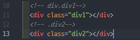

##### 👉div.div1

div태그를 만들고, .div1(div1이라는 클래스)를 부여한다.

##### 👉.div2

div태그를 만들고(태그가 적혀있지 않으면 디폴트로 div태그)  ,div2라는 클래스를 div에 부여한다.

div는 꽉차게,

span은 자기 자신 사이즈만.

block은 가로로 꽉 차게. inline은 자기 자신의 크기를 가짐.

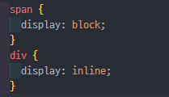

span에 block을 주고, div에 inline을 주면 결국 span이 div가 되고, div가 span이 된다.

##### \<header> & \<footer>

같은 div이다.

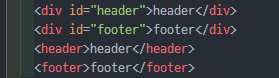

위 두줄과 아래 두줄은 같은 의미.

##### \<inline> & \<inline-block>

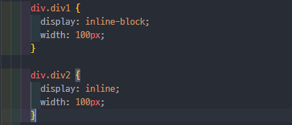

inline은 크기를 설정할 수 없다.

inline-block은 width와 height를 설정할 수 있다.

### display (화면표시) 예제

  See the Pen <a href="https://codepen.io/dodokyumin/pen/zYRWxXX">
  Untitled</a> by HONGKYUMIN (ANTHONY) (<a href="https://codepen.io/dodokyumin">@dodokyumin</a>)
  on <a href="https://codepen.io">CodePen</a>.

### border(외곽선) 예제

  See the Pen <a href="https://codepen.io/dodokyumin/pen/yLvKLVe">
  Untitled</a> by HONGKYUMIN (ANTHONY) (<a href="https://codepen.io/dodokyumin">@dodokyumin</a>)
  on <a href="https://codepen.io">CodePen</a>.

#### Position 속성

absolute : 가장가까운 태그중에서 포지션 속성이 먹어있는 놈.(가장 가까운게 화면 왼쪽 위 0,0 기준 위치가 배정된다.)

relative : 원래의 위치 기준으로 위치가 배정된다.

static : 자기자신 위치를 고정

fixed : 

sticky : 스크롤을 움직여도 화면 밖으로 벗어나지 않는다.

### images (이미지 조작)

  See the Pen <a href="https://codepen.io/dodokyumin/pen/QWQmwRm">
  Untitled</a> by HONGKYUMIN (ANTHONY) (<a href="https://codepen.io/dodokyumin">@dodokyumin</a>)
  on <a href="https://codepen.io">CodePen</a>.

filter :

blur(px) 뿌옇게 만든다(px단위)

margin 바깥쪽 여백

padding 안쪽 여백

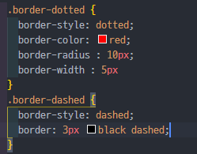

빠르게 간략히 입력하는 방법. 늘여쓴다.

margin: top right bottom left  ;

margin: top (right & left) bottom ; 

margin: (top & bottom) (left & right) ;

margin: all  ;

body에는 기본적으로 padding값이 들어가있다.

### @media (반응형 웹 페이지)

  See the Pen <a href="https://codepen.io/dodokyumin/pen/gOvebZg">
  Untitled</a> by HONGKYUMIN (ANTHONY) (<a href="https://codepen.io/dodokyumin">@dodokyumin</a>)
  on <a href="https://codepen.io">CodePen</a>.

미디어타입 형식

<table class="colorscripter-code-table" style="margin:0;padding:0;border:none;background-color:#fafafa;border-radius:4px;" cellspacing="0" cellpadding="0"><tr><td style="padding:6px;border-right:2px solid #e5e5e5">

1

2

3

</td><td style="padding:6px 0;text-align:left">

@media&nbsp;(적용&nbsp;조건)&nbsp;{

&nbsp;&nbsp;&nbsp;&nbsp;적용&nbsp;내용

}

</td><td style="vertical-align:bottom;padding:0 2px 4px 0"><a href="http://colorscripter.com/info#e" target="_blank" style="text-decoration:none;color:white">cs</a></td></tr></table>

반응형 웹페이지

화면 크기가 바뀌면 내용도 변화가 생김

##### float : left/right

영역 차지를 안하고 둥둥떠있다. 밑 컨텐츠들은 위로 올라오지 않는다.

##### clear

~~(예전에 쓰던 태그들)~~

**free html templates** 로 이것저것 만져보자

favicon은 

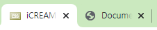

타이틀 창의 아이콘.

## 실습해보기

### POSITION

  See the Pen <a href="https://codepen.io/dodokyumin/pen/wvymBQe">
  Untitled</a> by HONGKYUMIN (ANTHONY) (<a href="https://codepen.io/dodokyumin">@dodokyumin</a>)
  on <a href="https://codepen.io">CodePen</a>.

------

### FACEBOOK

  See the Pen <a href="https://codepen.io/dodokyumin/pen/wvymvqV">
  Untitled</a> by HONGKYUMIN (ANTHONY) (<a href="https://codepen.io/dodokyumin">@dodokyumin</a>)
  on <a href="https://codepen.io">CodePen</a>.

------

### MY WEBPAGE

[MY WEBPAGE 소스](https://github.com/dodokyumin/koposw_WebProgramming/tree/master/MY%20WEBPAGE)

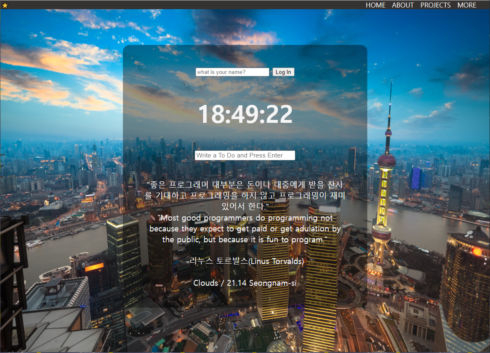

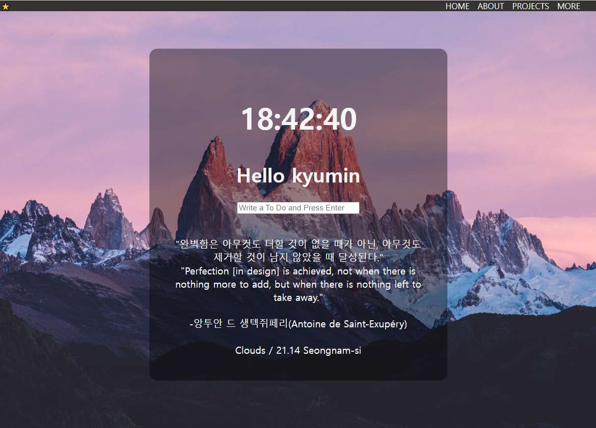

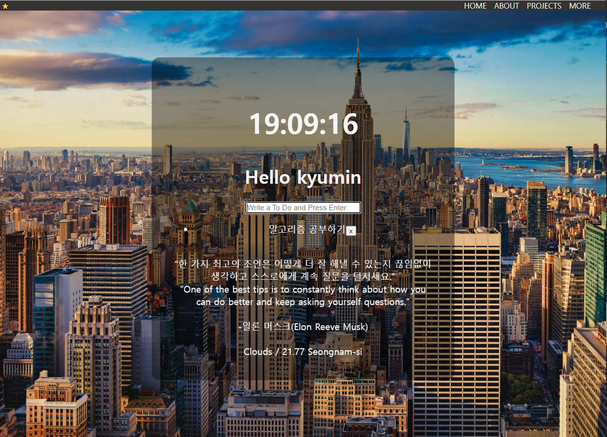

### 새로 배운 점 :

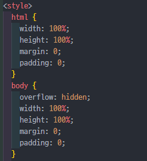

1. **기본 html과 body에는 default로 padding값과 margin값이 있다.**

그것들을 0으로 설정해줘야 하얀 테두리나 스크롤바가 생기지 않는다.

2. 사진 크기가 일정하지 않아서 브라우저 창 크기에 다 담기지 않아 스크롤바가 생긴다면,

**overflow 속성의 hidden 설정으로 넘치는 부분을 잘라(가려)주는 것**도 하나의 방법이다.

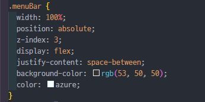

3. 상단 메뉴바 div의 두 요소 '별'과 'menuList' 를 서로 멀리 떼놓기 위해,

메뉴바 **div의 display설정을 flex**로 하여 유동적 설정으로 바꿔주고,

**justify-content 속성의 space-between설정**으로 두 요소가 서로 계속 멀리 떨어져있는 위치를 잡을 수 있도록 유지할 수 있었다.

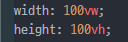

4. 뷰포트란 해당 웹페이지를 실행하고 있는 기기(노트북, 스마트폰 등)의 화면크기를 말한다.