# 웹 (프론트엔드)개발의 기초 4


**display flex**

flex 레이아웃은 요즘 현대 웹 디자인에서 주요하게 쓰인다. (1분코딩 블로그 참고)


**margin : 0 auto;**

위아래는 0, 좌우는 auto.


**em & rem**

상대 단위. 고정되지 않고 어떤 기준에서 상대적으로 크기 조절을 할 수 있음.

기준 폰트가 16pt이면, 2em 은 32pt.


> 웹 페이지 구성을 할 때, 만약 웹 페이지가 로드가 되지 않더라도 그 구성을 쉽게 알아볼 수 있도록 하기 위하여.
>
> 메뉴 리스트는 li로 묶어서 가시성 좋은 뼈대 만들기를 지향하자.

<br>

<br>

<br>

<br>

## 👉용어정리

### DOM(Document Object Model)

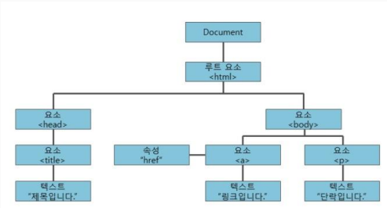

문서 객체 모델 

웹페이지 문서내의 모든 엘리먼트 들을 정의하고 접근하는 방법을 제공함

<br>

<br>

### 인터프리트 언어 

실시간으로 실행되는 언어 ex) Javascript , PHP , ASP , Python 

반대: 컴파일 언어 등등.. ex) C, C++ , Java , Go

<br>

<br>

### 스코프란?

변수가 적용되는 범위를 가리키는 용어.

자바는 중괄호 안의 변수는 중괄호 안에서만 살아있음.

자바스크립트의 var는 스코프를 깬다.

<br>

<br>

### 네이티브 자바스크립트

다른 라이브러리 혹은 프레임워크를 사용하지 않은, 기본적인 문법으로만 사용되는 자바스크립트.

'**바닐라 자바스크립트**'라고도 불린다!

<br>

<br>

### 로그

프로그램의 흐름을 확인하기 위해서 남기는 기록.

개발을 하기전 가장 먼저 설계해야하는 목표와 같음.

<br>

<br>

### 👉자바스크립트에서의 변수 선언

**var 의 한계점.**

```javascript
      //변수
      var i = 10;
      var i = 20; //var는 재선언이 된다.
      console.log(i); //오류가 나지 않는 이상한 var. let을 쓰자!

      //중간에 타입이 바뀔 수 있는 JS의 특징. 주의하자!
      let num = 10; //10의 타입은 number이다. integer라고 불리지 않는다.
      num = "hello";
      let text = "Hello";
      text = 10;
```

<br>

<br>

### JS에서는..!

**js는 타입비교를 기본적으로 안한다.**

1 == "1"

\> true

<br>

**만약 타입비교를 하려면 '==='을 쓰자!**

1 === "1"

\>false

<br>

##### \`${ }`를 이용한 문자열 병합

```javascript
//문자열 병합(기존의 방법)
      let name = "홍규민";
      let age = 42;
      let result = name + "는" + age + "살입니다.";
//문자열 병합(`${}`을 이용한 방법)
      result = `${name}는 ${age}살입니다.`;
      
```

<br>

<br>

### ✨자바스크립트 코드 쉽게 입력하기

**console.log();**  : 

log치고 엔터!

<br>

**id를 갖고있는 div 만들 때** : 

#target 입력 후 엔터!

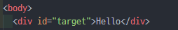

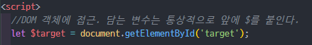


물론 class도 숏컷으로 만들 수 있다!

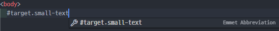

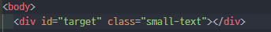

응용ver.(emet사용)

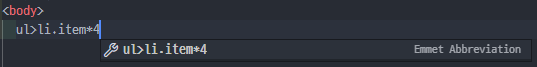


<br>

<br>

### 👉셀렉터(Selector)

**.getElementsByClassName( );**

item 클래스로 묶은 리스트들을 셀렉터로 가져와보자!

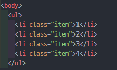

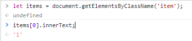

마치 **자바의 배열**처럼 담긴다.


querySelector => 맨 위 한개만 가져옴

querySelectorAll => 모두 가져올 수 있다 [리스트 형태]


<br>

<br>

<br>

<br>

## ✏실습해보기

### 텍스트 색상 바꾸기

**조건 1. 텍스트 값을 입력 받음**

**조건 2. 값이 없으면 "텍스트 값을 입력해 주세요" 출력**

**조건 3. 값이 있으면 가운데 크게 텍스트를 표시**

**조건 4. 바로 아래에 빨강/파랑/초록 글자가 쓰여진 버튼이 생김**

**조건 5. 각 버튼을 클릭하면**

**조건 6. "~색으로 변경됩니다." 라는 경고창 띄움**

**조건 7. 입력된 텍스트를 해당 색상으로 변경**

| 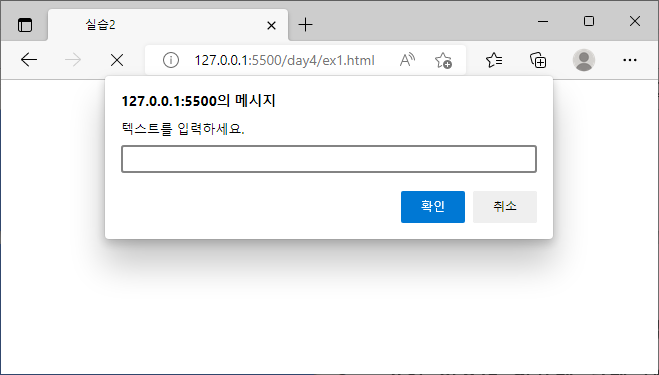prompt 띄우기 | 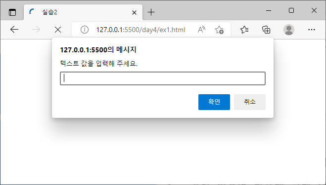공백문자 입력 | 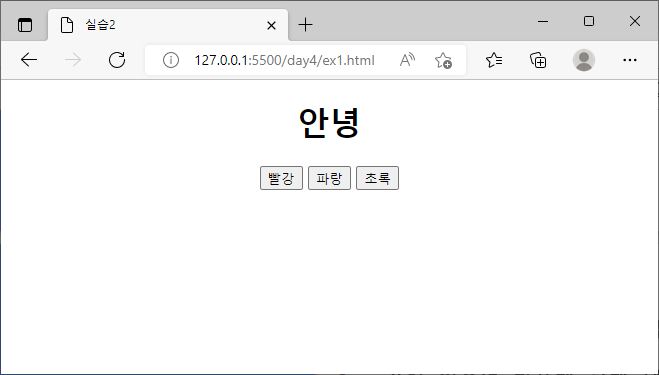텍스트 "안녕" 입력 |
| ------------------------------------------------------------ | ------------------------------------------------------------ | ------------------------------------------------------------ |

| 빨강 버튼 클릭 prompt | 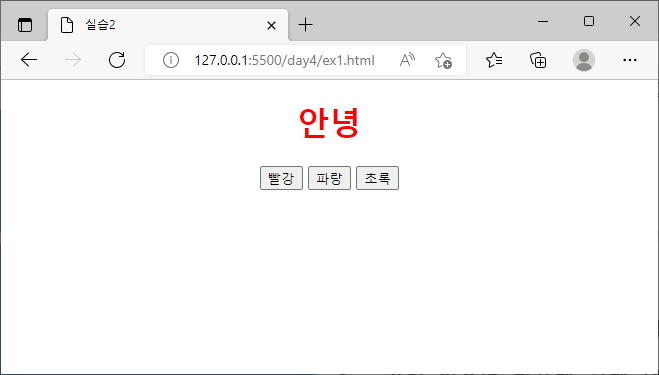텍스트 색상 변경(빨강) |
| ------------------------------------------------------------ | ------------------------------------------------------------ |
| **파랑 버튼 클릭 prompt** | 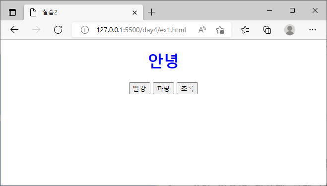**텍스트 색상 변경(파랑)** |
| 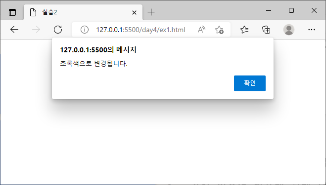**초록 버튼 클릭 prompt** | 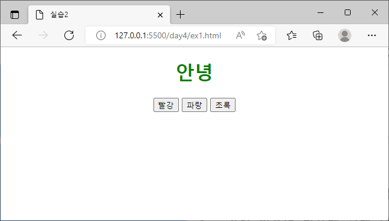**텍스트 색상 변경(초록)** |

 <br>

#### 생각해 본 점 & 배운 점

##### 1.

조건 4의 "버튼이 생김" 이므로, 처음 프롬프트 입력창 부터 버튼이 화면에 있으면 안된다.

```javascript
document.querySelector(".buttons").style.display = "none";
```

그러므로 버튼들을 클래스로 묶고, 자바 스크립트를 통해 DOM에 접근하여 style.display 값을 "none"으로 설정하여 보이지 않게 하였다.

이후 while 반복문으로 텍스트 입력값을 끝내 받았을 때 아래 코드로 "none" 설정을 바꿔주어 화면에 버튼들을 출력하였다.

```javascript
document.querySelector(".buttons").style.display = "block";
```

검색 했을 때,

타겟 태그의 형태에 따라 "block" 또는 "inline"; 이라고 적혀있었지만,

**"block", "inline", "inline-block", "" 네가지 모두 none을 풀어줄 수 있었다.**

<br>

##### 2.

조건3, 조건4 를 보면 바로 입력한 텍스트 아래에 버튼이 생겨야 한다.

그러므로 빈 h1태그를 먼저 button태그 위에 만들어놓고, 자바스크립트로 텍스트 값을 입력 받았을 때, .innerHTML로 텍스트를 넣어주었다.

```html
<h1 class="text"></h1>
...
<script>
	let $text = document.getElementsByClassName("text")[0];
	let inputText = prompt("텍스트를 입력하세요.");
	$text.innerHTML = inputText;
</script>
```

<br>

##### 2-1. 

**그럼 innerHTML과 innerText의 차이는 무엇인가?**

element.InnerHTML;	:	element안의 HTML이나 XML을 가져온다.

element.InnerText;	:	element안의 text 값들만 가져온다.

<br>

##### 3.

이 코드는 자바스크립트에서 DOM을 통해 h1태그의 text값을 넣어준 것.

```html
<h1 class="a"></h1>
    <script>
      let $aa = document.getElementsByClassName("a")[0];
      $aa.innerHTML = "나오나?";
    </script>
```

<br>

반면에, 아래 코드는 아무것도 출력하지 않는다. 

```html
<h1 class="a"></h1>
    <script>
      let $aa = document.getElementsByClassName("a")[0].innerHTML;
      $aa = "나오나?";
    </script>
```

A	:

$aa변수에 innerHTML을 가져온다. (현재는 아무것도 없는 ""). 결국 $aa는 element가 담긴 것이 아닌, String ""이 담긴 것.

그리하여 $aa 변수에 "나오나?"라는 String을 재정의 해준 것 뿐.

<br>

<br>

<br>

### 박스 색상 바꾸기(클릭ver)

**조건 1. 배경이 회색이고 텍스트가 하얀 메뉴 3개 만들기.**

**조건 2. 마우스로 메뉴를 클릭하면 한 메뉴만 배경이 하얗게, 외곽선과 텍스트는 검게 변한다.**

**조건 3. 다른 메뉴를 클릭하면 아까 클릭한 메뉴는 원래대로 돌아오고, 클릭한 메뉴가 변한다.**

| 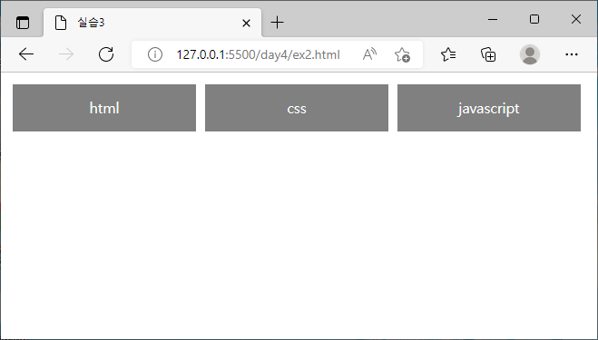디폴트 화면 | html박스 클릭 |
| ------------------------------------------------------------ | ------------------------------------------------------------ |
| **css박스 클릭** | 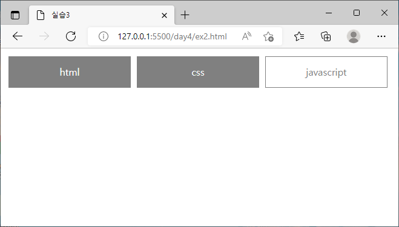**javascript박스 클릭** |

<br>

#### 생각해 본 점 & 배운 점

##### 1.

굳이 $button1.addEventListener('click', css값을 바꾸는 함수); 를 쓰지 않고, html div태그에 **onlclick="css값을 바꾸는 함수"** 를 사용하여 코드를 간단히 할 수 있었다.

```html
<div id="button1" onclick="changeButton1()">html</div>
    <div id="button2" onclick="changeButton2()">css</div>
    <div id="button3" onclick="changeButton3()">javascript</div>
```


<br>

<br>

<br>

### 박스 색상 바꾸기(마우스오버ver)

**조건 1. 배경이 회색이고 텍스트가 하얀 메뉴 3개 만들기.**

**조건 2. 마우스를 메뉴 위에 얹으면 한 메뉴만 배경이 하얗게, 외곽선과 텍스트는 검게 변한다.**

**조건 3. 다른 메뉴위에 마우스를 얹으면 아까 클릭한 메뉴는 원래대로 돌아오고, 해당 메뉴가 변한다.**

| 디폴트 화면 | 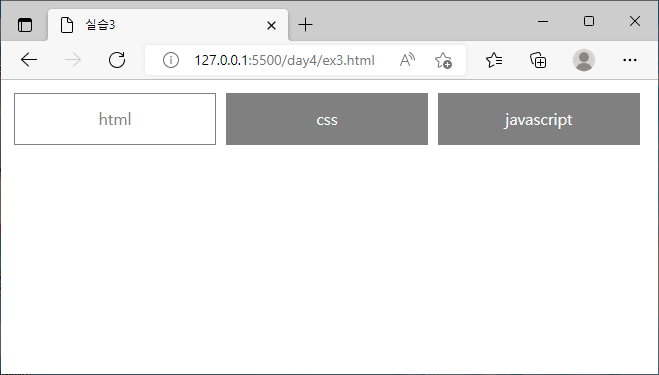html박스 마우스 오버 |
| ------------------------------------------------------------ | ------------------------------------------------------------ |
| 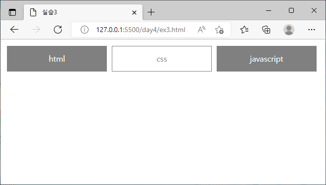**css박스 마우스 오버** | **javascript박스 마우스 오버** |

<br>

#### 생각해 본 점 & 배운 점

##### 1.

```html
<div
      id="button1"
      onmouseover="changeButton1()"
      onmouseleave="defaultColor()"
    >
      html
    </div>
    <div
      id="button2"
      onmouseover="changeButton2()"
      onmouseleave="defaultColor()"
    >
      css
    </div>
    <div
      id="button3"
      onmouseover="changeButton3()"
      onmouseleave="defaultColor()"
    >
      javascript
    </div>
```

마우스를 해당 요소에 올렸을 때 작동하는 **onmouseover="";**

마우스를 해당 요소에서 떼었을 때 작동하는 **onmouseleave="";**

<br>

##### 2.

이렇게 함수를 6개나 만들 필요 없이, 각 div의 text 값이나 id 값을 onmouseover와 onmouseleave 함수에 파라미터로 전달 할 수 있었으면 코드가 더 콤팩트해 졌을 것.

