# 웹 (프론트엔드)개발의 기초 JQuery

###  JQuery란?

자바스크립트용 라이브러리(변하는 기술). 웹사이트를 쉽게 짤 수 있게 해줌.(ex JS의 document.getElement.... 이런 방식보다 더 쉽게 element를 찾아준다.)

모든 브라우저와 동기 처리가 되어 호환성이 매우 뛰어나다.

하지만 JS와 브라우저들의 업그레이드로 한계가 드러나 사용이 적어짐.

레거시 프로그램으로 아직 사용하는 곳이 많다.

### CDN(Contents Delivery Network)

데이터 복사한 복제본이 여러곳에 있는 것.(마치 넷플릭스가 자기 복제본 서버를 한국에 두고있어서 빠르게 볼 수 있는 것처럼.)


부트스트랩이 jquery를 사용했다가 최근에는 쓰지 않음.


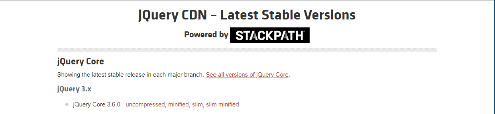

uncompressed : 라이브러리 코드가 전부 다 보이는 버전.(개발을 할 때 편하다)

minified : 거기서 코드를 간략화해 줄인 버전

slim : 더 줄임

slim minified : 더더줄임(프로그램 배포용(용량이 작기 때문))

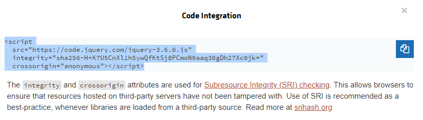

코드에 삽입!

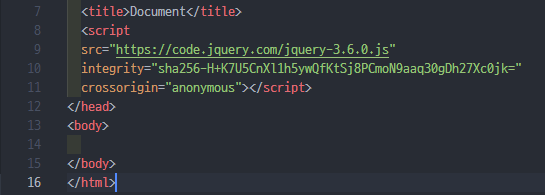

이것이 jquery의 CDN.

링크로 들어가면 편의를 위해 구현되어있는 함수들을 볼 수 있다. 

용량이 비교적 크기 때문에, 모바일 시장이 커지는 상황에 제이쿼리를 지향하지는 않는다고한다.

uncompressed 버전 :

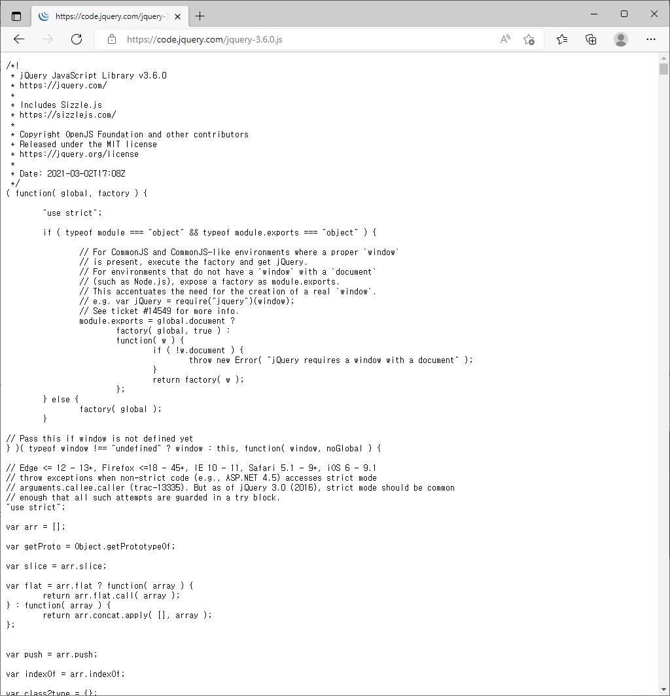

<br>

<br>

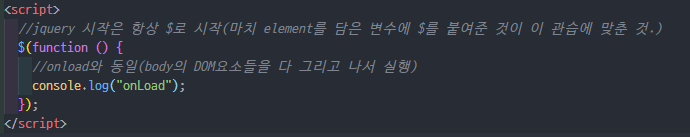

```javascript
//기존 js의 방식
        $jsTitle = document.getElementById("id");
        console.log($jsTitle);
```

```javascript
//jquery형식. 무조건 jquery 객체 리턴.
        $title = $("#title");
        console.log($title);
```

<br>

다른 객체를 불러온다. 그러므로 jquery에 맞는 함수를 사용하여야 함.

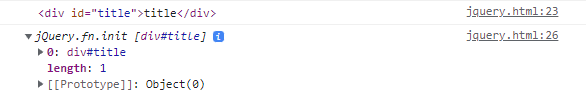

<br>

<br>

<br>

## Jquery의 기능

#### method chain

Jquery의 모든 함수들은 연쇄적으로 입력이 가능하다. 

```javascript
      $("#button2")
        .on("click", function () {
          console.log("click!");
        })
        .on("mouseover", function () {
          console.log("enter!");
        });
```

<br>

<br>

#### 끼워넣기

```javascript
$(target).append(source) //셀렉터의 뒤에
$(target).prepend(source) //셀렉터의 앞에
$(source).appendTo(target) //셀렉터의 뒤에
$(source).prependTo(target) //셀렉터의 앞에
```

<br>

<br>

#### element 옵션 변경

```javascript
$(target).attr("바꿀 옵션","값") //값 변경
$(target).attr("값 확인할 옵션") //값 확인
$("a").attr("src","http://naver.com");
```

<br>

<br>

#### css 변경

```javascript
$(target).css("바꿀 css","값") //값 변경
$("a").css("width", "100%")
```


순회를 돌다 중간 어떤거를 잡아 조건을 줄 때엔 each

.prop 해당 프로퍼티 가져오는 것.

.is

<br>

<br>

<br>

바닐라 자바스크립트로 애니메이션을 구현하는 것은 엄청난 노가다이다.

Jquery의 **Effect**를 사용하자!


w3schools에서 callback은 이 동작이 끝났을 때 이어 실행시킬 동작(함수)를 넣는 것.


animate는 인풋값이 누적이 되기 때문에 ex)눌러놓고 있으면 쭈욱 간다.

중간에 방향 바꾸기 어렵기 때문에 정지도 걸어줘야하고..


자바는 인자로 메소드로 넘길 수 없지만,

js는 함수를 값으로 받을 수 있다.

<br>

<br>

<br>

<br>

## ✏실습해보기

### 회원가입 페이지 만들기

**조건 1. 취미는 3개 이상, 직업은 1개 이상, 성별 1개 이상, 비밀번호는 5자 이상, 아이디는 이메일 형식.**

**조건 2. 취소버튼 누르면 입력값들 초기화.**

**조건 3. 회원가입 누르면 위의 조건 확인, 조건이 맞지 않으면 알림, 조건이 모두 맞으면 회원가입 완료 알림**

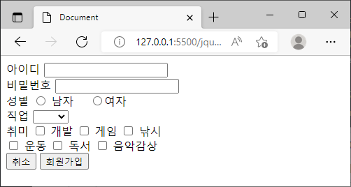

**디폴트 화면**

| 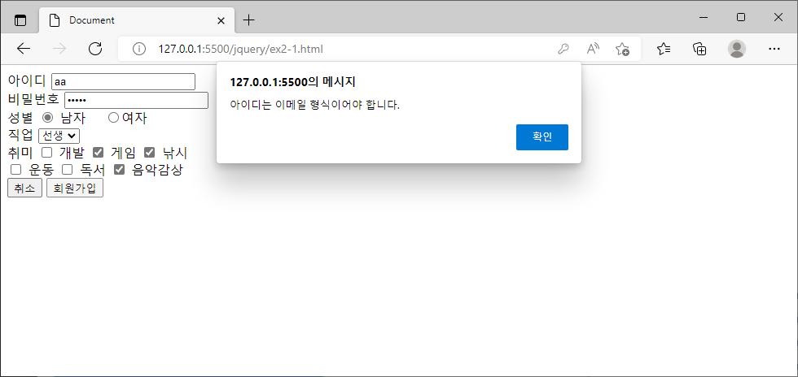id가 이메일 형식이 아닐 때 | 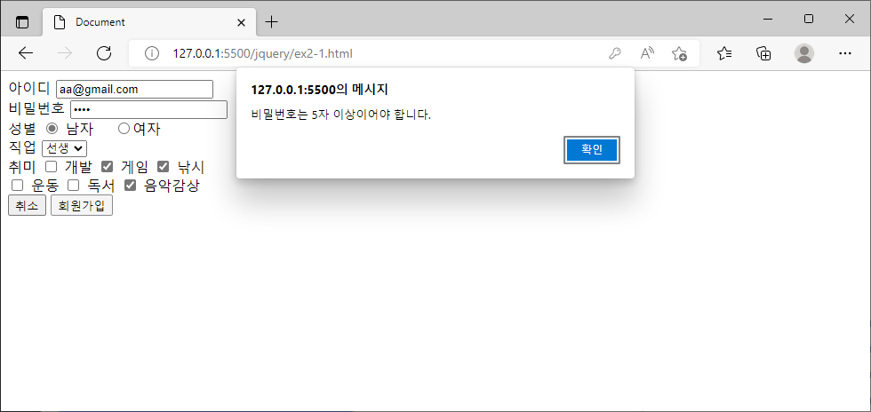비밀번호가 5자 이상이 아닐 때 |
| ------------------------------------------------------------ | ------------------------------------------------------------ |
| 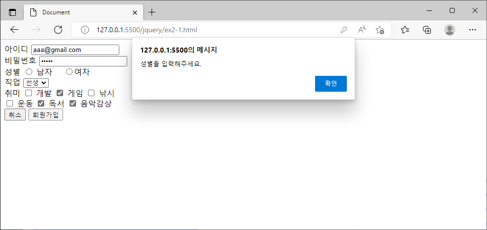**성별을 입력하지 않았을 때** | 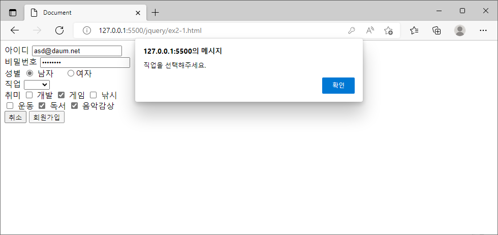**직업을 선택하지 않았을 때** |
| 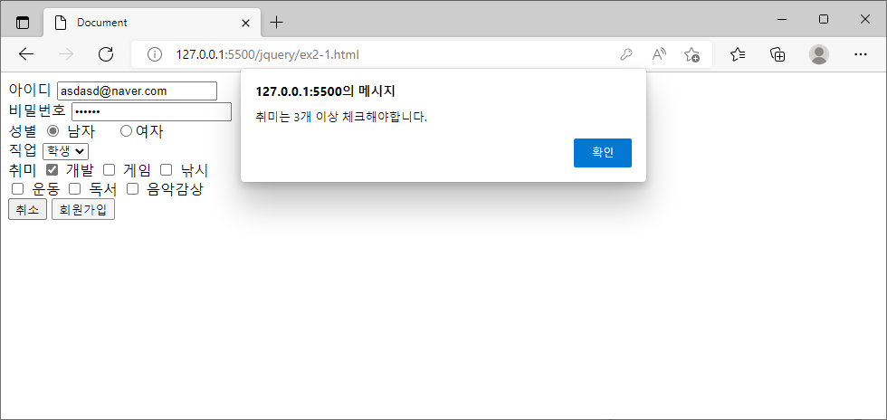 **취미가 3개이상 체크되지 않았을 경우** | 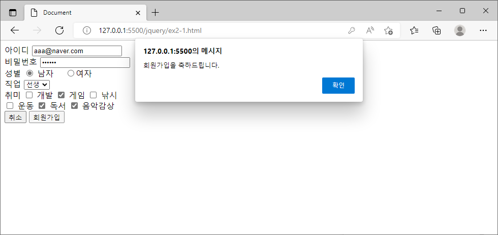**모든 조건에 맞았을 때** |
| 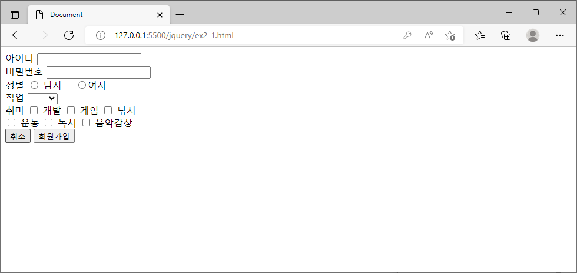**취소 버튼을 눌렀을 때** |                                                              |

#### 🔎생각해 본 점 & 배운 점

##### 1. 이메일 정규식을 사용하여 true/false를 판단하는 함수.

```javascript
let $id = $("#id").val();

//정규식을 이용하여 id 이메일 형식 여부 확인하기.
      function isValidEmailAddress(emailAddress) {
        var pattern = /^([a-z\d!#$%&'*+\-\/=?^_`{|}~\u00A0-\uD7FF\uF900-\uFDCF\uFDF0-\uFFEF]+(\.[a-z\d!#$%&'*+\-\/=?^_`{|}~\u00A0-\uD7FF\uF900-\uFDCF\uFDF0-\uFFEF]+)*|"((([ \t]*\r\n)?[ \t]+)?([\x01-\x08\x0b\x0c\x0e-\x1f\x7f\x21\x23-\x5b\x5d-\x7e\u00A0-\uD7FF\uF900-\uFDCF\uFDF0-\uFFEF]|\\[\x01-\x09\x0b\x0c\x0d-\x7f\u00A0-\uD7FF\uF900-\uFDCF\uFDF0-\uFFEF]))*(([ \t]*\r\n)?[ \t]+)?")@(([a-z\d\u00A0-\uD7FF\uF900-\uFDCF\uFDF0-\uFFEF]|[a-z\d\u00A0-\uD7FF\uF900-\uFDCF\uFDF0-\uFFEF][a-z\d\-._~\u00A0-\uD7FF\uF900-\uFDCF\uFDF0-\uFFEF]*[a-z\d\u00A0-\uD7FF\uF900-\uFDCF\uFDF0-\uFFEF])\.)+([a-z\u00A0-\uD7FF\uF900-\uFDCF\uFDF0-\uFFEF]|[a-z\u00A0-\uD7FF\uF900-\uFDCF\uFDF0-\uFFEF][a-z\d\-._~\u00A0-\uD7FF\uF900-\uFDCF\uFDF0-\uFFEF]*[a-z\u00A0-\uD7FF\uF900-\uFDCF\uFDF0-\uFFEF])\.?$/i;
        return pattern.test(emailAddress);
      }

if( !isValidEmailAddress($id) ){
          alert("아이디는 이메일 형식이어야 합니다.");
        }
```


<br>

<br>

<br>

### 제목 테이블 체크 및 출력

**조건 1. 확인 체크박스가 체크되면 모두 선택, 체크 해제되면 모두 해제.**

**조건 2. 각각 체크도 가능.**

**조건 3. 로그 버튼 누르면 로그로 선택된 제목만 표시됨**

**조건 4. 선택 없으면 알림표시**

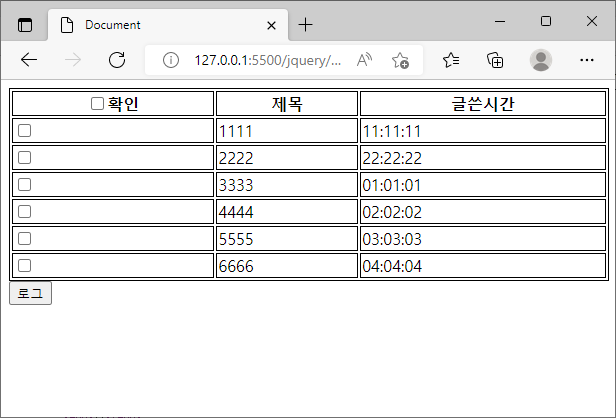

**디폴트 화면**

| 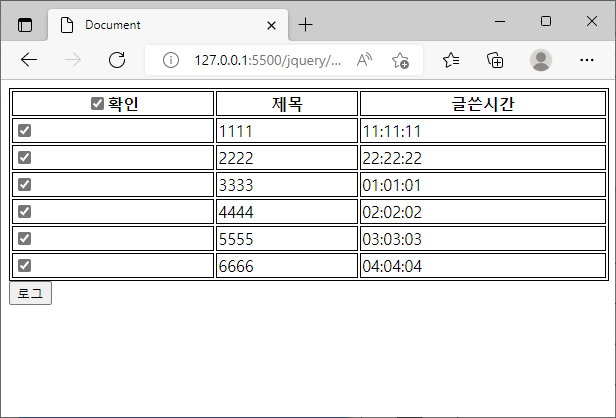확인 체크 눌렀을 때 | 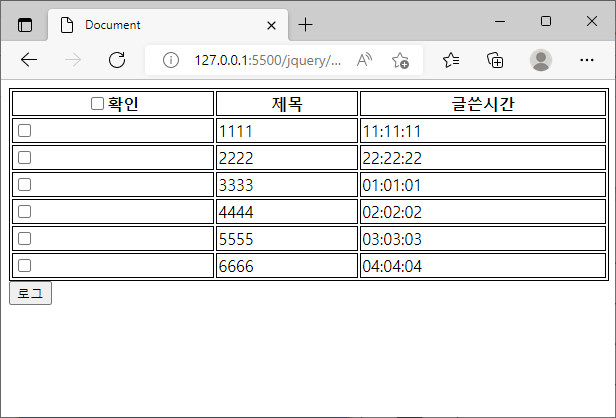확인 체크 다시 풀었을 때 |
| ------------------------------------------------------------ | ------------------------------------------------------------ |
| 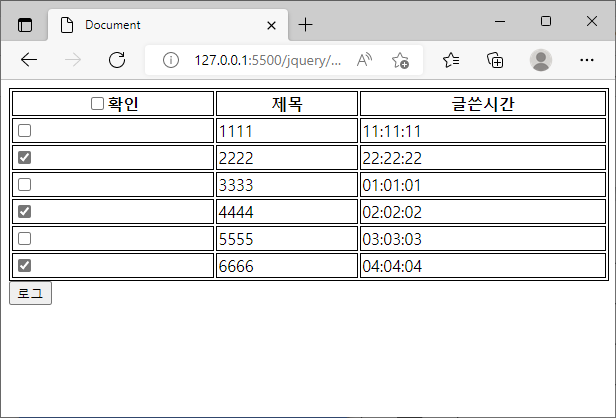**개별 선택** | 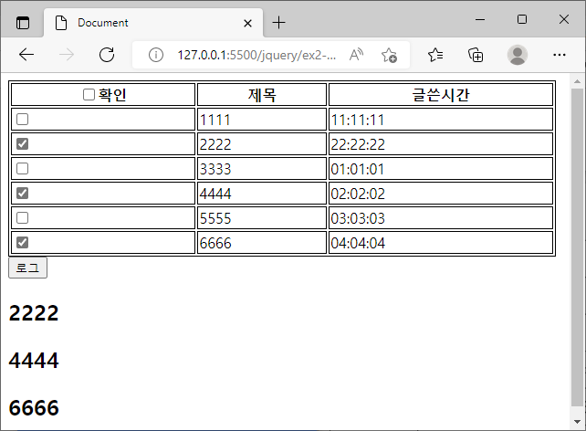**로그버튼 클릭** |

#### 🔎생각해 본 점 & 배운 점

##### 1. .next() : 자신의 옆 형제 태그를 가져오는 jquery 함수.


