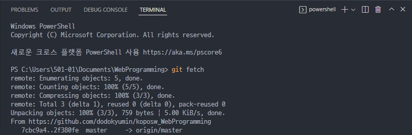
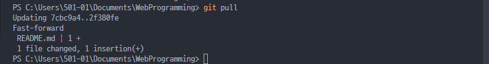
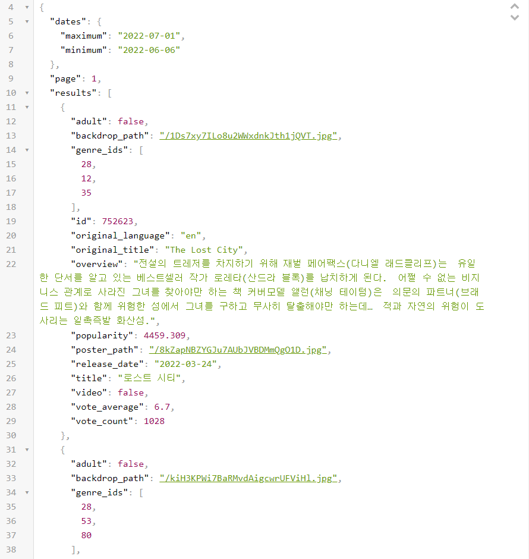
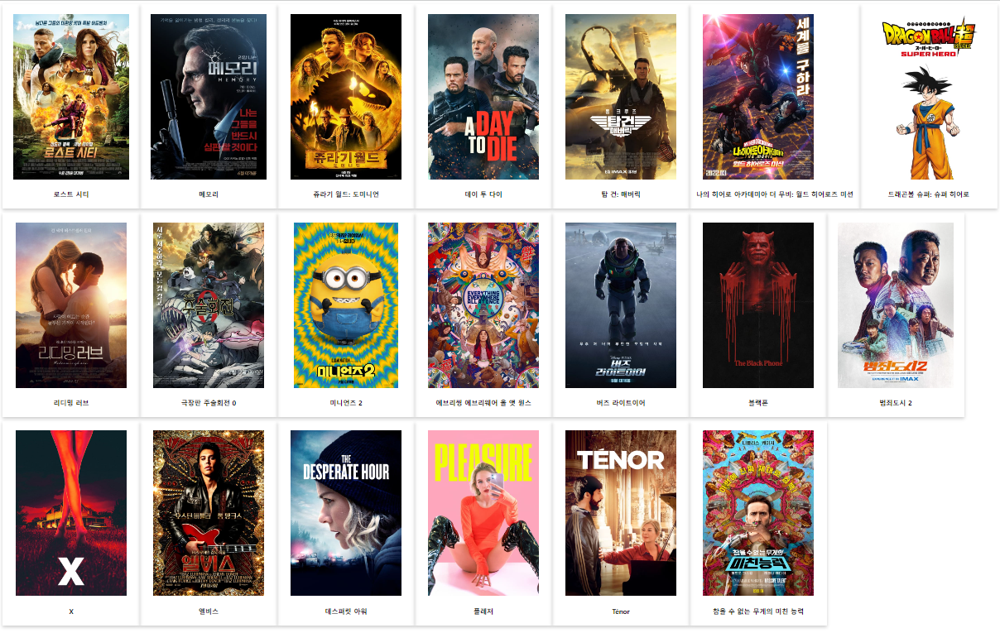

# AJAX

xml에 html이 포함되어있는 관계.

현재에는 xml보단 json을 더 많이 사용한다.

사람이봐도 컴퓨터가 봐도 보기 편한  json(데이터타입).


#### 깃허브에 업로드 되어있는 파일 pull해오기.

terminal - newterminal에서

```
git fetch
```



리모트에 변경 수정된 사항을 가져온다.


```
git pull
```



리모트에 있는 것들이 반영이 된다.

<br>

<br>

<br>

## AJAX

 **Asynchronous Javascript And XML**

Javascript

비동기 : 웹페이지를 리로드하지 않고도 데이터를 불러오는 방식.(검색하고 정리해보자) 

정한 코드를 실행시키고, 도중에 다른 코드도 실행시키는.

동기 : 순차적으로 실행되는 코드

**비동기와 멀티쓰레드의 차이는?**


### AJAX로 할 수 있는 것

클라이언트에서 서버로 데이터를 요청하고 결과를 돌려받을 수 있습니다

 그런데 그 동안 브라우저가 멈추지 않는다.

마치 NAVER 브라우저 검색창에 검색어를 입력했을 때,

연관 검색어 작은 창이 떠도 브라우저가 새로고침 되지 않고, 계속 이어나가는 것.


### AJAX의 장점

- 웹페이지의 속도 향상

- 서버의 처리가 완료될 때까지 기다리지 않고 처리가 가능
- 서버에서 data만 전송하면 되므로 전체 코드양 감소
- 기존 웹에서 불가능했던 다양한 UI를 가능하게 해줌


### AJAX의 단점

- 히스토리가 관리되지 않음
- 페이지 이동없는 통신으로 보안상의 문제가 있음

...

그래도 장점이 뛰어나서 사용한다.


<br>

<br>

<br>

## 기본 예제 코드 1

```javascript
<script>
      function loadDoc() {
        // XMLHttpRequest Obj(객체)생성
        var xhttp = new XMLHttpRequest();

        // 응답이 왔을 때의 콜백 함수 정의
        xhttp.onreadystatechange = function () {
          //this는 xhttp를 가리킨다.
          // this.readyState == 4 : operation is done 정상 완료(응답이 왔으면). 
          // status : http 상태 코드를 반환한다.
          // this.status == 200 : OK(성공했다). 서버에서 주는 값. 서버 입장에서 성공이라고 정했음
          // this.status == 404 : 서버 입장에서 파일을 못 찾았다.

          //&&을 붙여 정상적으로 응답이 오고, 성공을 했다면.
          if (this.readyState == 4 && this.status == 200) {
            document.getElementById("demo").innerHTML = this.responseText;
          }
        };
        //ajax_info.txt 파일을 읽어오는 코드
        xhttp.open("GET", "ajax_info.txt", true);
        xhttp.send();
      }
    </script>

    <div id="demo"></div>
    <button onclick="loadDoc()">get data</button>
```

<br>

#### readyState의 value : 0~4 까지 설명

| Value | State            | Description                                                  |
| ----- | ---------------- | ------------------------------------------------------------ |
| 0     | UNSENT           | Client has been created. open() not called yet.              |
| 1     | OPENED           | open() has been called.                                      |
| 2     | HEADERS_RECEIVED | send() has been called, and headers and status are available. |
| 3     | LOADING          | Downloading; responseText holds partial data.                |
| 4     | DONE             | The operation is complete.                                   |

> 참고 : https://developer.mozilla.org/en-US/docs/Web/API/XMLHttpRequest/readyState

<br>

<br>


## jquery로 ajax 사용방법 2


arrow function, lambda expression


## fetch 함수를 사용한 AJAX 3


json코드를 연습할 수 있게 무료 서버를 제공하는 서비스.

[JSONPlaceholder - Free Fake REST API (typicode.com)](https://jsonplaceholder.typicode.com/)


## 이것만은 알고가자

### 1. CORS란?

교차 출처 자원 공유방식

웹하고 서버를 하는 개발자는 잘 정리해서 알고있자.


요청을 막고있는 것은 SOP


CORS오류는 CORS를 허용해줘라라는 의미.


get, post : simple request 방식

patch, delete : preflight 방식


### 2. restful API 

암묵적인 룰. 클라이언트 개발자를 위한 서버 개발자가 지양해야할 점.


poster path가 이미지 url


## ✏실습해보기

### themoviedb api의 json파일 파싱하기

#### json데이터




<br>

#### 메인화면



<br>

#### 개별 클릭화면

