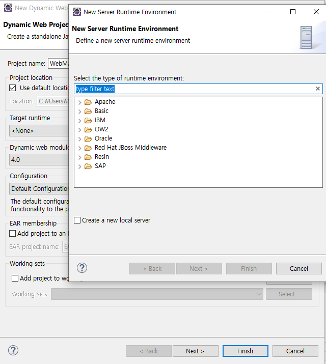

# JSP 1강

legacy. 

~~ 앞으로는 더더욱 안쓴다 ~~

spring에서 jsp 안씀.

유지보수를 위해 공부.

jsp를 지원하는 eclipse인지 확인해보자.

java EE가 있다면 준비 완료!

아니라면 홈페이지에서 **Eclipse IDE for Enterprise Java and Web Developers**를 받아 실행하자.

> https://www.eclipse.org/downloads/packages/

New Dynamic Web을 만들 때

target runtime은 아파치의 톰캣서버를 사용했다.

Download and Install로 직접 설치도 가능.

webapp에는 jsp

java에는 java코드.

이클립스를 쓰는 이유 : 톰캣의 설정을 수동으로 하지 않아도 되기 때문에.

vscode에서 해당 폴더 열어 실행 가능.

jsp 코드 색 입히는 익스텐션. 하지만 vscode의 자동완성 

publish to github을 할 때에 .classpath .project .setting을 같이 넣어주어야 나중에 코드를 받을 때 오류가 나지 않는다.