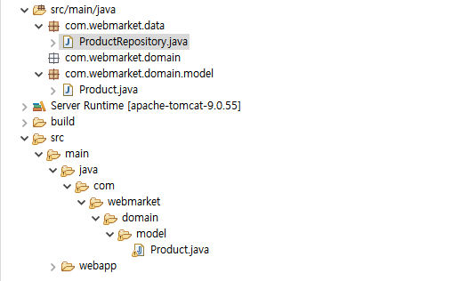
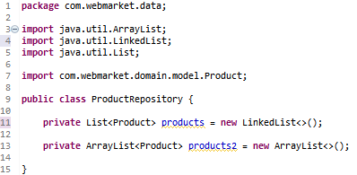
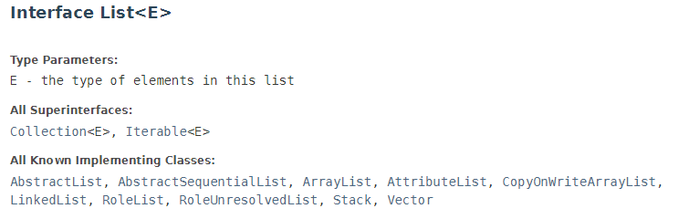
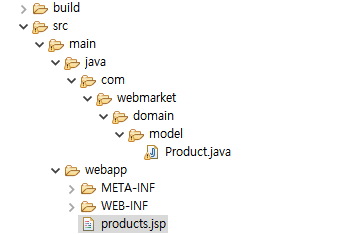

# Java DAO,DTO,Repository


**순서** 

1. 모델객체 만들고

2. **기능제공하는 레파지토리 만들고**

3. 화면에 뿌린다. (jsp)

   

   <details>
     <summary style="font-Weight : bold; font-size : 15px; color : #E43914;" >실습 목표</summary>
     <div>
       
     </div>
   </details>
   
   

------


dto data transfer object

DAO 패키지는 database와 밀접하다.

product를 제공하고 별도로 뿌려주는 클래스를 만들자.



일반적으로 ~Repository 자바 파일명을 설정해준다.


이 파일은 products의 데이터들을 받는다. 이때 어떤 데이터 구조로 받을 것인가?

List or ArrayList?




### List와 ArrayList

### List


Next에 다음 데이터의 레퍼런스 저장. 주소를 가리킴.

항상 삽입과 삭제의 속도가 동일하다.

데이터를 삽입 했을 때, (내장함수에서) 전자 A와 C의 Node값을 지정해줘 링크연결을 한다. 

B데이터를 삭제했을 때 전자의 넥스트에서 C데이터를 가리키도록 주소만 바꾸면 됨.

링크가 끊어진 B는 알아서 JVM이 삭제한다.

#### 요약

삽입, 삭제가 빈번할 떄 항상 동일 성능. but  ArrayList보다 검색이 느리다.

메모리 조금 더 많이 먹는다. (Node값 두개 지정)


### 동적배열(Array) 

ArrayList는 일반적으로 배열(Array)와 같다고 볼 수 있다.

![01-자료구조: 배열(Array)->정적배열(Static Array) : 네이버 블로그](data:image/png;base64,iVBORw0KGgoAAAANSUhEUgAAAU8AAAB8CAMAAADeisJ3AAAAxlBMVEX////q6uoAAADf79/d7t3j8ePn8+fi8OJlb2WZmZnq9Orp9One7t4/Pz/u9u7a7Nq7u7vC4cKqqqoRERGIiIjy+PIiIiLd3d3MzMzH48dmZmYzMzNERETV6tV3d3ey07JVVVXK0cqoyKiHh4f09PR/f3+KoYpOTk5eXl6HkIdRVFFDTkO53bnO5s6epZ57gXvByMG3w7fPz88lKCVaZVp1cnPG08Y7QjvS2NJqeWqiuaJSWlIvNy+10rXV4tWptKljaWOZppkqB5TEAAAMpklEQVR4nO1dDXubthYGxXGCUzsqIhIF7JK1Xtx1a7a27nbvdu92//+fuvoECXSI7RInzqP32eqEY+m85+XoA1BQFAUEBAQEBAQEPD8giSxC6QNfrPBR+Jw60ApzsAglD33xoS8ECBiZ+GdGyUoITFGREcrTsTlAsoiiBzM4ILL1zAjOKW/4FKeozGsaNQfyFOUx7xMCHobqP0V7L7lgWRkJ3bjICYrMgUQeCO19J6j+UyimlDXycT3dA0HPndC2d5IxhjNLT/dA0HMntOP7iuK8rC093QOh/9wJqlEXYv5ZEFLHciLK/09R5B4owvgeEBAQEBAQ8F1Q0w7szCnUHS4x8bC+92wmHXlpftqNZ1wRmkbZ6vGZSf9yWhxnuX1MXlHkzjz4+VxllI1iu/GsKpYhFhP2+NRa//y0ooymCUUV03e4+HlPaYFKzDMCFfx7rCIli2rKQ6qPws0LzP2nVNBqeao7c2Ian5nbdy1NfZlUFEehZ/Tk12UkyxFmNdV3uPiFW4IKVpcRWTGhZ1mzgkYMZQk6zrn2oqijGCWsIFHLU92ZE5eZlbl919LkqnJjhNFwvSPBXLXJ61yMsjzGWmOpZ8z/x/xfhpKcf8Sc2IrQ45xqP2gWxWmcFyhqeaoUFCnKmtt3DU3MA6SK+hEg+09m7sNkFJHU1lN8iH/5MXVfLI1iQuJjMIMIc3I1ImVfT/lrc/uuoVlVeV5VxxpRrfaeiK6d1aSrp0rMBCPGWMbE+X7KJ1ycHGciqXX0FIkZN7fvGprCKL/9BHqKjqmMrP5TftBC9p+8G12ROCar1VMmKBVSYVzyk9z2n1LPhHectbl919KsSpmfx2rvqfkQP8nxXd/hEuM7kh+sQjWfwvFhno+qFZ/+ldUxqPnBxyNOsExI0fLUd+YyQgqqb9+1NONa3r070nh0csDksHKrelQaLwfVYVcW5CjN/QTRXm/ug+T4czz2/ugux8X681MzcJCdeotI1k/NwMHJ6/l+/tQMHJy8nlH5rHqs09dz+2xu0gqcvp54+9QMbJy+nhF9agI2XoCed094Y7aHF6Bn9gyeyrBcY5uoz+c1K94Ln++e1v/7OI7fbTOFtf6s49PFlwPLjalnt5mfsp41Pqxc0NOPZHVYuaCnH2x+WLmgJ4Av7KBiQU8ARXJQsfH1jCtUxZCeJcByS9GdPyHSEs1zgHxO/NXl4kHvGqiObLwG9XS49ZQWzY9sTqjfEe6RG1/PqpJPqb16Jijz8trQFJfeHouRbT4vvYXieA5Ul5I0Tb0nISdrTLxK8xLp3KZAWzfzfI181TGyyTfUOdSXxn28rB/67a4nQ3mUqwUqPT3F3516BRAhZshnSRADLLxECVSXgYPJlp+aLWRNiS1a1fwivHg9CXIMpfYhj57OpVaCdrp8bPWUj1PVCoCennkOCJDkosn7LIyzvfPnZ04wUN2WErLxdh/llsHjDHUS913TxMs7rpwvPxNxot2OxaunXg7HKlQWMj8zSopIr4sTT897Crd66kU1Xj2B0yzANgjoWtdQVzjfQtVt5jildz4LmSPO3u8oI86vuDI/iZU33k5XpMd6Bz31cjha55iIRRMZxZiYdXFikUfvdtZu+QnrmUI9Plead16+i5U15em+BrOto47xXzIGpHtMt+7v5pKT97lA/8mdIErakHgXjG20eprlcNFK6Ekz3pFivS6OVJj11h3t1n+CemLkb556QuBN3bkckL15s+H6r716Cs2A7jjtnjVzyalatY9CnogurC22Wq3WNlo9m+VwclGPWS8l18XxOQLqPYN2xncGju+QnnwE5fBZ7kqMtwTKQqi6krf3rc+yFhMJb08Qb7snwFxy8lYA5KdYlnnnjm5Ae1fL4XiWZSY/s0yti8uziJ+x7pC/6/wT6CSJPFU+C7sjZA7emwCq4xNG4pVTqAaMVPG8K3NzycmnwGXa/bpE0ps2D+gZlZXuP1fiL+yxWhfH+2CW9paYvbzro/iwS06PnqlZDsczja7k+L4iIkXVurikRLR39/pF6nnIJWdfz4PwIvW0Ljl3RtBzAN4rjGEEPQdQQTdiYAQ9B/Bu/w50TD3N87jsBTyPk2gvOXfGSHoKNM+LDU74ebHGQStuA0BsTj8lnhWebGHtL69B/PzzAaZjWR4o9J+/9qzu9cUocmY/TCZnZxcX5+fT6fTqajZbLBY3Cpu3k1etSVq0qVuoteQ//sJN3uq+vpGFbMui7wi2DFOYdSl8+a+XgqquR+HmZrocRc93sJ41GAxcaEDPSxWMR88a1NOlcLUPha+f+o4uj6NnV4DvDsarGhwMfOK6FGaDFBY2hb//GaDQO3FH0hOgDBcyenpUs4PZVbVDKYjq6D4URtUTSJufHgjGl4UmGA9lNxjbBDsSFr9qhkKft6Lw7dvvf3/juL29/UNgNkzh5uZ8bD2BYDqqLUww/kK/unra1V2+2V81Q+FibwofPm3++dTiwx/DFB5Zz4UJxk95DRb6tWnvvepEMI5qM9uRP87DKXy4bcHT89MfLYUmQxxBR9SzjcUh5g9moYOxBWhNMpgmo5xCIhh/dbCjvmXmpTDtUbD1vBV6DlO4ubkYS89rr4+FTptJn/Li5l4U8qThQgXjUWDRD6aNxs3PqWOBHN2DvBUFR89boecghcfS0yK2kMH43C/uwUIdPe3qZGObeKReeFSbfScFNz9vb4WeQxRubs5G1NPbeJ1gXPf3YCEezHXPMtN69hWY+VTrWiY2hasdKQB6Qo4Wi/H07PowTngw172GONPBAIVUMK86CsyaYGRtXamVaj5HioLP0UMUYD25H5+go+rpBiOczJxgOpzvwUI6P33V8WB8Us86qjmODqVw3dPz1kthaigsFpPx9PRSns1EMN44Z/dgIRVM1yJNKhhbAVNIN4RJ39HhFDx6DlGYjaynE4yWQAfTjfOqCcZjkcF04tQmEYzf0qrWrW4/CsqkKPT0HKYwm42m5xIgdvXT22U/Tmm6/wGyGD3tjlJXp4Nxo5kqR9dOnOeW5SEKE4CCR88hCldXY+Znn7LwYsLsxDkVwUCFeDC2AhdWdZevl67U562jJeDIpnC2F4Wunt+GKVxdXY+Wn0ubssWMh9mNU5vuwUIqORxBTXWXr41l0nN07Y/TpXC2DwWPnpIC4Gg6HVHPHrFzE4zl3jaJxuYvJJIDqE4lhyt16+jajvPCQ+FVjwLgSFEA9Fz2zun5+Hp2KBsvOjm6nM91cngL/SYam8fCTZdvWgUmTnXC0fK6d+bOv4dCT89hCtPpctz8bIi1Esgwl9cece7BQr/J5OhwVoV4crT5PtnNkddysQuF/31w8W2Ywvn5mHq2xIwT4UYFs/SY7sFCMpi29U7OWg1EMG00ryyLys9lV5zvo+BzBFMYWc9WAelEedHBLPsmFYzPooKxqmsVlcFYsk06jmDLAAUP74MoXFyMq6dybzE7a4NZusy4yejZDefMBGNXN9HVqWDaaNrqTBaCFovCqw6FPu+GQre6IQoj6vnLsuPEeGmCsWRTJldPu9BvP76BqtPBDDi6th09SAHivTMF5wSdjaanXBzxhv/Xxce3kOlfYKF//whW99WszdjD0WNR6JvevB5Hz+zrJYQvHyHb779/BCx//gUW+vLxT9ACVQdbRqZweXl/M4qeAQEBAQEBAQEBAS8Ho/5VT0BE0YCgwNt3KmxZ3J3h1EZnGSEnsB/xY7zWFaOhPecAm7MftrszXCoMKcGYjPnW6UeInK37fxg/Auq6Frs4ZTRN6YqwCtEsoiuxZ5WwNvvR6ZfyxAWhKyS2hEM11SnI81NteCMLyNNTFVFUjLm7zYYm475kHW8QOnDLlkHEKE0RE7vSsQRVaVmwFOGV2CVP7tzY7EenX8ojdi3iHQTK9GZw4jvi3R1iQztZH2NCTyI2hxqT7mce/Xa8JH1fijeA0PlYaGtO1IZ5Ys8n8d6dlHGV5B5f6qVEzX506qU8kUhJ+dITWcK8SUZvaKegNypUr4qKopEYy3egjPeaYLbmFT7Ga8YrwbNsBCjElm9JRDOdXc1+dPqlJ7JzRKb/bHYyUxvaRbrII+Tne5FO4zb5ZP4IG8Lx1olxgpjWE4sWLHbBrCr10qJmPzrzEpnMyGrrqTe0i3SRR+g/1+hu/OA/j19lJlUgq0ZPnBfI3SVP7Uen9cz4wE2RaOyOnmpDu8gUGX98T5/TG+sHoDa/LKiYTYp5pBi+RaYR3bcgsx+dfimPeBdPhcSWcHozuKgzvuuDpzH/PB4qYF/mFJuZVMDuiDG0a2NBc0xD5u2JFEHbhotdHY+0pXhAQEBAQEBAQMCx8X8D70lLVzo1KgAAAABJRU5ErkJggg==)

Array에서 데이터를 추가했을 때, 그냥 뒤에 갖다 붙임.

Array에서 만약 0번 index 값을 삭제했을 때,

뒤의 1,2,3,4...가 모두 한칸 씩 이동.

만약 데이터가 1억개 이면 하나 삭제 했을 때 데이터의 복사 붙여넣기가 1억번 실행됨.

#### 요약

크기가 커질수록 삽입, 삭제가 느려짐.

내부적으로 배열이라 성능이 일단 빠르다.


리스트(상위 개념) 구조에 포함되는 것들. 각각의 기능들이 있으므로 적재적소에 맞는 리스트를 쓰자.



https://docs.oracle.com/javase/8/docs/api/java/util/List.html


자료구조를 선택했다면, 예를 들어 sort 기능을 만들면

```java
	public static List<Product> sort(List<Product> products) { //여기에 상위 개념인 List를 붙여주어 사용자들이 입맛에 맞게 변형하여 쓸 수 있도록,
		return new LinkedList<>();
	}
```


```java
sort(products);
		Stack stack = (Stack) sort(products2);
```

만약 나는 List 하위 개념인 stack을 사용하고 싶어. 그러면 Stack으로 형 변형을 해줄 수 있다.


## 3. 화면에 뿌리기 위한 Jsp 만들기




### ❓ 의문점

1. List\<product> products = new LinkedList<>();

   List\<product> products = new ArrayList<>();

   여기서 앞에는 List, 뒤에는 LinkedList 어쩔때는 뒤가 ArrayList, 앞이 List.

   무슨 차이일까?


https://www.geeksforgeeks.org/types-of-linked-list/

https://m.blog.naver.com/PostView.naver?isHttpsRedirect=true&blogId=justkukaro&logNo=220396540585


