# Java 클래스를 정의했을 때 할 일

**순서** 

1. **모델객체 만들고**

2. 기능제공하는 레파지토리 만들고

3. 화면에 뿌린다. (jsp)

   

   ```markdown
   <details>
     <summary style="font-Weight : bold; font-size : 30px; color : #E43914;" >실습 목표</summary>
     <div>
       
     </div>
   </details>
   ```

   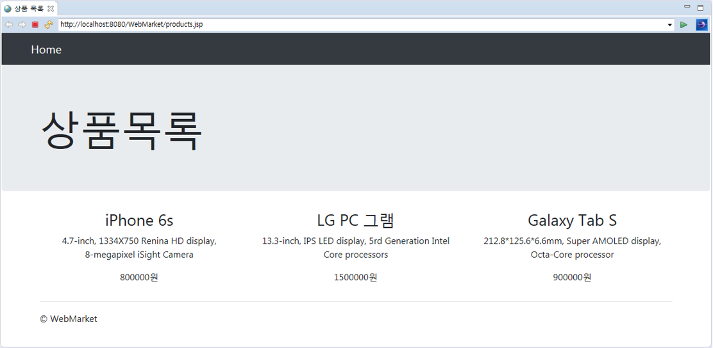

------


*자바의 철학 : 현실세계와 맞춘다.*

*고로 이 5가지 과정을 거친다.*

1. **무지성 private 멤버 변수**
2. **필요하면 생성자 추가**
3. **무지성 getter/ setter**
4. **무지성 toString()**
5. **필요하면 equals / hashCode 재정의(오버라이드)**

  


**<이클립스 우클릭 Source 기능 활용하기(Alt+Shift+S)>**

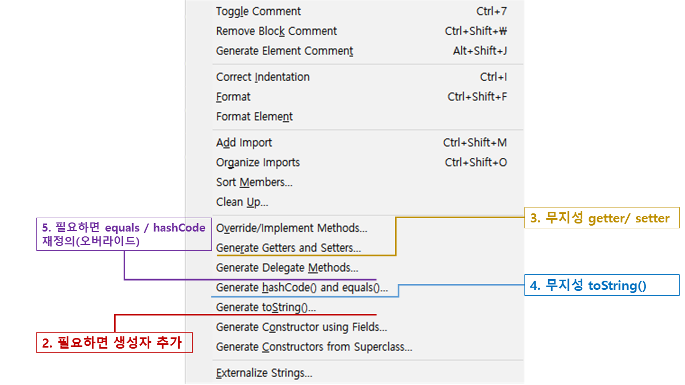


## 객체만들기


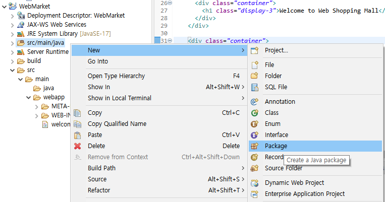

자바 파일은 여기에 해도 밑 사진처럼 이렇게 경로에 저장이 된다.

패키치 이름은 보통 com.웹사이트 주소로 통일한다.

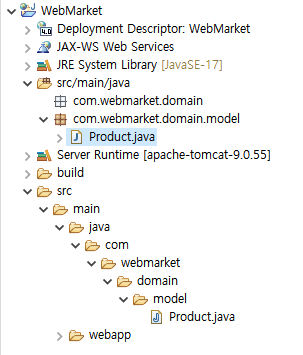

product에 모든 상품을 객체로 담는다.


객체를 만들 때 정석은 객체의 속성을 모두 다 private으로 설정한다.


```java
package com.webmarket.domain.model;

public class Product {
	
	private String id;
	private String name;
	private String unitPrice;
	private String description;
	private String manufacturer;
	private String category;
	private long unitsInStock;
	private String condition;
	
}
```

```
	//클래스와 메인메소드는 아무런 관계가 없다.\
	//static은 데이터가 기록이 되면 정적으로 다른 공간에 바로 메모리에 올라간다.(다른 데이터와 다른 공간이므로 서로 모른다.
	//그럼 class main안에 메인메소드를 왜 넣냐? 자바의 룰로, 메인메소드는 클래스 안에 넣어야한다.(아무데나가능)
	//그러므로 밑의 변수들에 접근을 할 수 없다.
```

```java
package com.webmarket.domain.model;

public class Product {
	
	public static void main(String[] args) {
// Product product = new Product();
		name = "ddd"; // 밑 변수들과 상관이 없으므로 가져올 수 없다.
		id = "110";	// 변수 id는 static이므로 가져올 수 있다.
	}
	
	private static String id;
	private String name;
	private String unitPrice;
	private String description;
	private String manufacturer;
	private String category;
	private long unitsInStock;
	private String condition;
	
}
```


정적데이터(static)은 공용데이터 프로그램 끝날 떄까지 사라지지 않는다..

동적데이터는 사용하지 않게 될 경우 .JVM이 알아서 삭제하여 메모리를 확보한다.

```java
public class Product {
	
	public static void main(String[] args) {
		Product product = new Product();
		Product product2 = new Product();
		product.id = "100";
		//product2.id = ? //"100"
	}
	
	private static String id;
	private String name;
	private String unitPrice;
	private String description;
	private String manufacturer;
	private String category;
	private long unitsInStock;
	private String condition;
	
}

```

이때 두 product와 product2는 같은  static(정적데이터)를 보고 있으므로 product2.id 도 "100이다/"


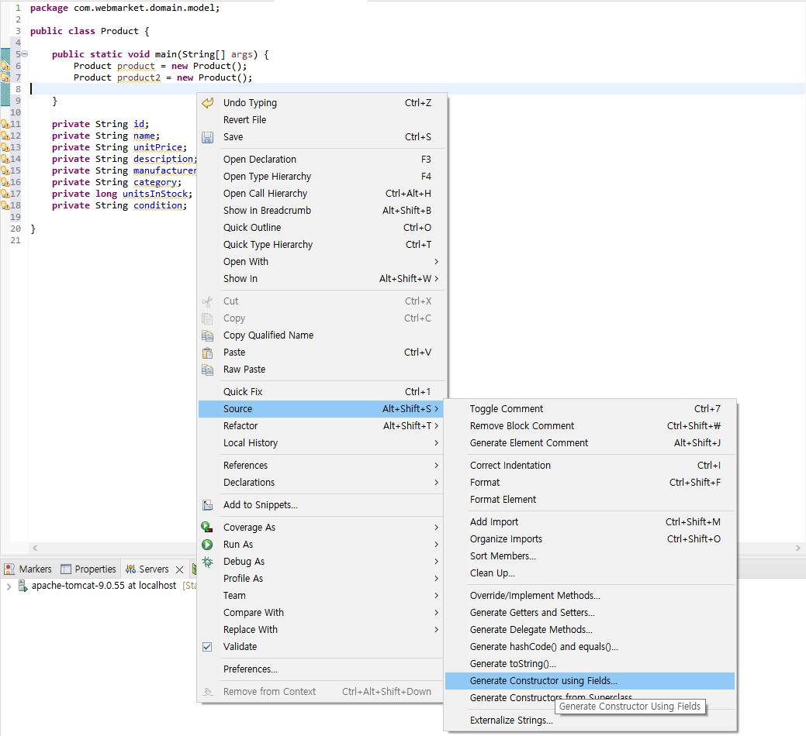

앞으로 자주 사용하게될 소스 도구들


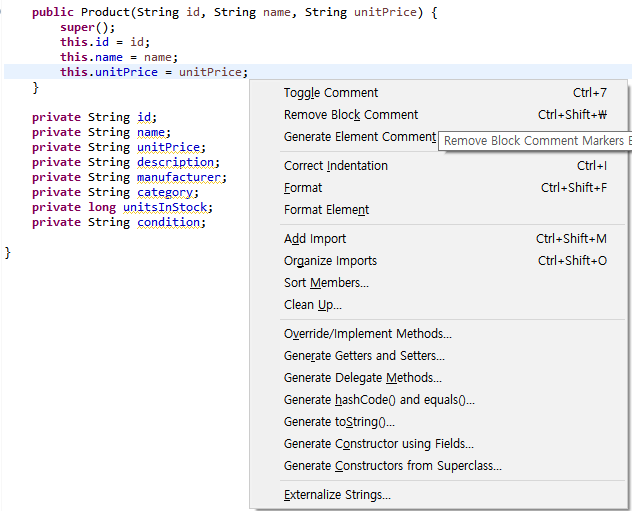


생성자는 만드는 사람이 반드시 세가지 값이 꼭 필요하게 만들어야지. 하고 추가해주는 것.


똑같은 이름의 생성자나 메소드를 여러개 만드는  : 오버로드


### 무지성 getter / setter

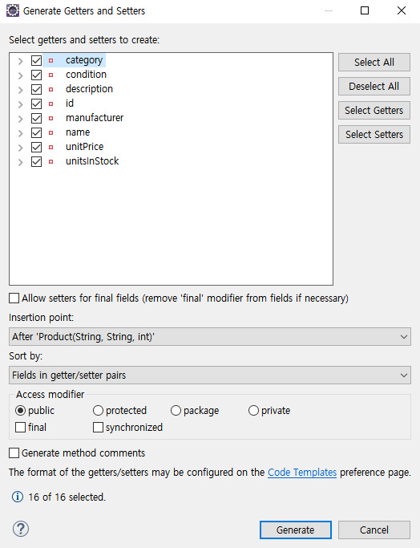

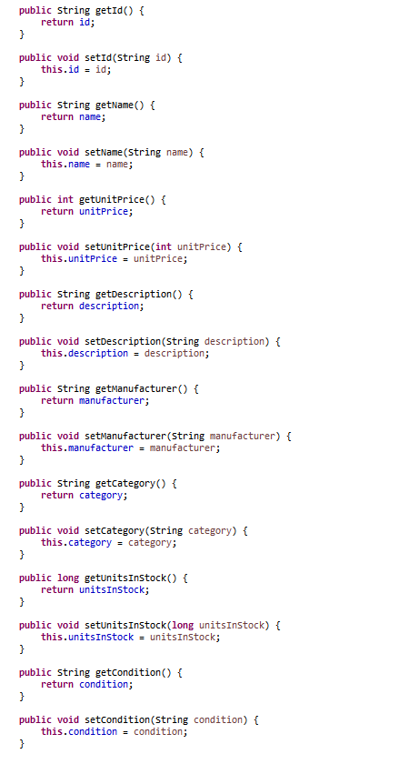

getter setter 를 하는 이유:

논리적으로 말이 안되는 것들을 막아 실수 범위를 줄인다.

읽기 전용, 쓰기 전용 만드는 것.


### 4. 무지성 toString()

toString은 통상적으로 코드 맨 밑에 위치.

해쉬코드(hashCode()를 통해 볼 수 있음)가 toString을 통해

이 객체를 String으로 표현하고자 하는게 있으면 여기에다 재정의 해라.

```java
@Override
public String toString() {
	return "Product [id=" + id + ", name=" + name + ", unitPrice=" + unitPrice + ", description=" + description
			+ ", manufacturer=" + manufacturer + ", category=" + category + ", unitsInStock=" + unitsInStock
			+ ", condition=" + condition + "]";
}
```


만든 인스턴스를 출력해보면..

```java
	public static void main(String[] args) {
		Product product = new Product("33", "33", 11);
		Product product2 = new Product("33", "33", 11);
		System.out.println(product);
	}
```


해당 인스턴스의 hashCode가 보인다. 👉 3d012ddd

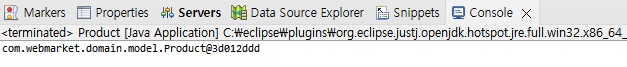


toString()을 만들어 주었을 때 출력 화면 :

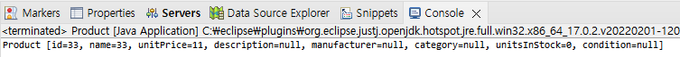


```java
System.out.println(product == product2); // false
```

이때 false인 이유는 각 인스턴스의 해쉬코드도 다르고, 동적 데이터로 만들어진 두 인스턴스.

객체 비교를 할 때에는 equals() 함수가 필요하다. 하지만 Object 클래스의 equals 기능으로는 두 객체를 비교할 수  없다.

그러므로 equals() 재정의를 통해 두 객체의 동등한 비교를 할 수 있도록 만들어준다. 


+a

String 비교에 .equals()를 따로 쓰는 이유.

==은 레퍼런스 비교이다.

```java
System.out.println("name" == "name"); // false
```

```java
System.out.println(new String("name") == new String("name")); // false
```

물론, 이때 jvm의 코드 재사용으로 간혹 true가 나올 수 있다고 한다.


### 5. 필요하면 equals / hashCode 재정의(오버라이드)

만들어진 인스턴스 들 중에서

ID가 같으면 같은걸로 보고싶을 때.

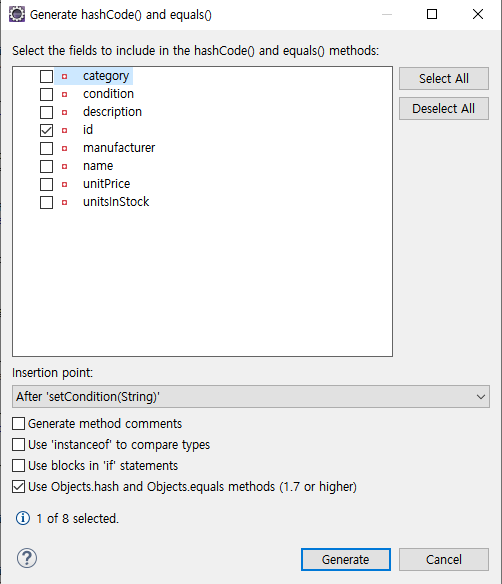

```java
@Override
	public int hashCode() {
		return Objects.hash(id);
	}


	@Override
	public boolean equals(Object obj) {
		if (this == obj)
			return true;
		if (obj == null)
			return false;
		if (getClass() != obj.getClass())
			return false;
		Product other = (Product) obj;
		return Objects.equals(id, other.id);
	}
```

그럼 equals했는데, id가 같아. 근데 id는 같은데 hashCode가 서로 다르면 현실이랑 안맞지 않나?

hashCode도 맞춰주자. 👉 hashCode 재정의

즉,

쌍둥이 둘은 태어났는데 똑같이 생겼으면 같은 애야 - > equals() 재정의

 


하지만

```java
System.out.println(product == product2);// false
```

언제나 false이다. 쌍둥이 둘은 결국 다른 애들이기 때문.

그러므로 java에서 객체 비교는 언제나 equals() 로 한다.


### Object클래스란?

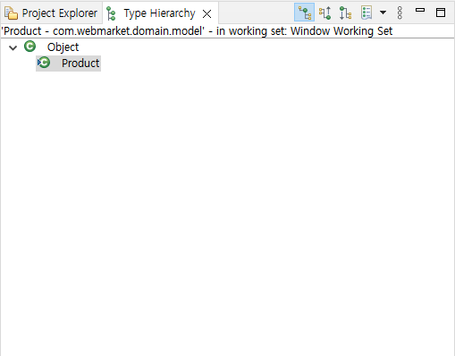

F4를 눌러 Type Hierachy를 보았을 때 Object에서 상속받아온 것을 볼 수 있음.

Object는 모든 클래스의 상위 클래스.

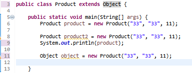

결국 extends Object가 생략되어 있다고 볼 수 있는것이다.


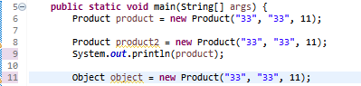

그러므로 11번 라인의 코드는 오류가 나지 않는다. 이것이 다형성.

java에서 모든 클래스는 Object클래스를 상속받음.


위 기본 설정들이 요즘 언어(kotlin)에서는 한줄로 표현이 된다구?!