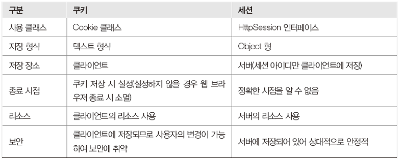

**세션과 쿠키, 로컬스토리지 모두**

값을 저장하고 빼내는데 사용되는 기능으로,

클라이언트와 웹 서버 간의 상태를 지속적으로 유지하는 방법이다.

<br>

<br>

<br>

# 세션(Session)

- **웹 서버에서 저장**하는 것. 보안 유지에 유리하고, 데이터를 저장하는데 한계가 없다.
- 오직 웹 서버에 존재하는 객체로 웹 브라우저마다 하나씩 존재하므로 웹 서버의 서비스를 제공받는 **사용자를 구분하는 단위**가 된다.
- 웹 브라우저를 닫기 전까지 웹 페이지를 이동하더라도 사용자의 정보가 웹 서버에 보관되어 있어 사용자 정보를 잃지 않는다.

- **내장객체 없이(import없이) 사용 가능**하다.

<br>

#### 🔨세션 값 설정하기

```java
session.setAttribute("설정한 세션아이디", 세션에 넣을 값);     		session.setAttribute("user_id", user_id);   
```

<br>

#### 🔨세션 유지시간 설정하기(초 단위)

```java
session.setMaxInactiveInterval(30*60); // 60분동안 세션을 유지하고 싶다면, 60 * 60으로 설정
session.setMaxInactiveInterval(-1);     // 세션의 시간을 무한대로 설정 
```

<br>

#### 🔨세션에 저장된 값 가져오기

```java
session.getAttribute("user_id");
```

<br>

#### 🔨세션 값 삭제

```java
session.removeAttribute("user_id");     
session.invalidate(); // 세션 전체 제거, 무효화 
```

<br>

<br>

<br>

# 쿠키(Cookie)

- 세션과 달리 상태 정보를 웹서버가 아닌 **클라이언트에 저장**한다.
- 클라이언트의 **일정 폴더에 정보를 저장**하기 때문에 **웹 서버의 부하를 줄일 수 있다**는 것이 장점이다.

- 쿠키 저장소 (폴더)에 데이터가 쌓인다. 고로, 웹 브라우저가 접속했던 웹 사이트에 관한 정보와 **개인 정보가 기록되기 때문에 보안에 문제**가 있다.

<br>

#### 🍪쿠키 생성

```java
Cookie Cookie(String name, String value)
    //name은 쿠키를 식별하기 위한 이름, value는 쿠키 값
```

Cookie( ) 메서드를 사용한다.

쿠키를 생성한 후에는 반드시 response(응답객체) 내장 객체의 addCookie( ) 메소드로 쿠키를 설정해야 한다.

<br>

**ex) Cookie( ) 메소드 사용 예**

```java
Cookie cookie_id = new Cookie("userID","user_id");
Cookie cookie_pw = new Cookie("userPW","user_pw");
response.addCookie(cookie_id);
response.addCookie(cookie_pw);
```

<br>

#### 🍪쿠키 객체,정보 얻기

```java
Cookie[] request.getCookies( );
```

클라이언트에 저장된 모든 쿠키 객체를 가져오려면 request 내장 객체의 getCookies( ) 메소드를 사용한다.

쿠키 객체가 여러 개일 때는 배열 형태로 가져온다.

<br>

**ex) getCookies( ) 메소드 사용 예**

```java
Cookie[] cookies = request.getCookies( );
```

<br>

쿠키 객체를 얻어왔다면 이 쿠키 객체에 저장된 쿠키 이름과 값을 가져오기 위해 **getName( ), getValue( )** 메소드를 사용한다.

```java
String getName()
String getValue()
```

<br>

**ex) getName(), getValue( ) 메소드 사용 예**

```jsp
Cookie[] cookies = request.getCookies();

for (int i = 0; i < cookies.length; i++){
    out.println(cookies[i].getName() + ":" + cookies[i].getValue() + "<br>")
}
```

<br>

#### 🍪쿠키 삭제

```java
void setMaxAge(int age)
```

쿠키의 유효 기간을 결정하는 setMaxAge( ) 메소드에 유효 기간을 0으로 설정하여 쿠키를 삭제할 수 있다.

<br>

**ex) setMaxAge( ) 메소드 사용 예**

```java
Cookie cookie = new Cookie("memberID", "member_id");
cookie.setMaxAge(0);
response.addCookie(cookie);
```

<br>

<br>

## 쿠키와 세션의 차이



<br>

<br>

<br>

# 웹스토리지(Web Storage)

영구저장소 **로컬스토리지(LocalStorage)**와 임시저장소 **세션스토리지(SessionStorage)**를 가지고 있다.

- 로컬스토리지 : 사용자(로컬)에 저장하는 임시저장소. 영구적. windows 전역 객체의 LocalStorage라는 컬렉션을 통해 저장, 조회가 이루어진다.

- 세션스토리지 : 임시적. windows 전역 객체의 sessionStorage라는 컬렉션을 통해 저장, 조회가 이루어진다.


- **html5에서 제공하는 기능.** 브라우저 안에 있는 데이터 로컬이다. 
- 쿠키와 비슷하지만 용량의 제한이 5MB이고,쿠키처럼 매번 서버로 전송하지 않아 네트워크 트래픽 비용을 줄여준다. 
- 키/값의 쌍으로 데이터를 저장하고 키를 기반으로 데이터를 조회하는 패턴이다.
- 서버로 절대 전송되지 않는다.
- 쿠키 위험성이 있기 때문에, 이후 페이지들의 간단한 데이터 저장 방식이 로컬 스토리지로 대체가 되었다고 함.
- 자바스크립트 코드를 통해 관리할 수 있다.

<br>

#### \<javascript>

#### ⛏데이터 저장하기

```javascript
LocalStorage.setItem( key, value );
```

<br>

#### ⛏데이터 불러오기

```javascript
LocalStorage.getItem( key );
```

<br>

#### ⛏데이터 삭제

```javascript
LocalStorage.removeItem( key ); // 해당 키의 데이터 삭제
LocalStorage.clear( ); // 모든 데이터 삭제
```

<br>

#### ⛏index에 해당하는 키 소환

```javascript
LocalStorage.key(index);
```

<br>

#### ⛏저장된 항목의 수

```javascript
LocalStorage.length;
```

<br>

<br>

​	 데이터를 저장할 때엔, 배열을 선언하여 각각의 정보들을 배열의 요소로 추가하고, 한 이름에 대한 정보들은 여러 항목이 있기에 객체로 저장한다.

```javascript
objArr = [{num:1, title:'test', contents:'blahblah'}, ...]
```

​	localStorage는 iterable (반복가능한) 객체가 아니어서 키와 값 전체를 얻으려면 배열처럼 다루면 된다.

```javascript
for(let i=0; i<localStorage.length; i++) {
  let key = localStorage.key(i);
  alert(`${key}: ${localStorage.getItem(key)}`);
}
```


<br>

<br>

<br>

## References

> - 세션(Session) : [[튜나 개발일기:티스토리]](https://devuna.tistory.com/53) 
> - 웹 스토리지(Web Storage) : [[코딩맛집:티스토리]](https://coding-restaurant.tistory.com/294)

