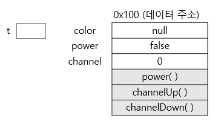
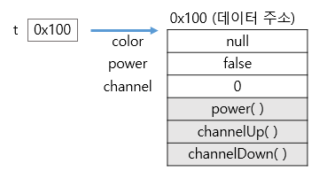

## 클래스와 객체

> - 클래스의 정의 : 클래스란 객체를 정의해 놓은 것.
>
>   '객체의 설계도 또는 틀'
>
> - 클래스의 용도 : 클래스는 객체를 생성하는데 사용된다.

> - 객체의 정의 : 실제로 존재하는 것.
> - 객체의 용도 : 객체가 가지고 있는 기능과 속성에 따라 다름.

**프로그래밍에서의 객체: 클래스에 정의된 내용대로 메모리에 생성된 것.**

<br>

<br>

<br>

## 객체와 인스턴스

클래스로부터 객체를 만드는 과정 : 인스턴스화(instantiate)

클래스로부터 만들어진 객체 : 인스턴스(Instance)

<br>

~~'책상은 인스턴스이다.'~~ 👉 '책상은 객체다.'

~~'책상은 책상 클래스의 객체이다.'~~ 👉 '책상은 책상 클래스의 인스턴스이다.'

<br>

**클래스 ---인스턴스화---> 인스턴스(객체)**

<br>

<br>

<br>

## 객체의 구성요소

객체의 구성요소는 두가지가 있다.

<br>

- **속성(property)**

  : 멤버변수(member variable), 특성(attribute), 필드(field), 상태(state)

ex) TV의 크기, 길이, 높이, 색상, 볼륨, 채널 등

채널(멤버 변수) = int channel

- **기능(function)**

: 메서드(method), 함수(function), 행위(behavior)

ex) TV 켜기, 끄기, 볼륨 높이기, 볼륨 낮추기, 채널 변경하기 등

채널 높이기(메서드) = channelUp( )

<br>

TV클래스를 만들어보자!

```java
Class TV{
    String color;
    boolean power;
    int channel;

    void power(){
        power = !power;
    }
    void channelUp {
        channel++;
    }
    void channelDown {
        channel--;
    }
}
```

<br>

<br>

<br>

## 인스턴스의 생성과 사용

TV클래스를 선언한 것은 TV설계도를 작성한 것일 뿐이므로, TV인스턴스를 생성해야 제품(TV)를 사용할 수 있다.

```java
클래스명 변수명;	// 클래스 객체를 참조하기 위한 참조 변수를 선언
변수명 = new 클래스명();	// 클래스의 객체를 생성 후, 객체의 주소를 참조변수에 저장

TV t;	// TV 클래스 타입의 참조 변수 t를 선언
t = new TV(); // TV인스턴스를 생성한 후, 생성된 TV인스턴스의 주소를 t에 저장
```

<br>

<br>

---

1.

```java
TV t;
```

TV 클래스 타입의 참조 변수 t를 선언한다. **메모리에 참조변수 t를 위한 공간이 마련된다. (공간o, 데이터x)**

아직 인스턴스가 생성되지 않았으므로 참조변수로 아무것도 할 수 없다.


<br>

##### 참조란?

참조 변수 t가 TV인스턴스를 **가리키고 있다(참조하고 있다)**.

<br>

<br>

2.

```java
new TV();
```

**new** 라는 연산자를 사용하여 **TV인스턴스를 새로 생성(new)** 한 것.

**TV클래스의 인스턴스가 메모리의 빈 공간에 생성된다.**

이 때, 멤버 변수는 각 자료형에 해당하는 기본값(boolean은 false, int는 0, String은 null)으로 초기화 된다.



<br>

<br>

3.

```java
t = new TV();
```

대입연산자(=)를 통해 **생성된 객체의 주소 값**을 만들었던 참조변수 **t에 저장** 한다.

그리하여 참조변수 t를 통해 TV인스턴스에 접근할 수 있는 것.



<br>

<br>

4.

```java
Tv t = new TV();
```

✔인스턴스는 오직 참조변수를 통해서만 다룰 수 있다.

✔참조변수의 타입은 인스턴스의 타입과 일치해야한다.

ex) TV를 사용하려면 TV리모콘을 사용해야하는 것처럼.

---

<br>

<br>

```java
class TV {
	//TV의 속성(멤버 변수)
	boolean power;
	int channel;

    //TV의 기능(메서드)
	void power() { power = !power; }
	void channelDown() { --channel; }
	void channelUp() { ++ channel; }

}
class TVTest{
	public static void main(String[] args) {
		TV t;	// TV 인스턴스를 참조하기 위한 변수 t 선언
		t = new TV();	// TV 인스턴스를 생성한다.
		t.channel = 7;	// TV 인스턴스의 멤버 변수 channel의 값을 7로 한다.
		t.channelDown();	// TV 인스턴스의 메서드 channelDown()을 호출한다.
		System.out.println("현재 채널은 " + t.channel + " 입니다.");

	}
}
```

<br>

<br>

<br>

## References

> - [자바의 정석,도우출판 ](http://www.kyobobook.co.kr/product/detailViewKor.laf?ejkGb=KOR&mallGb=KOR&barcode=9788994492032&orderClick=LAG&Kc=)
