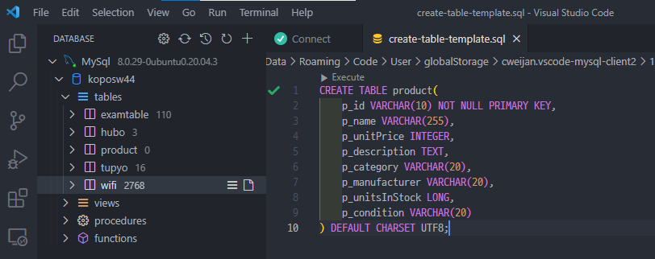
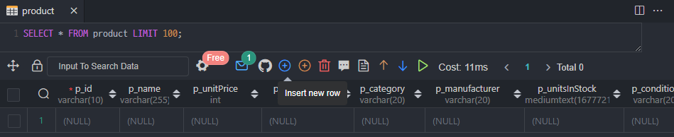
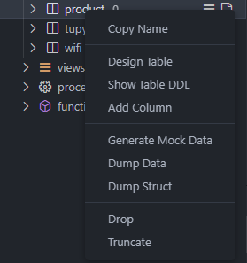
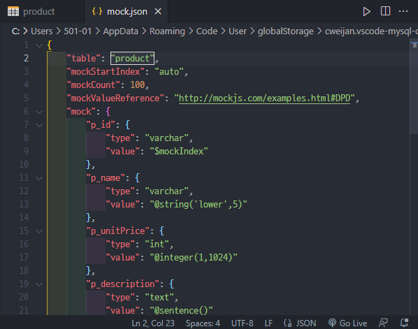
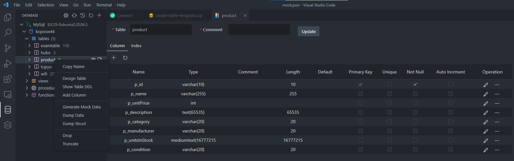

# 데이터베이스 개발 환경 구축

DB를 나누는 이유. 

메모리에 저장되어 있으면 서버가 꺼지고 데이터가 다 리셋되기 때문.

## mySQL 데이터 타입

##### varchar(가변형)

비는 칸을 지워 이름 길이만큼 딱 맞게 잡아줌

##### char 

지정해준 크기 만큼만

##### text

 최대 65535 byte. utf8 기준(3바이트 문자)으로 21844 글자 저장가능

예약어를 피해 이름 설정을 해주자.

<테이블 우클릭 기능들>

### generate mock data

연습용 mock 데이터를 json을 통해 만들 수 있다.

json이란?

JavaScript Object Notation라는 의미의 축약어로 데이터를 저장하거나 전송할 때 많이 사용되는 **경량의 DATA 교환 형식**

### desgin table

쉽게 테이블 설정 값들을 바꿔줄 수 있다. 

