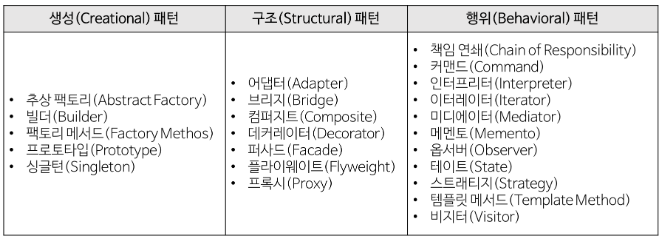

**POJO (Plain Old Java Object)**

​	:객체 지향적인 원리에 충실하면서 환경과 기술에 종속되지 않고 필요에 따라 재활용될 수 있는 방식으로 설계된 오브젝트.

마치 자바bean

<br>

<br>

## 폼(form) 태그

**Get방식과 Post방식**

method post 는 

request객체 안에 body에 들어있어서 주소창에 키(파라미터)가 보이지 않는다.


👉**키 값들을 노출해도 되면 get, 숨기고 싶으면 post**


상품을 입력하는 웹페이지는 대부분  post로 숨겨서 넣는다.

sql injection(sql 삽입) : 가장 일반적이고 잘 알려진 코드

~~why? 상품 입력 하는 웹페이지는 DB에 접속하는데 sql injection(sql 삽입) 공격이 이루어질 수 있기 때문.~~

```sql
SELECT * FROM Users WHERE UserId = 105 OR 1=1;
```

모든 유저 정보를 탈취하게 된다.

<br>

이제는 이러한 기본적인 오차범위는 프레임워크가 막아준다.

<br>

<br>

<br>

### 자바 빈즈를 대체하는 기능(인스턴스) 만들기

```java
//이 레파지토리를 만들었을 때 위에 계속 만들지 말고 만들었던거를(static을 통해 이미 올린 후) 재사용하자.
    public static ProductRepository getInstance() {
        return instance;
    }
```

 static으로 최초로 생성이 된 instance를 가져오기 때문에,

서버가 살아서 죽을 때까지(사라지지 않는) 객체가 된다.

그럼 아래 bean 코드는 쓸 필요가 없다. 아래 코드의 스코프는 session.

session은 30분동안 데이터가 저장되어있다가 후에 날라간다.(ex 장바구니 기능)

```jsp
<jsp:useBean id="repository"
	class="com.webmarket.data.ProductRepository" scope="session"></jsp:useBean>
```

<br>

<br>

아래처럼 변경.

### 싱글턴 패턴을 이용

1. static 인스턴스 준비
2. static 메서드로 인스턴스 리턴 (getInstance() 이름을 주로 씀)
3. 생성자 막기 (private)

```jsp
<%
	ProductRepository repository = ProductRepository.getInstance();
	List<Product> products = repository.getAllProducts();
	for(int i = 0; i < products.size(); i++){
		Product product = products.get(i);
    }		
%>
```

이러면 새로 add를 해도 기존의 아이템들만 가져오기 때문에.

생성자를 private으로 바꿔주어 제한을 걸어줘야한다.

```java
//여기 생성자를 public에서 private으로 바꿔주기.
private ProductRepository() {
        Product phone = new Product("P1234", "iPhone 6s", 800000);
        phone.setDescription("4.7-inch, 1334x750 Retina HD display");
        phone.setCategory("Smart Phone");
        phone.setManufacturer("Apple");
        phone.setUnitsInStock(1000);
        phone.setCondition("New");

        Product notebook = new Product("P1235", "LG PC 그램", 1500000);
        notebook.setDescription("4.7-inch, 1334x750 Retina HD display");
        notebook.setCategory("Smart Phone");
        notebook.setManufacturer("Apple");
        notebook.setUnitsInStock(1000);
        notebook.setCondition("Refubished");

        Product tablet = new Product("P1236", "Galaxy Tab S", 900000);
        tablet.setDescription("4.7-inch, 1334x750 Retina HD display");
        tablet.setCategory("Smart Phone");
        tablet.setManufacturer("Apple");
        tablet.setUnitsInStock(1000);
        tablet.setCondition("Old");

        products.add(phone);
        products.add(notebook);
        products.add(tablet);
    }
```


이때 빈즈의 규칙으로 인해 하나는 생성자가 있어야한다.

하지만 private으로 막았으니.


<br>

<br>

## 소프트웨어의 디자인 패턴

소프트웨어 코드의 설계 패턴



오늘 사용해본 싱글턴(Singleton) 패턴 :

​	프로그램이 시작될 때 어떤 클래스가 **최초 한번만 메모리를 할당하고(static)** 그 메모리에 인스턴스를 만들어 사용하는 디자인 패턴이다.

<br>

<br>

## 자바 컴파일 과정

자바의 장점은 모든플랫폼에서 실행이 가능

동일한 클래스 파일을 맥용 jvm 윈도우용 JVM등등들이 알아서 컴파일을 해준다.

<br><br><br>

## References

> - [디자인 패턴 종류](https://gmlwjd9405.github.io/2018/07/06/design-pattern.html) from. gmlwjd9405
