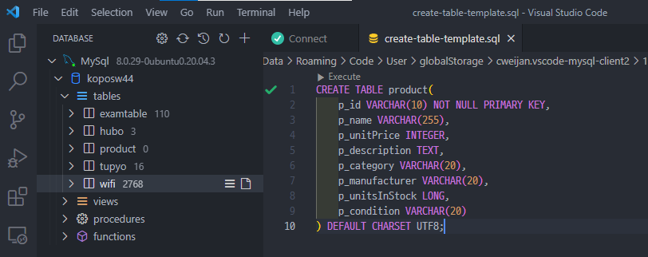
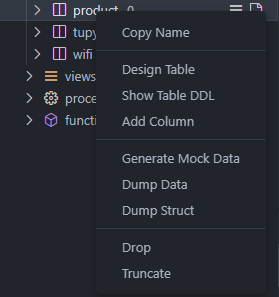
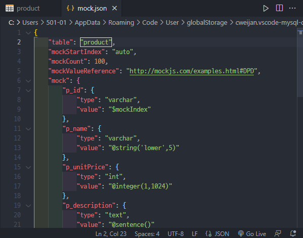
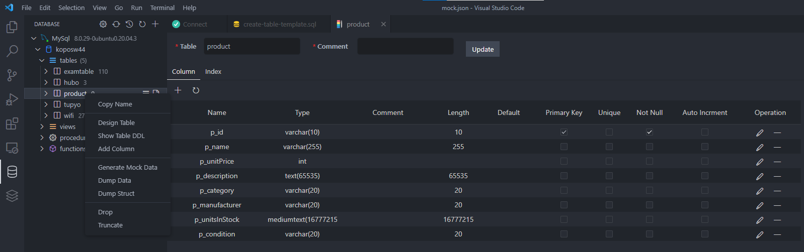

# vscode에서 MySql 익스텐션 사용하기

DB를 나누는 이유. 

메모리에 저장되어 있으면 서버가 꺼지고 데이터가 다 리셋되기 때문.

## MySql 과 DB서버 연결하기

익스텐션 설치 후,

 

좌측에 생긴 MySql 로고를 누르고,

Create Connection을 해준다.

 

본인 서버에 맞는 **Host, Port, Username, Password** 를 입력해주고, Name란의 **Connection Name**도 입력해주자.

\+ Connect !

 

❗이때 나는 vscode로 서버에 접속한 후 서버 안에서 익스텐션을 설치하고 connect를 했다. Connect Success! 가 떴지만 DATABASE가 나타나지 않았다.

👉이미 서버 안에서 Connect to server를 하니 연결이 되지 않았던 것.

서버 밖(기본 vscode 메인 화면)에서 익스텐션 설치 후 연결을 해주자.

 

연결 성공!

왼쪽 DATABASE 창에 저장되어있는 DB가 나타난다.

 

 

## mySQL 데이터 타입

##### varchar(가변형)

입력한 값을 제외한 비는 칸을 지워 input 길이만큼 딱 맞게 잡아준다.

##### char 

지정해준 크기 만큼 메모리를 잡아준다.

 

char보다 **varchar 사용을 지향**하자.

 

##### text

 최대 65535 byte. utf8 기준(3바이트 문자)으로 21844 글자 저장가능

 

 

예약어를 피해 이름 설정을 해주자.

 

 

+ : 새로운 row 추가하기

🗑 : 체크하여 선택한 row 삭제하기

▶ : 해당 쿼리문 실행하기

 

 

## 테이블 우클릭 기능들

#### generate mock data

연습용 mock 데이터를 json을 통해 만들 수 있다.

json이란?

JavaScript Object Notation라는 의미의 축약어로 데이터를 저장하거나 전송할 때 많이 사용되는 **경량의 DATA 교환 형식**

 

 

#### desgin table

쉽게 테이블 설정 값들을 바꿔줄 수 있다. 

