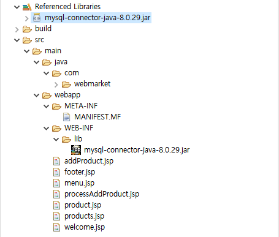
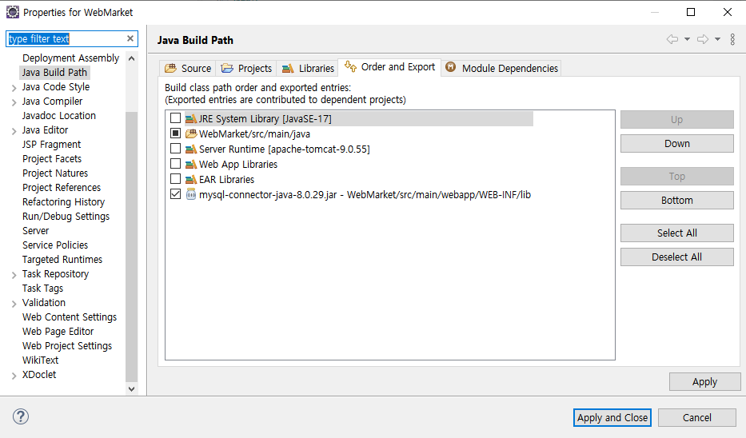
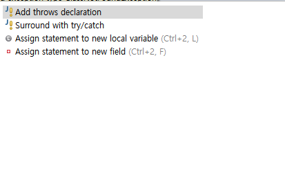

반적으로 메모리로

외부 라이브러리 추가하기

lib폴더에 넣고, 우클릭 Build Path -> Add to Build Path

jdk로 넣을 수 있지만, 프로그램마다 버전관리의 용이성을 위해 lib폴더에 위치시켜보자.

BuildPath에 잘 들어가있는 라이브러리.

# PreparedStatement 객체

쿼리를 컴파일하여 한번에 실행하는 스킬.

​		String sql = "INSERT INTO product VALUES (?, ?, ?, ?, ?, ?, ?, ?)";

공통적인 기능들을 정의하는 interface.

이 메서드는 꼭 구현해! 강제를 하기 위해.

interface 는 body가 없다.

domain 패키지는  시스템의 핵심적인 기능, 꼭 필요한 모델들이 추상화되어있는 패키지

코드의 구조를 바꾸는 리팩토링.

abstract

일부 구현 기능을 가져오는데 ..

DAO

DB랑 연결할 놈

interface

interface 안에서는 public이 생략되어있고(default) public만 됨

throw는 오류가 콘솔에만 뜨고 프로그램은 돌아간다.

이클립스 소스 안으로 들어가는 키 F3

들어오는 객체를 데이터로 바꿔주는? dto

이클립스에서 전체 검색을 하는 ctrl + h

이클립스에서 유용한 프로그램

코드를 분석하는 프로그램 : **클래스 다이어그램**(최신버전은 다운이 안됨)

