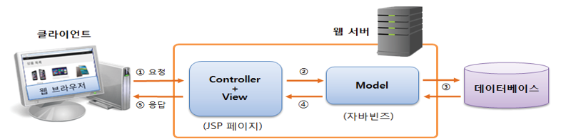
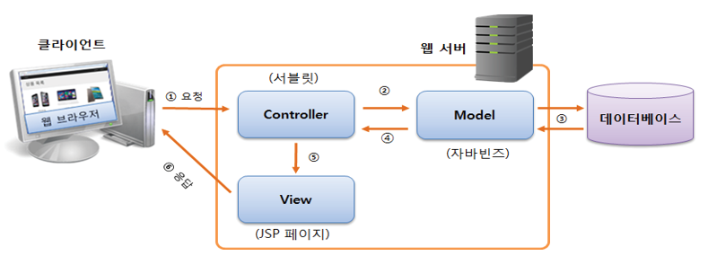

# MVC

모델1:



모델 2:

jsp에서 java코드, 로직들을 싹다 view에서 conroller로 옮겨 담아 관리



## MVC Model 2, Servlet

추상클래스 abstract class

interface와 비슷하지만 다른점은 코드가 일부 구현되어있다.

데이터가 get또는 post를 받았을 때 데이터가 httpservlet을 거치게 되는 느낌.

```java
@WebServlet(name = "ProductController", urlPatterns = {"/product.do"}) //jsp를 통과할 코드가 이 경로의 코드를 통과함
public class ProductController extends HttpServlet {

	/**
	 *
	 */
	private static final long serialVersionUID = -4873067786040482711L;

	@Override	//get방식의 데이터는 여기 메서드를 통과
	protected void doGet(HttpServletRequest req, HttpServletResponse resp) throws ServletException, IOException {
		// TODO Auto-generated method stub
		super.doGet(req, resp);
	}

	@Override	//post방식의 데이터는 여기 메서드를 통과
	protected void doPost(HttpServletRequest req, HttpServletResponse resp) throws ServletException, IOException {
		// TODO Auto-generated method stub
		super.doPost(req, resp);
	}
}
```

**mvc패턴 조사.**

doc builder

http://192.168.23.89:8080/ch6/gaepyoxml.jsp
