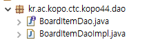
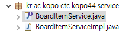

UI

Controller(UI 인풋을 받아서 뭘해야하는 지시.)

Service

Dao (CRUD + P(페이지처리) + S(검색기능))

Domain (BoardItem, CommentItem)

(이름 BoardGroup ex)갤러리모음)


1대 다수 관계

BoardGroup < BoardItem < CommenItem(댓글)


이러한 단어들을 Domain부터 UI까지 공통 사용할 수 있게 하는것이 중요.


## DOMAIN

작성자 같은 경우는 계정 조회를 통해.

번호 id

말머리 x

제목 title

글쓴이 author

작성일 created

조회 view

추천 x


만드는 모든 도메인에는 id가 들어가야한다 구분을 위해ㅔ.

```java
package kr.ac.kopo.ctc.kopo44.domain;

import java.util.Date;

public class BoardItem {
	//DB의 테이블 명이 BoardItem
	private int id;
	private int no;
	private String title;
	private String author;
	private Date created;
	private int view;
	
	
	public int getId() {
		return id;
	}
	public void setId(int id) {
		this.id = id;
	}
	public int getNo() {
		return no;
	}
	public void setNo(int no) {
		this.no = no;
	}
	public String getTitle() {
		return title;
	}
	public void setTitle(String title) {
		this.title = title;
	}
	public String getAuthor() {
		return author;
	}
	public void setAuthor(String author) {
		this.author = author;
	}
	public Date getCreated() {
		return created;
	}
	public void setCreated(Date created) {
		this.created = created;
	}
	public int getView() {
		return view;
	}
	public void setView(int view) {
		this.view = view;
	}
	
	
}

```


## DAO

DAO 기능 : CRUD + P(페이지처리) + S(검색기능)

domain이 늘어나면 dao도 똑같이 늘어나야한다. 


글 번호같은 경우 시스템 내부적으로 정해지기 때문에.




## Controller



서비스 쪽 페이지 네이션은 controller단계에서.

**페이지네이션**(pagination)은 여러 개의 게시물을 보여주는 웹사이트에서 보통 화면 하단에서 흔히 볼 수 있는 UI. 

<<	<	1 2 3 4 5	>	>>

UI랑 페이지 계산은 서로 상관이 없는 것. 분리하여놓자.


DTO(transfer 전송객체)

DTO는 DB와 관련이 없다.


### UI에서 서비스를 통해서 DAO를 사용할 수 있도록 하는게 편리


```java
1)private 2)BoardItemDao 3)boarditemDao = 4)new BoardItemDaoImpl();
```

implements 타입의 인스턴스.

4는 도메인거, new를 쓰면 하드코딩이다. 마치 탄창 교체를 못하는 빨간잉크 총. 일체형.

a는 탄창교체를 원하는 소비자(4를 비웠다가 런타임에 맞춰 끼워넣어주는 기능을 원함. setter로 dao를 자동 setting해주는 기능.-> spring의 기능)

b는 몸체도 같이 팔아 이익을 벌고싶어하는 생산자. 정적인 4) 끼워팔기.


interface 하나를 두고 갑(아키텍쳐하단) 을(상단) 관계가 바뀜(제어 역전).


