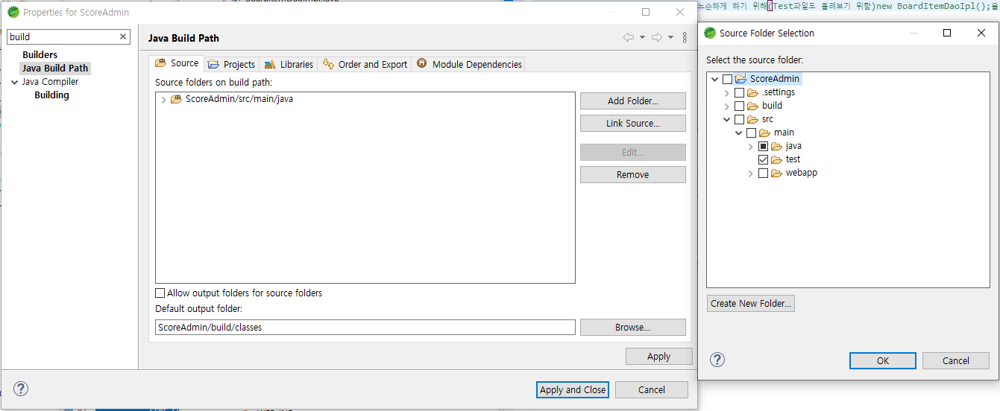
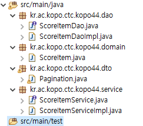
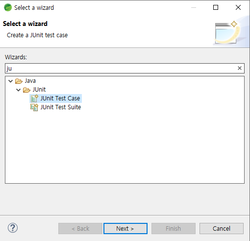
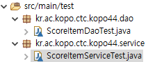
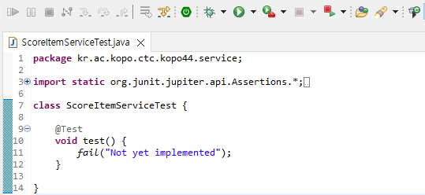

이 파일을 실행하면 DB연결 여부와 상관없이 테스트를 진행할 수 있다. 밑단 domain 과 연결 필요 없이 

assertEquals( , );를 활용하여.

Mock데이터로 자신이 원하는 데이터 영역만 들어갈 수 있게.

UI단에서 요구사항이 내려올 때에도

Junit 테스트를 통해 모든 코드를 구구절절 설명할 필요없이 딱 보여주기만 하면 된다.

A도 테스트 결과가 일치 하는지만 확인하면 되니까 시간도 단축. 윈윈