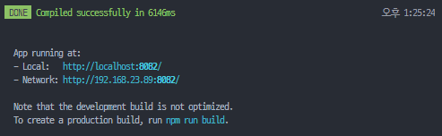
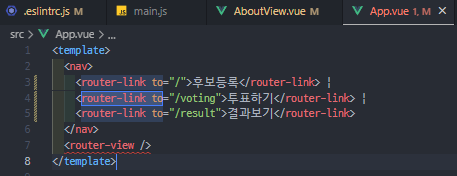

# REACT

화면 개발 방식

과거 : html css js

현재 : nps(패키지관리도구)	ES6(최신 JS문법)	모듈번들러	TS 

### 리액트의 특징

| Vue                    | React                  |
| ---------------------- | ---------------------- |
| HTML                   | JSX                    |
| 컴포넌트기반 개발 방식 | 컴포넌트기반 개발 방식 |
|                        |                        |

#### 1.컴포넌트(component)기반 개발 방식

(화면을 여러개의 작은 단위로 쪼개어 개발)

재사용성⬆	구현속도⬆	코드가독성⬆

마치 투표 시스템의 상단 메뉴(후보조회, 투표하기, 투표조회), footer등 을 반복 하던 것을,

컴포넌트로 만들어 개별적으로 관리.


#### 2. MVVM 패턴

Model + View + ViewModel

모델과 뷰가 Two-way data binding(양방향)으로 바인딩 되어있어서 getelementby 이런거 없이 값을 실시간으로 받을 수 있다.

앵귤러의  Two-way data binding 기능을 가져온 Vue.

리액트의 Virtual Dom 기능을 가져온 Vue


#### 3. Vue.js 구성요소

- Vue Instance(최상위객체)
- Vue Component(컴포넌트 블록 쌓기)
- Vue Router(화면간 이동)
- Vue Template(최종 완성본?)

---

#### 1. Vue.js 개발자 도구

 Vue.js devtools -> 현재 웹 페이지가 vue로 만들어져있다면 각 컴포넌트 구성을 확인할 수 있다.

공식 가이드 홈페이지 :

https://kr.vuejs.org/v2/guide/

cli버전 :

https://cli.vuejs.org/guide/#cli


설치 후 터미널에서 

```
node -v
>v16.15.1
```

로 버전확인


### npm

#### npm 이란?

node설치하면서 자동으로 설치됨.

**Package Manager**

개발자가 A Library를 사용하여 B Lib을 만들어 배포하고, B로 C를 만들고..

Dependency(의존성)가 생긴다.

C를 사용하고싶으면 상위 A B Lib을 모두 받아야 하는데, 이런 도구들을 한번에 관리하여 제공하는 것이  Package Manager. ex) npm,pnpm(최신)	yarn

**npx는?**

실행까지 해주는 것.


#### npm 설치

vscode터미널에서

```
npm install -g @vue/cli
```


## Creating a Project

```
vue create hello-world
```


Manually select features 설정(포매터 스타일가이드 등)


eslint(Linter) vs prettier

설정 후 프로젝트 폴더에서


```
npm run serve
```

npm run serve 명령문에서 sass 를 찾을 수 없다는 오류가 뜨면,

```
npm install --save-dev node-sass sass-loader
```


이후 vue의 welcome 페이지가 나온다.




크롬 익스텐션에서  vue를 설치했으면,

vue로 만들어진 페이지는 크롬 개발자 도구에 vue 가 추가된 모습을 볼 수 있다.


list만 따로 + 버전정보. npm install 필수!


vue 익스텐션 다운받기.


snippet : 코드조각

```
viewcreate
```

기본 코드 포맷 빨리 만들기.


language에서 TypeScript지원.


tip ) 개발 환경이 바뀌었을 때 깃헙에 vscode 익스텐션을 올려서 어디가서도 같은 개발환경으로 세팅할 수 있다.


**scss(css preprocessor)(sass)**

편하게 사용하는 css. scss 받기.

```
npm install -g node-sass sass-loader
```

그리고 <style language> 를 scss로 바꿔주자!


최전방에 보여줄 페이지를 담은 public폴더 


prettier로 인해

**vue에서는 마지막 한줄은 개행 문자여야 에러가 안뜬다.**

**vue에서는 탭 위치가 중요.**

문법이 매우 딱딱하다. prettier꺼주자.


그리고 서버 재시작! npm run serve


컴포넌트는 부모와 자식으로 전달하는 방법 밖에 없다.

props 를 사용하여 전달.


자식 컴포넌트,에서ㅏ 프로퍼티를 설정,


라우터 적용하기



index.js에 routes추가


라이프 사이클 다이어그램