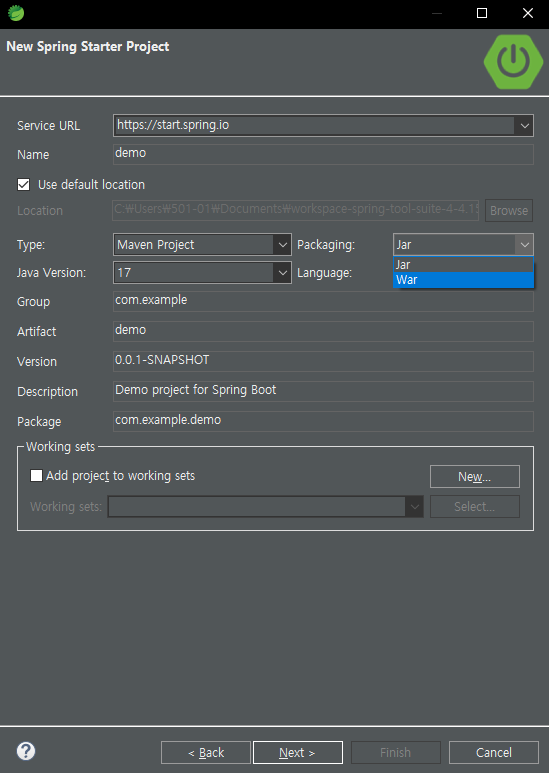
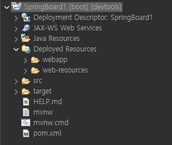
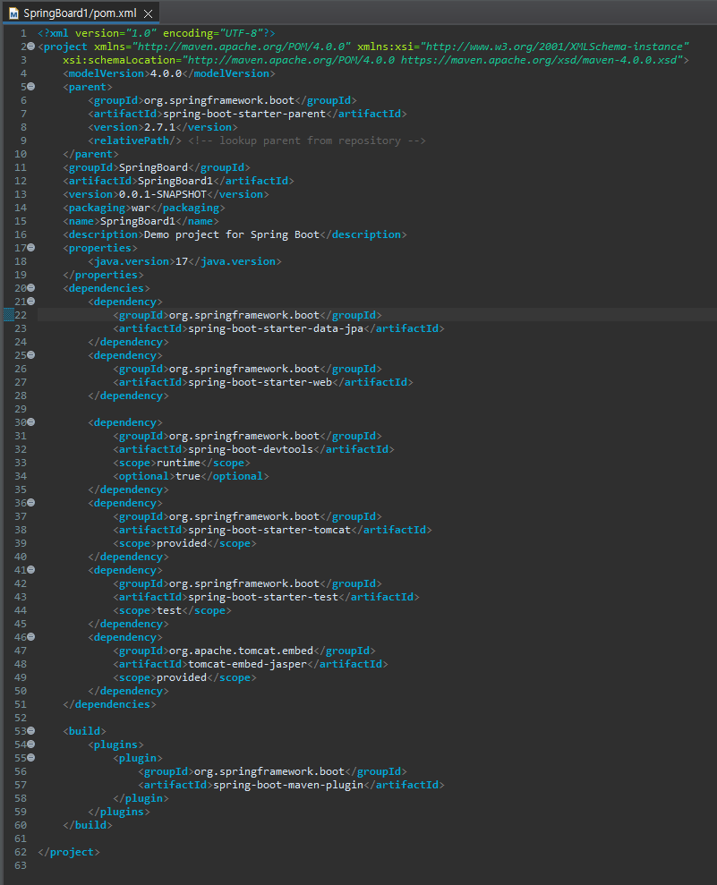
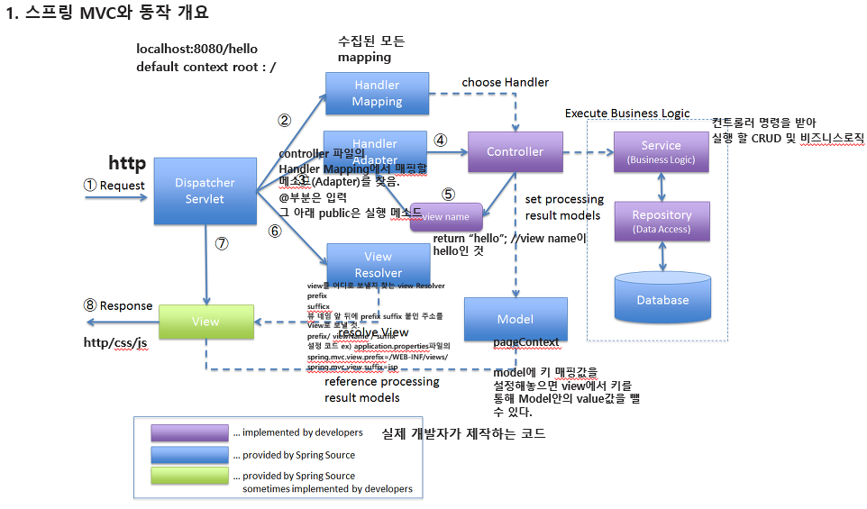
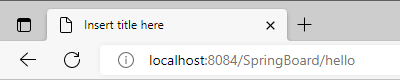
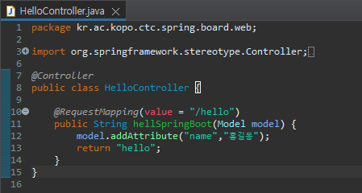
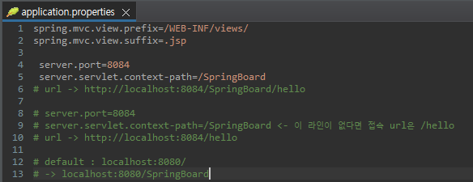
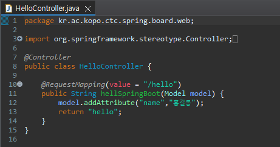
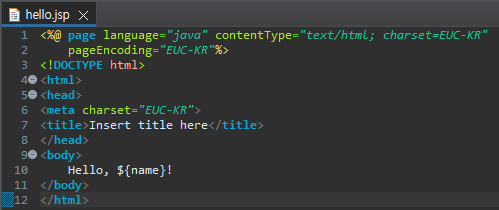

war로 하여야 웹 어플리케이션 구동 가ㅣ능.


## Maven?

Maven은 자바 프로젝트의 빌드(build)를 자동화 해주는 빌드 툴이다.

라이브러리를 관리해주는, 의존성 관리 툴.





maven에서 라이브러리 관리하기.

pom.xml에 \<dependency>를 적어주는 것 만으로

PC에 설치를 해주고, BuildPath에 넣어준다.


mvn코드를 쉽게 얻을 수 있는 mvn repository




@Service(ex 페이지네이션)

@Repository => hibernate나 mybatis로 crud 구현

@Controller

1. **주소창의 http를 통한 Request**



DispatcherServlet이 요청을 위임할 HandlerMapping을 찾는다.

2. **프로젝트에 수집되어있는 모든 Mapping.**

HandlerMapping을 통해 요청을 Controller로 위임한다.

3. **controller에서 1번 Request를 통해 받은 /hello 를 mapping할 메소드(Adapter)를 찾는다.**



class HelloController가 

​	@RequestMapping의 value로 /hello 가 설정되어 있으므로, 이 클래스에 mapping 된다.

​	아래 메소드는 실행할 내용.


4. **컨트롤러로 전송 및, 컨트롤러 명령을 받아 실행할 service(CRUD 및 비즈니스 로직)**

컨드롤러가 하는 일 두가지 : 모델세팅, view지정

5. **controller는 비즈니스 로직을 통해 받은 데이터를 view name ("hello")를 통해 리턴한다.**

6. **view를 어디로 보낼지 찾는  View Resolver**



application.properies 파일의\

- prefix

- suffix

  두 설정을 통해

  prefix/	 view name	/ suffix

  포맷으로 만든 url을 view 단계로 전달한다.

7. **view에서 model로 접근하는 방법이 있는데,**

   model에 키 매핑값을 이렇게 설정해 놓으면,

   ```java
   model.addAttribute("(key)","(value)");
   ```



view단 에서 이렇게



```java
${key}
```

model 안의 해당 key에 접근하여 value 값을 얻을 수 있다.

$는 모델에서 값을 가져오겠다는 것.


## URI vs URL vs URN

식별할 방법을 이름으로(Name)할 지, 위치(Location)으로 할 지

자원을 식별(필터링) 하기위한 두가지 방식

- Path Variable

```
/dodokyumin/1
/dodokyumin/2
/dodokyumin/3
```


- Query Parameter

```
/dodokyumin?age=27
/dodokyumin?name=kyumin&age=27
```


**url :**

```
https://github.com/
```


**url임과 동시에 uri :** 

```
https://github.com/dodokyumin
```

/dodokyumin까지는 자원의 실제 위치 이므로 url이기도 하다.


**uri : 식별자(?tab=repositories)를 포함한 url**

```
https://github.com/dodokyumin?tab=repositories
```


## MVC

Spring에서 지원하는 웹. : spring mvc


요즘 웹들은 rest 아키텍쳐를 준수하여(rest풀 하다) 만들어진다.


rest는	url + method	의 조합으로 만들어진 구조이다. 

실제로 rest에서 다루는 url은 uri이다.

i는 리소스.. 인터넷에서 대상이 되는 무언가는 전부 리소스라 취급하는 URI

Unique한 Resource로 Identify 한다.


**Http 메소드**

get : read

post : c

put : u

delete : d


프로젝트 진행 시.

http메소드를 통한 도메인에 대한 접근법을 파악 -> 스키마 구조를 파악.


(GET) http://localhost:8080/ScoreItem/1

selectOne?id=1 로 들어갈 것.

(POST) http://localhost:8080/ScoreItem

socoreItemDao/create 로 들어갈 것.

body 에 JSON타입으로 들어감.

{

​	"id" : 1234,

​	"name" : "홍길동"

}

(PUT) http://localhost:8080/ScoreItem/1234

scoreItemDao/selectOne/1234


(DELETE) http://localhost:8080/ScoreItem/1234

scoreItemDao/selectOne/1234


## Rest서버


컨트롤러는 누가 가져다 쓰고 하는게 아니기 때문에(Main의 역할), Impl이 없음.

ScoreItem에 대한 CRUD 제공.