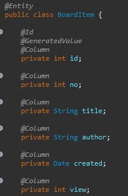

인터페이스를 매개로 느슨한 연결을 해주게끔 스프링이 도와준다.

의존관계에 대한 역전으로.


##  Dao

Hibernate : 주로 사용


MyBatis : 보조로 사용


JPA

interface표준 규격

JPA를 구현한 hybernate(dao Impl)




```java
@Entity
```

class이름 Sample로 테이블이 만들어짐


```java
@Id

@GeneratedValue

@Column
```

이렇게 맨 위 셋은 JPA에서 지켜주는 룰