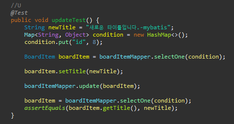
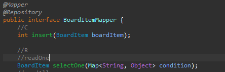

JPA 구현체 - hibernate,Mybatis


### where 1=1의 의미

```xml-dtd
	<select id ="findAllByCondition" resultType="kr.ac.kopo.ctc.spring.board.domain.BoardItem">
		select
			*
		from
			board_item b
		where
			1 = 1
			<include refid="whereCondition"/>
	</select>
	
	<sql id="whereCondition">
		<if test="id !=null">
			and b.id = #{id}
		</if>
	</sql>
```

where 1 = 1 은 **참** 을 의미한다.

입력한 #{id} 가 b.id와 같은 데이터들을 모두(참) 조회한다.


### HashMap

오늘 Mybatis 실습 때 사용했던 HashMap에 대해 알아보자.





