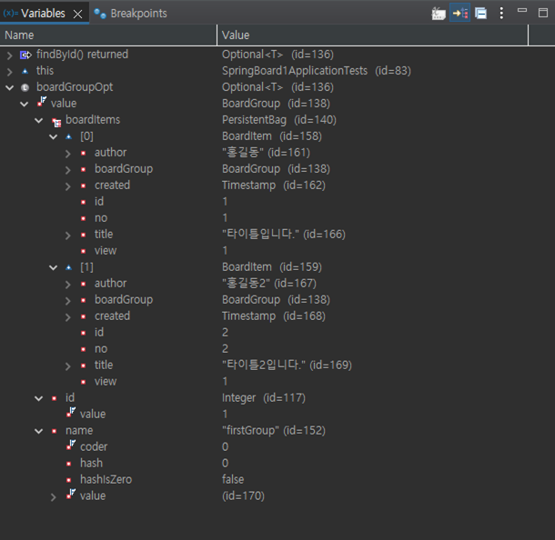

## fetchType

EAGER

- 즉시 가져오는 것

LAZY

- 지연해서 가져오는 것.


부모(@OneToMany 의 디폴트)에서 FetchType이 LAZY.

자식(@ManyToOne 의 디폴트) 에서 FetchType이 EAGER.


예시. BoardGroup(갤러리)들을 모아 출력하는 갤러리 전체보기.


<br>

<br>

### Lazy

```java
Optional<BoardGroup> boardGroupOpt = boardGroupRepository.findById(1);
```

이렇게 findById()를 하여 boardGroup들을 가져와 갤러리 전체보기 처럼 나열을 할 때.


FetchType이 LAZY 이어야,


Item들 까지 자세히 가져오지 못하고 에러가 발생한다.

쉽게 얘기하자면, Item들을 가져왔다 치고! 그 다음으로 넘어감.

👉 **group들을 나열할 때 그 자식 데이터 (BoardItem)들까지 출력하지 않도록 일부러 LAZY를 통해 에러를 발생시키는 것이다.**

<br>

<br>

### EAGER


FetchType이 EAGER 면,



현 Group의 Id를 공유하는 자식(BoardItem) 들의 데이터까지 모두 가져오게 된다.

👉 **즉시 로딩**

즉 데이터가 무수히 많을 때 소요 시간이 매우 늘어나 비효율적인 방법이 된다.

<br>

<br>

<br>

## CascadeType

자식(게시글)이 지워진다해서 부모(게시판)가 지워진다거나 다른 자식들이 지워지지 않음.

게시판을 지웠을 때, 자식(게시글)들은 함께 지워져야 한다.

이렇게 도미노처럼 연결되어 같이 Cascade.

<br>

부모(BoardGroup) 게시판에서(@OneToMany)


👉 **CascadeType.ALL**

부모인 BoardGroup이 삭제되면, 자식인 BoardItem들이 모두(ALL) 삭제된다.

<br>

<br>

자식(BoardItem) 게시판에서는(@ManyToOne)


아예 cascade가 지정되지 않은 것이 디폴트.


<br>

<br>

### Cascade Type 종류


스크린샷 출처 : https://ethank.tistory.com/entry/JPA-Cascade-Types