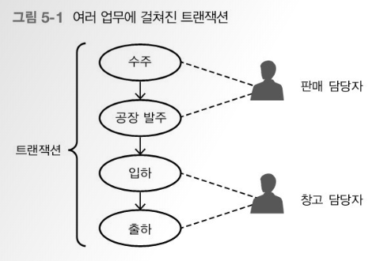

## Aop(Aspect Oriented Programming)

oop를 사용하면서 특정 상황에 Aop를 가져와 병행하는 방식

### 관점 지향 프로그래밍

컴퓨팅에서 관점 지향 프로그래밍은 횡단 관심사의 분리를 허용함으로써 모듈성을 증가시키는 것이 목적인 프로그래밍 패러다임이다.  핵심관심 = 종단관심

[위키백과](https://ko.wikipedia.org/wiki/관점_지향_프로그래밍)

쉽게 말해 어떤 로직을 기준으로 핵심적인 관점, 부가적인 관점으로 나누어서 보고 그 관점을 기준으로 각각 모듈화하겠다는 것이다. 여기서 모듈화란 어떤 공통된 로직이나 기능을 하나의 단위로 묶는 것을 말한다. 

\- 출처 : [새로비 블로그](https://engkimbs.tistory.com/746)

ex) 은행의 계좌이체, 입출금, 이자계산


계좌이체를 사용했을 때 로깅 보안 트랜잭션을 하나하나 실행시키는 것이 아니라,

로깅과 보안 트랙잭션 사이사이에 실행 완료 조건을 통해 다음 단계를 연결하여 연속적으로 실행되게 한다.


각 메소드를 직접 하나하나 실행하는 것이 아닌, 하나의 메소드 끝나는 조건에 그다음 등록한 메소드를 호출하도록. 윈도우 프로그래밍은 이벤트 기간에 

- handler

- callback

프로그램이 성공했을 때 실행될 콜백을 등록한다.

- listener
- hook


```java
@Before("execution(* kr.ac.kopo.ctc.spring.board.service.*.*AopBefore(..))")
	public void onBeforeHandler() {
		System.out.println("LogAspect.onBeforeHandler() 핸들러 호출");
	}
```

(..) : 인자 상관없이 모든 인자들을 받겠다는 의미.

<br>

<br>

<br>

## Transaction

논리적 묶음.

전부다 같이 성공하거나, 전부다 실패 하거나.




@Transactional 이 적용 되어있는 메소드는,

메소드가 끝나기 전에 Erorr가 발생하면 그전까지 진행되었던 line들은 모두 적용되지 않은채로 메소드가 종료된다.


