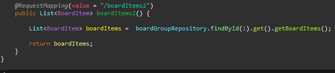

## MVC

데이터만 취급하는 rest서버

C : Post방식

R : get방식

U : put방식

D : Delete방식

```ㅗ싀
//localhost:8080/BoardItem,POST
body={
	'title' = 'aaa';
	...
}
localhost:8080/BoardItem/3,GET
```


crud를 잡고 투명하게 구현했을 때 레스트풀하다


네트워크 - 헤더 

를 통해 보내는 파라미터 변경 가능


Rest는 json으로 통채로 파라미터 전달이기에,

부모-> 자식-> 부모-> 자식->.. 순환참조가 발생할 수 있음



위 코드가 이렇게 참조 순환이 발생함.

